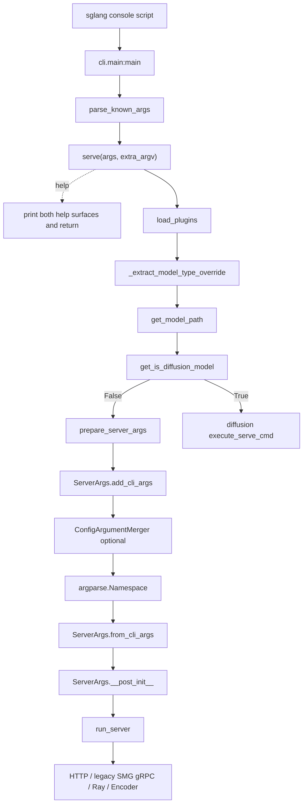

# 启动链路 · 源码走读

这篇只跟一条真实命令：

```powershell
sglang serve --model-path meta-llama/Llama-3.1-8B-Instruct --tp-size 2 --port 8080
```

读完你应该能解释这条命令如何变成 `ServerArgs`，为什么默认进入 HTTP Server，以及哪些分支会让它改走 gRPC、Ray、encoder-only 或 diffusion。

## 长文读法

这篇按命令生命周期读：`sglang` console script 只把子命令分出去，`serve()` 先处理模型族分发和插件加载，LLM 路径再把 `argv` 编译成 `ServerArgs`，最后 `run_server` 根据运行模式进入 HTTP、gRPC、Ray 或 encoder-only 分支。不要把“CLI 分发”和“runtime server 分叉”混成一层。

| 读者任务 | 先读 | 要抓住的判断 |
|----------|------|--------------|
| 首次建立启动主线 | 主线图、第 1 到 3 节 | 根命令只识别 `serve/generate/version`，真正服务参数仍留给后续 parser |
| 判断为什么先窥探模型类型 | 第 3 到 6 节 | `--model-type` 是 `serve()` 的私有 hint；diffusion 检测失败会回落到 LLM server |
| 理解插件何时生效 | 第 4、7、8、9 节 | 当前入口尽早加载；真正不变量是各相关进程在开始服务前完成注册与 apply |
| 追踪 `argv -> ServerArgs` | 第 10 到 12 节 | `add_cli_args` 生成参数面，`--config` 在 parse 前合并，`from_cli_args` 再构造 dataclass |
| 判断最终走 HTTP、gRPC 还是 Ray | 第 13、14 节 | `run_server` 只看已经规范化后的 `ServerArgs`，默认分支才是 HTTP server |
| 排查 runtime 端口和 IPC 坐标 | 第 15 节、运行验证 | `PortArgs` 是 post-init 之后的衍生运行坐标，不是用户直接输入的一组 CLI 参数 |

读的时候保持两条线分开：前半篇解释“命令如何被解析”，后半篇解释“解析后的配置如何选择 runtime”。这能避免把 diffusion 分发、插件 hook、HTTP/gRPC server 入口混成一个大入口函数。

## 主线图



## 1. shell 命令先进入 console script

安装后的 `sglang` 命令不是直接指向 `launch_server.py`，而是指向 `sglang.cli.main:main`。

```toml
# 来源：python/pyproject.toml L178-L180
[project.scripts]
sglang = "sglang.cli.main:main"
killall_sglang = "sglang.cli.killall:main"
```

这一步决定了新入口的第一站。旧入口 `python -m sglang.launch_server` 仍存在，但它绕过了 `cli/serve.py` 的模型族分发和双 help。

## 2. 根命令只识别子命令

`main()` 用 `parse_known_args()` 得到 `args.subcommand` 和 `extra_argv`。对示例命令来说，`args.subcommand == "serve"`，`extra_argv` 里仍保留 `--model-path`、`--tp-size`、`--port`。

```python
# 来源：python/sglang/cli/main.py L12-L46
def main():
    parser = argparse.ArgumentParser()

    # complex sub commands
    subparsers = parser.add_subparsers(dest="subcommand", required=True)
    subparsers.add_parser(
        "serve",
        help="Launch an SGLang server.",
        add_help=False,
    )
    subparsers.add_parser(
        "generate",
        help="Run inference on a multimodal model.",
        add_help=False,
    )

    # simple commands
    version_parser = subparsers.add_parser(
        "version",
        help="Show the version information.",
    )
    version_parser.set_defaults(func=version)

    args, extra_argv = parser.parse_known_args()

    if args.subcommand == "serve":
        from sglang.cli.serve import serve

        serve(args, extra_argv)
    elif args.subcommand == "generate":
        from sglang.cli.generate import generate

        generate(args, extra_argv)
    elif args.subcommand == "version":
        version(args, extra_argv)
```

设计判断：根命令的职责是“把车开到正确收费口”，不是“检查每张票”。如果根 parser 提前吃掉服务参数，LLM 与 diffusion 两套参数面会互相污染。

## 3. `serve()` 先处理自己的私有 hint

`--model-type` 只用于 `serve()` 判断模型族，不能传给 LLM `ServerArgs` parser。源码手动剥离它，并保留其他参数顺序。

```python
# 来源：python/sglang/cli/serve.py L16-L46
def _extract_model_type_override(extra_argv):
    """Extract and remove --model-type override from argv."""
    model_type = "auto"
    filtered_argv = []
    i = 0
    while i < len(extra_argv):
        arg = extra_argv[i]
        if arg == "--model-type":
            if i + 1 >= len(extra_argv):
                raise Exception(
                    "Error: --model-type requires a value. "
                    "Valid values are: auto, llm, diffusion."
                )
            model_type = extra_argv[i + 1]
            i += 2
            continue

        if arg.startswith("--model-type="):
            model_type = arg.split("=", 1)[1]
            i += 1
            continue

        filtered_argv.append(arg)
        i += 1

    if model_type not in ("auto", "llm", "diffusion"):
        raise Exception(
            f"Error: invalid --model-type '{model_type}'. "
            "Valid values are: auto, llm, diffusion."
        )
    return model_type, filtered_argv
```

这段解释了一个常见 bug：如果新加的 serve 分发参数不先剥离，`prepare_server_args` 会把它当未知 LLM 参数报错。

## 4. 正常启动尽早加载插件，help 路径例外

正常启动不走 help 分支时，`serve()` 先调用 `load_plugins()`，然后才读取 model type、model path，并进入 LLM 或 diffusion。

```python
# 来源：python/sglang/cli/serve.py L89-L130
    from sglang.srt.plugins import load_plugins

    load_plugins()

    model_type, dispatch_argv = _extract_model_type_override(extra_argv)
    model_path = get_model_path(dispatch_argv)
    try:
        if model_type == "auto":
            is_diffusion_model = get_is_diffusion_model(model_path)
            if is_diffusion_model:
                logger.info("Diffusion model detected")
        else:
            is_diffusion_model = model_type == "diffusion"
            logger.info(
                "Dispatch override enabled: --model-type=%s " "(skip auto detection)",
                model_type,
            )

        if is_diffusion_model:
            # Logic for Diffusion Models
            from sglang.multimodal_gen.runtime.entrypoints.cli.serve import (
                add_multimodal_gen_serve_args,
                execute_serve_cmd,
            )

            parser = argparse.ArgumentParser(
                description="SGLang Diffusion Model Serving"
            )
            add_multimodal_gen_serve_args(parser)
            parsed_args, remaining_argv = parser.parse_known_args(dispatch_argv)

            execute_serve_cmd(parsed_args, remaining_argv)
        else:
            # Logic for Standard Language Models
            from sglang.launch_server import run_server
            from sglang.srt.server_args import prepare_server_args

            server_args = prepare_server_args(dispatch_argv)

            run_server(server_args)
    finally:
        kill_process_tree(os.getpid(), include_parent=False)
```

这里有三个直接事实：

- 当前正常路径先加载插件，再 import LLM/diffusion runtime；help 路径在此前已经返回。
- diffusion 与 LLM 使用不同 parser。
- `finally` 清理子进程树，不依赖启动成功。

不要把第一条扩大成 Python 层面的绝对限制。`HookRegistry` 能在 apply 时解析尚未 import 的 target，也会传播补丁到已经持有旧引用的模块；真正的不变量是相关进程必须在 engine 开始服务前完成插件注册与 apply。

## 5. `get_model_path` 是早期窥探，不是完整解析

模型族检测必须知道 model path，但这时还没有进入 LLM parser。因此 `get_model_path` 手动扫描 `--model-path` 和 `--model`。

```python
# 来源：python/sglang/cli/utils.py L102-L116
def get_model_path(extra_argv):
    # Find the model_path argument
    model_path = None
    for i, arg in enumerate(extra_argv):
        if arg in ("--model-path", "--model"):
            if i + 1 < len(extra_argv):
                model_path = extra_argv[i + 1]
                break
        elif arg.startswith("--model-path=") or arg.startswith("--model="):
            model_path = arg.split("=", 1)[1]
            break

    if model_path is None:
        # Fallback for --help or other cases where model-path is not provided
        if any(h in extra_argv for h in ["-h", "--help"]):
```

非 help 场景缺少模型路径时，同文件后续分支会抛出 `--model-path is required`。注意：这个函数只是为 `serve()` 分发服务。真正的 LLM 参数解释仍在 `prepare_server_args`。

这也暴露了 config 的一个重要边界：`get_model_path(dispatch_argv)` 发生在 `prepare_server_args()` 合并 YAML 之前。因此下面的写法即使 YAML 含有 `model_path`，仍会在早期窥探阶段失败：

```powershell
sglang serve --config prod.yaml
```

当前必须把 `--model-path` 或 `--model` 留在命令行；config 可继续提供其余 LLM 参数。

## 6. diffusion 检测失败时回到 LLM

自动检测按 overlay、本地目录、known registry、已注册 diffusion 路径、远程 `model_index.json` 顺序判断。远程下载或解析异常会返回 False，让调用方 fall through 到 LLM 路径。

```python
# 来源：python/sglang/cli/utils.py L59-L99
def get_is_diffusion_model(model_path: str) -> bool:
    """Detect whether model_path points to a diffusion model.

    For local directories, checks the filesystem directly.
    For HF/ModelScope model IDs, attempts to fetch only model_index.json.
    For gated repos where file download fails, falls back to HF model card
    metadata (library_name == "diffusers").
    Returns False on any failure (network error, 404, offline mode, etc.)
    so that the caller falls through to the standard LLM server path.
    """
    if _is_overlay_diffusion_model(model_path):
        # short-circuit, if applicable for the overlay mechanism (diffusion-only)
        return True

    if os.path.isdir(model_path):
        if _is_diffusers_model_dir(model_path):
            return True
        return is_known_non_diffusers_diffusion_model(model_path)

    if is_known_non_diffusers_diffusion_model(model_path):
        return True

    if _is_registered_diffusion_model(model_path):
        return True

    try:
        if envs.SGLANG_USE_MODELSCOPE.get():
            from modelscope import model_file_download

            file_path = model_file_download(
                model_id=model_path, file_path="model_index.json"
            )
        else:
            from huggingface_hub import hf_hub_download

            file_path = hf_hub_download(repo_id=model_path, filename="model_index.json")

        return _is_diffusers_model_dir(os.path.dirname(file_path))
    except Exception as e:
        logger.debug("Failed to auto-detect diffusion model for %s: %s", model_path, e)
        return False
```

这不是强分类器，而是保守确认器。文件里虽然定义了 `_is_gated_diffusion_repo()`，当前 `get_is_diffusion_model()` 并没有调用它；函数 docstring 所写的 gated model-card metadata fallback 也没有实际接入这条控制流。判断当前行为应以可达分支为准：远程 `model_index.json` 获取失败就返回 False。想绕过自动检测，要显式传 `--model-type llm` 或 `--model-type diffusion`。

## 7. 插件发现先过滤，再加载

插件发现会受两个环境变量影响：`SGLANG_PLUGINS` 控制名字白名单，`SGLANG_PLATFORM` 通过 excluded dists 避免加载未选平台包。

```python
# 来源：python/sglang/srt/plugins/__init__.py L51-L78
    # SGLANG_PLUGINS whitelist (comma-separated plugin names)
    allowed_set: set[str] | None = None
    allowed_str = envs.SGLANG_PLUGINS.get()
    if allowed_str:
        allowed_set = {x.strip() for x in allowed_str.split(",") if x.strip()}

    discovered = entry_points(group=group)
    if len(discovered) == 0:
        logger.debug("No plugins found for group %s.", group)
        return {}

    logger.info("Available plugins for group %s:", group)
    for ep in discovered:
        logger.info("  - %s -> %s", ep.name, ep.value)

    plugins: dict[str, tuple[Callable[[], Any], str | None]] = {}
    for ep in discovered:
        if allowed_set is not None and ep.name not in allowed_set:
            logger.info("Skipping plugin %s (not in SGLANG_PLUGINS)", ep.name)
            continue
        dist_name = ep.dist.name if ep.dist else None
        if excluded_dists and dist_name in excluded_dists:
            logger.info(
                "Skipping plugin %s (dist %s excluded by SGLANG_PLATFORM)",
                ep.name,
                dist_name,
            )
            continue
```

这段的关键不是“能加载插件”，而是“未选平台插件不会被 import”。这能避免硬件依赖在不相关环境里影响启动。

## 8. `load_plugins` 执行插件并 apply hooks

`load_plugins` 在单个进程内幂等执行通用插件，然后统一调用 `HookRegistry.apply_hooks()`。

```python
# 来源：python/sglang/srt/plugins/__init__.py L119-L141
    global _plugins_loaded
    if _plugins_loaded:
        return
    _plugins_loaded = True

    plugins = load_plugins_by_group(
        GENERAL_PLUGINS_GROUP,
        excluded_dists=_get_excluded_dists(),
    )

    for name, (func, dist_name) in plugins.items():
        source = HookSource(plugin_name=name, dist_name=dist_name)
        token = _current_plugin_source.set(source)
        try:
            func()
            logger.info("Executed general plugin: %s", name)
        except Exception:
            logger.exception("Failed to execute general plugin: %s", name)
        finally:
            _current_plugin_source.reset(token)

    # Apply all registered hooks (idempotent — already-patched targets are skipped).
    HookRegistry.apply_hooks()
```

注意失败语义：函数一进入就把 `_plugins_loaded=True`。单个插件 load/execute 失败会被记录并继续，但当前进程后续再次调用 `load_plugins()` 会直接返回，不会自动重试。engine core 和 worker 是不同进程，各自仍需调用自己的加载阶段。

## 9. Hook apply 的真正语义

`HookRegistry.apply_hooks()` 会按 target 排序，并跳过已经 patch 的 target。REPLACE 会先于其他 hook 包装，保证方法级 hook 作用在替换后的对象上。

```python
# 来源：python/sglang/srt/plugins/hook_registry.py L145-L166
    @classmethod
    def apply_hooks(cls):
        """
        Apply all registered hooks to their target functions/classes.

        This performs the actual monkey-patching. Should be called once after
        all plugins have been loaded and before the engine starts.

        Targets with class REPLACE hooks are applied first, so that
        subsequent method-level hooks (AROUND, BEFORE, AFTER) on child
        attributes resolve against the *replaced* class rather than the
        original.
        """
        sorted_items = sorted(cls._hooks.items(), key=cls._target_sort_key)
        for target, hooks in sorted_items:
            if target in cls._patched:
                continue
            try:
                cls._apply_target(target, hooks)
                cls._patched.add(target)
            except Exception:
                logger.exception("Failed to apply hooks to %s", target)
```

四类 hook 都由 `_wrap_fn` 组合，区别在调用权：BEFORE 可改输入，AFTER 可改返回值，AROUND 决定是否及何时调用原函数，REPLACE 完全替换目标。实现见 `hook_registry.py` L352-L393；排障时应先确认 hook 类型，再判断输入、输出或原函数调用为何改变。

“必须早于 target import”也不是准确边界。`_apply_target` 用 `pkgutil.resolve_name` 解析目标；patch 后还扫描 `sys.modules`，把其他模块通过 `from source_module import name` 保存的旧绑定替换成 wrapper。尽早加载仍然更容易推理，但源码真正承诺的是 apply 后的补丁传播，以及开始服务前完成 apply。

```python
# 来源：python/sglang/srt/plugins/hook_registry.py L294-L305
        # Propagate the patch to all other modules that imported the original
        # via ``from source_module import name``.  Python's ``from X import Y``
        # copies the reference at import time; patching X alone leaves
        # importers with a stale binding.
        if wrapped is not original:
            extra = _propagate_patch(original, wrapped, obj)
            if extra:
                logger.debug(
                    "Propagated patch for %s to %d additional module(s)",
                    target,
                    extra,
                )
```

```python
# 来源：python/sglang/srt/plugins/hook_registry.py L322-L349
def _propagate_patch(original: object, wrapped: object, source_module: object) -> int:
    """Propagate a monkey-patch to all modules holding a stale ``from X import Y`` binding.

    After ``setattr(source_module, name, wrapped)`` updates the defining module,
    other modules that did ``from source_module import name`` still hold a direct
    reference to the old *original* object.  This walks ``sys.modules`` and
    replaces every such stale binding with *wrapped*.

    Returns the number of additional module attributes that were patched.
    """
    patched_count = 0
    for mod in list(sys.modules.values()):
        if mod is source_module or mod is None:
            continue
        if not isinstance(mod, types.ModuleType):
            continue
        try:
            mod_vars = vars(mod)
        except TypeError:
            continue
        for attr_name, attr_value in list(mod_vars.items()):
            if attr_value is original:
                try:
                    setattr(mod, attr_name, wrapped)
                    patched_count += 1
                except (AttributeError, TypeError):
                    pass
    return patched_count
```

## 10. `ServerArgs.add_cli_args` 编译参数面

`ServerArgs.add_cli_args` 先从 dataclass metadata 自动注册大部分参数，再手写动态 choices、`--config` 和 deprecated 参数。

```python
# 来源：python/sglang/srt/server_args.py L6623-L6664
        add_cli_args_from_dataclass(parser, ServerArgs)

        # --- Fields with dynamic choices (computed at add_cli_args time) ---
        reasoning_parser_choices = list(ReasoningParser.DetectorMap.keys())
        parser.add_argument(
            "--reasoning-parser",
            type=str,
            choices=["auto"] + reasoning_parser_choices,
            default=ServerArgs.reasoning_parser,
            help=f"Specify the parser for reasoning models. "
            f"Use 'auto' to detect from chat template. "
            f"Options include: {reasoning_parser_choices}.",
        )
        tool_call_parser_choices = list(FunctionCallParser.ToolCallParserEnum.keys())
        parser.add_argument(
            "--tool-call-parser",
            type=str,
            choices=["auto"] + tool_call_parser_choices,
            default=ServerArgs.tool_call_parser,
            help=f"Specify the parser for handling tool-call interactions. "
            f"Use 'auto' to detect from chat template. "
            f"Options include: {tool_call_parser_choices}.",
        )
        parser.add_argument(
            "--kv-canary-real-data",
            type=str,
            default=ServerArgs.kv_canary_real_data,
            choices=[m.name.lower() for m in RealKvHashMode],
            help=(
                "Check the real KV-cache in the canary. "
                "'none' (default) disables the feature. "
                "'partial' checks the first 16 bytes of each real-KV slot. "
                "'all' checks the full real-KV slot."
            ),
        )

        # --- Configuration file support ---
        parser.add_argument(
            "--config",
            type=str,
            help="Read CLI options from a config file. Must be a YAML file with configuration options.",
        )
```

这一段说明新增普通参数应该优先改 dataclass 字段，而不是手写 argparse。只有动态 choices、config 和 deprecated 兼容属于手写区。

## 11. `--config` 在 parse 前合并

如果 argv 含有精确 token `--config`，`prepare_server_args` 会先构造 `ConfigArgumentMerger`，把 YAML 转成 CLI 参数，再交给 argparse。

```python
# 来源：python/sglang/srt/server_args_config_parser.py L52-L83
    def merge_config_with_args(self, cli_args: List[str]) -> List[str]:
        """
        Merge configuration file arguments with command-line arguments.

        Configuration arguments are inserted after the subcommand to maintain
        proper precedence: CLI > Config > Defaults

        Args:
            cli_args: List of command-line arguments

        Returns:
            Merged argument list with config values inserted

        Raises:
            ValueError: If multiple config files specified or no config file provided
        """
        config_file_path = self._extract_config_file_path(cli_args)
        if not config_file_path:
            return cli_args

        config_data = self._parse_yaml_config(config_file_path)
        config_args = self._convert_config_to_args(config_data)

        # Merge config args into CLI args
        config_index = cli_args.index("--config")

        # Split arguments around config file
        before_config = cli_args[:config_index]
        after_config = cli_args[config_index + 2 :]  # Skip --config and file path

        # Simple merge: config args + CLI args
        return config_args + before_config + after_config
```

返回顺序是 `config_args + before_config + after_config`。在 argparse 的常见覆盖语义下，后出现的 CLI 显式参数会覆盖 config 里的同名值。

两个边界必须单独记住：

- `prepare_server_args` 用 `if "--config" in argv` 判断是否合并，所以 `--config=prod.yaml` 虽可被 argparse 识别为一个普通 option，却不会读取 YAML 内容。
- config 合并发生在 LLM 分发之后，不能用 YAML 中的 `model_path` 替代 `serve()` 早期所需的命令行 `--model-path`。

YAML 会先被验证为文件存在且后缀正确，根节点必须是 dict。

```python
# 来源：python/sglang/srt/server_args_config_parser.py L114-L130
        self._validate_yaml_file(file_path)

        try:
            with open(file_path, "r") as file:
                config_data = yaml.safe_load(file)
        except Exception as e:
            logger.error(f"Failed to read config file {file_path}: {e}")
            raise

        # Handle empty files or None content
        if config_data is None:
            config_data = {}

        if not isinstance(config_data, dict):
            raise ValueError("Config file must contain a dictionary at root level")

        return config_data
```

## 12. Namespace 变成 dataclass，并触发 post-init

`from_cli_args` 只取 Namespace 中存在的 dataclass 字段，内部字段保留默认值。

```python
# 来源：python/sglang/srt/server_args.py L6862-L6869
    def from_cli_args(cls, args: argparse.Namespace):
        # Some dataclass fields (e.g. stat_loggers) intentionally have no CLI
        # surface and won't appear on the argparse Namespace. Skip them so the
        # dataclass default applies.
        attrs = [
            attr.name for attr in dataclasses.fields(cls) if hasattr(args, attr.name)
        ]
        return cls(**{attr: getattr(args, attr) for attr in attrs})
```

构造 `ServerArgs` 会触发 `__post_init__`。这一步可能读取模型配置、查询硬件、解析 backend 并改写环境变量，不是纯 dataclass 搬运。它解释了很多错误为什么发生在 parse 之后、进入 HTTP 之前。

还要保留第二道边界：部分跨字段约束位于 `ServerArgs.check_server_args()`，由后续 engine 初始化调用。因此“`prepare_server_args` 成功”只证明 parser 与 post-init 通过，不等于完整 runtime 配置已经验收。

```python
# 来源：python/sglang/srt/entrypoints/engine.py L786-L791
        # Defensive: ensure plugins loaded (may already be loaded by
        # Engine.__init__ or CLI entry).
        load_plugins()

        server_args.check_server_args()
        _set_gc(server_args)
```

## 13. `run_server` 根据 `ServerArgs` 分叉

`run_server` 的判断顺序就是 runtime 分叉优先级。其中普通 `grpc_mode` 分支是 legacy SMG wrapper，不是 native Rust/Tonic gRPC 接线。

```python
# 来源：python/sglang/launch_server.py L15-L51
def run_server(server_args):
    """Run the server based on server_args.grpc_mode and server_args.encoder_only."""
    if server_args.encoder_only:
        # For encoder disaggregation
        if server_args.grpc_mode:
            from sglang.srt.disaggregation.encode_grpc_server import (
                serve_grpc_encoder,
            )

            asyncio.run(serve_grpc_encoder(server_args))
        else:
            from sglang.srt.disaggregation.encode_server import launch_server

            launch_server(server_args)
    elif server_args.grpc_mode:
        # TODO: Once the native Rust gRPC server starts alongside HTTP in the
        # default path below (controlled by SGLANG_ENABLE_GRPC / SGLANG_GRPC_PORT),
        # remove this legacy SMG path and the grpc_mode flag.
        from sglang.srt.entrypoints.grpc_server import serve_grpc

        asyncio.run(serve_grpc(server_args))
    elif server_args.use_ray:
        # Ray mode: HTTP mode with Ray backend.
        try:
            from sglang.srt.ray.http_server import launch_server
        except ImportError:
            raise ImportError(
                "Ray is required for --use-ray mode. "
                "Install it with: pip install 'sglang[ray]'"
            )

        launch_server(server_args)
    else:
        # Default mode: HTTP mode.
        from sglang.srt.entrypoints.http_server import launch_server

        launch_server(server_args)
```

对示例命令来说，`encoder_only=False`、`grpc_mode=False`、`use_ray=False`，所以进入默认 HTTP 分支，下一跳是 [[SGLang-HTTP-Server]]。

组合字段不会并列生效：encoder-only 最高；其后 `grpc_mode=True` 会遮住 `use_ray=True`；只有前两者都为 False 才可能进入 Ray。

## 14. 旧入口保留 LLM 兼容

旧入口作为兼容层仍加载插件、解析 `ServerArgs`、调用 `run_server`，但会提示推荐 `sglang serve`。

```python
# 来源：python/sglang/launch_server.py L63-L72
    from sglang.srt.plugins import load_plugins

    load_plugins()

    server_args = prepare_server_args(sys.argv[1:])

    try:
        run_server(server_args)
    finally:
        kill_process_tree(os.getpid(), include_parent=False)
```

旧入口缺少 `cli/serve.py` 的模型族自动检测和双 help，因此新部署应优先使用 `sglang serve`。

## 15. PortArgs 是 runtime 后的衍生坐标

`prepare_server_args` 到 `run_server` 只生成配置事实。真正的 ZMQ/NCCL 坐标是 runtime 启动时由 `PortArgs.init_new(server_args)` 派生。

```python
# 来源：python/sglang/srt/server_args.py L7602-L7652
@dataclasses.dataclass
class PortArgs:
    # The ipc filename for tokenizer to receive inputs from detokenizer (zmq)
    tokenizer_ipc_name: str
    # The ipc filename for scheduler (rank 0) to receive inputs from tokenizer (zmq)
    scheduler_input_ipc_name: str
    # The ipc filename for detokenizer to receive inputs from scheduler (zmq)
    detokenizer_ipc_name: str

    # The port for nccl initialization (torch.dist)
    nccl_port: int

    # The ipc filename for rpc call between Engine and Scheduler
    rpc_ipc_name: str

    # The ipc filename for Scheduler to send metrics
    metrics_ipc_name: str

    # The ipc filename for MultiTokenizerRouter to receive inputs from TokenizerWorker processes (zmq)
    tokenizer_worker_ipc_name: Optional[str]

    # The ipc endpoints between verifier scheduler and drafter scheduler
    decoupled_spec_ipc_config: Optional[DecoupledSpecIpcConfig]

    # zmq address for load snapshot PUSH/PULL (dp-attention TCP mode only;
    # empty when IPC mode derives the address from instance_id).
    load_collector_ipc_name: str = ""

    # Stable token shared by all processes in one server instance, used to
    # derive the /dev/shm path for load snapshots.
    instance_id: str = ""

    @staticmethod
    def init_new(
        server_args: ServerArgs,
        dp_rank: Optional[int] = None,
        worker_ports: Optional[List[int]] = None,
    ) -> PortArgs:
        if server_args.nccl_port is None:
            nccl_port = get_free_port()
        else:
            nccl_port = server_args.nccl_port

        if server_args.tokenizer_worker_num == 1:
            tokenizer_worker_ipc_name = None
        else:
            tokenizer_worker_ipc_name = (
                f"ipc://{tempfile.NamedTemporaryFile(delete=False).name}"
            )

        instance_id = uuid.uuid4().hex[:12]
```

这就是本专题和 HTTP Server 的交界：本专题结束于 `run_server(server_args)`，HTTP Server 接过 `ServerArgs` 后才分配 `PortArgs` 和进程拓扑。

## 运行验证

静态确认 console script：

```powershell
rg -n "sglang = \"sglang.cli.main:main\"" sglang/python/pyproject.toml
```

预期：命中 project scripts。

静态确认根命令透传：

```powershell
rg -n "parse_known_args|serve\\(args, extra_argv\\)" sglang/python/sglang/cli/main.py
```

预期：看到 `extra_argv` 被传给 `serve()`。

静态确认默认 HTTP：

```powershell
rg -n "Default mode: HTTP mode|entrypoints.http_server" sglang/python/sglang/launch_server.py
```

预期：命中 `run_server` 默认分支。

## 复盘

- `main()` 不解释服务参数，`serve()` 只解释模型族分发参数。
- `ServerArgs` 是 LLM 服务配置事实，`__post_init__` 是语义处理层。
- 插件是进程局部的启动期控制面；当前入口尽早加载，硬边界是开始服务前完成 apply。
- config 是 parse 前的 argv 变换，但看不到更早的模型族分发阶段。
- `run_server` 是最后分叉；`grpc_mode` 是 legacy SMG 路径，默认 HTTP 的内部细节属于下一专题。
