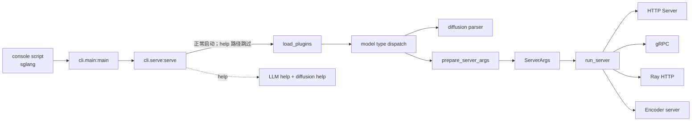

# 启动链路

## 你为什么要读

启动链路回答的是一个很实际的问题：用户敲下 `sglang serve --model-path <model>` 之后，哪段代码有权解释这串参数，哪段代码决定最终启动 HTTP、gRPC、Ray 还是 encoder-only server。

读这一组文档，不是为了背 `ServerArgs` 的几百个字段，而是为了能做三件事：

1. 排查命令行参数为什么没有生效，或为什么 `--model-path` 在根命令 help 里找不到。
2. 判断服务走了 LLM、diffusion、HTTP、gRPC、Ray 或 encoder-only 中的哪条启动路径。
3. 改 CLI 参数、插件 hook、YAML config 或启动分支时，知道不变量和测试入口。

## 一句话模型

启动链路是“命令行控制台”：它把 shell argv 分成两层，先由根命令选择子命令，再由 `serve()` 决定模型族，最后把 LLM 参数编译成 `ServerArgs` 并交给 `run_server` 分发。



这个模型里最重要的边界是：`cli/main.py` 不解释 `--model-path`；`cli/serve.py` 只做模型族分发；`ServerArgs` 才是 LLM 服务参数的正式载体；`run_server` 只根据已经成型的 `ServerArgs` 选择 runtime 入口。还要记住一个容易踩坑的前置条件：`serve()` 在合并 YAML 之前就要窥探模型路径，因此模型路径不能只藏在 config 里。

## 阅读顺序

| 顺序 | 文件 | 适合解决的问题 |
|------|------|----------------|
| 1 | [[SGLang-启动链路-核心概念]] | 先建立 console script、argv 分层、`ServerArgs`、插件和分发模型 |
| 2 | [[SGLang-启动链路-源码走读]] | 沿 `sglang serve --model-path <model>` 看当前源码证据 |
| 3 | [[SGLang-启动链路-数据流]] | 看 `argv → dispatch_argv → raw_args → ServerArgs → run_server` 的对象形态 |
| 4 | [[SGLang-启动链路-排障指南]] | 按症状排查 help、config、插件、model type、旧入口、Ray/gRPC 分支 |
| 5 | [[SGLang-启动链路-学习检查]] | 用命令和源码入口验收自己是否能复述启动链 |

如果你只关心默认 HTTP 服务，读完 01 和 02 后接 [[SGLang-HTTP-Server]]。如果你要改参数或插件，必须读 03 和 04。

## 源码范围

| 文件 | 本专题关注点 |
|------|--------------|
| `python/pyproject.toml` | console script 如何把 shell 命令接到 `sglang.cli.main:main` |
| `python/sglang/cli/main.py` | 根命令如何只做子命令分发和未知参数透传 |
| `python/sglang/cli/serve.py` | `serve` 如何处理 help、插件、LLM/diffusion 分发和清理 |
| `python/sglang/cli/utils.py` | 如何在完整 parser 之前早期读取 `--model-path` 并做 diffusion 检测 |
| `python/sglang/srt/server_args.py` | LLM 服务参数如何从 argv 变成 `ServerArgs`，以及 runtime 衍生 `PortArgs` |
| `python/sglang/srt/server_args_config_parser.py` | YAML config 如何合并进 CLI 参数，以及精确 `--config FILE` 语法的边界 |
| `python/sglang/srt/plugins/` | 插件发现、白名单、平台过滤、hook 注册与 apply |
| `python/sglang/launch_server.py` | `ServerArgs` 如何进入 HTTP/gRPC/Ray/Encoder 分支 |

## 最小源码主线

安装后的 `sglang` 命令来自 console script：

```toml
# 来源：python/pyproject.toml L178-L180
[project.scripts]
sglang = "sglang.cli.main:main"
killall_sglang = "sglang.cli.killall:main"
```

根命令把 `serve` 后面的参数留给子模块：

```python
# 来源：python/sglang/cli/main.py L35-L40
    args, extra_argv = parser.parse_known_args()

    if args.subcommand == "serve":
        from sglang.cli.serve import serve

        serve(args, extra_argv)
```

LLM 路径的正式参数工厂是 `prepare_server_args`：

```python
# 来源：python/sglang/srt/server_args.py L7561-L7595
def prepare_server_args(argv: List[str]) -> ServerArgs:
    """
    Prepare the server arguments from the command line arguments.

    Args:
        args: The command line arguments. Typically, it should be `sys.argv[1:]`
            to ensure compatibility with `parse_args` when no arguments are passed.

    Returns:
        The server arguments.
    """
    parser = argparse.ArgumentParser(prog="sglang serve")
    ServerArgs.add_cli_args(parser)

    # Check for config file and merge arguments if present
    if "--config" in argv:
        # Import here to avoid circular imports
        from sglang.srt.server_args_config_parser import ConfigArgumentMerger

        # Extract boolean actions from the parser to handle them correctly
        config_merger = ConfigArgumentMerger(parser)
        argv = config_merger.merge_config_with_args(argv)

    raw_args = parser.parse_args(argv)

    # Set up basic logging before ServerArgs.__post_init__ so that
    # logger.info / logger.warning calls there are properly formatted.
    logging.basicConfig(
        level=getattr(logging, raw_args.log_level.upper()),
        format="[%(asctime)s] %(message)s",
        datefmt="%Y-%m-%d %H:%M:%S",
        force=True,
    )

    return ServerArgs.from_cli_args(raw_args)
```

`run_server` 是 LLM 路径最后的分发点：

```python
# 来源：python/sglang/launch_server.py L47-L51
    else:
        # Default mode: HTTP mode.
        from sglang.srt.entrypoints.http_server import launch_server

        launch_server(server_args)
```

因此默认路径是：`sglang` console script 进入 `main()`，`main()` 把 serve 参数透传给 `serve()`，`serve()` 加载插件并选择 LLM，`prepare_server_args()` 生成 `ServerArgs`，最后 `run_server()` 进入 HTTP Server。

## 与相邻专题衔接

| 方向 | 专题 | 关系 |
|------|------|------|
| 下游 | [[SGLang-HTTP-Server]] | 默认 `run_server` 分支继续启动 HTTP server 和 SRT engine |
| 下游 | [[SGLang-gRPC-Proto]] | `grpc_mode=True` 时进入 legacy SMG gRPC 分支；不要与默认 HTTP 路径预留的 native Rust gRPC 能力混为一谈 |
| 下游 | [[SGLang-分布式]] | `ServerArgs` 中的 TP/PP/DP/CP 字段决定分布式坐标 |
| 下游 | [[SGLang-可观测性]] | 插件、日志、metrics 参数会影响可观测入口 |

## 读完后的复盘问题

- 为什么 `sglang --help` 不应该展示 `--model-path`？
- `--model-type` 为什么要在 `serve()` 层被剥离，而不是进入 `ServerArgs`？
- `--config` YAML 和 CLI 显式参数冲突时，谁覆盖谁？
- 为什么当前主入口选择尽早加载插件，但真正的不变量是“每个相关进程在开始服务前完成注册与 apply”，而不是“目标模块绝不能提前 import”？
- 为什么模型路径只写在 YAML config 里仍会在 `serve()` 的早期分发阶段失败？
- `encoder_only=True` 和 `grpc_mode=True` 同时出现时，为什么不是普通 gRPC 分支？

下一篇先读 [[SGLang-启动链路-核心概念]]。
