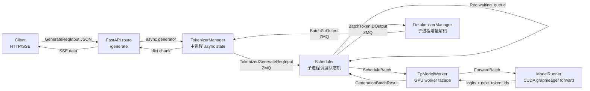

# SGLang HTTP 请求全链路

本文追踪一条 **HTTP `POST /generate` 流式请求** 从客户端进入 SGLang，到 GPU 生成 token，再以 SSE chunk 返回客户端的完整 baseline 路径。

范围限定：

- HTTP `/generate`
- 单条文本生成请求
- 非 gRPC、非 PD 分离、非投机解码、非多模态
- 默认语言模型 serving 路径

## 读者任务

读完本文，读者应该能做三件事：

1. 沿一条请求复述对象如何变化：`GenerateReqInput` → `TokenizedGenerateReqInput` → `Req` → `ScheduleBatch` → `ForwardBatch` → `BatchTokenIDOutput` → `BatchStrOutput` → SSE chunk。
2. 判断某个延迟或卡住现象发生在哪一段：HTTP、TokenizerManager、Scheduler waiting/running、GPU forward、Detokenizer、还是 HTTP stream。
3. 用日志、metric、配置或断点验证自己的理解，而不是只背诵“HTTP → Scheduler → ModelRunner”。

## 长文读法

首次阅读只看“读者任务”“先建立模型”“贯穿场景”和“复盘”；需要定位具体边界时再进入主线走读与源码证据。连续入门请先读 [[推理Serving主线]]。

这篇适合按“请求此刻由谁持有”来读，不必从第 1 节一路读到底。先用 `rid` 串起 HTTP generator、TokenizerManager state、Scheduler `Req`、Detokenizer output，再按现象跳到对应边界。

| 读者任务 | 先读 | 要抓住的判断 |
|----------|------|--------------|
| 第一次建立全链路地图 | 先建立模型、贯穿场景、主线走读 1 到 3 | HTTP 只包装 async generator，TokenizerManager 才是主进程请求状态机 |
| 判断请求为什么没有进入调度 | 主线走读 3 到 5 | `GenerateReqInput` 必须先变成 tokenized request，再在 Scheduler 侧变成 `Req` |
| 排查首 token 慢或 waiting queue 堆积 | 主线走读 6 到 9、验证 3 | batch 选择、overlap loop、CUDA graph/eager forward 决定 prefill 和 decode 节奏 |
| 排查 GPU 在跑但 HTTP 没有文本 | 主线走读 10 到 12、验证 2 | 输出先走 `BatchTokenIDOutput` 到 Detokenizer，再以 `BatchStrOutput` 唤醒 HTTP |
| 做生产排障速查 | 运行验证、失败模式与排障入口 | 先按 HTTP / Scheduler / Detokenizer / TokenizerManager 四段定位，再看源码入口 |
| 准备读专题深水区 | 复盘的下一步阅读 | Scheduler、ScheduleBatch、ModelRunner、KV cache、gRPC 和 RL rollout 是这条 baseline 的分叉 |

读完整篇后，最重要的不是背下 12 个步骤，而是能回答：请求对象现在在哪里、下一跳是谁、卡住时哪个日志或 metric 能证明自己的判断。

## 源码阅读依据

改写本文前已阅读下列 upstream 源码的相关函数和调用上下文；正文中的设计判断均回指这些源码。代码块第一行写“来源”时，表示下面是该连续区间的逐字摘录；写“定位”时，表示为了突出控制流而删去旁支的摘要骨架，不能把它当成可直接复制的源码。

| upstream 文件 | 本文使用方式 |
|---------------|--------------|
| `sglang/python/sglang/cli/serve.py` | `sglang serve` 如何分派到标准语言模型 server |
| `sglang/python/sglang/srt/entrypoints/http_server.py` | `/generate` route、SSE stream、HTTP server 全局状态与子进程启动 |
| `sglang/python/sglang/srt/managers/io_struct.py` | 请求和输出对象的字段契约 |
| `sglang/python/sglang/srt/managers/tokenizer_manager.py` | 请求状态、tokenize、ZMQ dispatch、等待 BatchStrOutput、组装返回 dict |
| `sglang/python/sglang/srt/managers/scheduler_components/request_receiver.py` | Scheduler 侧收包、rank0 拉取、TP/CP/DP 广播 |
| `sglang/python/sglang/srt/managers/scheduler.py` | event loop、请求入队、batch 选择、forward launch、结果分派 |
| `sglang/python/sglang/srt/managers/tp_worker.py` | `ScheduleBatch` 到 `ForwardBatch`，调用 `ModelRunner.forward` 与 sampling |
| `sglang/python/sglang/srt/model_executor/model_runner.py` | CUDA graph / eager forward / sampling 的执行边界 |
| `sglang/python/sglang/srt/managers/scheduler_components/batch_result_processor.py` | decode 结果如何写回 `Req` 并触发输出 |
| `sglang/python/sglang/srt/managers/scheduler_components/output_streamer.py` | `Req` 如何聚合成 `BatchTokenIDOutput` |
| `sglang/python/sglang/srt/managers/detokenizer_manager.py` | token id 如何增量 decode 成 string |

## 先建立模型

这条链路不是“一个函数调用另一个函数”。它是 **主进程 async 请求状态机 + 两个子进程 + GPU forward + ZMQ 回传** 的组合。



三个关键不变量：

| 不变量 | 为什么重要 | 破坏后现象 |
|--------|------------|------------|
| `rid` 在全链路唯一 | `TokenizerManager.rid_to_state` 用它唤醒等待中的 HTTP generator | chunk 找不到 state、请求泄漏或错误日志 |
| Scheduler 的生成主线只调度 tokenized 请求 | 分词、多模态预处理、LoRA 解析先在 TokenizerManager 侧收束；控制 RPC 是另一类输入 | 若把前台协议直接塞进热循环，调度状态会膨胀 |
| baseline 输出分两段：token id 先回 Detokenizer，再回 TokenizerManager | tokenizer 已初始化的普通文本路径把字符串处理移出 Scheduler 热路径；`--skip-tokenizer-init` 是另一条边界 | decode 卡住时 GPU 可能仍在跑，但 HTTP 没有新文本 |

## 贯穿场景

假设客户端发送：

```json
{"text": "Hello", "sampling_params": {"max_new_tokens": 8}, "stream": true}
```

对象会经历下面的物理形态变化：

| 阶段 | 对象形态 | 关键持有者 |
|------|----------|------------|
| HTTP 收包 | `GenerateReqInput` | FastAPI route |
| API 状态 | `ReqState` + `rid_to_state[rid]` | TokenizerManager |
| 分词后 | `TokenizedGenerateReqInput` | TokenizerManager → Scheduler |
| 调度内部 | `Req` | Scheduler |
| GPU 前 | `ScheduleBatch` / `ForwardBatch` | Scheduler / TpModelWorker |
| GPU 后 | `GenerationBatchResult` | Scheduler |
| token 输出 | `BatchTokenIDOutput` | Scheduler → Detokenizer |
| 文本输出 | `BatchStrOutput` | Detokenizer → TokenizerManager |
| HTTP 返回 | `{"text": ..., "meta_info": ...}` | HTTP SSE |

## 主线走读

### 1. 启动：HTTP、TokenizerManager、Scheduler、Detokenizer 先被组装好

**系统压力：** serving 入口既要支持标准语言模型，也要支持 diffusion 等其他 server。普通 LLM serving 必须尽快收敛到 `run_server(server_args)`，然后启动 HTTP + runtime engine。

**源码证据：**

```python
# 来源：python/sglang/cli/serve.py L123-L128
            from sglang.launch_server import run_server
            from sglang.srt.server_args import prepare_server_args

            server_args = prepare_server_args(dispatch_argv)

            run_server(server_args)
```

HTTP server 的 docstring 直接说明 runtime 的三件核心组件：

```python
# 来源：python/sglang/srt/entrypoints/http_server.py L2482-L2488
    The SRT server consists of an HTTP server and an SRT engine.

    - HTTP server: A FastAPI server that routes requests to the engine.
    - The engine consists of three components:
        1. TokenizerManager: Tokenizes the requests and sends them to the scheduler.
        2. Scheduler (subprocess): Receives requests from the Tokenizer Manager, schedules batches, forwards them, and sends the output tokens to the Detokenizer Manager.
        3. DetokenizerManager (subprocess): Detokenizes the output tokens and sends the result back to the Tokenizer Manager.
```

**执行逻辑：**

- `serve.py` 只负责 CLI 层分派，不直接建 Scheduler。
- `http_server.launch_server` 调 `Engine._launch_subprocesses` 启动 runtime 子进程。
- `_setup_and_run_http_server` 把 `tokenizer_manager` 放进全局状态，后续 route 通过 `_global_state.tokenizer_manager` 调用它。

**读者抓手：** HTTP 和 TokenizerManager 在主进程；Scheduler 与 Detokenizer 是子进程；ZMQ 是主进程和子进程之间的请求/结果通道。

### 2. HTTP route：`/generate` 不生成 token，只把 async generator 暴露成 SSE

**系统压力：** HTTP 层要尽快把请求交给 TokenizerManager，同时把流式输出转换成 SSE 格式；它不应该理解调度、KV cache 或 GPU forward。

**源码证据：**

```python
# 来源：python/sglang/srt/entrypoints/http_server.py L785-L801
@app.api_route(
    "/generate",
    methods=["POST", "PUT"],
    response_class=SGLangORJSONResponse,
)
async def generate_request(obj: GenerateReqInput, request: Request):
    """Handle a generate request."""
    if envs.SGLANG_ENABLE_REQUEST_HEADER_OVERRIDES.get():
        apply_header_overrides(obj, request.headers)
    if obj.stream:

        async def stream_results() -> AsyncIterator[bytes]:
            try:
                async for out in _global_state.tokenizer_manager.generate_request(
                    obj, request
                ):
                    yield b"data: " + dumps_json(out) + b"\n\n"
```

异常、SSE 结束标记和 abort task 位于同一路由的后半段：

```python
# 来源：python/sglang/srt/entrypoints/http_server.py L802-L826
            except ValueError as e:
                # A client disconnect also surfaces here. It's a client-side
                # cancellation, not a server error or bad input -- log it and
                # stop (the request was already aborted upstream) instead of
                # emitting a 400.
                if request is not None and await request.is_disconnected():
                    logger.info(f"[http_server] Client disconnected: {e}")
                    return
                out = {
                    "error": {
                        "message": str(e),
                        "type": "invalid_request_error",
                        "code": 400,
                        "retryable": False,
                    }
                }
                logger.error(f"[http_server] Error: {e}")
                yield b"data: " + dumps_json(out) + b"\n\n"
            yield b"data: [DONE]\n\n"

        return StreamingResponse(
            stream_results(),
            media_type="text/event-stream",
            background=_global_state.tokenizer_manager.create_abort_task(obj),
        )
```

**执行逻辑：**

- FastAPI 把 JSON body 反序列化成 `GenerateReqInput`。
- `stream=True` 时，HTTP 返回 `StreamingResponse`；每个 `out` dict 被包装成 `data: ...\n\n`。
- route 的 `background` abort task 绑定请求生命周期；客户端断开时会走 abort 路径。

**不变量与失败模式：**

- HTTP route 不应阻塞等待完整生成；否则流式输出会退化成非流式。
- 如果客户端断开，`_wait_one_response` 会触发 abort，HTTP route 捕获 disconnect 类型的 `ValueError` 后停止输出。

### 3. TokenizerManager：为 `rid` 建状态、分词、发送 tokenized 请求

**系统压力：** HTTP 请求是异步的，但 Scheduler 返回的是跨进程 batch 输出。TokenizerManager 必须为每个 `rid` 建一个可被输出侧唤醒的状态对象。

**源码证据：**

```python
# 定位：python/sglang/srt/managers/tokenizer_manager.py L589-L633（摘要骨架；省略 routed_dp_rank 校验）
    async def generate_request(
        self,
        obj: Union[GenerateReqInput, EmbeddingReqInput],
        request: Optional[fastapi.Request] = None,
    ):
        self.auto_create_handle_loop()

        # Normalize the request
        obj.normalize_batch_and_arguments()
        self._set_default_priority(obj)

        self._init_req_state(obj, request)
        try:
            if self.server_args.language_only:
                self._handle_epd_disaggregation_encode_request(obj)

            # Log the request
            self.request_logger.log_received_request(obj, self.tokenizer, request)

            async with self.is_pause_cond:
                await self.is_pause_cond.wait_for(lambda: not self.is_pause)

            async with self.model_update_lock.reader_lock:
                await self._validate_and_resolve_lora(obj)

                # Tokenize the request and send it to the scheduler
                if obj.is_single:
                    tokenized_obj = await self._tokenize_one_request(obj)
                    state = self.rid_to_state[obj.rid]
                    if obj.return_prompt_token_ids:
                        state.prompt_token_ids = list(tokenized_obj.input_ids)
                    self._send_one_request(tokenized_obj)
                    async for response in self._wait_one_response(obj, request):
                        yield response
```

`_init_req_state` 是 `rid` 状态的创建点：

```python
# 定位：python/sglang/srt/managers/tokenizer_manager.py L2850-L2893（摘要骨架；省略 trace context 初始化）
    def _init_req_state(
        self,
        obj: Union[GenerateReqInput, EmbeddingReqInput],
        request: Optional[fastapi.Request] = None,
    ):
        created_time = obj.received_time

        # Normalize single/batch into a uniform list of (rid, sub_obj, bootstrap_room)
        if not hasattr(obj, "is_single") or obj.is_single:
            items = [(obj.rid, obj, getattr(obj, "bootstrap_room", None))]
        else:
            items = [
                (
                    obj.rid[i],
                    obj[i],
                    (
                        obj.bootstrap_room[i]
                        if hasattr(obj, "bootstrap_room") and obj.bootstrap_room
                        else None
                    ),
                )
                for i in range(len(obj.rid))
            ]

        for rid, sub_obj, bootstrap_room in items:
            if rid in self.rid_to_state:
                raise ValueError(f"Duplicate request ID detected: {rid}")
            time_stats = APIServerReqTimeStats(disagg_mode=self.disaggregation_mode)
            state = ReqState([], False, asyncio.Event(), sub_obj, time_stats)
            self.rid_to_state[rid] = state
```

发送到 Scheduler 前，Tokenized 对象会被包装并经 `_dispatch_to_scheduler`：

```python
# 来源：python/sglang/srt/managers/tokenizer_manager.py L1331-L1341
    def _send_one_request(
        self,
        tokenized_obj: Union[TokenizedGenerateReqInput, TokenizedEmbeddingReqInput],
    ):
        tokenized_obj.time_stats.set_api_server_dispatch_time()
        tokenized_obj = wrap_shm_features(tokenized_obj)
        time_stats = tokenized_obj.time_stats
        tokenized_obj.wrap_pickle_fields()
        self._dispatch_to_scheduler(tokenized_obj)
        tokenized_obj.time_stats = time_stats
        tokenized_obj.time_stats.set_api_server_dispatch_finish_time()
```

**执行逻辑：**

- `normalize_batch_and_arguments()` 先把单请求/批请求参数规范化。
- `_init_req_state` 创建 `ReqState(out_list, finished, event, obj, time_stats)`。
- `_tokenize_one_request` 把 `text` 变成 `input_ids`；若用户已经给 `input_ids`，则跳过 tokenizer。
- `_send_one_request` 把 tokenized 请求发给 Scheduler。
- 当前 HTTP coroutine 随后进入 `_wait_one_response`，等待输出侧 `state.event.set()`。

**不变量与失败模式：**

- `rid` 不能重复；否则 `_init_req_state` 直接报错。
- 请求在进入 Scheduler 前失败时，异常路径会 `_discard_pending_req_states`，避免 `rid_to_state` 泄漏。
- 权重更新 pause 期间，`is_pause_cond` 会阻止新请求继续 dispatch。

### 4. Scheduler 收包：入口 rank 拉外部请求，再按 PP/TP/CP/DP 拓扑同步

**系统压力：** 多 TP/CP/DP rank 不能同时消费同一个 ZMQ socket。否则一个请求可能只被某个 rank 读走，其他 rank 没有同步视图。

**源码证据：**

```python
# 定位：python/sglang/srt/managers/scheduler_components/request_receiver.py L72-L99（摘要骨架；省略装饰器与 SHM finalize/return）
    def recv_requests(
        self,
    ) -> List[Union[TokenizedGenerateReqInput, TokenizedEmbeddingReqInput, Any]]:
        """Receive results at tp_rank = 0 and broadcast it to all other TP ranks."""

        if self.scripted_scheduler_hook is not None:
            self.scripted_scheduler_hook.step()

        if self.recv_skipper is not None:
            if not self.recv_skipper.handle(self.get_last_forward_mode()):
                return []

        recv_reqs = self._pull_raw_reqs()

        if self.input_blocker is not None:
            recv_reqs = self.input_blocker.handle(recv_reqs)

        recv_reqs = self._broadcast_reqs_across_ranks(recv_reqs)

        if self.ps.pp_rank == 0:
            self.unwrap_pickle_wrapper(recv_reqs)

        recv_reqs = self._apply_mm_receiver(recv_reqs)
```

拉取 raw request 的入口 rank 条件：

```python
# 定位：python/sglang/srt/managers/scheduler_components/request_receiver.py L101-L139（摘要骨架；只保留 pp_rank=0 的 tokenizer socket 分支）
    def _pull_raw_reqs(self) -> Optional[List]:
        if self.ps.pp_rank == 0:
            if self.ps.attn_tp_rank == 0 and self.ps.attn_cp_rank == 0:
                recv_reqs = []

                while True:
                    try:
                        if self.recv_limit_reached(len(recv_reqs)):
                            break
                        recv_req = sock_recv(self.recv_from_tokenizer, zmq.NOBLOCK)
                    except zmq.ZMQError:
                        break
                    recv_reqs.append(recv_req)
```

**执行逻辑：**

- `pp_rank == 0 && attn_tp_rank == 0 && attn_cp_rank == 0` 的入口 rank 从 TokenizerManager socket 拉请求；同一入口还会拉 scheduler RPC。
- PP 后续 stage 不再消费这个 socket，而是通过点对点通信接收；入口拿到的对象随后再按 TP/CP/DP 拓扑同步。
- pickle wrapper 在 PP rank0 解包；之后还会经过多模态接收与 SHM feature finalize，不能把“socket 已读到对象”当成收包流程已经结束。

**读者抓手：** 如果你在多卡场景里以为“每个 TP rank 都各自收 HTTP 请求”，后续所有调度理解都会错。Scheduler 的模型是“单入口收包，多 rank 同步执行”。

### 5. Scheduler 把 tokenized 请求变成内部 `Req`，再放进队列

**系统压力：** 外部请求对象含 HTTP/OpenAI/session/LoRA/多模态/PD 字段；调度循环不能每轮都理解这些前台协议。它需要统一的内部 `Req`。

**源码证据：**

```python
# 定位：python/sglang/srt/managers/scheduler.py L2022-L2088（摘要骨架；省略 Req 其余构造字段）
    def handle_generate_request(
        self,
        recv_req: TokenizedGenerateReqInput,
    ):
        # Route: normal request / session request / session-not-found
        session_id = (
            recv_req.session_params.id if recv_req.session_params is not None else None
        )
        # Radix-native sessions use only the top-level session_id.
        radix_native_session = (
            recv_req.session_id is not None
            and self.server_args.enable_session_radix_cache
        )

        if session_id is None or radix_native_session:
            # Normal non-session request, or a radix-native session request
            if recv_req.input_embeds is not None:
                # Generate fake input_ids based on the length of input_embeds
                seq_length = len(recv_req.input_embeds)
                recv_req.input_ids = array("q", [1]) * seq_length

            if recv_req.bootstrap_port is None:
                # Use default bootstrap port
                recv_req.bootstrap_port = self.server_args.disaggregation_bootstrap_port

            req = Req(
                recv_req.rid,
                recv_req.input_text,
                recv_req.input_ids,
                recv_req.sampling_params,
                return_logprob=recv_req.return_logprob,
```

入队分支：

```python
# 定位：python/sglang/srt/managers/scheduler.py L2288-L2309（摘要骨架；只展示 baseline 与 PREFILL 分支）
    def _add_request_to_queue(self, req: Req, is_retracted: bool = False):
        if not self._set_or_validate_priority(req):
            return
        if self.disaggregation_mode == DisaggregationMode.NULL:
            if self._abort_on_queued_limit(req):
                return
            self._prefetch_kvcache(req)
            self.waiting_queue.append(req)
            req.time_stats.set_wait_queue_entry_time()
        elif self.disaggregation_mode == DisaggregationMode.PREFILL:
            self._prefetch_kvcache(req)
            self.disagg_prefill_bootstrap_queue.add(
                req, self.model_config.num_key_value_heads
            )
```

**执行逻辑：**

- `handle_generate_request` 是协议对象到内部请求对象的边界。
- baseline 模式 `DisaggregationMode.NULL` 下，请求进入 `waiting_queue`。
- PD 分离时不会进入同一个队列，而是进入 prefill bootstrap 或 decode prealloc 队列。

**不变量与失败模式：**

- 进入 `waiting_queue` 的请求必须已经完成 tokenization。
- priority scheduling 关闭时仍传 priority，只有同时启用 `abort_on_priority_when_disabled` 才会被 `_set_or_validate_priority` abort。
- PD 请求依赖 bootstrap/transfer metadata，并进入专用 prefill bootstrap 或 decode prealloc 队列；不能按 baseline `waiting_queue` 推理它的生命周期。

### 6. 调度循环：默认 overlap 把“上一轮结果处理”和“当前 GPU forward”错开

**系统压力：** LLM serving 中 GPU forward 是热路径，CPU 侧收请求、更新状态、发送输出不应完全串行挡在 GPU 前面。

normal loop 的形状更容易读：

```python
# 来源：python/sglang/srt/managers/scheduler.py L1521-L1540
    def event_loop_normal(self):
        """A normal scheduler loop."""
        while True:
            if self.gracefully_exit:
                break

            # Receive requests
            recv_reqs = self.request_receiver.recv_requests()
            self.process_input_requests(recv_reqs)
            if self._engine_paused:
                continue

            # Get the next batch to run
            batch = self.get_next_batch_to_run()
            self.cur_batch = batch

            # Launch the current batch
            if batch:
                result = self.run_batch(batch)
                self.process_batch_result(batch, result)
```

默认 overlap loop 多了 `result_queue`：

```python
# 定位：python/sglang/srt/managers/scheduler.py L1551-L1613（摘要骨架；保留收包阶段，省略同步边界、launch 与结果出队）
    def event_loop_overlap(self):
        """A scheduler loop that overlaps the CPU processing and GPU computation."""
        self.result_queue: Deque[
            Tuple[ScheduleBatch, Union[GenerationBatchResult, EmbeddingBatchResult]]
        ] = deque()

        def pop_and_process():
            # Process the results of the last batch
            tmp_batch, tmp_result = self.result_queue.popleft()
            self.process_batch_result(tmp_batch, tmp_result)

        while True:
            if self.gracefully_exit:
                break

            # Receive requests
            recv_reqs = self.request_receiver.recv_requests()
            self.process_input_requests(recv_reqs)
            if self._engine_paused:
                continue
```

**执行逻辑：**

- normal：`run_batch` 后立刻 `process_batch_result`。
- overlap：当前 batch 的 `run_batch` 先 append 到 `result_queue`；上一轮结果在下一轮被 `pop_and_process`。
- grammar/spec 或连续 prefill 等场景会通过 `is_disable_overlap_for_batch` 临时同步。

**读者抓手：** 读日志或断点时，不要假设“当前 loop 处理的 result 一定来自当前 batch”。默认 overlap 下常常相差一拍。

### 7. 组 batch：先尝试新 prefill，再处理 running decode

**系统压力：** 新请求需要尽快 TTFT；已 prefill 的请求需要稳定 decode。Scheduler 每轮必须在 waiting queue 和 running batch 之间做取舍。

**源码证据：**

```python
# 定位：python/sglang/srt/managers/scheduler.py L2586-L2714（摘要骨架；省略 chunked、HiSparse 与 DP/MLP sync 旁支）
    def get_next_batch_to_run(self) -> Optional[ScheduleBatch]:
        self.process_pending_chunked_abort()

        if self.enable_fpm:
            self._fpm_batch_t0 = time.monotonic()
        self._abort_on_waiting_timeout()
        self._abort_on_running_timeout()
        if self.dllm_config is not None:
            self.dllm_manager.filter_finished_reqs()

        # Merge the prefill batch into the running batch
        chunked_req_to_exclude = set()

        if (
            not self.enable_hisparse
            and self.last_batch
            and self.last_batch.forward_mode.is_extend()
        ):
            # Filter batch
            last_bs = self.last_batch.batch_size()
            self.last_batch.filter_batch(
                chunked_req_to_exclude=list(chunked_req_to_exclude)
            )
            # Merge the new batch into the running batch.
            if not self.last_batch.is_empty():
                if self.running_batch.is_empty():
                    self.running_batch = self.last_batch
                else:
                    # Merge running_batch with prefill batch
                    self.running_batch.merge_batch(self.last_batch)

        if self.dllm_config is not None:
            new_batch = self.get_new_batch_dllm()
        else:
            new_batch = self.get_new_batch_prefill()

        if new_batch is not None:
            # Run prefill first if possible
            ret = new_batch
        else:
            # Run decode (skip for prefill-only batches)
            if (
                not self.running_batch.is_empty()
                and not self.running_batch.is_prefill_only
            ):
                self.running_batch = self.update_running_batch(self.running_batch)
                ret = self.running_batch if not self.running_batch.is_empty() else None
```

**执行逻辑：**

- 上一轮 extend batch 先 merge 到 `running_batch`。
- 再尝试从 waiting queue 组新的 prefill batch。
- baseline 决策是：`get_new_batch_prefill()` 返回可运行 batch 时优先返回它，否则更新 running decode；DP/MLP sync 还可能把 idle/sync batch 插入这个决策。
- chunked prefill、HiSparse、DLLM、DP MLP sync 都是在这个主决策周围插入的分支。

**不变量与失败模式：**

- prefill merge 后才能让请求进入后续 decode 生命周期。
- 如果 KV 不足，`update_running_batch` 后续可能触发 retract；这不是 HTTP 层错误，而是调度层资源回收。

### 8. GPU 前：`ScheduleBatch` 被物化为 `ForwardBatch`

**系统压力：** Scheduler 的对象是 CPU 调度状态；GPU forward 需要 tensor 化后的 input ids、positions、seq lens、KV indices、sampling info。

**源码证据：**

```python
# 定位：python/sglang/srt/managers/tp_worker.py L482-L561（摘要骨架；省略 DLLM、延迟 sampling、prefill-only 与附加输出）
    def forward_batch_generation(
        self,
        batch: Optional[ScheduleBatch],
        forward_batch: Optional[ForwardBatch] = None,
        pp_proxy_tensors: Optional[PPProxyTensors] = None,
        is_verify: bool = False,
        skip_attn_backend_init: Optional[bool] = None,  # deprecated
    ) -> GenerationBatchResult:
        # Get forward batch from schedule batch
        if batch is not None:
            # update the consumer index of hicache to the running batch
            self.set_hicache_consumer(batch.hicache_consumer_index)

            forward_batch = ForwardBatch.init_new(batch, self.model_runner)
        else:
            # FIXME(lsyin): unify the interface of forward_batch
            assert forward_batch is not None

        if self.pp_group.is_last_rank:
            out = self.model_runner.forward(
                forward_batch,
                pp_proxy_tensors=pp_proxy_tensors,
            )
            logits_output, can_run_cuda_graph = out.logits_output, out.can_run_graph
            batch_result = GenerationBatchResult(
                logits_output=logits_output,
                can_run_cuda_graph=can_run_cuda_graph,
```

**执行逻辑：**

- `ForwardBatch.init_new` 是 CPU batch 到 GPU forward 输入的边界。
- last PP rank 才有 logits；非 last rank 返回 hidden-state proxy。
- 非 prefill-only 请求会调用 `model_runner.sample` 得到 `next_token_ids`。

**读者抓手：** 调度层的 `Req` 和 GPU 层的 `ForwardBatch` 不是同一个抽象。一个讲生命周期，一个讲张量布局。

### 9. ModelRunner：在 CUDA graph 和 eager forward 之间选择执行路径

**系统压力：** decode 频繁、shape 稳定时要尽量走 CUDA graph；prefill、特殊 shape 或不满足条件时走 eager / prefill graph。

**源码证据：**

```python
# 定位：python/sglang/srt/model_executor/model_runner.py L2954-L3046（摘要骨架；省略 debugger、canary、elastic EP 与捕获器收尾）
    def forward(
        self,
        forward_batch: ForwardBatch,
        skip_attn_backend_init: Optional[bool] = None,  # deprecated
        pp_proxy_tensors: Optional[PPProxyTensors] = None,
        reinit_attn_backend: bool = False,
        split_forward_count: int = 1,
    ) -> ModelRunnerOutput:
        # Deprecated kwarg: pre-planners mark the batch themselves now.
        forward_batch.apply_deprecated_skip_attn_backend_init(skip_attn_backend_init)

        self.forward_pass_id += 1

        with (
            canary_ctx,
            step_span_ctx,
            get_global_expert_distribution_recorder().with_forward_pass(
                self.forward_pass_id,
                forward_batch,
            ) as recorder_outputs,
        ):
            output = self._forward_raw(
                forward_batch,
                pp_proxy_tensors,
                reinit_attn_backend,
                split_forward_count,
            )
```

实际路径选择在 `_forward_raw`：

```python
# 定位：python/sglang/srt/model_executor/model_runner.py L3048-L3141（摘要骨架；突出 decode graph 门禁，省略 HiSparse、split-prefill、prefill graph 与 eager 分派）
    def _forward_raw(
        self,
        forward_batch: ForwardBatch,
        pp_proxy_tensors: Optional[PPProxyTensors],
        reinit_attn_backend: bool = False,
        split_forward_count: int = 1,
    ) -> ModelRunnerOutput:
        if has_forward_context():
            ctx_mgr = contextlib.nullcontext()
        else:
            ctx_mgr = forward_context(ForwardContext(attn_backend=self.attn_backend))
        with ctx_mgr:
            mode_check = (
                forward_batch.forward_mode.is_cpu_graph
                if self.device == "cpu"
                else forward_batch.forward_mode.is_cuda_graph
            )
            can_run_graph = bool(
                mode_check()
                and self.decode_cuda_graph_runner
                and self.decode_cuda_graph_runner.can_run_graph(forward_batch)
            )

            # Replay cuda graph if applicable
            if can_run_graph:
                ret = self.decode_cuda_graph_runner.execute(
                    forward_batch,
                    pp_proxy_tensors=pp_proxy_tensors,
                )
                return ModelRunnerOutput(logits_output=ret, can_run_graph=can_run_graph)

            # DP / MLP-sync padding + attn-tp normalization.
            self._prepare_eager_forward_batch(forward_batch)
```

sampling 把 logits 转成 next token：

```python
# 定位：python/sglang/srt/model_executor/model_runner.py L3160-L3191（摘要骨架；省略 sampler 的其余参数与返回收尾）
    def sample(
        self,
        logits_output: LogitsProcessorOutput,
        forward_batch: ForwardBatch,
    ) -> torch.Tensor:
        """Sample and compute logprobs and update logits_output.

        Args:
            logits_output: The logits output from the model forward
            forward_batch: The forward batch that generates logits_output
        """
        self._preprocess_logits(logits_output, forward_batch.sampling_info)

        # Sample the next tokens
        next_token_ids = self.sampler(
            logits_output,
            forward_batch.sampling_info,
            forward_batch.return_logprob,
```

**执行逻辑：**

- `forward()` 包一层 tracing / expert metrics / debugger。
- `_forward_raw()` 决定 CUDA graph、prefill graph、split prefill 或 eager runner。
- `sample()` 应用 grammar/logits bias 后调用 sampler。

**不变量与失败模式：**

- `ForwardBatch.forward_mode` 必须正确，否则可能走错 graph/eager 路径。
- 结构化输出 grammar 会影响 sampling；这也是 overlap 某些 batch 需要同步的原因。

### 10. Scheduler 处理结果：更新 `Req.output_ids`，再发送 `BatchTokenIDOutput`

**系统压力：** GPU 只给出 token ids/logits；Scheduler 需要更新每个请求的生命周期、finish state、logprob、hidden states，并把可输出内容推给 Detokenizer。

**源码证据：**

```python
# 定位：python/sglang/srt/managers/scheduler_components/batch_result_processor.py L629-L721（摘要骨架；省略 metrics、KV free group、logprob/hidden state/grammar 分支）
    def process_batch_result_decode(
        self,
        batch: ScheduleBatch,
        result: GenerationBatchResult,
    ):
        if result.copy_done is not None:
            result.copy_done.synchronize()
        if result.routed_experts_output is not None:
            result.routed_experts_output.finalize()
            result.routed_experts_output = None

        logits_output, next_token_ids, can_run_cuda_graph = (
            result.logits_output,
            result.next_token_ids,
            result.can_run_cuda_graph,
        )

        next_token_ids, next_token_logprobs = self._normalize_decode_outputs(
            batch=batch,
            result=result,
            logits_output=logits_output,
            next_token_ids=next_token_ids,
        )

        for i, req in enumerate(batch.reqs):
            req: Req

            next_token_id = next_token_ids[i]
            req.output_ids.extend(next_token_id)
            new_accept_len = len(next_token_id)

            self._maybe_update_reasoning_tokens(req, next_token_id)
            req.time_stats.set_last_decode_finish_time()
            req.update_finish_state(new_accept_len)

        self.output_streamer.stream_output(batch.reqs, batch.return_logprob)
```

`output_streamer` 聚合成 `BatchTokenIDOutput`：

```python
# 定位：python/sglang/srt/managers/scheduler_components/output_streamer.py L93-L164（摘要骨架；省略测试钩子、返回字段探测与 overlap 注释）
    def stream_output(
        self,
        reqs: List[Req],
        return_logprob: bool,
        skip_req: Optional[Req] = None,
    ):
        """Stream the output to detokenizer."""
        if self.is_generation:
            self._stream_output_generation(reqs, return_logprob, skip_req)
        else:  # embedding or reward model
            self._stream_output_embedding(reqs)

    def _stream_output_generation(
        self,
        reqs: List[Req],
        return_logprob: bool,
        skip_req: Optional[Req] = None,
        is_idle_batch: bool = False,
    ):
        acc = _GenerationStreamAccumulator(
            return_logprob=return_logprob,
            return_hidden_states=return_hidden_states,
            return_routed_experts=return_routed_experts,
            return_indexer_topk=return_indexer_topk,
            spec_algorithm=self.spec_algorithm,
            disaggregation_mode=self.disaggregation_mode,
            default_stream_interval=self.server_args.stream_interval,
            default_force_stream_interval=DEFAULT_FORCE_STREAM_INTERVAL,
            get_cached_tokens_details=self.get_cached_tokens_details,
        )
        for req in reqs:
            if req is skip_req:
                continue
            if req.finished() and req.finished_output:
                continue

            acc.accept(req=req)
            self._maybe_log_time_stats(req=req)

        # Send to detokenizer
        payload = acc.to_payload(
            dp_rank=self.ps.dp_rank,
            is_idle_batch=is_idle_batch,
        )
        if payload is not None:
            self.send_to_detokenizer.send_output(payload)
```

输出对象契约：

```python
# 来源：python/sglang/srt/managers/io_struct.py L1194-L1212
class BatchTokenIDOutput(BaseBatchReq, kw_only=True):
    # The finish reason
    finished_reasons: List[Optional[FinishReasonDict]]
    # For incremental decoding
    decoded_texts: List[str]
    decode_ids: List[array]  # List[array[int]]
    read_offsets: List[int]
    # Only used when `--skip-tokenizer-init` is on
    output_ids: Optional[List[array]]  # Optional[List[array[int]]]
    # Detokenization configs
    skip_special_tokens: List[bool]
    spaces_between_special_tokens: List[bool]
    no_stop_trim: List[bool]

    # Token counts
    prompt_tokens: List[int]
    reasoning_tokens: List[int]
    completion_tokens: List[int]
    cached_tokens: List[int]
```

**执行逻辑：**

- decode result processor 把 next token 写回 `Req.output_ids`。
- `Req.update_finish_state` 判断是否结束。
- `output_streamer` 把多个 req 的增量输出聚成一个 `BatchTokenIDOutput`。
- 输出仍是 token id / decode metadata，不是最终 HTTP 字符串。

**读者抓手：** “模型生成 token”不等于“HTTP 收到 text”。中间还要经过 Detokenizer 和 TokenizerManager 的 state/event 机制。

### 11. Detokenizer：把 token id 增量解码成 string

**系统压力：** 解码字符串涉及 tokenizer 状态、UTF-8 边界、stop string trimming、logprob text 化。把它放在独立子进程，能让 Scheduler 专注调度和 GPU 结果处理。

**源码证据：**

```python
# 来源：python/sglang/srt/managers/detokenizer_manager.py L151-L168
    def init_request_dispatcher(self):
        self._request_dispatcher = TypeBasedDispatcher(
            [
                (BatchEmbeddingOutput, self.handle_batch_embedding_out),
                (BatchTokenIDOutput, self.handle_batch_token_id_out),
                (FreezeGCReq, self.handle_freeze_gc_req),
                (ConfigureLoggingReq, self.handle_configure_logging_req),
            ]
        )

    def event_loop(self):
        """The event loop that handles requests"""
        while True:
            with self.soft_watchdog.disable():
                recv_obj = sock_recv(self.recv_from_scheduler)
            output = self._request_dispatcher(recv_obj)
            if output is not None:
                sock_send(self.send_to_tokenizer, output)
```

```python
# 定位：python/sglang/srt/managers/detokenizer_manager.py L406-L455（摘要骨架；省略 BatchStrOutput 的其余透传字段）
    def handle_batch_token_id_out(self, recv_obj: BatchTokenIDOutput):
        # If handling idle batch, set output_strs to [].
        output_strs = (
            self._decode_batch_token_id_output(recv_obj)
            if len(recv_obj.rids) > 0
            else []
        )
        routed_experts = self._b64_encode_per_request(recv_obj.routed_experts)
        indexer_topk = self._b64_encode_per_request(recv_obj.indexer_topk)
        return BatchStrOutput(
            rids=recv_obj.rids,
            http_worker_ipcs=recv_obj.http_worker_ipcs,
            finished_reasons=recv_obj.finished_reasons,
            output_strs=output_strs,
            output_ids=recv_obj.output_ids,
            prompt_tokens=recv_obj.prompt_tokens,
```

**执行逻辑：**

- Detokenizer 收 `BatchTokenIDOutput`。
- `_decode_batch_token_id_output` 根据 `decode_ids/read_offsets` 做增量 decode。
- 返回 `BatchStrOutput`，保留 `rid`、finish reason、token counts、logprob 等 metadata。

**不变量与失败模式：**

- `BatchTokenIDOutput.rids[i]` 与 `output_strs[i]` 必须一一对应。
- Detokenizer 卡住时，Scheduler 可能已经发出 token id，但 HTTP 侧不会收到 text。

### 12. TokenizerManager 输出侧：`BatchStrOutput` 唤醒等待中的 HTTP generator

**系统压力：** TokenizerManager 的输入侧在 `_wait_one_response` 等事件；输出侧必须根据 `rid` 找回 `ReqState`，追加 text/output_ids，并在有可返回内容时唤醒事件。

**源码证据：**

```python
# 来源：python/sglang/srt/managers/tokenizer_manager.py L1847-L1858
    async def handle_loop(self):
        """The event loop that handles requests"""
        while True:
            with self.soft_watchdog.disable():
                recv_obj = await async_sock_recv(self.recv_from_detokenizer)
            if isinstance(
                recv_obj,
                (BatchStrOutput, BatchEmbeddingOutput, BatchTokenIDOutput),
            ):
                await self._handle_batch_output(recv_obj)
            else:
                self._result_dispatcher(recv_obj)
```

```python
# 来源：python/sglang/srt/managers/tokenizer_manager.py L1862-L1878
    async def _handle_batch_output(
        self,
        recv_obj: Union[
            BatchStrOutput,
            BatchEmbeddingOutput,
            BatchTokenIDOutput,
        ],
    ):
        recv_obj.time_stats = unwrap_from_pickle(recv_obj.time_stats)
        if isinstance(recv_obj, (BatchStrOutput, BatchTokenIDOutput)):
            customized_info = unwrap_from_pickle(recv_obj.customized_info)
        else:
            customized_info = None
        pending_notify: dict[str, ReqState] = {}
        batch_notify_size = self.server_args.batch_notify_size
        for i, rid in enumerate(recv_obj.rids):
            state = self.rid_to_state.get(rid, None)
```

流式文本构造：

```python
# 定位：python/sglang/srt/managers/tokenizer_manager.py L1971-L2012（摘要骨架；只展示 incremental stream 分支）
            if isinstance(recv_obj, BatchStrOutput):
                # Not all request types have `stream` (e.g., EmbeddingReqInput). Default to non-streaming.
                is_stream = getattr(state.obj, "stream", False)
                incremental = (
                    self.server_args.incremental_streaming_output and is_stream
                )
                delta_text = recv_obj.output_strs[i]
                delta_output_ids = list(recv_obj.output_ids[i])
                output_offset = state.last_output_offset
                state.append_text(delta_text)
                state.output_ids.extend(delta_output_ids)

                if is_stream:
                    if incremental:
                        output_token_ids = delta_output_ids
                        _slice_streaming_output_meta_info(
                            meta_info,
                            output_offset,
                            state.customized_info_accumulated.keys(),
                        )
                        state.last_output_offset = len(state.output_ids)
                        out_dict = {
                            "text": delta_text,
                            "output_ids": output_token_ids,
                            "meta_info": meta_info,
                        }
```

事件唤醒：

```python
# 定位：python/sglang/srt/managers/tokenizer_manager.py L2080-L2120（摘要骨架；省略 metrics 与 LoRA release）
            # Set first_token_time on the first output batch.
            # This is the single write point for first_token_time.
            if state.time_stats.first_token_time == 0.0:
                state.time_stats.set_first_token_time()

            if state.finished:
                if state.time_stats.trace_ctx.tracing_enable:
                    state.time_stats.trace_ctx.trace_set_root_attrs(
                        self.convert_to_span_attrs(state, recv_obj, i)
                    )
                state.time_stats.set_finished_time()
                meta_info["e2e_latency"] = state.time_stats.get_e2e_latency()

                del self.rid_to_state[rid]

            if out_dict is not None:
                state.out_list.append(out_dict)
                pending_notify[rid] = state
```

等待侧取出 chunk：

```python
# 定位：python/sglang/srt/managers/tokenizer_manager.py L1446-L1515（摘要骨架；只展示等待与断连 abort，省略 drain/coalesce/yield）
    async def _wait_one_response(
        self,
        obj: Union[GenerateReqInput, EmbeddingReqInput],
        request: Optional[fastapi.Request] = None,
    ):
        """Wait for the response of one request."""
        state = self.rid_to_state[obj.rid]
        # Not all request types have `stream` (e.g., EmbeddingReqInput). Default to non-streaming.
        is_stream = getattr(obj, "stream", False)
        while True:
            try:
                await asyncio.wait_for(
                    state.event.wait(), timeout=_REQUEST_STATE_WAIT_TIMEOUT
                )
            except asyncio.TimeoutError:
                if (
                    request is not None
                    and not obj.background
                    and await request.is_disconnected()
                ):
                    # Abort the request for disconnected requests (non-streaming, waiting queue)
                    self.abort_request(obj.rid)
                    # Use exception to kill the whole call stack and asyncio task
                    raise ValueError(
                        f"Request is disconnected from the client side (type 1). Abort request {obj.rid=}"
                    )
                continue
```

**执行逻辑：**

- `handle_loop` 从 Detokenizer socket 收 `BatchStrOutput`。
- `_handle_batch_output` 按 `rid` 找 `ReqState`。
- 对 stream 请求，构造 `{"text": delta_text, "output_ids": ..., "meta_info": ...}`。
- 写入 `state.out_list` 后先进入 `pending_notify`；达到 `batch_notify_size` 或处理完本批输出时再统一 `state.event.set()`。
- `_wait_one_response` 被唤醒，yield dict 给 HTTP route。

**不变量与失败模式：**

- 如果输出到达时 `rid_to_state` 已被删除，TokenizerManager 会记录 “Received output for rid but state was deleted”。
- 非 incremental streaming 中间 chunk 的 `text` 可能是 `None`，等待侧在需要时用 `state.get_text()` 补全，避免每步 O(n) 拼接。

## 运行验证

### 验证 1：确认 HTTP stream 只是包装 TokenizerManager 输出

操作：

```bash
curl -N http://127.0.0.1:30000/generate \
  -H 'Content-Type: application/json' \
  -d '{"text":"Hello","sampling_params":{"max_new_tokens":8},"stream":true}'
```

预期：

- 返回形态是多条 `data: {...}`。
- 最后有 `data: [DONE]`。
- 每个 JSON chunk 的 `meta_info.id` 对应同一个 `rid`。

对应源码：`http_server.generate_request` 的 SSE wrapper 与 `TokenizerManager._wait_one_response`。

### 验证 2：区分调度卡住还是 Detokenizer 卡住

操作：

- 看 Scheduler 日志或 metrics 是否仍有 forward/decode batch。
- 看 Detokenizer 进程是否有异常或 soft watchdog。
- 看 TokenizerManager 是否还在收到 `BatchStrOutput`。

预期判断：

| 现象 | 更可能的位置 |
|------|--------------|
| 没有新 `BatchTokenIDOutput` | Scheduler / GPU forward |
| 有 token id 输出但没有 text | Detokenizer |
| 有 `BatchStrOutput` 但 HTTP 无 chunk | TokenizerManager `rid_to_state` / event |

### 验证 3：用配置简化状态机

操作：

- 启动时加 `--disable-overlap-schedule`。
- 对比默认 overlap 与 normal loop 的日志/延迟。

预期：

- normal loop 更容易断点：`run_batch` 后立刻 `process_batch_result`。
- overlap 的设计目标是把 CPU 结果处理与 GPU 计算错开，结果处理和 batch launch 会相差一拍；吞吐是否改善必须在相同模型、硬件和 workload 下实测，不能由控制流直接推出。

对应源码：`event_loop_normal` 与 `event_loop_overlap`。

### 验证 4：无 GPU 时做静态契约检查

操作（在仓库根目录运行）：

```powershell
$checks = @(
  @{ Path = 'sglang/python/sglang/srt/entrypoints/http_server.py'; Pattern = 'async def generate_request' },
  @{ Path = 'sglang/python/sglang/srt/managers/tokenizer_manager.py'; Pattern = 'async def _wait_one_response' },
  @{ Path = 'sglang/python/sglang/srt/managers/scheduler.py'; Pattern = 'def event_loop_overlap' },
  @{ Path = 'sglang/python/sglang/srt/managers/tp_worker.py'; Pattern = 'ForwardBatch.init_new' },
  @{ Path = 'sglang/python/sglang/srt/managers/detokenizer_manager.py'; Pattern = 'def handle_batch_token_id_out' },
  @{ Path = 'sglang/python/sglang/srt/managers/tokenizer_manager.py'; Pattern = 'pending_notify' }
)

foreach ($check in $checks) {
  rg -n --fixed-strings $check.Pattern $check.Path
  if ($LASTEXITCODE -ne 0) { throw "missing: $($check.Pattern)" }
}
```

预期：六组定位全部命中。它只证明 baseline 入口和交接点仍存在，不证明服务能启动、SSE 时序正确或 GPU 性能达标；这些结论仍需验证 1 到 3 的目标环境。

## 失败模式与排障入口

| 症状 | 可能原因 | 源码入口 | 验证方法 |
|------|----------|----------|----------|
| HTTP 连接不断开但没有 chunk | Scheduler 未产出、Detokenizer 未回传、或 `ReqState.event` 未唤醒 | `TokenizerManager._wait_one_response`、`handle_loop` | 查是否有 `BatchStrOutput` 到达 |
| 首 token 很慢 | waiting queue 堆积、prefill 太大、KV/prefix cache 状态不理想 | `Scheduler.get_next_batch_to_run` | 看 TTFT、waiting/running 数、prefill batch 日志 |
| decode 吞吐低 | overlap 被禁、CUDA graph 没跑、grammar/spec 同步 | `event_loop_overlap`、`ModelRunner._forward_raw` | 对比 `--disable-overlap-schedule`，看 `can_run_graph` |
| 流式输出 chunk 太稀 | `stream_interval`、batch notify、TokenizerManager chunk coalesce | `output_streamer._GenerationStreamAccumulator`、`_coalesce_streaming_chunks` | 看 chunk 间隔与 backlog warning |
| 请求结束后仍有状态残留 | 正常完成路径没有删除 `rid_to_state`，或异常前未清理 | `_handle_batch_output`、`_discard_pending_req_states` | 检查 `rid_to_state` 数量和错误日志 |

## 复盘

这条 baseline 链路可以压缩成五句话：

1. HTTP 层只负责接收 `GenerateReqInput` 和包装 SSE，不直接生成 token。
2. TokenizerManager 是主进程里的请求状态机：建 `ReqState`、分词、发 ZMQ、等待输出、唤醒 HTTP。
3. Scheduler 是子进程里的资源仲裁器：收 tokenized 请求、构造 `Req`、组 `ScheduleBatch`、驱动 GPU forward。
4. ModelRunner 才真正进入 CUDA graph / eager forward 和 sampler，产出 next token id。
5. 输出先以 `BatchTokenIDOutput` 进 Detokenizer，再以 `BatchStrOutput` 回 TokenizerManager，最后变成 HTTP chunk。

下一步阅读：

- 调度细节：[[SGLang-Scheduler]]
- `ScheduleBatch` 字段：[[SGLang-ScheduleBatch数据结构]]
- GPU 执行：[[SGLang-ModelRunner]]
- KV 与前缀缓存：[[SGLang-KV-Cache]]
- gRPC 路径：[[SGLang-gRPC请求全链路]]
- RL rollout 如何复用 serving：[[Slime-RL训练全链路]]
