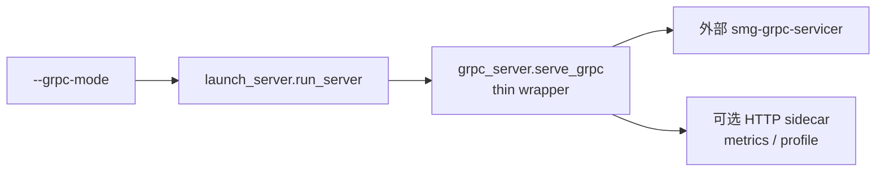
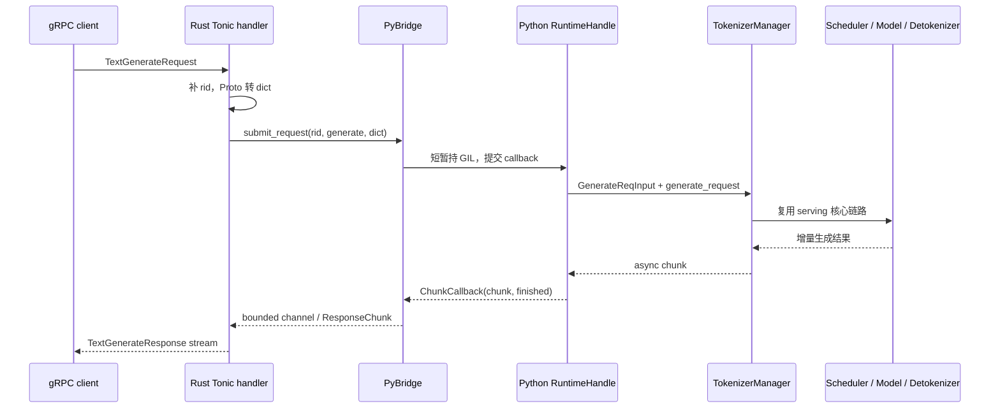

# SGLang gRPC 请求全链路

> 与 [[SGLang-HTTP请求全链路]] 对照阅读 · baseline：Git `70df09b`

先给出本篇最重要的结论：**当前基线里有两个容易被混为一谈的 gRPC 概念。**

- `--grpc-mode` 是 `launch_server.py` 真正会进入的 standalone 路径，但仓库内的 `grpc_server.py` 只是包装器，核心服务委托给外部 `smg-grpc-servicer` 包。
- 仓库同时包含一套 native Rust/Tonic + PyO3 bridge 实现；它清楚展示了 Proto 请求怎样进入 `TokenizerManager`、响应怎样背压回流，但在本基线中还没有被默认 HTTP 启动路径调用。

因此，不能用仓库内 Rust handler 的源码去证明 `--grpc-mode` 当前就是怎样运行的。正确读法是：**先分清部署路径，再研究 native bridge 的设计。**

## 读者任务

读完后，你应该能够：

1. 判断进程实际走的是 legacy `--grpc-mode`，还是尚待接线的 native Rust gRPC 能力。
2. 解释 Rust handler、`PyBridge`、Python `RuntimeHandle`、`TokenizerManager` 各自负责什么。
3. 沿 `rid` 追踪 `TextGenerate` 请求、响应 channel、terminal chunk 和 abort。
4. 根据“启动失败、没有 listener、慢客户端、流提前关闭”等症状找到正确源码边界。

## 长文读法

首次阅读先看“两个边界”和“native 请求主线”；准备排障时再看背压、取消与验证。Proto 字段逐项映射和完整 Rust 实现放在 [[SGLang-gRPC-Proto-源码走读]]，本篇只保留串起全局所需的关键证据。

## 先钉住两个边界

| 名称 | 当前入口 | 实现所有者 | 本基线状态 |
|------|----------|------------|------------|
| Legacy standalone gRPC | `--grpc-mode` / `server_args.grpc_mode` | 外部 `smg-grpc-servicer`，仓库提供 thin wrapper | 启动分支已接通 |
| Native Rust gRPC | `sglang.srt.grpc._core.start_server(...)` | 仓库内 `rust/sglang-grpc` + `grpc_bridge.py` | 实现存在，但默认 Python 启动路径尚未调用 |
| Encoder gRPC | `encoder_only=True` 且 `grpc_mode=True` | `encode_grpc_server` | 独立分支，不属于本文的生成链路 |

`launch_server.py` 自己已经把 legacy 与 native 的关系写得很直白：

```python
# 来源：python/sglang/launch_server.py L15-L36
def run_server(server_args):
    """Run the server based on server_args.grpc_mode and server_args.encoder_only."""
    if server_args.encoder_only:
        # For encoder disaggregation
        if server_args.grpc_mode:
            from sglang.srt.disaggregation.encode_grpc_server import (
                serve_grpc_encoder,
            )

            asyncio.run(serve_grpc_encoder(server_args))
        else:
            from sglang.srt.disaggregation.encode_server import launch_server

            launch_server(server_args)
    elif server_args.grpc_mode:
        # TODO: Once the native Rust gRPC server starts alongside HTTP in the
        # default path below (controlled by SGLANG_ENABLE_GRPC / SGLANG_GRPC_PORT),
        # remove this legacy SMG path and the grpc_mode flag.
        from sglang.srt.entrypoints.grpc_server import serve_grpc

        asyncio.run(serve_grpc(server_args))
    elif server_args.use_ray:
```

这张证据卡只证明一个判断：**普通 `grpc_mode` 当前明确被标记为 legacy SMG path；native server 是计划接到默认 HTTP 分支旁边的后续方向。**

## 路径 A：`--grpc-mode` 当前实际启动什么

仓库内 `serve_grpc` 不创建 Tonic server，也不实例化 `PyBridge`。它在运行时导入外部包，然后把 `server_args` 和 `model_info` 交出去：

```python
# 来源：python/sglang/srt/entrypoints/grpc_server.py L156-L174
async def serve_grpc(server_args, model_info=None):
    """Start the standalone gRPC server with integrated scheduler."""
    try:
        from smg_grpc_servicer.sglang.server import serve_grpc as _serve_grpc
    except ImportError as e:
        raise ImportError(
            "gRPC mode requires the smg-grpc-servicer package. "
            "If not installed, run: pip install smg-grpc-servicer[sglang]. "
            "If already installed, there may be a broken import due to a "
            "version mismatch — see the chained exception above for details."
        ) from e

    sidecar_app = web.Application()
    sidecar_runner = None
    sidecar_port = (
        server_args.grpc_http_sidecar_port
        if server_args.grpc_http_sidecar_port is not None
        else server_args.port + 1
    )
```

所以当前仓库能直接证明的 legacy 链路是：



外部包内部怎样创建 request manager、怎样绑定当前版本的 SGLang runtime，必须以安装环境中的 `smg-grpc-servicer` 源码为准；本仓库不能替它提供逐行证据。

### Sidecar 是运维面，不是生成主链路

当外部 servicer 支持 `on_request_manager_ready` hook 时，wrapper 才能启动 sidecar；旧版本仍可提供核心 gRPC 服务，但不能提供 sidecar。用户显式要求 metrics 时，源码选择直接报错，而不是静默缺失 `/metrics`：

```python
# 来源：python/sglang/srt/entrypoints/grpc_server.py L229-L254
    serve_kwargs: dict = {}
    sidecar_supported = (
        "on_request_manager_ready" in inspect.signature(_serve_grpc).parameters
    )
    if sidecar_supported:
        serve_kwargs["on_request_manager_ready"] = _on_request_manager_ready
    elif server_args.enable_metrics:
        # User explicitly asked for metrics but the installed servicer can't
        # start the sidecar that serves them — fail loud rather than silently
        # produce a server with no /metrics endpoint.
        raise RuntimeError(
            "--enable-metrics requires smg-grpc-servicer ≥ 0.5.3 (the version "
            "that accepts 'on_request_manager_ready'); installed version "
            "lacks the hook so the HTTP sidecar would never start. Upgrade "
            "smg-grpc-servicer or remove --enable-metrics."
        )
    else:
        logger.warning(
            "Installed smg-grpc-servicer does not accept "
            "'on_request_manager_ready'; HTTP sidecar disabled "
            "(no /metrics, /start_profile, /stop_profile). "
            "Upgrade smg-grpc-servicer to ≥ 0.5.3 to enable it."
        )

    try:
        await _serve_grpc(server_args, model_info, **serve_kwargs)
```

不要把 sidecar 端口当成 gRPC 端口：它只承载 `/metrics`、`/start_profile`、`/stop_profile` 等 HTTP 运维接口。

## 路径 B：native Rust gRPC 的请求主线

下面这条链路来自仓库内完整实现，但要始终带着一个前提：**它描述 native capability，不是当前 `--grpc-mode` wrapper 的内部源码。**



这条链路的核心不是“Rust 替代 Python 推理”，而是把职责切成三层：

| 层 | 负责 | 不负责 |
|----|------|--------|
| Tonic handler | wire protocol、stream、timeout、gRPC status | 不调度 GPU batch |
| `PyBridge` | GIL 边界、per-`rid` channel、callback、背压状态 | 不理解 Scheduler 策略 |
| `RuntimeHandle` | 把 dict 构造成内部请求，在 TokenizerManager event loop 上运行 | 不处理 Tonic socket |

## 1. Native server 是 Python 进程内的 Rust 扩展

PyO3 暴露的 `start_server` 接受 Python `runtime_handle`，建立独立 Tokio runtime 和后台线程，再把两者交给 `PyBridge`：

```rust
# 来源：rust/sglang-grpc/src/lib.rs L151-L176
#[pyo3(signature = (host, port, runtime_handle, worker_threads=4, response_channel_capacity=64, response_timeout_secs=300))]
fn start_server(
    host: String,
    port: u16,
    runtime_handle: PyObject,
    worker_threads: usize,
    response_channel_capacity: usize,
    response_timeout_secs: u64,
) -> PyResult<GrpcServerHandle> {
    // Best-effort: embedding processes may initialize tracing themselves.
    let _ = tracing_subscriber::fmt()
        .with_env_filter(
            EnvFilter::try_from_default_env().unwrap_or_else(|_| EnvFilter::new("info")),
        )
        .try_init();

    let addr: SocketAddr = format!("{}:{}", host, port)
        .parse()
        .map_err(|e| pyo3::exceptions::PyValueError::new_err(format!("Invalid address: {}", e)))?;
    let worker_threads = worker_threads.max(1);
    let response_channel_capacity = if response_channel_capacity == 0 {
        tracing::warn!(
            default = DEFAULT_RESPONSE_CHANNEL_CAPACITY,
            "response_channel_capacity must be positive; using default"
        );
        DEFAULT_RESPONSE_CHANNEL_CAPACITY
```

这里的架构取舍是 event-loop 隔离：Tonic 的网络收发在 Tokio runtime 上进行，模型运行时仍留在 Python `TokenizerManager` 的 loop 上。Rust crate 并不是一套独立模型后端。

## 2. Tonic handler 只做协议翻译和提交

`text_generate` 生成或复用 `rid`，把 Proto message 转成 dict，然后从 bridge 取得响应 receiver：

```rust
# 来源：rust/sglang-grpc/src/server.rs L222-L236
    async fn text_generate(
        &self,
        request: Request<proto::TextGenerateRequest>,
    ) -> Result<Response<Self::TextGenerateStream>, Status> {
        let req = request.into_inner();
        let rid = req
            .rid
            .clone()
            .unwrap_or_else(|| uuid::Uuid::new_v4().to_string());
        let req_dict = build_text_generate_dict(&rid, &req);

        let mut receiver = self
            .bridge
            .submit_request(&rid, "generate", req_dict)
            .map_err(|e| pyerr_to_status(e, "Failed to submit request"))?;
```

`rid` 是全链路最值得追踪的关联键：它同时标识内部请求、Rust channel、callback、terminal error 和 abort 目标。

## 3. PyBridge 把 Rust receiver 与 Python producer 接起来

每个活动 `rid` 对应一个 bounded channel。默认容量是 64，但这是**响应 chunk 数量**，不是 token 数量或字节数：

```rust
# 来源：rust/sglang-grpc/src/bridge.rs L35-L46
pub const DEFAULT_RESPONSE_CHANNEL_CAPACITY: usize = 64;

type BridgeStateRef = Arc<Mutex<BridgeState>>;

#[derive(Default)]
struct BridgeState {
    channels: HashMap<String, Sender<ResponseChunk>>,
    pending_sends: HashSet<String>,
    ready_callbacks: HashMap<String, PyObject>,
    ready_signals: HashSet<String>,
    terminal_errors: HashMap<String, TerminalError>,
}
```

提交时，Rust 只短暂获取 GIL：创建 Python dict 和 callback，调用同步的 `RuntimeHandle.submit_request`，随后把 receiver 交回 Tonic handler：

```rust
# 来源：rust/sglang-grpc/src/bridge.rs L177-L198
    pub fn submit_request(
        &self,
        rid: &str,
        req_type: &str,
        req_dict: HashMap<String, serde_json::Value>,
    ) -> PyResult<Receiver<ResponseChunk>> {
        let receiver = self.create_channel(rid)?;
        let rid_owned = rid.to_string();

        let result = Python::with_gil(|py| -> PyResult<()> {
            let py_req_dict = json_map_to_pydict(py, &req_dict)?;
            let callback = self.make_chunk_callback(py, rid_owned)?;

            let kwargs = PyDict::new(py);
            kwargs.set_item("req_type", req_type)?;
            kwargs.set_item("req_dict", py_req_dict)?;
            kwargs.set_item("chunk_callback", callback)?;

            self.runtime_handle
                .call_method(py, "submit_request", (), Some(&kwargs))?;
            Ok(())
        });
```

因此，GIL 不承载整个流式传输；它只出现在跨语言对象转换和 callback 调用的短边界上。

## 4. RuntimeHandle 回到同一个 TokenizerManager

Python 侧把 dict 实例化为 `GenerateReqInput`，再通过 `run_coroutine_threadsafe` 把 coroutine 投递到 TokenizerManager 的 event loop。流式请求直接消费 `tokenizer_manager.generate_request(...)`：

```python
# 来源：python/sglang/srt/entrypoints/grpc_bridge.py L262-L302
    def submit_request(
        self,
        *,
        req_type: str,
        req_dict: dict,
        chunk_callback,
        is_disconnected_fn: Optional[Callable[[], bool]] = None,
    ):
        mock_request = (
            _GrpcRequest(is_disconnected_fn=is_disconnected_fn)
            if is_disconnected_fn is not None
            else None
        )
        if req_type == "generate":
            from sglang.srt.managers.io_struct import GenerateReqInput

            obj = GenerateReqInput(**req_dict)
            stream = req_dict.get("stream", False)
            self._submit_on_tm_loop(
                self._run_generate(obj, chunk_callback, stream, mock_request)
            )
        elif req_type == "embed":
            from sglang.srt.managers.io_struct import EmbeddingReqInput

            obj = EmbeddingReqInput(**req_dict)
            self._submit_on_tm_loop(self._run_embed(obj, chunk_callback, mock_request))
        else:
            raise ValueError(
                f"Unknown req_type: {req_type!r} (expected 'generate' or 'embed')"
            )

    async def _run_generate(self, obj, chunk_callback, stream: bool, request):
        ready_event = None
        try:
            ready_event = self._install_on_ready(chunk_callback) if stream else None
            gen = self.tokenizer_manager.generate_request(obj, request=request)
            if stream:
                async for chunk in gen:
                    finished = (
                        chunk.get("meta_info", {}).get("finish_reason") is not None
                    )
```

从这行 `generate_request` 开始，请求复用 HTTP 入口背后的同一套 TokenizerManager、Scheduler、ModelRunner、KV cache 与 Detokenizer 职责。所谓“复用”是运行时核心相同，不是 HTTP 和 gRPC 的传输层相同。

## 5. 背压是一份双边协议

可以把这一段想成有容量的传送带，但类比只在 producer/consumer 关系上成立：

- Python `RuntimeHandle` 是 producer。
- Rust bounded channel 是缓冲区。
- Tonic stream / client 是 consumer。
- `Ready`、`Pending`、`Closed` 是传送带状态，不是推理状态。

Rust 先 `try_send`。channel 满时只允许停放一个待发送 chunk；在它排空之前如果又收到一个 chunk，stream 会以 `ChannelFull` 关闭并触发 abort：

```rust
# 来源：rust/sglang-grpc/src/bridge.rs L524-L555
fn try_send_chunk(
    py: Python<'_>,
    rid: &str,
    state: &BridgeStateRef,
    runtime_handle: &PyObject,
    tokio_handle: &Handle,
    sender: &Sender<ResponseChunk>,
    msg: ResponseChunk,
) -> PyResult<ChunkSendStatus> {
    let terminal = msg.is_terminal();
    match sender.try_send(msg) {
        Ok(()) => {
            if terminal {
                remove_channel_refs(rid, state);
            }
            Ok(ChunkSendStatus::Ready)
        }
        Err(TrySendError::Full(msg)) => {
            if !register_pending_send(rid, state) {
                tracing::warn!(
                    rid,
                    "gRPC bridge received another chunk before the parked chunk drained; closing stream"
                );
                close_channel_with_error(
                    py,
                    rid,
                    state,
                    runtime_handle,
                    TerminalError::ChannelFull { rid: rid.into() },
                );
                return Ok(ChunkSendStatus::Closed);
            }
```

Python 收到 `Pending` 后等待 Rust 的 on-ready 通知。等待超过 300 秒时，它会 abort 对应 `rid`：

```python
# 来源：python/sglang/srt/entrypoints/grpc_bridge.py L115-L145
    async def _send_with_backpressure(
        self,
        chunk_callback,
        ready_event: Optional[asyncio.Event],
        payload,
        *,
        timeout_abort_rid=None,
        **kwargs,
    ) -> bool:
        status = self._safe_callback(chunk_callback, payload, **kwargs)
        if status is None or self._is_closed_status(status):
            return False
        if not self._is_pending_status(status):
            return True

        if kwargs.get("finished"):
            return True
        if ready_event is None:
            return True

        try:
            await asyncio.wait_for(
                ready_event.wait(), timeout=self._BACKPRESSURE_TIMEOUT_S
            )
        except asyncio.TimeoutError:
            if timeout_abort_rid is not None:
                self._abort_request_id(timeout_abort_rid)
                logger.warning(
                    "gRPC chunk backpressure wait timed out after %ss; aborted request",
                    self._BACKPRESSURE_TIMEOUT_S,
                )
```

失效边界也要说清楚：bounded channel 能限制未消费的响应 chunk，却不能替代模型侧的准入控制，也不能保证慢客户端仍获得无限等待时间。

## 6. terminal chunk、超时和断连如何收口

Python 以 `meta_info.finish_reason is not None` 判断正常生成结束，并调用 callback 时传 `finished=True`。Rust 把它转换成 `ResponseChunk::Finished`，Tonic handler 再发送 `TextGenerateResponse { finished: true }` 后退出循环。

异常结束走另一套规则：

| 事件 | Rust 对外状态 | 是否向 Python abort |
|------|--------------|---------------------|
| 正常 `Finished` | 最后一条 response 的 `finished=true` | 否 |
| Python callback error | gRPC `INTERNAL` | terminal error 已成立，不重复 abort |
| 单个 chunk 等待超时 | `DEADLINE_EXCEEDED` | 是 |
| client 停止消费、stream 被 drop | stream 结束 | `RequestAbortGuard::drop` 触发 abort |
| channel 无 terminal chunk 直接关闭 | `INTERNAL` 或保存的 terminal status | 无已知 terminal error 时 abort |

`RequestAbortGuard` 的意义是：不能因为 gRPC client 已经离开，就让 Scheduler 继续为无人接收的请求生成 token。

```rust
# 来源：rust/sglang-grpc/src/server.rs L88-L124
struct RequestAbortGuard {
    bridge: Arc<PyBridge>,
    rid: String,
    armed: bool,
}

impl RequestAbortGuard {
    fn new(bridge: Arc<PyBridge>, rid: impl Into<String>) -> Self {
        Self {
            bridge,
            rid: rid.into(),
            armed: true,
        }
    }

    fn disarm(&mut self) {
        self.armed = false;
    }

    fn abort_now(&mut self) {
        if self.armed {
            self.armed = false;
            spawn_abort(self.bridge.clone(), self.rid.clone());
        }
    }
}

impl Drop for RequestAbortGuard {
    fn drop(&mut self) {
        if self.armed {
            // Dropping a response stream means the client stopped consuming; propagate
            // cancellation to Python without blocking the Tokio worker.
            spawn_abort(self.bridge.clone(), self.rid.clone());
        }
    }
}
```

## 与 HTTP 路径对照

| 边界 | HTTP | Native gRPC capability |
|------|------|------------------------|
| wire protocol | HTTP JSON / SSE | Proto / Tonic stream |
| 协议适配 | FastAPI route 和 serving class | Rust handler、request dict、`RuntimeHandle` |
| 主进程运行时 | `TokenizerManager.generate_request` | 同一个方法 |
| GPU 调度与执行 | Scheduler / ModelRunner | 相同职责链 |
| 增量响应 | Python/SSE 编码 | callback → bounded channel → proto response |
| 取消 | HTTP request disconnect/abort | stream drop、timeout、channel close → abort |

“后端相同”只应理解为 TokenizerManager 之后的推理职责复用。入口验证、序列化、流控、错误码和取消传播都不同。

## 运行验证

以下命令均从知识库根目录执行。

### 1. 验证当前启动分叉

```powershell
rg -n "legacy SMG path|grpc_mode|serve_grpc" sglang/python/sglang/launch_server.py
rg -n "smg_grpc_servicer|on_request_manager_ready|_serve_grpc" sglang/python/sglang/srt/entrypoints/grpc_server.py
```

预期：第一条命中 legacy 注释；第二条证明 wrapper 导入外部包，而不是导入 `sglang.srt.grpc._core`。

### 2. 验证 native 实现存在但尚无 Python 调用点

```powershell
rg -n "fn start_server|PyBridge::new|run_grpc_server" sglang/rust/sglang-grpc/src
rg -n "start_server\(" sglang/python
```

预期：Rust 目录命中完整实现；本基线的 Python 目录不命中调用点。`rg` 第二条返回退出码 1 在这里表示“没有匹配”，不是命令损坏。

### 3. 验证 native bridge 的静态主线

```powershell
rg -n "text_generate|submit_request|RequestAbortGuard" sglang/rust/sglang-grpc/src/server.rs
rg -n "mpsc::channel|ChunkCallback|ChunkSendStatus|ChannelFull" sglang/rust/sglang-grpc/src/bridge.rs
rg -n "class RuntimeHandle|_send_with_backpressure|generate_request|def abort" sglang/python/sglang/srt/entrypoints/grpc_bridge.py
```

预期：三个文件分别命中协议入口、跨语言 channel、Python runtime 回接点。若其中任何一层缺失，就不能声称 native `TextGenerate` 主线完整。

### 4. 有构建环境时运行 Rust 测试

```powershell
cargo test --manifest-path "sglang/rust/sglang-grpc/Cargo.toml"
```

前提：已安装 Rust toolchain、`protoc` 和 crate 所需构建依赖。预期是 bridge/server 的单元测试通过；如果失败，应先区分构建依赖问题与 stream 语义测试失败。

## 症状到源码边界

| 症状 | 先看哪里 | 判断 |
|------|----------|------|
| `--grpc-mode` 启动即 ImportError | `grpc_server.py` 的外部 import | 缺包或 `smg-grpc-servicer` 版本/二进制不匹配 |
| gRPC 能用但 `/metrics` 不存在 | sidecar hook 检查 | servicer 过旧，或没有启用 metrics route |
| 设置 `SGLANG_ENABLE_GRPC=1` 却没有 native listener | `launch_server.py` 与 Python 调用点搜索 | 当前基线只生成配置，尚未把 native `start_server` 接入默认路径 |
| stream 客户端很慢后被关闭 | `try_send_chunk`、`_send_with_backpressure` | channel 满、parked chunk 未排空或 300 秒等待超时 |
| 客户端断开后 GPU 仍长时间工作 | `RequestAbortGuard` → `PyBridge.abort` → `RuntimeHandle.abort` | 检查取消是否跨 Rust/Python 边界传播 |
| native listener 准备直接暴露公网 | `run_grpc_server` 的认证边界注释 | 当前源码注明尚未与 HTTP API-key/admin-key 认证对齐 |

## 复盘

把本篇压缩成四句话：

1. `--grpc-mode` 当前进入外部 `smg-grpc-servicer`，仓库内文件只是 wrapper 与 sidecar。
2. 仓库内 native Rust gRPC 是一套 PyO3 capability，在本基线尚未被默认 Python 启动路径调用。
3. native 主线以 `rid` 为轴：Tonic handler → `PyBridge` channel → `RuntimeHandle` → `TokenizerManager` → callback → proto stream。
4. 真正决定生产稳定性的不是 Proto 字段数量，而是背压、terminal chunk、timeout、断连与 abort 能否闭环。

## 下一站

- Proto 字段与跨语言逐段证据：[[SGLang-gRPC-Proto-源码走读]]
- 对象形态迁移：[[SGLang-gRPC-Proto-数据流]]
- 依赖、sidecar、message size 和认证问题：[[SGLang-gRPC-Proto-排障指南]]
- 默认 HTTP 主线：[[SGLang-HTTP请求全链路]]
- 启动分发：[[SGLang-启动链路]]
