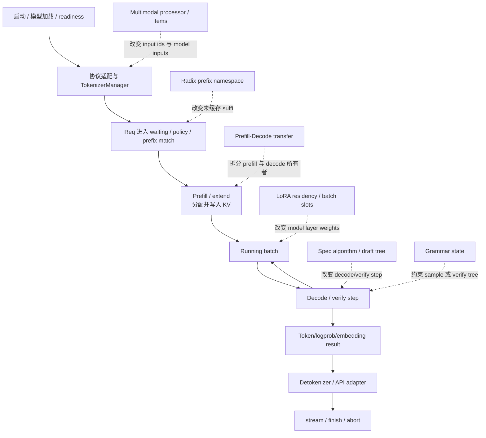

# SGLang 业务流程

> 先建立普通请求的状态机，再观察 prefix、speculative、PD、LoRA、多模态和 grammar 在哪个对象边界插入；不要把扩展能力画成八条互不相关的流水线。

## 读者任务

读完后，你应能沿同一个 request id 回答：服务何时真正 ready；请求由谁持有；prefill/decode 如何跨 step 推进；KV、adapter、multimodal item、draft tree 与 grammar state 在哪里进入；完成、abort 或失败时哪些资源必须收口。

## 一张业务总图



主干是请求状态机，虚线是插入点。一个请求可以同时使用 prefix cache、LoRA、grammar 和 speculative；这些能力并非只能单选，也不能只用“开关已打开”证明交叉状态正确。

## 业务不变量

贯穿所有域，至少维护五本账：

1. 请求账：内部 rid、输入/输出 token、finish/abort、stream consumer；
2. 批次账：waiting/running/chunked/staging、prefill/decode/verify、本 step commit；
3. KV 账：prefix indices、req row、alloc loc、device/host/storage 状态、释放责任；
4. 扩展状态账：adapter slot、draft tree/hidden/KV、grammar cursor、multimodal items、PD metadata；
5. 回程账：sampled ids、logprobs、detokenizer delta、API chunk 与错误传播。

只要其中一本账丢失，“业务成功”就可能只是表象：例如 HTTP 已监听但模型未生成就绪，prefix 命中但 KV 仍在 load-back，draft 接受了 token 但 grammar cursor 未回滚，客户端断开但 request/KV 仍存活。

## 流程一：启动到可服务

### 目标

把配置变成运行图，并区分 scheduler ready、HTTP lifecycle、weight wait、warmup 与真正可接受目标请求。

### 对象流

```text
CLI / Engine config
  → ServerArgs 派生与校验
  → Scheduler processes / ranks
  → 非零 node rank 等待或退出主入口
  → TokenizerManager / Detokenizer / HTTP app 装配
  → 可选 checkpoint weights wait
  → 可选 warmup
  → server_status / readiness
```

Engine 先启动 Scheduler processes；多节点非零 rank 不需要运行 tokenizer/detokenizer，并在 scheduler ready 后停在对应边界。

```python
# 来源：python/sglang/srt/entrypoints/engine.py L822-L840
scheduler_init_result, scheduler_procs = cls._launch_scheduler_processes(
    server_args, port_args, run_scheduler_process_func
)
scheduler_init_result.engine_info_bootstrap_server = (
    engine_info_bootstrap_server
)

if (
    server_args.enable_elastic_expert_backup
    and server_args.elastic_ep_backend is not None
):
    run_expert_backup_manager(server_args, port_args)

if server_args.node_rank >= 1:
    # In multi-node cases, non-zero rank nodes do not need to run tokenizer or detokenizer,
    # so they can just wait here.
    scheduler_init_result.wait_for_ready()

    if os.getenv("SGLANG_BLOCK_NONZERO_RANK_CHILDREN") == "0":
```

HTTP warmup 又是更后的门：可能先等 checkpoint weights；跳过 warmup 时才直接把 `server_status` 设为 Up。

```python
# 来源：python/sglang/srt/entrypoints/http_server.py L2145-L2161
def _wait_and_warmup(
    server_args: ServerArgs,
    launch_callback: Optional[Callable[[], None]] = None,
    execute_warmup_func: Callable = _execute_server_warmup,
):
    if server_args.checkpoint_engine_wait_weights_before_ready:
        _wait_weights_ready()

    # Send a warmup request
    if not server_args.skip_server_warmup:
        if not execute_warmup_func(server_args):
            return
    else:
        _global_state.tokenizer_manager.server_status = ServerStatus.Up

    # The server is ready for requests
    logger.info("The server is fired up and ready to roll!")
```

### 复盘

“进程存在、端口监听、health 成功、warmup 通过、目标模型/协议可服务”是不同强度的信号。启动排障必须定位最早未完成的对象，不以单一端口或日志句子代替 readiness。

## 流程二：普通文本请求

### 目标

把 transport request 转成长期 `Req`，在多个 Scheduler step 中完成 prefill/decode，再以 token/text 增量回程。

### 对象流

```text
HTTP/OpenAI/gRPC request
  → schema/template/tokenization
  → TokenizerManager ReqState + internal request
  → Scheduler waiting queue
  → prefix match / admission / allocation
  → prefill or chunked extend
  → merge/transition to running batch
  → repeated decode/other forward modes
  → output event
  → Detokenizer / API adapter
  → finish or abort cleanup
```

single request 路径中，TokenizerManager 先 tokenize，按需保存 prompt ids，发送内部请求，再异步等待并 yield response。

```python
# 来源：python/sglang/srt/managers/tokenizer_manager.py L626-L633
if obj.is_single:
    tokenized_obj = await self._tokenize_one_request(obj)
    state = self.rid_to_state[obj.rid]
    if obj.return_prompt_token_ids:
        state.prompt_token_ids = list(tokenized_obj.input_ids)
    self._send_one_request(tokenized_obj)
    async for response in self._wait_one_response(obj, request):
        yield response
```

Scheduler 的 prefill→running 过渡不是简单 append：还要处理 timeout、DLLM staging、chunked request 是否产生新 KV、HiSparse ready batch 等条件。

```python
# 来源：python/sglang/srt/managers/scheduler.py L2587-L2625
self.process_pending_chunked_abort()

if self.enable_fpm:
    self._fpm_batch_t0 = time.monotonic()
self._abort_on_waiting_timeout()
self._abort_on_running_timeout()
if self.dllm_config is not None:
    self.dllm_manager.filter_finished_reqs()

# Merge the prefill batch into the running batch
chunked_req_to_exclude = set()

if self.dllm_config is not None and self.dllm_manager.any_staging_reqs():
    chunked_req_to_exclude.update(self.dllm_manager.staging_queue)
    for req in self.dllm_manager.staging_queue:
        self.stash_chunked_request(req)

if self.chunked_req is not None:
    # Move the chunked request out of the batch so that we can merge
    # only finished requests to running_batch.
    chunked_req_to_exclude.add(self.chunked_req)

    # Stash (cache) the previous chunk only when it produced new KV
    # beyond what is already cached. A parked chunk (add_chunked_req
    # hybrid-SWA early-return) leaves extend_range.end ==
    # len(prefix_indices), so there is nothing new to cache and
    # stashing would be a no-op.
    if self.chunked_req.extend_range.end > len(self.chunked_req.prefix_indices):
        self.stash_chunked_request(self.chunked_req)

# HiSparse has its own prefill-to-decode transition; skip last_batch merge.
if self.enable_hisparse:
    ready_reqs = self.hisparse_coordinator.collect_ready_reqs()
    if len(ready_reqs) > 0:
        new_batch = self._build_hisparse_decode_batch(ready_reqs)
        if self.running_batch.is_empty():
            self.running_batch = new_batch
        else:
            self.running_batch.merge_batch(new_batch)
```

### 复盘

continuous batching 表示 Scheduler 在迭代边界持续接纳、推进和回收请求；它不保证所有 waiting/prefill/decode 工作永远在同一次 GPU forward 混合。每 step 生成一个 token 也只是普通 decode 的常见情形，speculative、多 token、DLLM 等模式会改变推进单位。

## 流程三：前缀缓存

### 插入点

在 waiting/admission 阶段，RadixAttention 用 token ids 与可选 `extra_key` 决定逻辑 namespace，返回最长匹配的 device indices 与 last node。

```python
# 来源：python/sglang/srt/mem_cache/radix_cache.py L355-L380
def match_prefix(self, params: MatchPrefixParams) -> MatchResult:
    """Find the longest cached prefix of ``key`` in the radix tree.

    The logical namespace for prefix matching is determined by both the
    token id sequence and the optional ``extra_key`` carried by ``RadixKey``.
    Entries that share identical leading token ids but have *different*
    ``extra_key`` values are intentionally kept disjoint and never share
    prefix nodes. This is useful to:

    * Isolate KV cache lines for different LoRA / adapter IDs.
    * Separate requests that intentionally should not share state (e.g.,
      different sampling salt, cache version, or retrieval augmentation
      context) by supplying a distinct ``extra_key``.

    Args:
        params (MatchPrefixParams): Parameters containing the lookup key
            with a list of token ids and an optional ``extra_key`` namespace tag.
            If ``page_size > 1`` the length is internally truncated to a multiple
            of ``page_size`` before matching. Passing an empty key returns an
            empty result with the root as the last node.

    Returns:
        MatchResult: ``device_indices`` is a 1-D ``torch.int64`` tensor of
        the concatenated KV cache indices corresponding to the longest
        cached prefix (may be length 0).
        ``last_device_node`` and ``last_host_node`` (currently the same) are the tree node objects
```

### 改变与不改变

- 改变：未缓存 suffix 长度、需要新分配/计算的 token、tree lock/commit/evict 生命周期；
- 不改变：请求仍要经过 Scheduler、ForwardBatch、backend 和回程；
- 额外边界：page alignment 会截断可匹配长度；LoRA 等 `extra_key` 隔离 namespace；HiCache/storage hit 可能还需 load-back。

业务 KPI 不能只看 `cached_tokens` 或 TTFT；还要对上 matched indices、new allocation、device readiness 与固定 workload。

## 流程四：投机解码与 grammar 的交叉

### 插入点

投机能力不只有 EAGLE。当前内建 DFLASH、EAGLE/EAGLE3、FROZEN_KV_MTP、STANDALONE、NGRAM，并允许注册插件；不同算法对 draft KV、hidden states、overlap 和 worker 类型有不同契约。

```python
# 来源：python/sglang/srt/speculative/spec_info.py L28-L57
class SpeculativeAlgorithm(Enum):
    """Builtin speculative decoding algorithms. Plugin-registered ones are
    ``CustomSpecAlgo`` instances; ``from_string`` returns either type, and
    both expose the same ``is_*()`` / ``create_worker`` interface so callers
    dispatch uniformly without isinstance checks.
    """

    DFLASH = auto()
    EAGLE = auto()
    EAGLE3 = auto()
    FROZEN_KV_MTP = auto()
    STANDALONE = auto()
    NGRAM = auto()
    NONE = auto()

    @classmethod
    def from_string(
        cls, name: Optional[str]
    ) -> Union[SpeculativeAlgorithm, CustomSpecAlgo]:
        if name is None:
            return cls.NONE
        upper = name.upper()
        try:
            return cls[upper]
        except KeyError:
            pass
        spec = _get_registered_spec(upper)
        if spec is not None:
            return spec
        raise ValueError(f"Unknown speculative algorithm name: {name}")
```

当 grammar 与 draft tree 同时存在时，verify mask 不是一次性填完：DFS 沿 accepted node 前进 grammar，生成下一层 bitmask，返回兄弟分支前再 rollback。

```python
# 来源：python/sglang/srt/speculative/spec_utils.py L397-L424
if is_accepted:
    if curr != 0:
        # Accept the current token
        grammar.accept_token(int(draft_tokens[curr]))
    if not grammar.is_terminated():
        # Generate the bitmask for the current token
        grammar.fill_vocab_mask(allocate_token_bitmask, curr)
        if retrieve_next_token[curr] != -1:
            # Visit the child node
            dfs(
                int(retrieve_next_token[curr]),
                retrieve_next_token,
                retrieve_next_sibling,
                curr,
            )

    if curr != 0:
        # Rollback the current token
        grammar.rollback(1)

if retrieve_next_sibling[curr] != -1:
    # Visit the sibling node
    dfs(
        int(retrieve_next_sibling[curr]),
        retrieve_next_token,
        retrieve_next_sibling,
        parent_pos,
    )
```

### 改变与不改变

- 改变：decode 的 candidate/verify/accept 单位、draft/target KV 与 hidden state、cache loc 搬移、grammar transaction；
- 不改变：target model 仍是接受语义的权威，accepted token 最终仍要提交到请求/KV/回程状态；
- 验证：同时记录 accepted chain、bonus token、target KV loc、grammar cursor 与 rollback，而不只看 accept rate。

## 流程五：Prefill-Decode 分离

### 插入点

PD 把普通请求的 prefill owner、decode owner、KV/metadata transfer 与前台路由拆开。它不是简单“Prefill 算完后 RDMA send”：还存在 bootstrap queue、metadata buffer index、rank/room 协商、sender/receiver 状态、handshake-first 或 optimistic forward/requeue 等路径。

释放 metadata index 是请求生命周期的一部分。

```python
# 来源：python/sglang/srt/disaggregation/prefill.py L90-L101
"""
Release the metadata buffer index allocated for a request in prefill disaggregation mode.

This function safely releases the metadata buffer index if it was allocated.

Args:
    req: The request object that may have a metadata_buffer_index allocated
    allocator: The ReqToMetadataIdxAllocator instance to free the index
"""
if req.metadata_buffer_index >= 0:
    allocator.free(req.metadata_buffer_index)
    req.metadata_buffer_index = -1
```

Prefill 侧 queue 还同时持有 target/draft KV pool、metadata buffers、TP/PP/rank、transfer backend 与 Scheduler。

```python
# 来源：python/sglang/srt/disaggregation/prefill.py L104-L130
class PrefillBootstrapQueue:
    """
    Store the requests in bootstrapping
    """

    def __init__(
        self,
        token_to_kv_pool: KVCache,
        draft_token_to_kv_pool: Optional[KVCache],
        req_to_metadata_buffer_idx_allocator: ReqToMetadataIdxAllocator,
        metadata_buffers: MetadataBuffers,
        tp_rank: int,
        tp_size: int,
        gpu_id: int,
        bootstrap_port: int,
        gloo_group: ProcessGroup,
        max_total_num_tokens: int,
        scheduler: Scheduler,
        pp_rank: int,
        pp_size: int,
        transfer_backend: TransferBackend,
    ):
        self.token_to_kv_pool = token_to_kv_pool
        self.draft_token_to_kv_pool = draft_token_to_kv_pool
        self.is_mla_backend = is_mla_backend(token_to_kv_pool)
        self.metadata_buffers = metadata_buffers
        self.req_to_metadata_buffer_idx_allocator = req_to_metadata_buffer_idx_allocator
```

### 验证

按一次 request attempt 记录 Gateway 路由、prefill/decode internal rid、bootstrap/room、metadata index、每个 rank 的 transfer 状态、PREBUILT/ready gate、retry/abort 和最终释放。具体主线见 [[SGLang-PD分离]]。

## 流程六：多 LoRA

### 插入点

LoRA 同时改变三个阶段：请求/prefix namespace 带 adapter id，batch admission 要满足 slot/pinned 约束，ModelRunner 前要把活跃 adapter 映射到 memory-pool buffer 并准备 backend batch metadata。

batch 合法性不是简单 `len(lora_ids) <= max_loras_per_batch`：pinned adapters 会减少可供 base/unpinned 使用的 vacancy；prepare 时还要把新请求与 running request 的 adapter 集合合并，传入 adapter/模块/ref 快照。

```python
# 来源：python/sglang/srt/lora/lora_manager.py L273-L318
def validate_lora_batch(self, lora_ids: set[Optional[str]]) -> bool:
    """
    Validate if the LoRA IDs in the batch can be loaded into the current LoRA memory pool.
    """
    if len(lora_ids) > self.max_loras_per_batch:
        return False

    # skip pinned LoRA check if no pinned LoRA adapters are loaded.
    if self.num_pinned_loras == 0:
        return True

    # counting the number of pinned LoRA adapters in the batch.
    pinned_loras_in_batch = 0
    for lora_id in lora_ids:
        if lora_id is not None:
            lora_ref = self.lora_refs.get(lora_id)
            assert (
                lora_ref is not None
            ), f"LoRA ID {lora_id} not found in lora_refs."
            pinned_loras_in_batch += int(lora_ref.pinned)

    assert pinned_loras_in_batch <= self.num_pinned_loras, (
        f"Number of pinned LoRA adapters in the batch ({pinned_loras_in_batch}) exceeds the total number of pinned adapters "
        f"({self.num_pinned_loras}). This indicates a bug in the LoRA loading logic."
    )

    required_slots = len(lora_ids) - pinned_loras_in_batch
    mem_pool_vacancy = self.memory_pool.max_loras_per_batch - self.num_pinned_loras

    return required_slots <= mem_pool_vacancy

def fetch_new_loras(
    self, new_loras: set[Optional[str]], running_loras: set[Optional[str]] = set()
):
    # Load active loras into lora memory pool
    cur_uids = new_loras | running_loras

    assert len(cur_uids) <= self.max_loras_per_batch
    self.memory_pool.prepare_lora_batch(
        cur_uids=cur_uids,
        lora_adapters=self.loras,
        lora_modules=self.lora_modules,
        lora_refs=self.lora_refs.copy(),  # copy snapshot of current lora_refs to avoid mutation during the batch preparation.
        lora_embed_tokens_module=self.embed_tokens_module,  # merge into embedding or lora module
        lora_lm_head_module=self.lm_head_module,  # merge into embedding or lora module
    )
```

### 验证

记录 adapter config/CPU weights、target modules、pinned 状态、pool buffer id、running/new uid union、CUDA Graph batch metadata 和最终 LoRA backend。不能把“已加载到 CPU”当成“当前 batch 已驻留 GPU buffer”，也不能预设 eviction 一定是 LRU。

## 流程七：多模态

### 插入点

多模态处理发生在进入 Scheduler 主线之前，但结果不只是“vision tokens”。processor 可能产出/改写 input ids、offsets、pixel/audio/video feature、position/M-RoPE、model-specific data；输入还可能是 raw data、processor output 或 precomputed embedding。

`load_mm_data` 会根据预处理输入、token/data 对齐、skip-tokenizer 与动态 frame expansion 在 fast/legacy 路径间选择，而不是所有模型都走同一 AutoProcessor 调用。

```python
# 来源：python/sglang/srt/multimodal/processors/base_processor.py L797-L864
BaseMultimodalProcessor.validate_mm_data(image_data, video_data, audio_data)

input_ids = prompt if isinstance(prompt, list) else None
if input_ids is not None and self._all_mm_data_is_preprocessed(
    image_data, video_data, audio_data
):
    # fast path for preprocessed data: early return
    return BaseMultiModalProcessorOutput(
        input_text="",
        input_ids=input_ids,
        images=list(image_data or []),
        videos=list(video_data or []),
        audios=list(audio_data or []),
    )

multimodal_tokens_pattern = multimodal_tokens.get_combined_regex()
if isinstance(prompt, list) and return_text:
    assert len(prompt) and isinstance(prompt[0], int)
    prompt = self._tokenizer.decode(prompt)
else:
    prompt = prompt

assert isinstance(prompt, str)
# split text into list of normal text and special tokens
text_parts = re.split(multimodal_tokens_pattern, prompt)

cnt = {Modality.IMAGE: 0, Modality.VIDEO: 0, Modality.AUDIO: 0}
for text_part in text_parts:
    modality = multimodal_tokens.get_modality_of_token(text_part)
    if modality is not None:
        cnt[modality] += 1

n_image = len(image_data) if image_data else 0
n_video = len(video_data) if video_data else 0
n_audio = len(audio_data) if audio_data else 0

# For MiniCPMO and MiniCPMV or multimodal_tokens not totally align, legacy show path
if (
    self.server_args.skip_tokenizer_init
    or cnt[Modality.IMAGE] != n_image
    or cnt[Modality.VIDEO] != n_video
    or cnt[Modality.AUDIO] != n_audio
    or getattr(self, "support_dynamic_frame_expansion", False)
):
    return await self.legacy_load_mm_data(
        prompt=prompt,
        multimodal_tokens=multimodal_tokens,
        image_data=image_data,
        video_data=video_data,
        audio_data=audio_data,
        return_text=return_text,
        discard_alpha_channel=discard_alpha_channel,
        audio_sample_rate=audio_sample_rate,
        input_ids=input_ids,
    )
# For models other than MiniCPMO and MiniCPMV,
# totally align multimodal_tokens, fast path
return await self.fast_load_mm_data(
    prompt=prompt,
    multimodal_tokens=multimodal_tokens,
    image_data=image_data,
    video_data=video_data,
    audio_data=audio_data,
    return_text=return_text,
    discard_alpha_channel=discard_alpha_channel,
    audio_sample_rate=audio_sample_rate,
    input_ids=input_ids,
)
```

### 验证

对每个 model/processor 记录输入格式、placeholder 与媒体数量、最终 input ids/offset、item format、feature device/transport、retokenize drift/fallback 和模型消费字段。不能把所有 VLM 统一解释为 cross-attention，也不能假设媒体预处理总在 CPU。

## 域间交叉矩阵

| 组合 | 额外要保护的状态 |
|---|---|
| Prefix + LoRA | `extra_key`/adapter namespace，避免跨 adapter 共享 KV |
| Spec + Grammar | 每个 draft tree 分支的 accept/fill/rollback 与 target acceptance |
| Spec + PD | draft KV/hidden state 是否需要传输、两侧算法/shape 一致 |
| LoRA + CUDA Graph | adapter buffer id、batch metadata 与 replay shape |
| Multimodal + Prefix | expanded input ids、mm item hash/offset 与 cache granularity |
| Multimodal + PD | encoder/local processing、feature transport 与 language request owner |

所谓“功能兼容”必须验证交叉对象，而不是分别证明两个开关单独可用。

## 静态验证

```powershell
rg -n '_launch_scheduler_processes|wait_for_ready|_wait_and_warmup' sglang/python/sglang/srt/entrypoints/engine.py sglang/python/sglang/srt/entrypoints/http_server.py
rg -n '_tokenize_one_request|_send_one_request|_wait_one_response' sglang/python/sglang/srt/managers/tokenizer_manager.py
rg -n 'chunked_req_to_exclude|stash_chunked_request|running_batch' sglang/python/sglang/srt/managers/scheduler.py
rg -n 'match_prefix|extra_key|page_size' sglang/python/sglang/srt/mem_cache/radix_cache.py
rg -n 'class SpeculativeAlgorithm|CustomSpecAlgo|grammar\.accept_token|grammar\.rollback' sglang/python/sglang/srt/speculative/spec_info.py sglang/python/sglang/srt/speculative/spec_utils.py
rg -n 'PrefillBootstrapQueue|metadata_buffer_index|transfer_backend' sglang/python/sglang/srt/disaggregation/prefill.py
rg -n 'validate_lora_batch|pinned_loras|prepare_lora_batch' sglang/python/sglang/srt/lora/lora_manager.py
rg -n 'validate_mm_data|legacy_load_mm_data|fast_load_mm_data|process_and_combine_mm_data' sglang/python/sglang/srt/multimodal/processors/base_processor.py
```

预期：八组命中分别对应 readiness、请求前台、batch transition、prefix namespace、spec/grammar transaction、PD metadata、LoRA residency 和多模态输入协议。静态命中不替代端到端组合测试。

## 收官问题

- [ ] 能沿一个普通 request 画出启动后 ingress→waiting→prefill→running→decode→回程→cleanup。
- [ ] 能说明 continuous batching 与 mixed GPU forward 不是同义词。
- [ ] 能区分 prefix semantic hit、KV allocation 与 device-ready data。
- [ ] 能按具体 speculative algorithm 说明 draft KV/hidden/verify input，而不是只会 EAGLE 三步图。
- [ ] 能解释 grammar 在 draft tree DFS 中为什么需要 accept/rollback。
- [ ] 能为 PD request attempt 对上双前台、metadata、各 rank transfer 与 retry/release。
- [ ] 能区分 LoRA CPU cache、GPU memory pool residency、batch slot 与 CUDA Graph metadata。
- [ ] 能区分 raw/processor-output/precomputed multimodal 输入和 fast/legacy/IPC 路径。

逐 hop 的普通 HTTP 主线见 [[SGLang-HTTP请求全链路]]；各扩展的深入证据回到对应专题。
