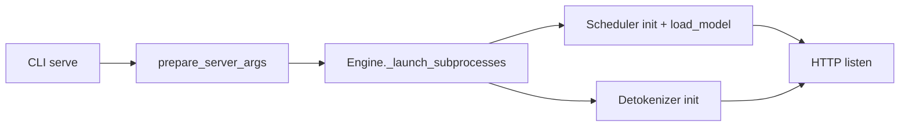
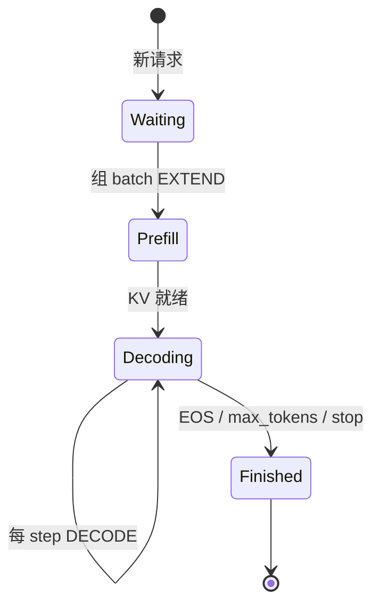
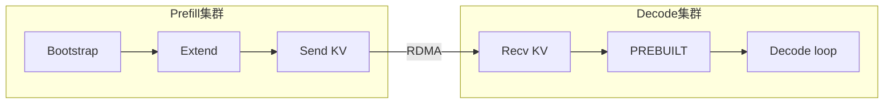
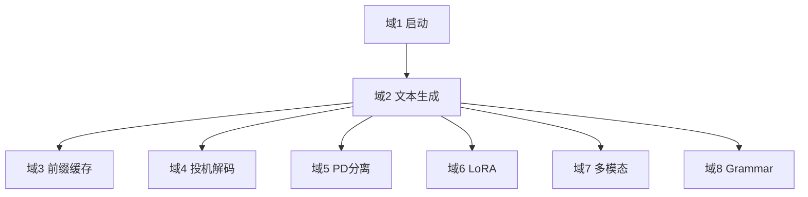

# SGLang 业务流程

> understand-domain 风格：按**业务域**组织流程步骤，每步有目标、参与者、状态变化与代码锚点

## 你为什么要读

本文不从「文件 A 调文件 B」角度组织，而从**运维与推理业务**角度描述 SGLang 的核心域流程。每个域给出步骤表 + 简图 + 关键代码。

---

## 域 1 · 服务启动与就绪

**业务目标：** 运维人员执行一条命令，使模型 loaded、Scheduler loop 运行、HTTP 端口可接受请求。

| 步骤 | 参与者 | 动作 | 状态变化 |
|------|--------|------|----------|
| 1 | 运维 | `sglang serve --model-path ...` | — |
| 2 | CLI | 解析 argv → ServerArgs | 配置就绪 |
| 3 | Engine | spawn Scheduler + Detokenizer 子进程 | ZMQ 端口建立 |
| 4 | Scheduler | 加载模型权重、初始化 KV pool | GPU memory 占用 |
| 5 | HTTP | bind 端口，warmup 可选 | **服务 READY** |



**读法：** 就绪判定标志是 HTTP health endpoint 返回 OK 且 Scheduler 完成 warmup forward。

**源码锚点：**

```python
## 来源：python/sglang/srt/entrypoints/http_server.py L2494-L2508
    # Launch subprocesses
    (
        tokenizer_manager,
        template_manager,
        port_args,
        scheduler_init_result,
        subprocess_watchdog,
    ) = Engine._launch_subprocesses(
        server_args=server_args,
        init_tokenizer_manager_func=init_tokenizer_manager_func,
        run_scheduler_process_func=run_scheduler_process_func,
        run_detokenizer_process_func=run_detokenizer_process_func,
    )

    _setup_and_run_http_server(
```

**要点：** 若 load_model 失败，子进程 exit，HTTP 不会进入 listen。

---

## 域 2 · 文本生成（核心推理域）

**业务目标：** 客户端提交 prompt，获得流式或完整 generated text。

| 步骤 | 参与者 | 动作 | 状态变化 |
|------|--------|------|----------|
| 1 | Client | POST /generate | HTTP 请求 pending |
| 2 | TokenizerManager | tokenize prompt | input_ids 就绪 |
| 3 | Scheduler | prefix match + 入 waiting queue | Req 创建 |
| 4 | Scheduler | extend prefill（首次） | KV 写入 pool |
| 5 | Scheduler | decode loop × N | 每 step 1 token |
| 6 | Detokenizer | id → string 增量 | text chunk 就绪 |
| 7 | Client | 收 SSE chunk | 直至 finished_reason |



**读法：** 连续批处理允许 Waiting 中多个请求与 Decoding 中请求在同一 GPU batch 共存。

**源码锚点：**

```python
## 来源：python/sglang/srt/managers/tokenizer_manager.py L626-L633
                if obj.is_single:
                    tokenized_obj = await self._tokenize_one_request(obj)
                    state = self.rid_to_state[obj.rid]
                    if obj.return_prompt_token_ids:
                        state.prompt_token_ids = list(tokenized_obj.input_ids)
                    self._send_one_request(tokenized_obj)
                    async for response in self._wait_one_response(obj, request):
                        yield response
```

**要点：** 业务上「一次生成」= Scheduler 侧 Req 从 Waiting 到 Finished 的完整生命周期。

---

## 域 3 · 前缀缓存复用

**业务目标：** 多请求共享相同 system prompt，减少 prefill 计算与延迟。

| 步骤 | 参与者 | 动作 | 状态变化 |
|------|--------|------|----------|
| 1 | Scheduler | 新 Req 进入 | waiting |
| 2 | RadixCache | match_prefix(token_ids) | 返回 cached KV indices |
| 3 | Scheduler | 仅 extend 未缓存 suffix | extend_len 缩短 |
| 4 | ModelRunner | forward EXTEND | 只写新 KV |
| 5 | RadixCache | insert 完成序列 | 树更新，ref_count++ |
| 6 | 后续请求 | 重复 2–3 | cache hit 率上升 |

**读法：** 业务 KPI 是 `cached_tokens` 字段——HTTP 响应 meta_info 中可见。

**源码锚点：**

```python
## 来源：python/sglang/srt/mem_cache/radix_cache.py L355-L359
    def match_prefix(self, params: MatchPrefixParams) -> MatchResult:
        """Find the longest cached prefix of ``key`` in the radix tree.

        The logical namespace for prefix matching is determined by both the
        token id sequence and the optional ``extra_key`` carried by ``RadixKey``.
```

**要点：** LoRA adapter 不同则 extra_key 不同，**不会错误共享** KV——这是多租户场景的关键隔离。

---

## 域 4 · 投机解码加速

**业务目标：** 在 decode 阶段一次 GPU launch 验证多个 candidate token，提升吞吐。

| 步骤 | 参与者 | 动作 | 状态变化 |
|------|--------|------|----------|
| 1 | Draft Worker | 提出 K 个 candidate tokens | draft token 序列 |
| 2 | Target Worker | TARGET_VERIFY forward | parallel verify |
| 3 | Reject sampler | 比较 draft vs target | 接受前缀长度 L≤K |
| 4 | Scheduler | 推进 sequence L token | decode 步等价 L 步 |
| 5 | 统计 | spec_verify_ct 回传 | 监控 accept rate |

**读法：** 业务收益 = decode throughput ↑；风险 = draft 质量低则 accept 少，overhead 反而增加。

**源码锚点：**

```python
## 来源：python/sglang/srt/speculative/spec_info.py L28-L35
class SpeculativeAlgorithm(Enum):
    """Builtin speculative decoding algorithms. Plugin-registered ones are
    ``CustomSpecAlgo`` instances; ``from_string`` returns either type, and
    both expose the same ``is_*()`` / ``create_worker`` interface so callers
    dispatch uniformly without isinstance checks.
    """

    DFLASH = auto()
```

**要点：** 启用需 `--speculative-algorithm eagle` 等 CLI 参数，见 ServerArgs。

---

## 域 5 · Prefill-Decode 分离部署

**业务目标：** Prefill 集群处理长 prompt 计算；Decode 集群专注低延迟 token 生成；KV 跨机传输。

| 步骤 | 参与者 | 动作 | 状态变化 |
|------|--------|------|----------|
| 1 | Prefill 节点 | Bootstrap 协商 transfer room | 通道建立 |
| 2 | Prefill | extend 计算 KV | KV 在 prefill GPU |
| 3 | KVSender | RDMA send KV | 传输 inflight |
| 4 | Decode 节点 | KV recv 完成 | Req → PREBUILT |
| 5 | Decode Scheduler | decode loop | 无 local prefill |
| 6 | Client | 收 stream | 感知为单一服务 |



**读法：** 业务上需独立扩缩 Prefill vs Decode 算力——prompt 长时扩 Prefill，QPS 高时扩 Decode。

**源码锚点：**

```python
## 来源：python/sglang/srt/disaggregation/prefill.py L104-L107
class PrefillBootstrapQueue:
    """
    Store the requests in bootstrapping
    """
```

**要点：** Mooncake/NIXL 等 backend 对网络拓扑有要求，见 [[SGLang-PD分离]]。

---

## 域 6 · 多 LoRA 租户服务

**业务目标：** 同一 base model 上，不同客户请求携带不同 adapter，batch 内并行推理。

| 步骤 | 参与者 | 动作 | 状态变化 |
|------|--------|------|----------|
| 1 | Client | 请求带 lora_path | — |
| 2 | TokenizerManager | validate adapter | 拒绝或继续 |
| 3 | LoRAManager | load/evict adapter | GPU slot 占用 |
| 4 | Scheduler | batch 内标记 lora_id | CSGMV 索引 |
| 5 | ModelRunner | forward with LoRA | 增量权重参与 |
| 6 | LoRAManager | LRU eviction 若满 | slot 释放 |

**读法：** 业务约束是 `max_loras_per_batch`——单 batch 最多 N 个不同 adapter。

**源码锚点：**

```python
## 来源：python/sglang/srt/lora/lora_manager.py L78-L79
        self.max_loras_per_batch: int = max_loras_per_batch
        self.load_config: LoadConfig = load_config
```

---

## 域 7 · 多模态 VLM 推理

**业务目标：** 客户端提交 image+text，服务器预处理视觉输入后与 LLM 联合推理。

| 步骤 | 参与者 | 动作 | 状态变化 |
|------|--------|------|----------|
| 1 | Client | 上传 image + prompt | multimodal request |
| 2 | MM Processor | resize/normalize/embed | vision tokens |
| 3 | TokenizerManager | 插入 special tokens | 扩展 input_ids |
| 4 | Scheduler | 正常 extend/decode | cross-attn 层激活 |
| 5 | Client | 收 text 输出 | 同文本域 |

**读法：** 预处理可在 CPU（主进程）或 GPU（IPC transport），取决于 Processor 实现。

**源码锚点：**

```python
## 来源：python/sglang/srt/multimodal/processors/base_processor.py L402-L472
    def process_mm_data(
        self, input_text, images=None, videos=None, audios=None, **kwargs
    ) -> dict:
        """
        process multimodal data with transformers AutoProcessor
        """
        if images:
            kwargs["images"] = images
            if self.image_config:
                kwargs.setdefault("images_kwargs", {}).update(self.image_config)
        if videos:
            kwargs["videos"] = videos
            if self.video_config:
                kwargs.setdefault("videos_kwargs", {}).update(self.video_config)
        if audios:
            if self._processor.__class__.__name__ in {
                "Gemma3nProcessor",
                "Gemma4Processor",
                "Gemma4UnifiedProcessor",
                "GlmAsrProcessor",
                "Qwen2AudioProcessor",
                "Qwen3ASRProcessor",
                "Qwen3OmniMoeProcessor",
            }:
                # Note(Xinyuan): for gemma3n, ref: https://github.com/huggingface/transformers/blob/ccf2ca162e33f381e454cdb74bf4b41a51ab976d/src/transformers/models/gemma3n/processing_gemma3n.py#L107
                kwargs["audio"] = audios
                kwargs.setdefault("audio_kwargs", {})
                kwargs["audio_kwargs"].setdefault("truncation", False)
            else:
                kwargs["audios"] = audios
            if self.audio_config:
                kwargs.setdefault("audio_kwargs", {}).update(self.audio_config)

        processor = self._processor
        if (
            hasattr(processor, "image_processor")
            and isinstance(processor.image_processor, BaseImageProcessor)
            and not self.server_args.disable_fast_image_processor
        ):
            if _is_cpu or get_global_server_args().rl_on_policy_target is not None:
                kwargs["device"] = "cpu"
            elif _is_xpu:
                kwargs["device"] = "xpu"
            elif not _is_npu:
                base_gpu_id = get_global_server_args().base_gpu_id
                kwargs["device"] = f"cuda:{base_gpu_id}"
            elif processor.__class__.__name__ not in {
                "Glm4vProcessor",
                "Glm46VProcessor",
            }:
                # Note: for qwen-vl, processor has some reshape issue because of dims restriction on Ascend.
                from sglang.srt.hardware_backend.npu.modules.qwen_vl_processor import (
                    npu_apply_qwen_image_preprocess_patch,
                )

                npu_apply_qwen_image_preprocess_patch()
                kwargs["device"] = "npu"
            elif processor.__class__.__name__ == "Glm46VProcessor":
                from sglang.srt.hardware_backend.npu.modules.glm46v_processor import (
                    npu_apply_glm46v_image_preprocess_patch,
                )

                npu_apply_glm46v_image_preprocess_patch()
                kwargs["device"] = "npu"

        result = processor.__call__(
            text=[input_text],
            padding=True,
            return_tensors="pt",
            **kwargs,
        )
```

**要点：**

- TokenizerManager 在 tokenize 前调用 Processor，把 image/video 转为 embedding 或扩展 `input_ids`。
- 预处理可在主进程 CPU 完成，也可经 CUDA IPC 直传 GPU（见 `SGL_USE_CUDA_IPC` 分支）。
- 与域 1 文本生成共用 Scheduler extend/decode 循环，差异仅在 cross-attn 层激活。

---

## 域 8 · 约束解码（Grammar）

**业务目标：** 生成 JSON/regex 合规输出，用于 API 结构化响应。

| 步骤 | 参与者 | 动作 | 状态变化 |
|------|--------|------|----------|
| 1 | Client | 请求带 json_schema | grammar object 创建 |
| 2 | Scheduler | 绑定 grammar 到 Req | — |
| 3 | ModelRunner | sample 前 fill_vocab_mask | logits 掩码 |
| 4 | Sampler | 只在合法 token 上采样 | 保证约束 |
| 5 | Client | 收合法 JSON | parse 成功 |

**源码锚点：**

```python
## 来源：python/sglang/srt/speculative/spec_utils.py L400-L403
                grammar.accept_token(int(draft_tokens[curr]))
            if not grammar.is_terminated():
                # Generate the bitmask for the current token
                grammar.fill_vocab_mask(allocate_token_bitmask, curr)
```

**要点：** 投机+grammar 需 accept/rollback 协同，是域 4 与域 8 的交叉点。

---

## 域间关系



**阅读建议：** 域 2 是主干；域 3–8 是可选加速或扩展，可独立开关，共享 Scheduler + ModelRunner 基础设施。

详细 hop 级追踪见 [[SGLang-HTTP请求全链路]]。

---

## 运行验证

维护本文时，先用下面的命令确认八个业务域仍能映射到源码入口：

```powershell
rg -n "launch_server|generate_request|match_prefix|SpeculativeAlgorithm|disaggregation_mode|class LoRAManager|process_and_combine_mm_data|fill_vocab_mask" sglang/python/sglang/srt/entrypoints/http_server.py sglang/python/sglang/srt/managers/tokenizer_manager.py sglang/python/sglang/srt/mem_cache/radix_cache.py sglang/python/sglang/srt/speculative/spec_info.py sglang/python/sglang/srt/disaggregation/prefill.py sglang/python/sglang/srt/disaggregation/decode.py sglang/python/sglang/srt/lora/lora_manager.py sglang/python/sglang/srt/multimodal/processors/base_processor.py sglang/python/sglang/srt/speculative/spec_utils.py
```

预期信号：

- 启动、文本生成、前缀缓存、投机、PD、LoRA、多模态和 grammar 都应至少有一个源码入口命中。
- `TokenizerManager.generate_request` 仍应是域 2 的主干入口。
- 域 3–8 的命中应落在各自子模块，而不是全部挤回 HTTP 层。

如果某个域没有命中，先检查该能力是否被迁移、改名或移出主线，再更新本文的域间关系图。
