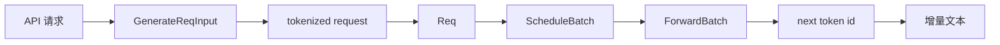

# SGLang 关键概念

## 你为什么要读

SGLang 最容易让人迷路的地方，不是类名多，而是同一个请求会先后以协议对象、进程消息、调度状态和 GPU tensor 出现。把这些形态混成一团，就会把“HTTP 没返回”误判成 kernel 卡住，也会把“KV 不够”误判成模型显存不够。

本页是一张概念地图。首次学习先读 [[推理Serving主线]]；遇到术语或边界不清时，再回本页查定义、责任和源码入口。

## 请求先后变成什么



| 对象 | 谁创建或组织 | 解决的问题 | 不负责什么 |
|------|--------------|------------|------------|
| `GenerateReqInput` | HTTP/OpenAI/gRPC 入口 | 表达外部输入和采样参数 | 不决定 batch 准入 |
| tokenized request | TokenizerManager | 把文本变成 token ids，绑定请求状态 | 不分配 GPU KV slot |
| `Req` | Scheduler 侧 | 保存单请求运行状态 | 不执行模型 forward |
| `ScheduleBatch` | Scheduler | 表达本轮选择的请求与调度状态 | 不决定具体 kernel 模板 |
| `ForwardBatch` | 执行准备层 | 把调度快照变成模型输入与 metadata | 不管理 HTTP 连接 |
| token/text 输出 | Scheduler、Detokenizer、TokenizerManager | 逐步生成并唤醒请求等待者 | 不修改模型权重 |

不要只背对象名。读任一专题时，都用下面五本账追问它在修改什么：

| 账本 | 核心问题 | 常见混淆 |
|------|----------|----------|
| 身份账 | 这还是不是同一个 `rid`、session 或子请求？ | 把 batch 下标当请求身份 |
| 生命周期账 | 对象此刻在 waiting、running、forward、finished 还是 abort？ | 把“已入队”当“已执行” |
| 地址账 | 逻辑 token、请求行、KV id、物理 pool slot 如何对应？ | 把 prefix hit 当作物理空间已经分配 |
| 执行账 | 当前 `ForwardMode`、backend、graph/eager 与并行组是什么？ | 从配置名直接猜实际 kernel |
| 回程账 | token id、增量文本、事件通知和协议 chunk 到了哪一站？ | 把“GPU 已出 token”当“用户已见文本” |

## `rid`：跨边界找回同一条请求

`rid` 是请求生命周期的关联标识。它把主进程等待状态、Scheduler 中的 `Req` 和返回结果重新对上号。它不是 KV 地址，也不是 batch 下标；batch 会变化，KV slot 可能迁移或释放，而请求身份必须稳定。

源码入口：`python/sglang/srt/managers/io_struct.py`、`tokenizer_manager.py`、`schedule_batch.py`。

## 三类运行职责：接请求、做调度、转文本

SGLang 常见运行路径把职责拆在不同进程或执行单元中：

- TokenizerManager 所在主进程接收请求、维护等待状态并汇总返回。
- Scheduler 子进程维护 waiting/running batch、KV 预算并驱动模型执行。
- Detokenizer 子进程把 token id 增量转换为文本。

这种拆分让 CPU 调度、GPU forward 和文本处理可以重叠，也意味着排障必须先确定消息停在哪个边界。

深入：[[SGLang-TokenizerManager]] · [[SGLang-Scheduler]] · [[SGLang-Detokenizer]]。

## Prefill 与 Decode：同一请求的两种工作形态

Prefill 一次处理输入段或新增段，建立对应 KV；decode 每轮通常为活动序列生成下一个 token，并读取历史 KV。二者属于同一请求，却有不同的计算、带宽和调度画像。

`ForwardMode` 用来告诉执行层当前 batch 在做什么，例如 extend/prefill、decode、mixed、target verify 或其他特定路径。它是执行语义，不是用户 API 名称。

当前枚举本身就说明：常说的 prefill 在执行层主要对应 `EXTEND`，但还存在 `MIXED`、`TARGET_VERIFY`、`PREBUILT`、`SPLIT_PREFILL` 与 dLLM 等模式，不能把系统压成 prefill/decode 二元开关。

```python
# 来源：python/sglang/srt/model_executor/forward_batch_info.py L78-L102
class ForwardMode(IntEnum):
    # Extend a sequence. The KV cache of the beginning part of the sequence is already computed (e.g., system prompt).
    # It is also called "prefill" in common terminology.
    EXTEND = auto()
    # Decode one token.
    DECODE = auto()
    # Contains both EXTEND and DECODE when doing chunked prefill.
    MIXED = auto()
    # No sequence to forward. For data parallel attention, some workers will be IDLE if no sequence are allocated.
    IDLE = auto()

    # Used in speculative decoding: verify a batch in the target model.
    TARGET_VERIFY = auto()
    # Used in speculative decoding: extend a batch in the draft model.
    DRAFT_EXTEND_V2 = auto()

    # Used in disaggregated decode worker
    # Represent a batch of requests having their KV cache ready to start decoding
    PREBUILT = auto()

    # Split Prefill for PD multiplexing
    SPLIT_PREFILL = auto()

    # Used in dLLM
    DLLM_EXTEND = auto()
```

深入：[[LLM推理与Token]] · [[SGLang-ScheduleBatch数据结构]]。

## Continuous Batching：batch 是每一轮重新组织的

静态 batch 像整桌人到齐才开席；continuous batching 更像每轮都重新排座位：完成的请求离开，新请求在资源允许时加入，长短请求不必彼此等到最后。

类比的边界是：Scheduler 不是随意拼单。它必须同时满足 token budget、KV 可用量、prefix 命中、优先级、LoRA 或其他特性约束。

深入：[[SGLang-Scheduler]] · [[SGLang-SchedulePolicy]]。

## KV Cache：历史 token 的执行状态

KV Cache 保存各层历史 token 的 K/V，使 decode 不必重新计算整个 prompt。它包含两个不同问题：

- 逻辑问题：一条请求的哪些 token 已经有可复用前缀。
- 物理问题：这些 token 的 K/V 实际占用哪些 pool slot 或 page。

只看到“cache hit”不能证明物理空间足够；只看到显存还有余量，也不能证明本轮调度能从对应 allocator 拿到足量且布局兼容的 KV 地址。

深入：[[SGLang-KV-Cache]]。

## RadixAttention：前缀索引与 KV 生命周期结合

RadixAttention 用 token 前缀树组织可复用前缀，并让匹配、锁定、插入、驱逐和释放与 KV 管理协同。它不是 attention 数学公式，也不是某个 GPU kernel；名字中的 Attention 容易让初学者走错门。

判断 prefix cache 问题时至少区分：key 是否相同、命中长度是多少、节点是否被保护、对应 KV 是否仍有效。

深入：[[SGLang-RadixAttention]]。

## `ScheduleBatch` 与 `ForwardBatch`：调度快照不是模型输入

`ScheduleBatch` 仍保留调度需要的请求级状态；进入模型前，执行准备层把其中必要信息整理为 tensor、位置、cache metadata、sampling metadata 等 `ForwardBatch` 内容。

这道边界很重要：Scheduler 决定谁运行，ModelRunner 决定怎样把这一批送进模型。把两者混在一起，会让调度策略与执行优化互相污染。

深入：[[SGLang-ScheduleBatch数据结构]] · [[SGLang-ModelRunner]]。

## ModelRunner 与 Attention Backend：组织执行，不拥有请求协议

ModelRunner 管模型 forward 所需的输入、CUDA Graph/eager 选路和执行上下文。Attention backend 根据硬件、forward mode、head 配置、KV 布局等条件选择可用实现。

后端可能是 FlashInfer、Triton、FlashAttention 或其他实现。看到 SGLang 调用了 attention，不应直接假设具体 kernel；实际选择必须通过配置、日志和 profiler 证明。

registry 只把名称映射到构造器，构造器内部仍会检查 MLA、设备和算法条件。例如 `flashinfer` 名称下面还会按 `use_mla_backend` 选择两类对象：

```python
# 来源：python/sglang/srt/layers/attention/attention_registry.py L23-L39
ATTENTION_BACKENDS = {}


def register_attention_backend(name):
    def decorator(fn):
        ATTENTION_BACKENDS[name] = fn
        return fn

    return decorator


@register_attention_backend("flashinfer")
def create_flashinfer_backend(runner):
    import torch

    if not runner.use_mla_backend:
        from sglang.srt.layers.attention.flashinfer_backend import FlashInferAttnBackend
```

深入：[[SGLang-Attention]] · [[Attention算子主线]]。

## 流式输出：token 已生成不等于用户已经看到文字

Scheduler 先产生 token 级结果，Detokenizer 再维护增量解码状态，TokenizerManager 最后唤醒对应请求并由 HTTP/OpenAI 层包装成 SSE 或兼容协议 chunk。

因此“有 token id、无文本”与“GPU 没产生 token”是两类问题。前者优先看 Detokenizer、offset、stop 裁剪和事件唤醒。

边界例外也要记住：`skip_tokenizer_init` 路径可让 `BatchTokenIDOutput` 绕过 Detokenizer，所以排障前必须先确认服务是否真的走普通文本链路。

```python
# 来源：python/sglang/srt/managers/io_struct.py L1232-L1236
    # Per-request routed experts (input + output tokens), shape
    # (token, layer, top_k). DetokenizerManager encodes to base64 into
    # BatchStrOutput; on the skip_tokenizer_init path the scheduler sends this
    # straight to TokenizerManager, which encodes on demand.
    routed_experts: Optional[List[Optional[torch.Tensor]]]
```

深入：[[SGLang-Detokenizer]] · [[SGLang-OpenAI-API]]。

## 分布式 rank：global rank 不足以解释职责

一个进程可能同时属于 TP、PP、DP 或其他通信组。入口 rank、模型 shard、pipeline stage 和输出汇总者的职责来自具体 group，而不是只看 global rank 相邻关系。

Collective hang 优先检查组成员、调用顺序、shape、dtype、device，以及是否有更早异常让某个 rank 没有进入协议。

深入：[[SGLang-分布式]] · [[分布式通信与并行]]。

## PD 分离与投机解码：改变主线，但不取消不变量

PD 分离把 prefill 与 decode 放到不同资源池，增加 KV 传输、半程请求状态和 gateway 路由边界。投机解码增加 draft、verify、accept/reject 状态。它们都让主线变复杂，但仍必须保护请求身份、KV 对齐、输出顺序和资源释放。

深入：[[SGLang-PD分离]] · [[SGLang-Speculative]]。

## Model Registry 与权重加载：类选择和参数写入是两件事

Model Registry 根据模型配置中的 architecture 等信息选择 SGLang 模型类；`load_weights` 再把 checkpoint 名称翻译到运行时参数，处理 fused 参数、并行 shard 和兼容前缀。

选择过程还包含 fallback：不在原生 registry 的 architecture 会把 `TransformersForCausalLM` 放到候选末尾；这说明“原生实现未命中”和“模型完全不受支持”不是同一件事。

```python
# 来源：python/sglang/srt/models/registry.py L61-L91
    def _normalize_archs(
        self,
        architectures: Union[str, List[str]],
    ) -> List[str]:
        if isinstance(architectures, str):
            architectures = [architectures]
        if not architectures:
            logger.warning("No model architectures are specified")

        # filter out support architectures
        normalized_arch = list(
            filter(lambda model: model in self.models, architectures)
        )

        # make sure Transformers backend is put at the last as a fallback
        if len(normalized_arch) != len(architectures):
            normalized_arch.append("TransformersForCausalLM")
        return normalized_arch

    def resolve_model_cls(
        self,
        architectures: Union[str, List[str]],
    ) -> Tuple[Type[nn.Module], str]:
        architectures = self._normalize_archs(architectures)

        for arch in architectures:
            model_cls = self._try_load_model_cls(arch)
            if model_cls is not None:
                return (model_cls, arch)

        return self._raise_for_unsupported(architectures)
```

模型类选对，不代表每个 tensor 都写对；参数名映射正确，也不代表当前 PP stage 应持有该权重。

深入：[[SGLang-通用模型]] · [[SGLang-ModelLoader]]。

## Import 与 Engine：看起来轻量的入口也可能有副作用

`import sglang` 不应被想象成纯粹读取符号：当前包初始化会按环境处理兼容逻辑并暴露公共 API；`Engine`、远端 Runtime 与 `sglang serve` 也有不同生命周期。排查启动或导入问题时，先确认自己走的是进程内 engine、远端 endpoint 还是独立 server，再检查当前版本实际执行的 import side effect。

深入：[[SGLang-阅读方法-源码走读]] · [[SGLang-阅读方法-排障指南]]。

## 症状到概念边界

| 症状 | 第一概念边界 | 不要先做什么 |
|------|--------------|--------------|
| 请求长期 waiting | Scheduler 准入与 KV 预算 | 先改 kernel |
| token id 有了但文本不动 | Detokenizer 与请求事件 | 先重载模型 |
| 相同前缀没有命中 | Radix key、extra key 与节点生命周期 | 只看字符串是否相同 |
| decode OOM 或 retract 增多 | KV pool 与 batch admission | 只看权重显存 |
| 指定 backend 未生效 | backend 兼容条件与实际 forward mode | 假设参数名等于最终选择 |
| 多卡 hang | group 成员与 collective 顺序 | 只重启某个 rank |
| 新模型加载 shape 错 | Registry、参数名映射、并行 shard | 在 forward 里补 reshape |

## 静态验证

**操作：** 在仓库根目录执行以下检索，并为每个命中写出它的生产者、消费者和责任边界：

```powershell
$checks = @(
  @{ Path = 'sglang/python/sglang/srt/managers/io_struct.py'; Pattern = 'class GenerateReqInput' },
  @{ Path = 'sglang/python/sglang/srt/managers/schedule_batch.py'; Pattern = 'class Req(' },
  @{ Path = 'sglang/python/sglang/srt/managers/schedule_batch.py'; Pattern = 'class ScheduleBatch(' },
  @{ Path = 'sglang/python/sglang/srt/model_executor/forward_batch_info.py'; Pattern = 'class ForwardBatch(' },
  @{ Path = 'sglang/python/sglang/srt/layers/attention/attention_registry.py'; Pattern = 'ATTENTION_BACKENDS = {}' },
  @{ Path = 'sglang/python/sglang/srt/models/registry.py'; Pattern = 'def resolve_model_cls' }
)

foreach ($check in $checks) {
  rg -n --fixed-strings $check.Pattern $check.Path
  if ($LASTEXITCODE -ne 0) { throw "missing: $($check.Pattern)" }
}
```

**预期：** 六组定位全部命中；你能把它们分别放入协议、请求状态、调度批次、执行批次、attention 实现选择和模型类选择六个责任层。这个检查只证明概念入口仍存在，不证明运行时选择或性能结论。

## 复盘

SGLang 的核心不是某个神奇 kernel，而是把请求身份、调度状态、KV 资源、模型执行和流式回程连接成可并发运行的系统。宏观上沿对象生命周期看全局，微观上用源码和观测证明每次交接，这就是后续阅读所有专题时应保持的视角。
