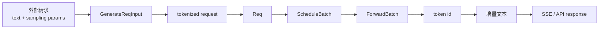

# SGLang 学习路径

## 你为什么要读

SGLang 的文件很多，但首次学习只需要回答一条问题：一条请求如何进入系统、拿到 KV 空间、被编入 GPU batch，再以 token 和文本返回。路径选错时，人很容易在模型文件、kernel wrapper 和启动参数之间来回横跳，最后记住一堆类名，却画不出请求主线。

本页只负责选择路线。概念解释进入专题页，完整源码证据进入源码走读，运行结论交给实验。

## 首次学习主线

按下面顺序阅读，每一步都带着一个明确产出：

| 阶段 | 阅读入口 | 读完要产出什么 |
|------|----------|----------------|
| 补齐基础 | [[LLM推理与Token]] · [[并发进程与背压]] | 解释 prefill、decode、KV Cache 和跨进程等待 |
| 看全局 | [[推理Serving主线]] · [[SGLang-项目总览]] | 画出 HTTP、TokenizerManager、Scheduler、ModelRunner、Detokenizer |
| 跟请求 | [[SGLang-HTTP请求全链路]] | 记录对象从 `GenerateReqInput` 到输出 chunk 的变化 |
| 看调度 | [[SGLang-Scheduler]] · [[SGLang-ScheduleBatch数据结构]] | 解释 waiting、running、prefill、decode、retract |
| 看显存 | [[SGLang-KV-Cache]] · [[SGLang-RadixAttention]] | 解释 token 如何占用、复用和释放 KV slot |
| 进 GPU | [[SGLang-ModelRunner]] · [[SGLang-Attention]] | 说明 batch 如何变成 tensor、metadata 和 kernel 调用 |
| 做验证 | [[SGLang服务实验]] | 用日志和指标区分调度、GPU 与文本回程问题 |

第一次读 [[SGLang-HTTP请求全链路]] 时，只看“长文读法”、对象表、主流程图和复盘。需要证明某个判断时，再跳到对应源码段。长文不是入场检票口，更像工具箱：用到哪把扳手，再打开哪一层。

## 一条对象主线

无论读到哪个专题，都把自己放回这条链：



每跨一条箭头，问五个问题：

1. 对象现在叫什么，关键字段是什么。
2. 当前所有者是谁，下一位消费者是谁。
3. 是函数调用、队列、ZMQ 还是 GPU collective。
4. 这一层必须守住什么不变量。
5. 用哪条日志、metric、断点或测试证明判断。

如果回答只能停在“框架内部会处理”，说明这一段还没有读透。

## 按问题跳读

### API、流式返回或协议兼容

[[SGLang-HTTP-Server]] → [[SGLang-OpenAI-API]] → [[SGLang-TokenizerManager]] → [[SGLang-Detokenizer]]

重点对象：请求 schema、`rid`、请求状态、token id、文本 offset、SSE chunk。

### TTFT、排队或 prefix cache

[[SGLang-Scheduler]] → [[SGLang-SchedulePolicy]] → [[SGLang-RadixAttention]] → [[SGLang-KV-Cache]]

重点判断：时间花在 waiting、prefill、cache miss、KV admission 还是 retract。

### TPOT、GPU 利用率或 attention backend

[[SGLang-ModelRunner]] → [[SGLang-Attention]] → [[GPU内存与算子]] → [[Attention算子主线]]

重点判断：问题来自 decode batch、KV 读取、graph/eager 分支，还是具体 kernel。

### 模型启动、权重加载或专用架构

[[SGLang-ModelLoader]] → [[SGLang-通用模型]] → [[SGLang-专用模型]] → [[SGLang-Quantization]]

重点对象：architecture 字符串、模型类、checkpoint 参数名、fused 参数与量化 method。

### 多卡、PD 分离或生产拓扑

[[SGLang-分布式]] → [[SGLang-PD分离]] → [[SGLang-model-gateway]] → [[SGLang-可观测性]]

重点判断：控制面与数据面分别走什么通道，哪个 rank 接收请求，哪个资源由谁释放。

### LoRA、多模态与扩展组件

[[SGLang-LoRA]] · [[SGLang-多模态]] · [[SGLang-sgl-kernel]] · [[SGLang-前端语言]] · [[SGLang-多模态生成]]

这些主题会改变主线的一部分，但不会推翻请求、调度、执行和回程四段结构。先找到它插在哪个边界，再读扩展内部。

## 深度文档怎么用

| 文档类型 | 适合什么时候打开 | 不适合怎么读 |
|----------|------------------|--------------|
| 核心概念 | 需要建立边界和术语时 | 把类比当成源码事实 |
| 数据流 | 对象错位、字段缺失或跨进程问题 | 只看箭头，不看生产者和消费者 |
| 源码走读 | 要证明调用链、修改实现时 | 从第一行顺序背到最后一行 |
| 排障指南 | 已经有症状和观测时 | 没有基线就照表改配置 |
| 学习检查 | 需要确认自己能否独立复述时 | 把勾选数量当成理解程度 |

## 学到哪里算完成首轮

- 能从 `rid` 追到 `Req`、KV slot、`ScheduleBatch` 和输出事件。
- 能解释 prefill 与 decode 为什么使用不同资源画像。
- 能说明 Scheduler 决定“谁这轮运行”，ModelRunner 决定“这一轮怎样执行”。
- 能区分 token id 已产生但文本未返回，与 GPU 根本没有 forward。
- 能设计一个只改变单一变量的 overlap 或 prefix cache 对照实验。

完成这些后再进入 [[SGLang-生产排障]] 或具体源码修改，不需要先读完整个目录。

## 运行或静态验证

**操作：** 选择一个最小流式请求，画出上述对象链；没有 GPU 时，用以下命令确认主要入口仍在当前源码基线中：

```powershell
rg -n "async def generate_request|def generate_request" sglang/python/sglang/srt
rg -n "class Req|class ScheduleBatch|class ForwardBatch" sglang/python/sglang/srt
rg -n "event_loop_overlap|event_loop_normal|BatchTokenIDOutput|BatchStrOutput" sglang/python/sglang/srt
```

**预期：** 你能把每个命中放回请求入口、调度、执行或输出回程中的唯一位置，并指出它不负责的相邻职责。

## 连接另外两个框架

要理解 SGLang 调用的 attention kernel，进入 [[Attention算子主线]]。要理解谁批量发起 rollout、消费 response 并更新权重，进入 [[RL训练闭环主线]] 与 [[Slime学习指南]]。
