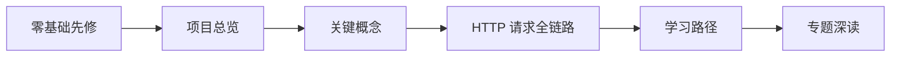

# SGLang 导读与总览

> 导读区控制台：选择起点、建立普通请求主线，再进入调度、资源、执行或生产分支。代码基线 `70df09b`。

## 本目录定位

本目录解决“我现在应该读哪一篇”的问题。它不替代 [[SGLang学习指南]] 的完整三遍路线，也不要求先把所有入口页读完。

离开导读区前，你应建立三件事：

1. SGLang 做什么，HTTP 请求如何进入推理栈。
2. `rid → Req → ScheduleBatch → ForwardBatch → token/text output` 怎样跨边界变化。
3. 当前问题属于协议、调度、缓存地址、GPU 执行、输出回程还是生产特性。

如果这三件事还说不清，继续读导读；如果已经能画普通请求主线，就直接进入专题，不必为了“按目录读完”停留在这里。

## 先按读者状态选入口

| 你的状态 | 入口 | 读完产出 |
|----------|------|----------|
| 不熟悉 token、prefill、decode、KV | [[SGLang-零基础先修]] | 能解释一次生成为什么分 prefill/decode |
| 懂 serving，想认识 SGLang | [[SGLang-项目总览]] → [[SGLang-关键概念]] | 能区分进程职责和五本账 |
| 想直接跟一条请求 | [[SGLang-HTTP请求全链路]] | 能画对象、所有者、通信和回程 |
| 已有问题，想选择专题 | [[SGLang-学习路径]] | 能进入唯一的第一故障域 |
| 正在读源码，找文件入口 | [[SGLang-源码地图]] | 能从对象/阶段定位文件，不按目录猜 |
| 正在看拓扑或依赖 | [[SGLang-模块依赖图]] · [[SGLang-图谱使用说明]] | 能区分课程顺序与语义邻居 |

## 文档地图

### 普通请求主线



这条顺序用于首次建立 baseline。`gRPC`、PD、Speculative、LoRA 和多模态都是分支；没有普通 HTTP 主线时，直接进入这些分支很容易丢失对象所有权。

### 查阅索引

| 文档 | 最适合回答什么 | 不承担什么 |
|------|----------------|------------|
| [[SGLang-架构分层]] | 系统分成哪些职责层 | 一次请求的逐 hop 细节 |
| [[SGLang-关键概念]] | 相邻对象怎样区分 | 完整源码调用链 |
| [[SGLang-源码地图]] | 某对象或阶段在哪些文件 | 学习优先级 |
| [[SGLang-模块依赖图]] | 模块间生产/消费关系 | 运行时分支是否真的启用 |
| [[SGLang-业务流程]] | 普通主干与特性插入点 | 每个专题的全部实现 |
| [[SGLang-用户场景]] | 生产需求如何映射到机制 | 未给环境的性能阈值 |
| [[SGLang-术语表]] | 快速查词和避免同名混淆 | 系统性学习 |
| [[SGLang-图谱使用说明]] | 怎样使用 Local Graph/Backlinks | 课程排序 |

## 从普通主线进入专题

| 你要解释的问题 | 第一站 | 随后进入 |
|------------------|--------|----------|
| 请求为什么进不来 | [[SGLang-启动与入口]] | HTTP/OpenAI/gRPC 对应入口专题 |
| 为什么长期 waiting 或 TTFT 高 | [[SGLang-请求调度]] | Scheduler、SchedulePolicy、ScheduleBatch |
| prefix 为什么没命中、KV 为什么不足 | [[SGLang-内存与Attention]] | RadixAttention、KV Cache、Attention |
| batch 怎样真正进入 GPU | [[SGLang-模型执行]] | ModelRunner、模型实现、ModelLoader |
| 输出为什么乱码、重复或没有 chunk | [[SGLang-Detokenizer]] | Detokenizer 数据流与排障指南 |
| PD、Spec、LoRA、多模态怎样插入 | [[SGLang-业务流程]] | 对应高级特性或扩展组件 |
| 生产故障怎样收缩范围 | [[SGLang-生产排障]] | 对应专题排障指南与可观测性 |

## 三条跨框架出口

| 想继续理解什么 | 出口 | 连接关系 |
|----------------|------|----------|
| attention kernel 与 IO | [[Attention算子主线]] · [[FlashAttention学习指南]] | SGLang 组织 batch/metadata，FlashAttention 实现部分算子路径 |
| rollout 如何批量调用 serving | [[SGLang与Slime-阅读对照]] · [[Slime-RL训练全链路]] | Slime 消费 SGLang serving 能力，但不接管其 KV/调度实现 |
| 从 prompt 到新权重 | [[从Prompt到新权重]] | 把 serving、样本、奖励、训练与新权重串成闭环 |

## 常见选路错误

| 错误方式 | 为什么会迷路 | 修正 |
|----------|--------------|------|
| 按文件夹或文件名顺序读源码 | 物理归档不等于运行时生命周期 | 沿 request/batch/KV/tensor/weight 对象读 |
| 看到 OOM 就只读 KV Cache | 还可能是权重、临时 workspace、Graph buffer 或通信 | 先按内存所有者分类 |
| 看到 GPU 利用率低就怪 Scheduler | 可能卡在输入、同步、backend、输出或 workload | 先建立阶段证据 |
| 直接比较 backend 快慢 | 缺模型、硬件、版本和 workload | 固定实验条件后单变量比较 |
| 把所有高级特性串成一条 pipeline | 多数特性是正交插入或条件分支 | 先找插入点和共享不变量 |

## 静态验证

操作：确认导读区的六个核心入口都存在且本页有链接：

```powershell
$targets = @(
  'SGLang-零基础先修',
  'SGLang-项目总览',
  'SGLang-关键概念',
  'SGLang-HTTP请求全链路',
  'SGLang-学习路径',
  'SGLang-源码地图'
)

$note = Get-Content -Raw 'sglang_reading/导读与总览/SGLang-导读与总览.md'
foreach ($target in $targets) {
  if ($note -notmatch [regex]::Escape("[[$target]]")) {
    throw "missing entry: $target"
  }
}
```

预期：六个入口全部通过。这个检查只证明控制台没有丢失主入口；顺序是否适合你，仍取决于前置知识和当前任务。

## 复盘

导读区的完成标准不是“所有入口页都读过”，而是你能画普通请求主线、能说清当前问题属于哪一层，并能选择唯一的下一篇。之后用专题文档建立证据，用实验验证运行事实，用 [[SGLang-总结复盘]] 做跨专题收口。
