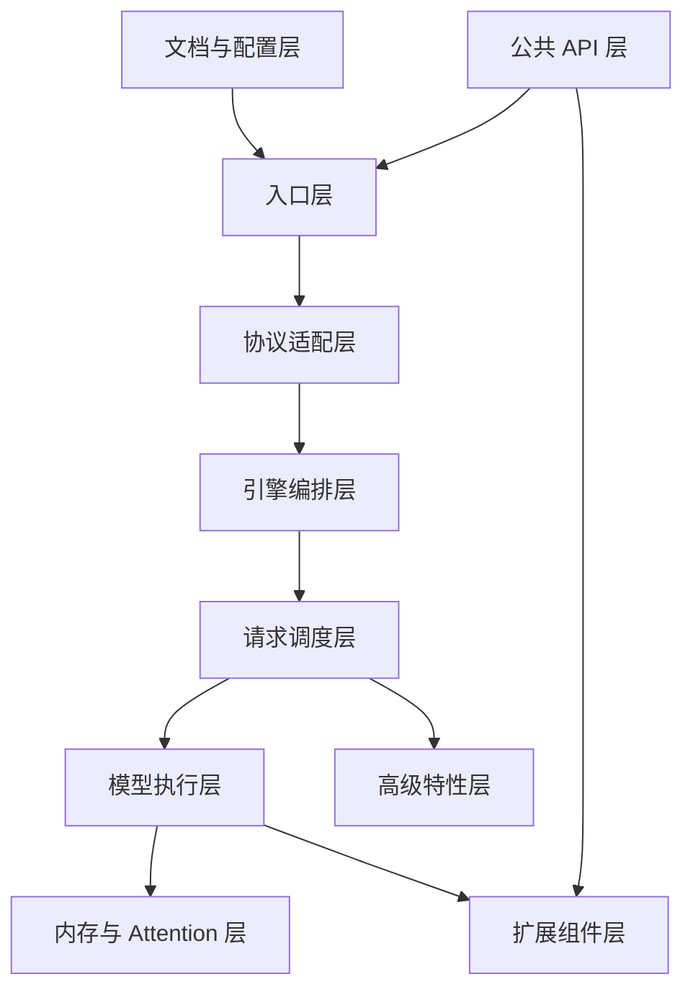

# SGLang 架构分层

> 本节说明 SGLang monorepo 的 12 层架构与代表代码 · 内嵌代码对应 sglang `70df09b`

## 你为什么要读

SGLang 知识图谱将代码组织为 **10 个架构层**。每层下方列出职责、代表代码与关键文件——读者可据此定位「某功能属于哪一层」。

---

## 总览图



---

## 1. 文档与配置层

**职责：** 项目说明、包配置、版本与全局常量。

| 文件 | 一句话 |
|------|--------|
| `README.md` | 官方特性介绍与快速开始 |
| `python/pyproject.toml` | CLI 入口、依赖、Rust 扩展声明 |
| `python/sglang/global_config.py` | 运行时全局常量 |

**读法：** 读源码前先看本层，建立 monorepo 边界感。

**源码锚点：**

```python
## 来源：python/sglang/global_config.py L1-L15（节选）
"""Global configurations"""

# FIXME: deprecate this file and move all usage to sglang.srt.environ or sglang.__init__.py

class GlobalConfig:
    """
    Store some global constants.
    """

    def __init__(self):
        # Verbosity level
        # 0: do not output anything
        # 2: output final text after every run
        self.verbosity = 0
```

---

## 2. 入口层

**职责：** 用户命令 → 服务进程。CLI、`launch_server`、HTTP/gRPC 监听。

**读法：** `sglang serve` 的默认路径：`cli/main` → `cli/serve` → `launch_server` → `http_server.launch_server`。

**源码锚点：**

```python
## 来源：python/sglang/launch_server.py L47-L51
    else:
        # Default mode: HTTP mode.
        from sglang.srt.entrypoints.http_server import launch_server

        launch_server(server_args)
```

| 文件 | 职责 |
|------|------|
| `cli/main.py` | 子命令路由 serve/generate/version |
| `cli/serve.py` | LLM vs diffusion 检测 |
| `launch_server.py` | HTTP/gRPC/Ray/Encoder 四路分发 |
| `srt/entrypoints/http_server.py` | FastAPI 应用与路由挂载 |
| `srt/server_args.py` | CLI → ServerArgs 解析 |

---

## 3. 协议适配层

**职责：** 外部 API 协议（OpenAI/Ollama）→ 内部 `GenerateReqInput`。

**读法：** `OpenAIServingBase` 模板方法统一校验、转换、流式响应；Ollama 为平行适配器。

**源码锚点：**

```python
## 来源：python/sglang/srt/entrypoints/openai/serving_base.py L73-L109
    async def handle_request(
        self, request: OpenAIServingRequest, raw_request: Request
    ) -> Union[Any, StreamingResponse, ErrorResponse]:
        """Handle the specific request type with common pattern
        If you want to override this method, you should be careful to record the validation time.
        """
        received_time = monotonic_time()

        try:
            # Validate request
            error_msg = self._validate_request(request)
            if error_msg:
                return self.create_error_response(error_msg)

            # Log the raw OpenAI request payload before conversion to tokenized form.
            request_logger = self.tokenizer_manager.request_logger
            if request_logger.log_requests and request_logger.log_requests_level >= 2:
                request_logger.log_openai_received_request(request, request=raw_request)

            # Convert to internal format
            adapted_request, processed_request = self._convert_to_internal_request(
                request, raw_request
            )

            if isinstance(adapted_request, (GenerateReqInput, EmbeddingReqInput)):
                # Only set timing fields if adapted_request supports them
                adapted_request.received_time = received_time

            # Note(Xinyuan): raw_request below is only used for detecting the connection of the client
            if hasattr(request, "stream") and request.stream:
                return await self._handle_streaming_request(
                    adapted_request, processed_request, raw_request
                )
            else:
                return await self._handle_non_streaming_request(
                    adapted_request, processed_request, raw_request
                )
```

**要点：**

- 模板方法：`handle_request` 固定校验→转换→分流；子类实现 `_convert_to_internal_request` 与 streaming handler。
- `adapted_request` 为内部 `GenerateReqInput`；`processed_request` 保留 OpenAI 形态供响应格式化。
- 流式与非流式在转换后分叉，二者最终都调用 `tokenizer_manager.generate_request`。

| 文件 | 职责 |
|------|------|
| `openai/serving_base.py` | OpenAI 模板基类 |
| `openai/serving_completions.py` | `/v1/completions` |
| `openai/serving_chat.py` | `/v1/chat/completions` |
| `ollama/serving.py` | Ollama JSON 协议 |

---

## 4. 引擎编排层

**职责：** `Engine._launch_subprocesses` 启动 TokenizerManager（主进程）+ Scheduler/Detokenizer（子进程），建立 ZMQ 通道。

**源码锚点：**

```python
## 来源：python/sglang/srt/entrypoints/http_server.py L2494-L2506
    # Launch subprocesses
    (
        tokenizer_manager,
        template_manager,
        port_args,
        scheduler_init_result,
        subprocess_watchdog,
    ) = Engine._launch_subprocesses(
        server_args=server_args,
        init_tokenizer_manager_func=init_tokenizer_manager_func,
        run_scheduler_process_func=run_scheduler_process_func,
        run_detokenizer_process_func=run_detokenizer_process_func,
    )
```

**要点：** HTTP 主进程与子进程 Scheduler/Detokenizer 通过 **ZMQ + 不同 port** 通信（见 `io_struct.py` 消息定义）。

---

## 5. 请求调度层

**职责：** Tokenize → 组 batch → GPU forward → 回传 token id。

| 文件 | 职责 |
|------|------|
| `tokenizer_manager.py` | tokenize + IPC 下发 |
| `scheduler.py` | 事件循环、continuous batching |
| `schedule_policy.py` | PrefillAdder、retract |
| `schedule_batch.py` | Req/ScheduleBatch 结构 |
| `detokenizer_manager.py` | token → 文本 |

**读法：** 本层是 SGLang 吞吐量的核心——`event_loop_overlap` 让 CPU 调度与 GPU 前向流水线并行。

---

## 6. 模型执行层

**职责：** `ModelRunner` 加载权重、管理 KV cache、执行 forward；`ModelRegistry` 按 architecture 选择模型类。

**源码锚点：**

```python
## 来源：python/sglang/srt/models/registry.py L130-L131
ModelRegistry = _ModelRegistry()
ModelRegistry.register("sglang.srt.models")
```

| 文件 | 职责 |
|------|------|
| `model_executor/model_runner.py` | 前向执行主类 |
| `managers/tp_worker.py` | TP worker 封装 |
| `models/registry.py` | 模型注册表 |
| `models/llama.py`, `qwen3.py`, `deepseek_v2.py` | 具体架构 |

---

## 7. 内存与 Attention 层

**职责：** RadixCache 前缀共享、Attention backend、MoE、量化 kernel。

**读法：** RadixAttention 是 SGLang 相对 vLLM 的差异化能力——跨请求共享相同 prompt 前缀的 KV。

**源码锚点：**

```python
## 来源：python/sglang/srt/mem_cache/radix_cache.py L355-L365（节选）
    def match_prefix(self, params: MatchPrefixParams) -> MatchResult:
        """Find the longest cached prefix of ``key`` in the radix tree.

        The logical namespace for prefix matching is determined by both the
        token id sequence and the optional ``extra_key`` carried by ``RadixKey``.
        Entries that share identical leading token ids but have *different*
        ``extra_key`` values are intentionally kept disjoint and never share
        prefix nodes. This is useful to:

        * Isolate KV cache lines for different LoRA / adapter IDs.
        * Separate requests that intentionally should not share state (e.g.,
```

---

## 8. 高级特性层

| 能力 | 锚点文件 |
|------|----------|
| Sampling / 约束解码 | `sampling/`, `constrained/` |
| 投机解码 EAGLE | `speculative/eagle_worker_v2.py` |
| PD 分离 | `disaggregation/prefill.py`, `decode.py` |
| TP/PP/EP/DP | `distributed/parallel_state.py` |

---

## 9. 扩展组件层

| 组件 | 目录 | 模块 |
|------|------|------|
| sgl-kernel | `sgl-kernel/python/sgl_kernel/` | [[SGLang-sgl-kernel]] |
| model-gateway | `sgl-model-gateway/src/` | [[SGLang-model-gateway]] |
| Frontend lang | `python/sglang/lang/` | [[SGLang-前端语言]] |
| multimodal_gen | `python/sglang/multimodal_gen/` | [[SGLang-多模态生成]] |
| VLM / LoRA | `srt/multimodal/`, `srt/lora/` | [[SGLang-多模态]] · [[SGLang-LoRA]] |

---

## 10. 公共 API 层

**职责：** `import sglang` 时暴露的 Frontend API 与 LazyImport 的 Runtime `Engine`。

**读法：** 易错点——`from sglang import Engine` 实际得到的是 **Runtime Engine**（LazyImport 覆盖 Frontend Engine）。

**源码锚点：**

```python
## 来源：python/sglang/__init__.py L79
Engine = LazyImport("sglang.srt.entrypoints.engine", "Engine")
```

## 运行验证

这篇是读者的分层地图，维护时先用源码检索确认每一层的代表入口仍然存在：全局配置、启动入口、OpenAI serving、HTTP server、模型注册、RadixCache、公共 API。

```powershell
rg -n 'global_config|def run_server|class OpenAIServingBase|FastAPI|def launch_server|ModelRegistry|def match_prefix|LazyImport|Engine =' sglang/python/sglang/global_config.py sglang/python/sglang/launch_server.py sglang/python/sglang/srt/entrypoints/openai/serving_base.py sglang/python/sglang/srt/entrypoints/http_server.py sglang/python/sglang/srt/models/registry.py sglang/python/sglang/srt/mem_cache/radix_cache.py sglang/python/sglang/__init__.py
```

读输出时不要只看是否命中，还要看命中分布：入口层、HTTP/OpenAI 层、模型执行层、内存层、公共 API 层都应各有锚点。某一层入口迁移时，本文的分层表要同步调整。
