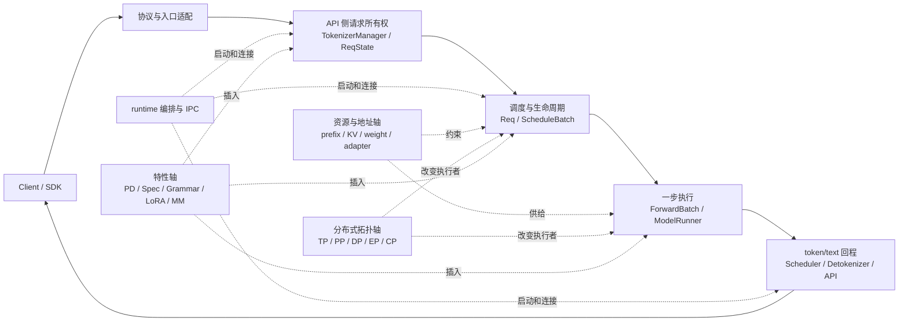

# SGLang 架构分层

## 你为什么要读

文件夹可以分层，运行时却不是十层洋葱。一次请求会在 API worker、runtime 子进程和 GPU step 之间往返；KV、并行组、LoRA、PD、Speculative 等机制又横穿多个阶段。更可靠的模型是：

- 六个运行平面：描述一次普通请求怎样前进和回程；
- 四条横切轴：描述资源、拓扑和特性怎样改变多个平面。

读完后，你应能把一个类放到“主要责任平面”，同时指出它读取了哪些横切状态，而不是强迫每个文件只能属于一层。

## 总图：六个运行平面，四条横切轴



这张图不是性能因果图。某平面存在，不代表它一定是瓶颈；某横切机制启用，也不代表每个请求都会走同一分支。

## 平面一：协议与入口适配

**责任：** 把 native HTTP、OpenAI、Ollama、gRPC 或进程内 Engine 的调用语义，转换为 runtime 能理解的请求对象；校验、错误格式和流式协议仍属于适配器责任。

OpenAI 基类的关键边界是“先转换成内部对象，再按 stream 分流”：

```python
# 来源：python/sglang/srt/entrypoints/openai/serving_base.py L92-L109
            # Convert to internal format
            adapted_request, processed_request = self._convert_to_internal_request(
                request, raw_request
            )

            if isinstance(adapted_request, (GenerateReqInput, EmbeddingReqInput)):
                # Only set timing fields if adapted_request supports them
                adapted_request.received_time = received_time

            # Note(Xinyuan): raw_request below is only used for detecting the connection of the client
            if hasattr(request, "stream") and request.stream:
                return await self._handle_streaming_request(
                    adapted_request, processed_request, raw_request
                )
            else:
                return await self._handle_non_streaming_request(
                    adapted_request, processed_request, raw_request
                )
```

**不负责：** batch 准入、KV 分配和具体 attention kernel。

**入口：** `srt/entrypoints/http_server.py`、`entrypoints/openai/`、gRPC sidecar/bridge、`srt/entrypoints/engine.py`。深入见 [[SGLang-启动与入口]]。

## 平面二：API 侧请求所有权

**责任：** TokenizerManager 规范化输入、创建 `ReqState`、tokenize/多模态预处理/LoRA 解析、向 Scheduler dispatch，并等待结果唤醒调用方。

```python
# 来源：python/sglang/srt/managers/tokenizer_manager.py L611-L633
        self._init_req_state(obj, request)
        try:
            if self.server_args.language_only:
                self._handle_epd_disaggregation_encode_request(obj)

            # Log the request
            self.request_logger.log_received_request(obj, self.tokenizer, request)

            async with self.is_pause_cond:
                await self.is_pause_cond.wait_for(lambda: not self.is_pause)

            async with self.model_update_lock.reader_lock:
                await self._validate_and_resolve_lora(obj)

                # Tokenize the request and send it to the scheduler
                if obj.is_single:
                    tokenized_obj = await self._tokenize_one_request(obj)
                    state = self.rid_to_state[obj.rid]
                    if obj.return_prompt_token_ids:
                        state.prompt_token_ids = list(tokenized_obj.input_ids)
                    self._send_one_request(tokenized_obj)
                    async for response in self._wait_one_response(obj, request):
                        yield response
```

**不负责：** 决定哪些请求共享下一次 GPU step。`rid_to_state` 是 API 等待状态，不是 KV 地址表。

深入见 [[SGLang-TokenizerManager]] 与 [[SGLang-HTTP请求全链路]]。

## 平面三：runtime 编排与 IPC

**责任：** 根据 ServerArgs 构造进程图、端口和通信对象，启动 Scheduler/Detokenizer 等 runtime 组件，并监控子进程生命周期。

```python
# 来源：python/sglang/srt/entrypoints/http_server.py L2494-L2506
    # Launch subprocesses
    (
        tokenizer_manager,
        template_manager,
        port_args,
        scheduler_init_result,
        subprocess_watchdog,
    ) = Engine._launch_subprocesses(
        server_args=server_args,
        init_tokenizer_manager_func=init_tokenizer_manager_func,
        run_scheduler_process_func=run_scheduler_process_func,
        run_detokenizer_process_func=run_detokenizer_process_func,
    )
```

**边界：** “主进程 + Scheduler + Detokenizer”是普通基线，不是所有部署的固定进程数。多 HTTP worker、DP、PP、PD、gateway 与 gRPC 会增加进程和通信边。

## 平面四：调度与请求生命周期

**责任：** 把 tokenized request 变成 `Req`，维护 waiting/running/retracted/finished 状态，做排序、准入和 batch commit，驱动一次 forward 并消费上一步结果。

最容易犯的错误是把 TokenizerManager、Scheduler、SchedulePolicy 和 ScheduleBatch 都叫“调度层”，从而丢失所有权：

| 对象/组件 | 权威责任 |
|-----------|----------|
| `ReqState` | API worker 等待与返回状态 |
| `Req` | Scheduler 单请求运行状态 |
| SchedulePolicy/PrefillAdder | 排序与准入候选 |
| `ScheduleBatch` | 可变的当前/运行 batch 状态 |
| overlap result queue | 保存 batch copy 与异步结果的配对 |

normal loop 展示了最小提交边界：

```python
# 来源：python/sglang/srt/managers/scheduler.py L1521-L1540
    def event_loop_normal(self):
        """A normal scheduler loop."""
        while True:
            if self.gracefully_exit:
                break

            # Receive requests
            recv_reqs = self.request_receiver.recv_requests()
            self.process_input_requests(recv_reqs)
            if self._engine_paused:
                continue

            # Get the next batch to run
            batch = self.get_next_batch_to_run()
            self.cur_batch = batch

            # Launch the current batch
            if batch:
                result = self.run_batch(batch)
                self.process_batch_result(batch, result)
```

深入见 [[SGLang-Scheduler]]、[[SGLang-SchedulePolicy]] 与 [[SGLang-ScheduleBatch数据结构]]。

## 平面五：一步模型执行

**责任：** 把 live `ScheduleBatch` 物化为一步 `ForwardBatch`，选择 eager/decode graph/prefill graph/split-prefill 等执行路径，运行模型并在合适的 rank sampling。

```python
# 来源：python/sglang/srt/managers/tp_worker.py L490-L518
        # Get forward batch from schedule batch
        if batch is not None:
            # update the consumer index of hicache to the running batch
            self.set_hicache_consumer(batch.hicache_consumer_index)

            forward_batch = ForwardBatch.init_new(batch, self.model_runner)
        else:
            # FIXME(lsyin): unify the interface of forward_batch
            assert forward_batch is not None

        # Deprecated kwarg: pre-planners mark the batch themselves now.
        forward_batch.apply_deprecated_skip_attn_backend_init(skip_attn_backend_init)

        if self.is_dllm():
            return self._forward_batch_generation_dllm(forward_batch)

        if self.pp_group.is_last_rank:
            out = self.model_runner.forward(
                forward_batch,
                pp_proxy_tensors=pp_proxy_tensors,
            )
            logits_output, can_run_cuda_graph = out.logits_output, out.can_run_graph
            batch_result = GenerationBatchResult(
                logits_output=logits_output,
                can_run_cuda_graph=can_run_cuda_graph,
                expert_distribution_metrics=out.expert_distribution_metrics,
                routed_experts_output=out.routed_experts_output,
                indexer_topk_output=out.indexer_topk_output,
            )
```

**不负责：** 外部协议、长期请求身份和 checkpoint 格式选择。ModelRegistry 选类、ModelLoader 写权重、ModelRunner 执行模型是相邻但不同的责任。

深入见 [[SGLang-模型执行]]、[[SGLang-ModelRunner]]、[[SGLang-ModelLoader]] 与 [[SGLang-Attention]]。

## 平面六：token/text 回程

**责任：** Scheduler 更新 `Req` 并形成 token 级输出；普通文本路径由 Detokenizer 做增量 decode，再由 TokenizerManager 按 rid 唤醒等待者，最后由协议 adapter 生成 SSE/OpenAI chunk。

```python
# 来源：python/sglang/srt/managers/detokenizer_manager.py L151-L168
    def init_request_dispatcher(self):
        self._request_dispatcher = TypeBasedDispatcher(
            [
                (BatchEmbeddingOutput, self.handle_batch_embedding_out),
                (BatchTokenIDOutput, self.handle_batch_token_id_out),
                (FreezeGCReq, self.handle_freeze_gc_req),
                (ConfigureLoggingReq, self.handle_configure_logging_req),
            ]
        )

    def event_loop(self):
        """The event loop that handles requests"""
        while True:
            with self.soft_watchdog.disable():
                recv_obj = sock_recv(self.recv_from_scheduler)
            output = self._request_dispatcher(recv_obj)
            if output is not None:
                sock_send(self.send_to_tokenizer, output)
```

**边界：** `skip_tokenizer_init` 可让 token 输出绕过 Detokenizer；stream interval 和 batch notify 也意味着“一个 token 对应一个 HTTP chunk”并不成立。

## 横切轴一：资源与地址

这条轴回答“请求为什么有资格执行、执行时读写哪里”：

| 资源 | 关键对象 | 必须区分 |
|------|----------|----------|
| prefix | RadixKey、MatchResult、tree node/lock | 逻辑命中不等于 device 已可读 |
| KV | req-to-token row、generic/virtual loc、physical pool | 请求行、地址 id 和 tensor layout |
| 权重 | model class、rank-local parameter、loader iterator | 类选择、参数映射和最终写入 |
| LoRA | adapter id、CPU cache、GPU memory pool | 已加载 CPU 不等于当前 batch 已驻留 GPU |

深入见 [[SGLang-内存与Attention]]、[[SGLang-RadixAttention]]、[[SGLang-KV-Cache]] 和 [[SGLang-ModelLoader]]。

## 横切轴二：分布式拓扑

TP、PP、DP、EP、CP 改变“哪个 rank 收请求、持有参数、执行 collective、产生 logits、汇总输出”。它不是某个高级特性目录下的一层。

排查时至少写出：global rank、local rank、rank-in-group、group 成员、collective 顺序、shape/dtype/device。只看相邻 global rank 无法解释通信职责。

深入见 [[SGLang-分布式]]。

## 横切轴三：条件特性

| 特性 | 主要插入点 | 不取消的不变量 |
|------|------------|----------------|
| PD | 入口路由、Scheduler 队列、KV transfer、回程 | rid、metadata gate、资源释放 |
| Speculative | draft input、target verify、accept/reject、sampling | target KV 与输出顺序 |
| Grammar | token mask、sampling、overlap 同步边界 | grammar state rollback/commit |
| LoRA | API 解析、batch capacity、layer method | adapter 身份与 residency |
| 多模态 | processor、token/embedding 对齐、transport | placeholder 与序列位置 |
| MoE/量化 | 模型 layer、dispatch/kernel、权重加载 | id/scaling/method 所有权 |

这些机制多数是正交分支，不应被画成 `PD → Spec → LoRA → MoE` 的固定 pipeline。插入点总览见 [[SGLang-业务流程]]。

## 横切轴四：扩展与公共表面

| 表面 | 角色 | 阅读入口 |
|------|------|----------|
| `python/sglang/lang/` | 前端语言与程序表达 | [[SGLang-前端语言]] |
| `sgl-kernel/` | 独立 kernel/extension 能力 | [[SGLang-sgl-kernel]] |
| `sgl-model-gateway/` | 多实例路由与协议代理 | [[SGLang-model-gateway]] |
| `multimodal_gen/` | 多模态生成 runtime | [[SGLang-多模态生成]] |
| `srt/lora/`、`srt/multimodal/` | serving 主线内扩展 | [[SGLang-LoRA]] · [[SGLang-多模态]] |

公共 import 只说明符号暴露方式，不等于 runtime 所有权。修改 `__init__.py`、lazy import 或 CLI 时，应重新检查 import side effect 和实际启动路径。

## 症状如何映射到平面

| 症状 | 第一平面/轴 | 不要先归因 |
|------|-------------|------------|
| 400/schema/协议错误 | 协议适配 | Scheduler |
| rid 等待但未入队 | API 请求所有权/IPC | attention kernel |
| waiting 堆积、retract | 调度 + 资源轴 | HTTP route |
| Graph replay/shape 错 | 一步执行 + 拓扑轴 | prefix key |
| token 有、文本无 | 回程平面 | 模型权重 |
| cache hit 但仍慢 | 资源轴 + workload | Radix tree 必然失效 |
| 多卡 hang | 拓扑轴 | 单一 rank 的最后一条日志 |

## 静态验证

操作：确认六个平面的代表入口仍存在：

```powershell
$checks = @(
  @{ Path = 'sglang/python/sglang/srt/entrypoints/openai/serving_base.py'; Pattern = 'class OpenAIServingBase' },
  @{ Path = 'sglang/python/sglang/srt/managers/tokenizer_manager.py'; Pattern = 'class ReqState' },
  @{ Path = 'sglang/python/sglang/srt/entrypoints/engine.py'; Pattern = 'class Engine' },
  @{ Path = 'sglang/python/sglang/srt/managers/scheduler.py'; Pattern = 'def event_loop_normal' },
  @{ Path = 'sglang/python/sglang/srt/model_executor/model_runner.py'; Pattern = 'class ModelRunner(' },
  @{ Path = 'sglang/python/sglang/srt/managers/detokenizer_manager.py'; Pattern = 'class DetokenizerManager' }
)

foreach ($check in $checks) {
  rg -n --fixed-strings $check.Pattern $check.Path
  if ($LASTEXITCODE -ne 0) { throw "missing architecture plane: $($check.Pattern)" }
}
```

预期：六组入口全部命中。命中只证明代表对象仍存在；若进程图、所有权或调用边变化，必须同步更新本页的平面关系。

## 复盘

SGLang 的主架构不是十个互不相交的文件夹层，而是协议适配、API 请求所有权、runtime 编排、调度生命周期、一步执行和输出回程六个平面，被资源地址、分布式拓扑、条件特性和扩展表面四条轴共同切过。用这个模型读源码，既能看全局，又不会把相邻对象的责任揉成一句“框架内部处理”。
