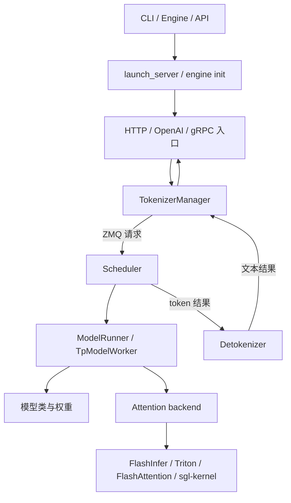
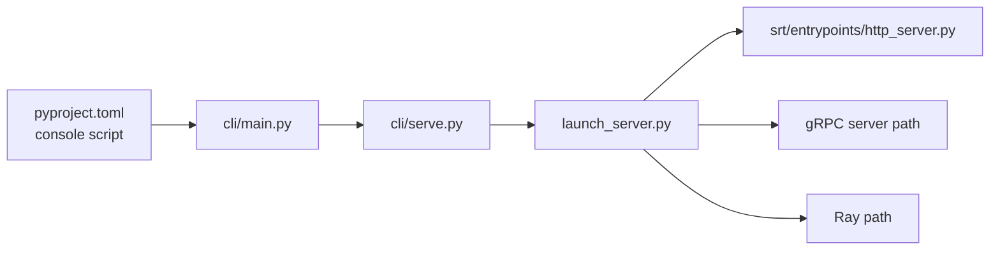
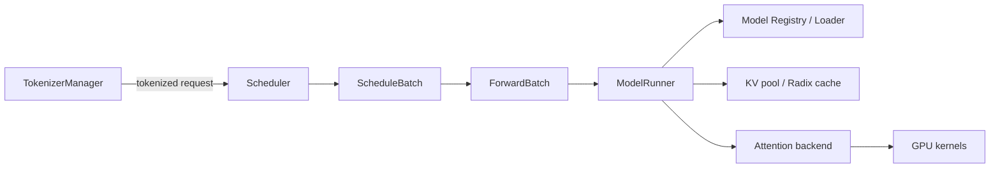
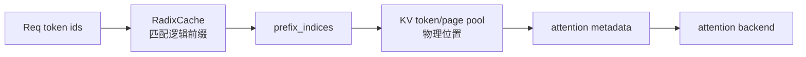
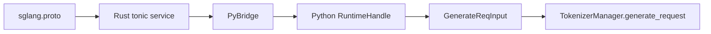

# SGLang 模块依赖图

## 你为什么要读

Python import 只能告诉你“文件引用了谁”，却不能完整表达 SGLang 的运行关系。HTTP 主进程通过 ZMQ 把请求交给 Scheduler，Scheduler 再驱动 GPU worker；gRPC 还会穿过 Rust/PyO3；attention backend 和 `sgl-kernel` 则在运行时按硬件与配置选路。

本页把依赖分成启动调用、跨进程消息、执行调用和扩展插入点。读图时不要把箭头都理解成普通函数调用。

## 全局关系



这张图的主线是请求生命周期。模型加载、缓存、分布式和高级特性都插在某个明确边界上，而不是另起一套完全独立的系统。

## 启动依赖



| 入口 | 下一跳 | 关系 |
|------|--------|------|
| `python/pyproject.toml` | `sglang.cli.main:main` | 安装后创建 `sglang` 命令 |
| `cli/main.py` | `cli/serve.py` | 分派 `serve` 子命令 |
| `cli/serve.py` | `launch_server.run_server` | 解析服务参数并进入 runtime |
| `launch_server.py` | HTTP、gRPC、Ray 等路径 | 根据配置选择进程拓扑 |

启动问题优先沿这张小图查，不要一开始就进入 Scheduler。

## 请求与执行依赖



关键边界：

- TokenizerManager 负责外部请求与等待状态，不负责 KV admission。
- Scheduler 负责选请求和资源预算，不负责模型结构。
- ModelRunner 负责组织 forward，不负责 HTTP 生命周期。
- Model Registry 决定模型类，loader 决定参数如何写入。
- Attention backend 选择实现，kernel 只消费 tensor 与 metadata。

## 缓存依赖



RadixCache 与 KV allocator 相互配合，但不是同一对象。前者回答“哪些 token 可以复用”，后者回答“对应 K/V 在哪里、何时释放”。

深入：[[SGLang-RadixAttention]] · [[SGLang-KV-Cache]]。

## 高级特性插在哪里

| 特性 | 插入边界 | 主要新增对象或协议 |
|------|----------|--------------------|
| Speculative decoding | Scheduler 与模型执行 | draft、verify、accept/reject 状态 |
| PD 分离 | 请求路由、KV pool、跨节点传输 | room、metadata、KV transfer、`PREBUILT` |
| LoRA | 请求身份、batch 准入、模型层 | `lora_id`、GPU slot、delta weights |
| 多模态 | 请求预处理与模型输入 | processor output、placeholder、视觉特征 |
| Quantization | 模型初始化、权重加载、算子执行 | quant config、method、量化参数 |
| Observability | HTTP、TokenizerManager、Scheduler | metrics、trace、request logs |

高级特性读法不是“从新目录重新开始”，而是先找到它改了主线哪一条箭头。

## gRPC 跨语言依赖



Rust 侧不是静态 import Python。桥接层在运行时调用 Python 对象，Proto 则是 client、gateway 与 server 共享的协议契约。

深入：[[SGLang-gRPC-Proto]] · [[SGLang-gRPC请求全链路]]。

## 扩展仓库与主 runtime

| 目录 | 与 `srt` 的关系 |
|------|-----------------|
| `sgl-kernel/` | 提供热点 CUDA/C++ custom ops，由 Python wrapper 和 runtime 调用 |
| `sgl-model-gateway/` | 位于 client 与 worker 之间，负责路由、代理、健康和重试 |
| `python/sglang/lang/` | 前端 DSL，通过 backend 调用本地或远端 runtime |
| `python/sglang/multimodal_gen/` | 扩散模型推理子系统，与文本 `srt` 并列而非其普通请求分支 |

## 怎么用这张图排障

1. 先写下症状发生时手里的对象：JSON、token ids、`Req`、batch、tensor 还是文本 chunk。
2. 在图上找到对象的生产者与消费者。
3. 判断箭头是函数调用、ZMQ、Rust/Python bridge 还是 GPU 执行。
4. 在两端分别取证，确认对象是在发送前就错，还是交接后才错。

例如“HTTP 连接正常但没有文本”至少要分三种：Scheduler 没生成 token、Detokenizer 没生成字符串、TokenizerManager 没唤醒等待者。

## 静态验证

**操作：** 在仓库根目录执行：

```powershell
rg -n "sglang =|def main|def serve|run_server" sglang/python/pyproject.toml sglang/python/sglang/cli sglang/python/sglang/launch_server.py
rg -n "class TokenizerManager|class Scheduler|class ModelRunner|class RadixCache" sglang/python/sglang/srt
rg -n "RuntimeHandle|PyBridge|SglangServiceImpl" sglang/python/sglang sglang/rust/sglang-grpc
```

**预期：** 每个图节点都能落到真实文件或类；若入口迁移，应更新图中的责任边界和专题链接，而不是只替换文件名。

## 继续阅读

主线进入 [[SGLang-HTTP请求全链路]]；按文件查找使用 [[SGLang-源码地图]]；按术语查找使用 [[SGLang-关键概念]]。
