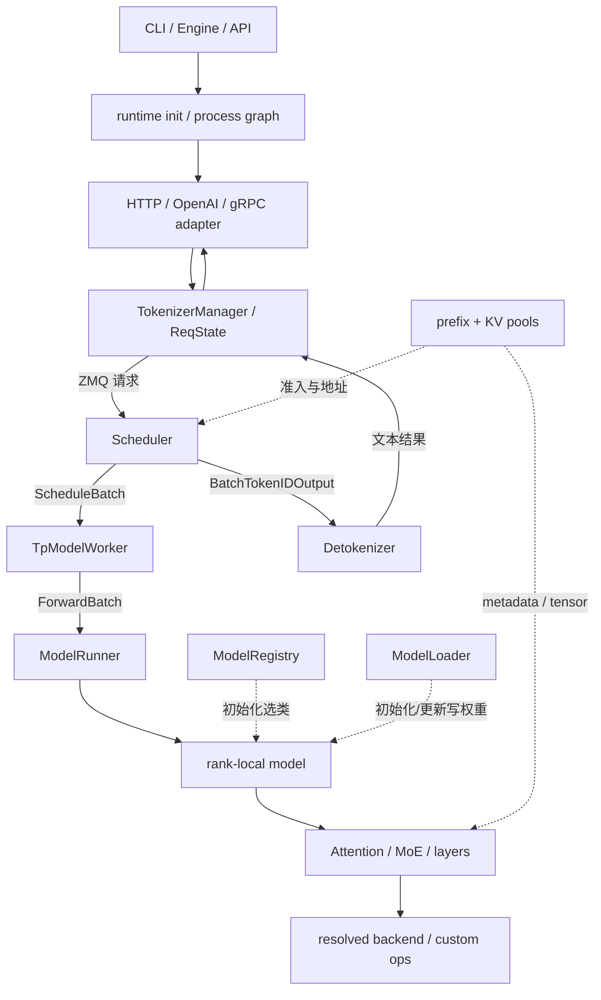
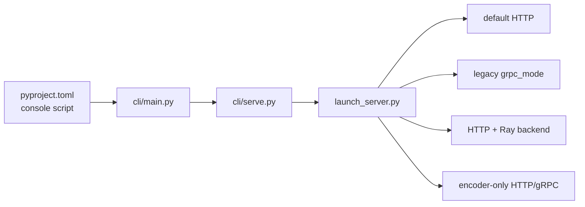
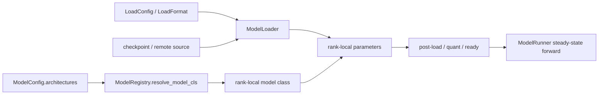
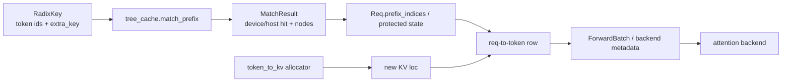
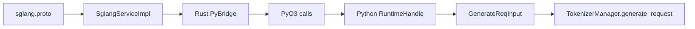

# SGLang 模块依赖图

## 你为什么要读

Python import 只能告诉你“文件引用了谁”，却不能完整表达 SGLang 的运行关系。HTTP 主进程通过 ZMQ 把请求交给 Scheduler，Scheduler 再驱动 GPU worker；gRPC 还会穿过 Rust/PyO3；attention backend 和 `sgl-kernel` 则在运行时按硬件与配置选路。

本页把依赖分成启动调用、跨进程消息、执行调用和扩展插入点。读图时不要把箭头都理解成普通函数调用。

| 箭头语义 | 例子 | 读图时要问 |
|----------|------|------------|
| 初始化调用 | Engine 创建 Scheduler/Detokenizer | 发生一次还是可热更新？失败后谁清理？ |
| 同进程调用 | TpModelWorker 调 ModelRunner | 对象是借用、复制还是原地改写？ |
| 跨进程消息 | TokenizerManager → Scheduler | 序列化格式、socket 所有者和 rank 同步是什么？ |
| 资源引用 | ScheduleBatch 持有 pool/cache 引用 | 谁拥有、谁分配、谁释放？ |
| 条件分派 | backend registry → implementation | 配置名、对象类型和最终 kernel 是否一致？ |

## 全局关系



实线是普通请求的主要前进/回程关系；虚线是初始化或资源依赖。ModelRegistry/Loader 不在每个 decode step 重新运行，cache 也不是 ModelRunner 的“下游模块”。

## 启动依赖



| 入口 | 下一跳 | 关系 |
|------|--------|------|
| `python/pyproject.toml` | `sglang.cli.main:main` | 安装后创建 `sglang` 命令 |
| `cli/main.py` | `cli/serve.py` | 分派 `serve` 子命令 |
| `cli/serve.py` | `launch_server.run_server` | 解析服务参数并进入 runtime |
| `launch_server.py` | encoder-only、legacy gRPC、Ray、default HTTP | 按条件选择入口与进程拓扑；不是四路同时启动 |

启动问题优先沿这张小图查，不要一开始就进入 Scheduler。

## 请求与执行依赖

```mermaid
flowchart LR
    TM["TokenizerManager"] -->|"tokenized request"| SCH["Scheduler"]
    SCH --> POLICY["sort / admit / commit"]
    POLICY --> BATCH["Req + ScheduleBatch"]
    BATCH --> TPW["TpModelWorker"]
    TPW -->|"ForwardBatch.init_new"| FB["ForwardBatch"]
    FB --> MR["ModelRunner"]
    MR --> MODEL["rank-local model.forward"]
    MODEL --> AB["resolved Attention/MoE backend"]
    AB --> OP["GPU kernels / custom ops"]
```



关键边界：

- TokenizerManager 负责外部请求与等待状态，不负责 KV admission。
- Scheduler 负责选请求和资源预算，不负责模型结构。
- ModelRunner 负责组织 forward，不负责 HTTP 生命周期。
- Model Registry 决定模型类，loader 决定参数如何写入。
- Attention backend 选择实现，kernel 只消费 tensor 与 metadata。

### 模型初始化与热更新不是请求热路径



热更新会重新触碰 loader/parameter，但仍不是普通 decode step 的固定下游。模型类选对、参数名映射正确、当前 rank 应持有该参数，是三项独立判断。

## 缓存依赖



tree cache 与 KV allocator 相互配合，但不是同一对象。匹配返回的 device indices、host hit 和节点状态先写回请求；新 token 的 KV loc 由 allocator 分配，再进入请求行和 backend metadata。host 命中不等于数据已在 device 可读。

深入：[[SGLang-RadixAttention]] · [[SGLang-KV-Cache]]。

## 高级特性插在哪里

| 特性 | 插入边界 | 主要新增对象或协议 |
|------|----------|--------------------|
| Speculative decoding | Scheduler 与模型执行 | draft、verify、accept/reject 状态 |
| PD 分离 | 请求路由、KV pool、跨 worker/节点传输 | room、metadata、KV transfer、`PREBUILT` |
| LoRA | 请求身份、batch 准入、模型层 | `lora_id`、GPU slot、delta weights |
| 多模态 | 请求预处理与模型输入 | processor output、placeholder、视觉特征 |
| Quantization | 模型初始化、权重加载、算子执行 | quant config、method、量化参数 |
| Observability | HTTP、TokenizerManager、Scheduler | metrics、trace、request logs |
| Grammar | sampling mask、spec tree 与 overlap 同步 | grammar state、mask、rollback/commit |

高级特性读法不是“从新目录重新开始”，而是先找到它改了主线哪一条箭头。

## gRPC 跨语言依赖



Rust 侧不是把 Python 当普通静态模块依赖。`SglangServiceImpl` 持有 `PyBridge`，桥接层通过 PyO3 调 Python `RuntimeHandle`；Proto 是 client、gateway 与 server 的协议契约。

深入：[[SGLang-gRPC-Proto]] · [[SGLang-gRPC请求全链路]]。

## 扩展仓库与主 runtime

| 目录 | 与 `srt` 的关系 |
|------|-----------------|
| `sgl-kernel/` | 提供热点 CUDA/C++ custom ops，由 Python wrapper 和 runtime 调用 |
| `sgl-model-gateway/` | 位于 client 与 worker 之间，负责路由、代理、健康和重试 |
| `python/sglang/lang/` | 前端 DSL，通过 backend 调用本地或远端 runtime |
| `python/sglang/multimodal_gen/` | 扩散模型推理子系统，与文本 `srt` 并列而非其普通请求分支 |

## 怎么用这张图排障

1. 先写下症状发生时手里的对象：JSON、token ids、`Req`、batch、tensor 还是文本 chunk。
2. 在图上找到对象的生产者与消费者。
3. 判断箭头是函数调用、ZMQ、Rust/Python bridge 还是 GPU 执行。
4. 再判断它属于初始化、steady-state 请求、资源引用还是条件分派。
5. 在两端分别取证，确认对象是在发送前就错，还是交接后才错。

例如“HTTP 连接正常但没有文本”至少要分三种：Scheduler 没生成 token、Detokenizer 没生成字符串、TokenizerManager 没唤醒等待者。

## 静态验证

**操作：** 在仓库根目录执行：

```powershell
$checks = @(
  @{ Path = 'sglang/python/sglang/launch_server.py'; Pattern = 'def run_server' },
  @{ Path = 'sglang/python/sglang/srt/managers/tokenizer_manager.py'; Pattern = 'class ReqState' },
  @{ Path = 'sglang/python/sglang/srt/managers/scheduler.py'; Pattern = 'class Scheduler(' },
  @{ Path = 'sglang/python/sglang/srt/managers/tp_worker.py'; Pattern = 'class TpModelWorker' },
  @{ Path = 'sglang/python/sglang/srt/model_executor/model_runner.py'; Pattern = 'class ModelRunner(' },
  @{ Path = 'sglang/python/sglang/srt/models/registry.py'; Pattern = 'def resolve_model_cls' },
  @{ Path = 'sglang/python/sglang/srt/mem_cache/base_prefix_cache.py'; Pattern = 'class MatchResult' },
  @{ Path = 'sglang/python/sglang/srt/entrypoints/grpc_bridge.py'; Pattern = 'class RuntimeHandle' },
  @{ Path = 'sglang/rust/sglang-grpc/src/bridge.rs'; Pattern = 'pub struct PyBridge' },
  @{ Path = 'sglang/rust/sglang-grpc/src/server.rs'; Pattern = 'pub struct SglangServiceImpl' }
)

foreach ($check in $checks) {
  rg -n --fixed-strings $check.Pattern $check.Path
  if ($LASTEXITCODE -ne 0) { throw "missing dependency node: $($check.Pattern)" }
}
```

**预期：** 十组节点全部命中。命中只证明节点存在；箭头方向仍要由调用点、消息发送点、对象字段或运行 trace 证明，不能从 import 关系直接推导。

## 继续阅读

主线进入 [[SGLang-HTTP请求全链路]]；按文件查找使用 [[SGLang-源码地图]]；按术语查找使用 [[SGLang-关键概念]]。
