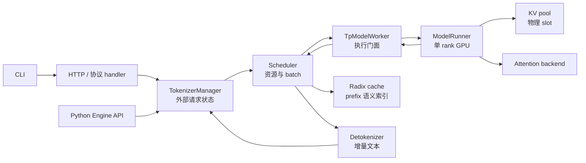

# SGLang 源码地图

## 读者任务

本页不是源码摘录合集，也不是要求你按目录逐个读文件。它是一张“问题到入口”的路由表：先判断异常属于协议、请求状态、调度、GPU 执行、KV/Attention 还是扩展路径，再打开最小的一组 upstream 文件和对应专题。

路径均相对于 `sglang/` 仓库根。具体行为、分支条件和不变量以链接的源码走读为准；本页只保存稳定职责，不用压缩伪代码冒充源码证据。

## 一条请求先经过哪些所有者



| 交接边界 | 主要对象 | 第一入口 | 深入阅读 |
|----------|----------|----------|----------|
| 用户命令到 server 配置 | argv → `ServerArgs` | `python/sglang/cli/main.py`、`cli/serve.py`、`srt/server_args.py` | [[SGLang-启动链路-数据流]] |
| HTTP 到内部请求 | JSON/OpenAI request → `GenerateReqInput` | `srt/entrypoints/http_server.py` | [[SGLang-HTTP-Server-源码走读]]、[[SGLang-OpenAI-API]] |
| 请求状态到调度消息 | tokenized input、rid、async state | `srt/managers/tokenizer_manager.py`、`io_struct.py` | [[SGLang-TokenizerManager]] |
| 请求到可执行 batch | `Req` → `ScheduleBatch` | `srt/managers/scheduler.py`、`schedule_batch.py` | [[SGLang-Scheduler]]、[[SGLang-ScheduleBatch数据结构]] |
| batch 到 GPU tensor | `ScheduleBatch` → `ForwardBatch` | `srt/managers/tp_worker.py`、`model_executor/forward_batch_info.py` | [[SGLang-ModelRunner-数据流]] |
| GPU 执行与 kernel | `ForwardBatch` → logits/采样结果 | `model_executor/model_runner.py`、`layers/radix_attention.py` | [[SGLang-ModelRunner]]、[[SGLang-Attention]] |
| token id 到文本 | `BatchTokenIDOutput` → `BatchStrOutput` | `srt/managers/detokenizer_manager.py` | [[SGLang-Detokenizer]] |

这张表的关键不是文件顺序，而是所有权：HTTP 不管理 KV，Scheduler 不负责文本解码，ModelRunner 不拥有客户端生命周期，attention backend 也不知道 OpenAI route 的名字。Python `Engine` 复用 TokenizerManager/Scheduler/Detokenizer runtime，但绕过 FastAPI；它不能被强行画进 HTTP 分支。

## 启动与协议入口

| 文件 | 稳定职责 | 不要误读成 |
|------|----------|------------|
| `python/pyproject.toml` | 安装产物、console script、package data、Rust extension 构建声明 | 运行时请求链 |
| `python/sglang/cli/main.py` | `serve/generate/version` 顶层子命令路由 | 完整 server 参数解析器 |
| `python/sglang/cli/serve.py` | diffusion 与标准 LLM serve 的早期分流 | HTTP server 本体 |
| `python/sglang/launch_server.py` | encoder、legacy gRPC、Ray HTTP、默认 HTTP 的入口选择 | Scheduler 进程拓扑实现 |
| `python/sglang/srt/entrypoints/http_server.py` | HTTP runtime 装配、FastAPI/ASGI、native 与兼容协议路由、health/warmup | token 调度或模型 forward |
| `python/sglang/srt/server_args.py` | CLI 配置的结构、默认值、派生值和合法性检查 | 全局可变单例 |

首次追 HTTP 请求，直接进入 [[SGLang-HTTP请求全链路]]。排查“端口已开但服务不可用”，进入 [[SGLang-HTTP-Server-排障指南]]，不要先读 Scheduler。

## gRPC 必须分成两条能力边界

| 路径 | 文件 | 当前基线中的含义 |
|------|------|------------------|
| legacy `--grpc-mode` | `python/sglang/srt/entrypoints/grpc_server.py` | thin wrapper，委托外部 `smg-grpc-servicer`；这是当前 Python 参数已接线的路径 |
| native Rust/Tonic capability | `proto/sglang/runtime/v1/sglang.proto`、`rust/sglang-grpc/src/server.rs`、`bridge.rs`、Python `grpc_bridge.py` | 仓库内协议、server、PyBridge 与 RuntimeHandle 能力；当前默认 Python 启动路径没有把它接成一条可启动链 |

不能把两行表合并成“`--grpc-mode` 启动 Rust/Tonic server”。详细证据与启动验证见 [[SGLang-gRPC请求全链路]]。

## 请求状态与跨进程消息

| 文件 | 拥有什么 | 遇到什么问题时打开 |
|------|----------|--------------------|
| `srt/managers/tokenizer_manager.py` | rid 对应的等待状态、tokenization、请求发送、回包聚合、abort 与流式 yield | 请求已到 HTTP，但没有进入调度；stream 卡住；客户端取消未释放 |
| `srt/managers/io_struct.py` | Tokenizer、Scheduler、Detokenizer、控制面之间传递的 dataclass/message 契约 | 字段丢失、版本漂移、跨进程对象形态不一致 |
| `srt/managers/detokenizer_manager.py` | token id 的增量解码状态与 `BatchStrOutput` | 有 token id 无文本、Unicode/stop 边界异常 |
| `srt/managers/communicator.py` | 通用的 ZMQ fan-out/collect 原语：一次发送等待全部参与者回包，并提供 queueing 与 watching 两种并发语义 | 广播未收齐、并发控制请求互相覆盖或等待者拿错结果；具体 pause、权重更新、logging 消息仍由调用方定义 |

排查时先问“对象在哪个进程被拥有”，再问“下一条消息由谁消费”。只看函数调用图容易忽略 ZMQ、队列与取消语义。

## Scheduler：资源决策与 batch 生命周期

| 文件 | 稳定职责 | 重点对象或判断 |
|------|----------|----------------|
| `srt/managers/scheduler.py` | 接收请求、维护 waiting/running 状态、选择 prefill/decode、执行 batch、处理结果与 retract | event loop、admission、KV 预算、输出发送 |
| `srt/managers/schedule_policy.py` | waiting request 的排序与 prefix-aware policy | policy 改变不等于 KV allocator 改变 |
| `srt/managers/schedule_batch.py` | `Req`、`ScheduleBatch` 及 batch 合并/过滤/状态变换 | 请求字段、KV 索引、采样状态、EXTEND/DECODE 形态 |
| `srt/managers/data_parallel_controller.py` | 启动 DP Scheduler 进程，按 round-robin、bootstrap room、累计请求数或累计 token 等策略选择 DP rank；也处理外部指定 rank、批请求拆分与控制消息 fan-out | DP controller 负责“选哪个 DP 副本及向哪些副本广播”，不是副本内部的 TP worker |

如果问题是 TTFT、排队、chunked prefill、retract 或 prefix-aware 排序，先读 [[SGLang-Scheduler-源码走读]]。如果字段在多次 batch 变换后错位，进入 [[SGLang-ScheduleBatch数据结构-数据流]]。

## GPU 执行：门面、tensor 化与模型

| 文件 | 稳定职责 | 修改时必须保护 |
|------|----------|----------------|
| `srt/managers/tp_worker.py` | Scheduler 与单 rank `ModelRunner` 之间的执行门面 | TP/PP rank 参与顺序、采样与输出契约 |
| `srt/model_executor/forward_batch_info.py` | `ForwardMode` 与 `ForwardBatch` 的 tensor/metadata 形态 | EXTEND、DECODE、MIXED、verify 等模式字段一致 |
| `srt/model_executor/model_runner.py` | 模型加载后的单 rank GPU 执行、attention backend、CUDA Graph、forward 与采样准备 | graph/eager 选路、KV pool、backend metadata、设备状态 |
| `srt/model_loader/loader.py` | checkpoint/load format 对应的 loader 策略 | 文件格式、量化与模型参数名映射 |
| `srt/models/registry.py` | HF architecture 到 SGLang model class 的解析 | 新模型注册不能只新增一个文件 |

模型实现不要从整个 `models/` 目录开始扫。先用 registry 找到 EntryClass，再选一个结构最接近的实现：通用 decoder 可从 `models/llama.py` 入手；MLA/MoE 看 `deepseek_v2.py`；vision-text cross attention 看 `mllama.py`；混合 sliding/full attention 看 `gemma3_causal.py`。

## KV、prefix cache 与 attention 是三层对象

| 层 | 文件 | 回答的问题 |
|----|------|------------|
| KV 物理资源 | `srt/mem_cache/` 下 allocator/pool 实现；主要由 GPU 执行侧持有和写入 | token slot 在哪里分配、释放和统计 |
| prefix 语义索引 | `srt/mem_cache/radix_cache.py`、`unified_radix_cache.py`；调度侧据此做 match/lock/commit | 哪段历史 token 可以复用，节点如何插入/匹配/淘汰 |
| attention 消费 | `srt/layers/radix_attention.py` 与具体 backend | 当前 batch 用哪些 Q/K/V、slot、indptr、indices 调 kernel |

不要把 `RadixAttention` 类名等同于 radix tree，也不要把 prefix hit 直接等同于 TTFT 必然下降。资源账读 [[SGLang-KV-Cache]]，prefix 语义读 [[SGLang-RadixAttention]]，kernel metadata 读 [[SGLang-Attention-源码走读]]。

## 分布式与高级路径

| 任务 | 第一入口 | 继续阅读 |
|------|----------|----------|
| TP/PP/CP/EP group 与 collective | `srt/distributed/parallel_state.py` | [[SGLang-分布式]] |
| Speculative 算法选择与公共 phase 契约 | `srt/speculative/spec_info.py`、`spec_registry.py` | [[SGLang-Speculative]]；再按算法进入 `eagle_worker_v2.py`、`dflash_worker_v2.py`、`ngram_worker.py` 等具体 worker |
| Prefill/Decode disaggregation | `srt/disaggregation/prefill.py`、`decode.py` | [[SGLang-PD分离]] |
| 可观测性与 metrics | `srt/observability/`、scheduler metrics reporter | [[SGLang-可观测性]] |
| checkpoint/在线权重更新 | updater、control message 与 model loader 相关入口 | [[SGLang-CheckpointEngine]] |

高级路径会改变主线中的参与者和等待点，但不会取消对象所有权。比如 PD 分离新增 KV transfer 队列，不代表 HTTP route 开始管理 KV；speculative 的 `spec_info.py` 统一表达 prepare、draft、verify 等阶段输入，却不等于所有算法都走 EAGLE worker。当前基线还包括 DFLASH、FROZEN_KV_MTP、STANDALONE、NGRAM 与插件注册算法，算法特有状态必须回到对应 worker 核对。

## 扩展组件

| 扩展 | 第一入口 | 先确认的边界 |
|------|----------|--------------|
| 多模态 | `managers/multimodal_processor.py`、`srt/multimodal/processors/base_processor.py` | 前者扫描、注册并按 architecture/model backend 选择 processor；后者约束 raw、processor output、precomputed embedding 三类输入，以及 placeholder/token 展开、offset/item 切分、hash/pad 和可选 CUDA IPC |
| LoRA | `srt/lora/lora_manager.py`、`srt/lora/mem_pool.py` | manager 负责配置/CPU adapter、模型层包装与 batch metadata；memory pool 才负责 GPU slot residency、权重装载、pinned adapter 保护和策略化 eviction |
| 前端语言 DSL | `python/sglang/lang/api.py`、`ir.py`、`interpreter.py`、`backend/runtime_endpoint.py` | API 构造 IR，解释器维护 program/stream/variable/fork 状态，backend 才把 generate/select 等动作翻译为远端协议；这些对象不是 Scheduler 的 `Req`/`ScheduleBatch` |
| model gateway | 独立 gateway/router 目录与协议入口 | 路由策略、session affinity 与单个 engine 内调度分开 |
| sgl-kernel | 独立 kernel 包及调用点 | kernel 包存在不代表当前模型/backend 一定 dispatch 到它 |

对应阅读：[[SGLang-多模态]]、[[SGLang-LoRA]]、[[SGLang-前端语言]]、[[SGLang-model-gateway]]、[[SGLang-sgl-kernel]]。

## 按症状反查入口

| 症状或修改目标 | 先打开 | 暂时不要先看 |
|----------------|----------|----------------|
| HTTP 422、OpenAI messages/tool 转换错误 | `http_server.py`、OpenAI serving handler | CUDA kernel |
| 请求已接受但 Scheduler 没看到 | `tokenizer_manager.py`、`io_struct.py` | 模型实现 |
| TTFT 高、waiting queue 增长 | `scheduler.py`、`schedule_policy.py`、metrics reporter | Detokenizer |
| KV usage 高或发生 retract | Scheduler admission、KV pool、radix cache | HTTP route |
| token id 正常但文本不返回 | `detokenizer_manager.py`、TokenizerManager 回包状态 | attention backend |
| CUDA Graph capture/replay 异常 | `model_runner.py`、attention backend graph metadata | CLI parser |
| 新模型权重缺失或 shape 不匹配 | registry、model class `load_weights`、loader | schedule policy |
| prefix cache 命中不符合预期 | radix cache key/insert/match、请求 token 序列 | 只看 GPU utilization |
| 多机某 rank 没完整 HTTP API | Engine 启动与 node rank 分支 | OpenAI handler |

## 静态验证

从知识库根目录执行：

```powershell
$paths = @(
  'sglang/python/sglang/cli/main.py',
  'sglang/python/sglang/cli/serve.py',
  'sglang/python/sglang/launch_server.py',
  'sglang/python/sglang/srt/entrypoints/http_server.py',
  'sglang/python/sglang/srt/entrypoints/grpc_server.py',
  'sglang/python/sglang/srt/entrypoints/grpc_bridge.py',
  'sglang/proto/sglang/runtime/v1/sglang.proto',
  'sglang/rust/sglang-grpc/src/server.rs',
  'sglang/python/sglang/srt/managers/tokenizer_manager.py',
  'sglang/python/sglang/srt/managers/scheduler.py',
  'sglang/python/sglang/srt/managers/schedule_batch.py',
  'sglang/python/sglang/srt/managers/detokenizer_manager.py',
  'sglang/python/sglang/srt/managers/communicator.py',
  'sglang/python/sglang/srt/managers/data_parallel_controller.py',
  'sglang/python/sglang/srt/managers/multimodal_processor.py',
  'sglang/python/sglang/srt/model_executor/model_runner.py',
  'sglang/python/sglang/srt/mem_cache/radix_cache.py',
  'sglang/python/sglang/srt/layers/radix_attention.py',
  'sglang/python/sglang/srt/disaggregation/prefill.py',
  'sglang/python/sglang/srt/disaggregation/decode.py',
  'sglang/python/sglang/srt/speculative/spec_info.py',
  'sglang/python/sglang/srt/speculative/spec_registry.py',
  'sglang/python/sglang/srt/lora/lora_manager.py',
  'sglang/python/sglang/srt/lora/mem_pool.py',
  'sglang/python/sglang/srt/multimodal/processors/base_processor.py',
  'sglang/python/sglang/lang/api.py',
  'sglang/python/sglang/lang/ir.py',
  'sglang/python/sglang/lang/interpreter.py',
  'sglang/python/sglang/lang/backend/runtime_endpoint.py'
)
$missing = $paths | Where-Object { -not (Test-Path -LiteralPath $_) }
if ($missing) { $missing; throw '源码地图存在失效路径' }
"checked=$($paths.Count) missing=0"
```

预期输出 `missing=0`。这只证明文件入口仍存在；要证明行为没有漂移，继续运行对应专题的源码证据、单元测试或服务实验。

## 复盘

使用这张地图时始终做三步：先确定对象所有者，再确定跨进程或跨层交接，最后才打开具体实现。能够背出文件名不算读懂；能够解释“为什么这个症状先看这里、为什么另外两层暂时不用看”，才算建立了可迁移的源码地图。
