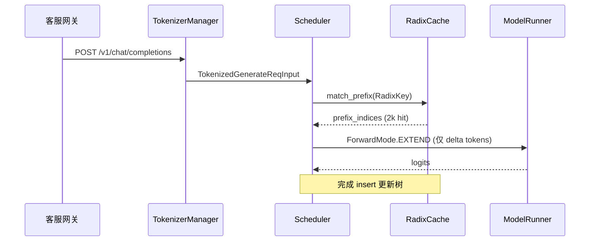
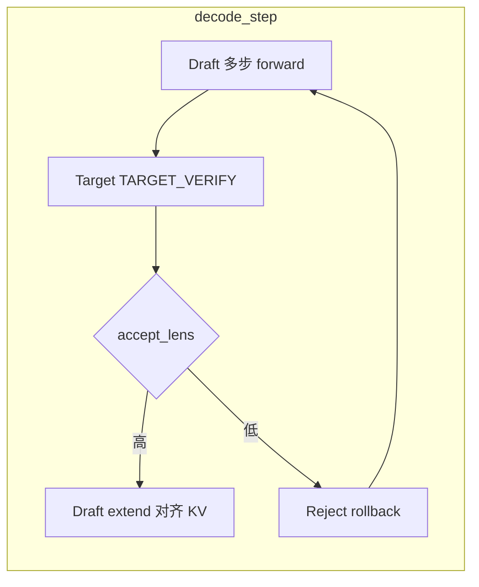
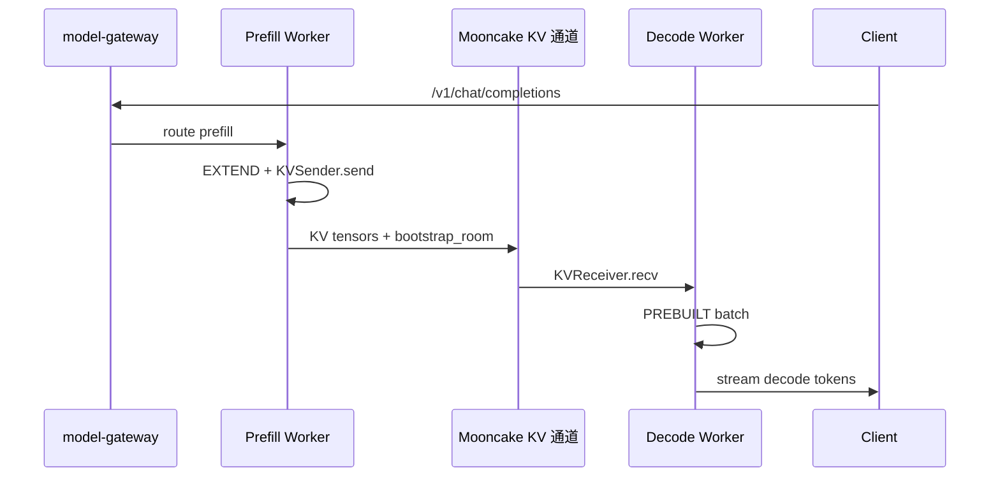

# SGLang 用户场景

> 三个示意场景：RadixCache、EAGLE 投机、PD 分离。场景用于建立因果关系，性能结果必须在自己的环境中测量。

---

## 你为什么要读

只看架构图，很容易把 RadixCache、投机解码和 PD 分离都理解成“更快按钮”。本篇把它们放回真实用户故事：共享 system prompt、decode 加速、prefill/decode 拆池，分别解决什么瓶颈、付出什么代价、该观察哪些指标。场景是主角，源码对象是证人。

## 故事 A：长对话共享 System Prompt → RadixCache 前缀命中 → 跳过 Prefill

### 场景角色

**小林**，某 SaaS 客服平台的推理工程师。平台的大量请求共享一段很长的 system prompt，每个终端用户只追加相对较短的消息。高峰期，P99 TTFT 是最先暴露问题的指标。

### 时间线

| 时刻 | 事件 |
|------|------|
| T0 | 用户 A 发起首条消息；Scheduler 对完整 prompt 做 extend prefill，RadixCache `insert` 挂树 |
| T0+30s | 用户 B、C… 陆续进入；`match_prefix` 命中相同 system 前缀 |
| T1 | 并发会话增加；命中的请求由 `prefix_indices` 覆盖共享前缀，GPU 只计算未命中的 delta |
| T2 | 对照 force miss 后，确认 matched tokens 增加，TTFT 分布随 prefill 工作量变化 |

### 涉及模块



**读法：** 前缀命中发生在 `ScheduleBatch` 初始化阶段：`match_prefix` 返回的 `device_indices` 写入 `prefix_indices`，后续 `prepare_for_extend` 只对 `origin_input_ids[len(prefix_indices):]` 分配 KV slot 并跑 attention。调度策略层 `match_prefix_for_req` 还会按命中长度排序 waiting 队列，提高 batch 内 prefix 复用率。

**源码锚点：**

```python
## 来源：python/sglang/srt/managers/schedule_policy.py L91-L131
def match_prefix_for_req(
    tree_cache: BasePrefixCache,
    req: Req,
    token_ids: Optional[array[int]] = None,
    *,
    cow_mamba: bool = False,
    include_req: bool = False,
):
    if token_ids is None:
        token_ids = req.origin_input_ids + req.output_ids

    match_result = tree_cache.match_prefix(
        MatchPrefixParams(
            key=RadixKey(token_ids=token_ids, extra_key=req.extra_key),
            cow_mamba=cow_mamba,
            req=req if include_req else None,
        )
    )
    if envs.SGLANG_RADIX_FORCE_MISS.get():
        match_result = zero_match_result(tree_cache, match_result)
    (
        req.prefix_indices,
        req.last_node,
        req.last_host_node,
        req.best_match_node,
        req.host_hit_length,
        req.swa_host_hit_length,
        req.mamba_host_hit_length,
    ) = (
        match_result.device_indices,
        match_result.last_device_node,
        match_result.last_host_node,
        match_result.best_match_node,
        match_result.host_hit_length,
        match_result.swa_host_hit_length,
        match_result.mamba_host_hit_length,
    )
    max_len = req._compute_max_prefix_len(len(token_ids))
    req.num_matched_prefix_tokens = min(
        len(req.prefix_indices) + req.host_hit_length, max_len
    )
```

```python
## 来源：python/sglang/srt/managers/schedule_batch.py L1168-L1206
        if tree_cache is not None:
            if cow_mamba is None:
                cow_mamba = tree_cache.supports_mamba()
            match_result = tree_cache.match_prefix(
                MatchPrefixParams(
                    key=RadixKey(
                        token_ids=token_ids_to_match,
                        extra_key=self.extra_key,
                        limit=key_limit,
                    ),
                    req=self,
                    cow_mamba=cow_mamba,
                )
            )
            if envs.SGLANG_RADIX_FORCE_MISS.get():
                match_result = zero_match_result(tree_cache, match_result)
            (
                self.prefix_indices,
                self.last_node,
                self.last_host_node,
                self.best_match_node,
                self.host_hit_length,
                self.swa_host_hit_length,
                self.mamba_host_hit_length,
                self.mamba_branching_seqlen,
            ) = (
                match_result.device_indices,
                match_result.last_device_node,
                match_result.last_host_node,
                match_result.best_match_node,
                match_result.host_hit_length,
                match_result.swa_host_hit_length,
                match_result.mamba_host_hit_length,
                match_result.mamba_branching_seqlen,
            )
            if match_result.cache_protected_len is not None:
                self.cache_protected_len = match_result.cache_protected_len
            else:
                self.cache_protected_len = len(self.prefix_indices)
```

**要点：**

- `extra_key` 来自 OpenAI 层 `_compute_extra_key`；若各租户 LoRA adapter 不同，必须保证 extra_key 一致才能共享 system 前缀。
- `positional_embed_overrides` 非空时强制禁用 prefix cache，避免同 token 不同 embedding 误共享。

### 如果…会怎样（调试）

| 现象 | 可能原因 | 排查 |
|------|----------|------|
| `cache_hit_rate` 始终为 0 | system prompt 含动态 timestamp / request id | 检查 template 是否每请求变化 |
| 命中长度只有几百 token | `extra_key` 不一致（LoRA、routing_key） | 对比 `GenerateReqInput.extra_key` |
| TTFT 降了但吞吐没升 | prefill batch 仍被长 delta 占满 | 看 `num_matched_prefix_tokens` 分布 |
| 强制验证 miss 行为 | 设 `SGLANG_RADIX_FORCE_MISS=1` | 对比 A/B latency |

**专题深读：** [[SGLang-RadixAttention]] · [[SGLang-SchedulePolicy]]

---

## 故事 B：EAGLE 投机解码 — Accept Rate 下降时的 Reject Rollback

### 场景角色

**阿杰**，推理平台 SRE。集群开启 EAGLE，希望减少 target decode 轮次。一次业务域变化后，draft 与 target 的分布不再匹配，accept length 明显下降，端到端延迟反而上升。

### 时间线

| 时刻 | 事件 |
|------|------|
| T0 | 基线流量：draft 连续提出候选，target `TARGET_VERIFY` 一次接受多个 token |
| T1 | 新上线营销文案域，词汇分布偏移；draft top-1 与 target 分歧增大 |
| T2 | `accept_lens` 分布下移；verify 成本仍在，额外 draft forward 开始侵蚀收益 |
| T3 | 开启 `--speculative-use-rejection-sampling`；reject 时 rollback KV，避免错误 draft 污染 cache |
| T4 | accept rate 仍低但 P99 恢复；决策：该域关闭投机或换 domain-specific draft |

### 涉及模块



**读法：** EAGLE decode 循环中，target verify 产出 `accept_lens`（含 bonus token）。`_draft_extend_for_decode` 用 `num_correct_drafts = accept_lens - 1` 告诉 draft 从哪条分支继续 extend。开启 rejection sampling 时，draft forward 保存 `draft_probs`，verify 阶段按 target 分布 reject，未接受 token 的 KV 不 commit，防止错误猜测污染 Radix 树与 req_to_token 映射。

**源码锚点：**

```python
## 来源：python/sglang/srt/speculative/eagle_worker_v2.py L659-L666
            if self.server_args.speculative_use_rejection_sampling:
                probs = renorm_draft_probs(
                    logits_output.next_token_logits,
                    forward_batch.sampling_info,
                    self.server_args.speculative_use_rejection_sampling,
                )
                topk_p, topk_index = fast_sample(probs, num_samples=1)
                draft_probs_list.append(probs)
```

```python
## 来源：python/sglang/srt/speculative/eagle_worker_v2.py L816-L839
    def _draft_extend_for_decode(
        self, batch: ScheduleBatch, batch_result: GenerationBatchResult
    ):
        # Batch 2: Draft extend
        draft_extend_input = EagleDraftExtendInput(
            hidden_states=batch_result.logits_output.hidden_states,
            # accept_lens includes the bonus token; correct drafts exclude it.
            num_correct_drafts=batch_result.accept_lens - 1,
            num_accept_tokens=batch_result.accept_lens,
            # Draft-extend fills the whole tree width (num_draft_tokens) per req,
            # not num_steps + 1, so DP MLP-sync padding stays consistent for topk > 1.
            num_tokens_per_req=self.speculative_num_draft_tokens,
            num_tokens_for_logprob_per_req=self.speculative_num_draft_tokens,
        )
        select_index = (
            torch.arange(
                0,
                len(batch.seq_lens) * self.speculative_num_draft_tokens,
                self.speculative_num_draft_tokens,
                device=self.device,
            )
            + batch_result.accept_lens
            - 1
        )
```

**要点：**

- accept rate 可以由 `accept_lens` 与候选步数推导，但是否值得开启必须看端到端收益，不能套统一阈值。
- draft/target 必须使用兼容 hidden size；rejection sampling 还要求 draft vocab 对齐。

### 如果…会怎样（调试）

| 现象 | 可能原因 | 排查 |
|------|----------|------|
| 吞吐反而下降 | accept length/rate 下移，draft/verify 成本超过节省 | Prometheus `spec_accept_rate` 或日志 `accept_lens` |
| 偶发乱码 | reject 未开，错误 draft KV 已 commit | 对比 `--speculative-use-rejection-sampling` |
| verify OOM | `speculative_num_steps` 过大 | 减 steps 或减 batch max running |
| draft 与 target 不对齐 | 不同 tokenizer / 热词表 | 检查 `hot_token_id` 映射 |

**专题深读：** [[SGLang-Speculative]]

---

## 故事 C：PD 分离 — 请求从 Prefill 节点穿越到 Decode 节点

### 场景角色

**老周**，云厂商 AI Infra 架构师。Prefill 与 Decode 的资源画像不同，混部时尾延迟波动明显。他把两者放进独立资源池，用 KV transfer backend 传状态，并由 Gateway 做 PD 路由。

### 时间线

| 时刻 | 事件 |
|------|------|
| T0 | 客户端经 Gateway 发 chat；路由选中 Prefill worker |
| T1 | Prefill Scheduler `DisaggregationMode.PREFILL` 完成 extend |
| T2 | `MooncakeKVSender` 把 KV indices + metadata 推到 Decode bootstrap |
| T3 | Decode 节点 `KVReceiver` 收齐 KV，`prepare_for_prebuilt` 设 `ForwardMode.PREBUILT` |
| T4 | Decode Scheduler 进入常规 decode 循环；TTFT 由排队、prefill、传输和首个 decode 共同组成 |
| T5 | Gateway health check 要求 prefill **与** decode 均 healthy 才对外 ready |

### 涉及模块



**读法：** PD 分离把一次生成的「重 prefill」与「长 decode」拆到不同进程甚至不同机器。Prefill 侧在 extend 结束后不再本地 decode，而是通过 disaggregation connector 发送 KV。Decode 侧不 rerun prefill forward，而是用 `prepare_for_prebuilt` 从 `req_to_token_pool` 已有 mapping 组装 `out_cache_loc`，`forward_mode = PREBUILT` 直接进入 target verify/decode 路径。Gateway 在 `PrefillDecode` 路由模式下同时检查两类 worker，避免「只有 prefill 没有 decode」的半开集群。

**源码锚点：**

```python
## 来源：python/sglang/srt/disaggregation/decode_schedule_batch_mixin.py L25-L56
    def prepare_for_prebuilt(self: ScheduleBatch):
        """
        Prepare a prebuilt extend by populate metadata
        Adapted from .prepare_for_extend().
        """

        self.forward_mode = ForwardMode.PREBUILT
        reqs = self.reqs
        input_ids = [r.get_fill_ids()[len(r.prefix_indices) :] for r in reqs]
        extend_num_tokens = sum(len(ids) for ids in input_ids)
        seq_lens = []
        pre_lens = []
        req_pool_indices = []

        # Pre-calculate total size
        total_size = sum(req.extend_range.length for req in reqs)
        out_cache_loc = torch.empty(total_size, dtype=torch.int64, device=self.device)

        # Fill the tensor in one pass
        offset = 0
        for i, req in enumerate(reqs):
            req_pool_indices.append(req.req_pool_idx)
            pre_len = len(req.prefix_indices)

            chunk = self.req_to_token_pool.req_to_token[req.req_pool_idx][
                pre_len : pre_len + req.extend_range.length
            ]
            assert (
                offset + req.extend_range.length <= total_size
            ), f"Exceeds total size: offset={offset}, req.extend_range.length={req.extend_range.length}, total_size={total_size}"
            out_cache_loc[offset : offset + req.extend_range.length] = chunk
            offset += req.extend_range.length
```

```rust
// 来源：sgl-model-gateway/src/server.rs L110-L118
 RoutingMode::PrefillDecode { .. } => {
 let has_prefill = healthy_workers.iter().any(|w| matches!(w.worker_type(), WorkerType::Prefill { .. }));
 let has_decode = healthy_workers.iter().any(|w| matches!(w.worker_type(), WorkerType::Decode));
 has_prefill && has_decode
 }
```

**要点：**

- OpenAI 请求里的 `bootstrap_host` / `bootstrap_port` / `bootstrap_room` 由 `_convert_to_internal_request` 注入，用于 decode 侧 rendezvous。
- 传输后端可选 Mooncake / Nixl / Ascend / Mori；选型影响带宽与 tail latency。

### 如果…会怎样（调试）

| 现象 | 可能原因 | 排查 |
|------|----------|------|
| Gateway 503 ready=false | 仅 prefill 或仅 decode healthy | Gateway worker 探活与 `WorkerType` |
| Decode 首 token 极慢 | KV 传输未完成就组 batch | `req_time_stats` disagg 分段 |
| 乱码 / 重复 | bootstrap_room 冲突 | 保证 room id 全局唯一 |
| PREBUILT OOM | decode 池 KV pool 小于 prefill 产出 | 对齐 `--mem-fraction` 与 max-seq |

**专题深读：** [[SGLang-PD分离]] · [[SGLang-model-gateway]]

---

## 三故事对照

| 维度 | 故事 A RadixCache | 故事 B EAGLE | 故事 C PD |
|------|-------------------|--------------|-----------|
| 优化目标 | TTFT / prefill 算力 | decode 吞吐 | 混部解耦 / 弹性扩缩 |
| 关键 metrics | `cache_hit_rate` | `accept_lens` / accept rate | KV 传输延迟、PD ready |
| 误开代价 | 低（最多 miss） | 中（可能负优化） | 高（半开集群不可用） |
| 入口专题 | [[SGLang-RadixAttention]] · [[SGLang-KV-Cache]] | [[SGLang-Speculative]] | [[SGLang-PD分离]] · [[SGLang-model-gateway]] |

---

## 运行验证

维护本文时，先用下面的命令确认三个用户故事仍能映射到源码入口：

```powershell
rg -n "match_prefix|prepare_for_extend|prepare_for_prebuilt|Eagle|accept_lens|PrefillDecode|WorkerType::Prefill|WorkerType::Decode" sglang/python/sglang/srt/managers/schedule_policy.py sglang/python/sglang/srt/managers/schedule_batch.py sglang/python/sglang/srt/speculative/eagle_worker_v2.py sglang/python/sglang/srt/disaggregation/decode_schedule_batch_mixin.py sglang/sgl-model-gateway/src/server.rs
```

预期信号：

- 故事 A 应命中 prefix match 与 extend 准备路径。
- 故事 B 应命中 EAGLE worker、`accept_lens` 和 accepted token 处理。
- 故事 C 应命中 `prepare_for_prebuilt` 与 gateway 的 prefill / decode worker 就绪判断。

如果某条故事线没有命中，先确认能力是被重命名、迁移，还是已不再属于主线场景，再更新本页和对应专题入口。
