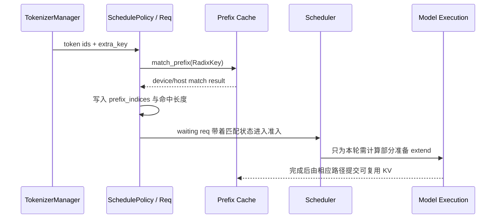
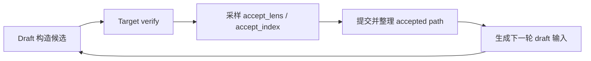
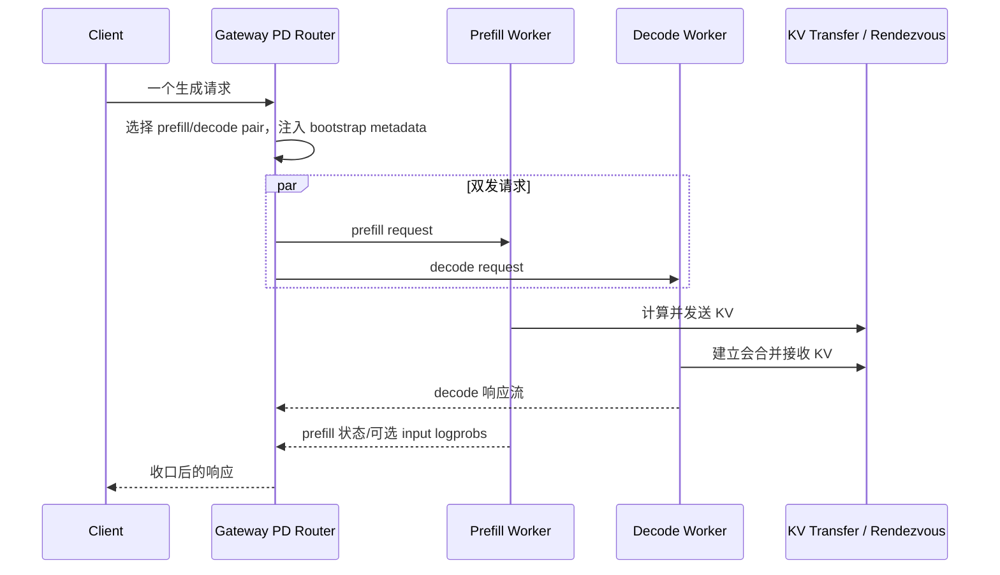
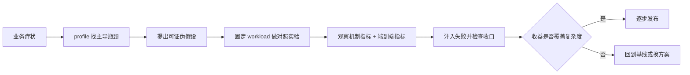

# SGLang 用户场景

> 三个决策故事：前缀复用、EAGLE 投机解码、PD 分离。它们不是三个“更快开关”，而是针对不同瓶颈、引入不同状态与失败面的系统改造。

## 你为什么要读

只看功能列表，很容易得出错误结论：共享 prompt 就一定有高 cache hit，开启 speculative 就一定减少延迟，prefill/decode 拆池就一定优于混部。本篇从业务症状出发，沿“假设 → 源码对象 → 观测 → 对照实验 → 决策”走完三个场景。

读完后，你应当能够先问“瓶颈在哪里”，再决定是否启用特性；也能解释为什么命中率、接受率或 KV 传输带宽单独变好，并不足以证明端到端收益。

---

## 先用一张表选场景

| 业务症状 | 首要假设 | 可能机制 | 新增代价 |
|---|---|---|---|
| 大量请求共享长前缀，未缓存 prompt 计算占 TTFT 大头 | 重复 prefill 可被复用 | RadixAttention / prefix cache | cache 地址、淘汰、隔离键与命中诊断 |
| decode 占主要时长，target 每轮产出少 | draft 候选可被 target 一次接受多个 | EAGLE speculative decoding | draft、verify、树/链整理与额外显存 |
| prefill 与 decode 互相干扰，资源画像和扩缩需求不同 | 两阶段值得独立调度和扩缩 | PD disaggregation + gateway | 双请求、会合、KV 传输、两池健康与重试 |

若 profile 显示瓶颈不符合首要假设，就不应仅因“框架支持”而启用该特性。

---

## 故事 A：共享 system prompt，为什么命中率仍可能很低

### 业务现场

某客服平台的大多数请求共享一段较长 system prompt，用户消息相对较短。团队观察到 TTFT 随并发上升，但不能直接断言 prefix cache 无效：TTFT 还包含排队、未命中后缀计算、采样和回程。

工程师先提出一个可证伪假设：**若请求的 token 前缀与隔离语义一致，第二批请求应得到更多 matched prefix tokens，并减少未缓存 prefill 工作。**

### 对象生命线



```python
## 来源：python/sglang/srt/managers/schedule_policy.py L91-L131
def match_prefix_for_req(
    tree_cache: BasePrefixCache,
    req: Req,
    token_ids: Optional[array[int]] = None,
    *,
    cow_mamba: bool = False,
    include_req: bool = False,
):
    if token_ids is None:
        token_ids = req.origin_input_ids + req.output_ids

    match_result = tree_cache.match_prefix(
        MatchPrefixParams(
            key=RadixKey(token_ids=token_ids, extra_key=req.extra_key),
            cow_mamba=cow_mamba,
            req=req if include_req else None,
        )
    )
    if envs.SGLANG_RADIX_FORCE_MISS.get():
        match_result = zero_match_result(tree_cache, match_result)
    (
        req.prefix_indices,
        req.last_node,
        req.last_host_node,
        req.best_match_node,
        req.host_hit_length,
        req.swa_host_hit_length,
        req.mamba_host_hit_length,
    ) = (
        match_result.device_indices,
        match_result.last_device_node,
        match_result.last_host_node,
        match_result.best_match_node,
        match_result.host_hit_length,
        match_result.swa_host_hit_length,
        match_result.mamba_host_hit_length,
    )
    max_len = req._compute_max_prefix_len(len(token_ids))
    req.num_matched_prefix_tokens = min(
        len(req.prefix_indices) + req.host_hit_length, max_len
    )
```

这张证据卡只证明：匹配键同时包含 token ids 与 `extra_key`，匹配结果区分 device/host 状态，并写回请求对象。它不证明每次视觉上相同的 prompt 都会命中。

### 四步实验

1. 固定模型、采样参数、并发和输入/输出长度分布，准备一组真正相同的 token 前缀。
2. 先发送 warm-up 请求，再发送复用组；记录 matched/cached tokens、queue time、TTFT 和吞吐。
3. 设置 `SGLANG_RADIX_FORCE_MISS=1` 做对照，再恢复环境变量。
4. 比较的是分布与未缓存工作量，而不是只比较一两个请求的墙钟时间。

预期：复用组的 matched/cached tokens 应高于 force-miss 组；TTFT 是否显著改善取决于未命中后缀、排队和运行环境。

### 命中失败时按顺序查

| 证据 | 可能解释 | 下一步 |
|---|---|---|
| token ids 在很早位置就不同 | 模板含时间戳、随机 ID、消息顺序差异 | 比较 tokenizer 后的前缀，不只比较原始字符串 |
| token ids 相同但 `extra_key` 不同 | LoRA、cache salt、routing/隔离语义不同 | 确认差异是必要隔离还是错误配置；不要为命中强行跨语义共享 |
| 有 host hit、device hit 较低 | KV 已下沉或设备层被逐出 | 联查 HiCache/eviction 与设备容量 |
| hit 高但 TTFT 仍高 | queue、长 delta、传输或首轮执行占主导 | 分解 TTFT，不把 cache hit 当端到端结论 |

决策边界：只有“重复前缀足够长、复用频繁、隔离键允许共享、缓存压力可控”同时成立时，这项机制才最有价值。

专题：[[SGLang-RadixAttention]]、[[SGLang-KV-Cache]]、[[SGLang-SchedulePolicy]]。

---

## 故事 B：EAGLE 接受率下降，为什么不能先调一个开关

### 业务现场

平台为某类稳定流量启用了 EAGLE。上线新领域数据后，decode 延迟上升。直觉上是 draft 与 target 更不一致，但正确诊断需要同时看：每轮接受长度、draft/verify 成本、batch 变化、输出长度以及端到端延迟。

EAGLE 的收益来源不是“draft 比 target 小”这一句话，而是：**draft 构造候选结构，target 一次 verify 后接受一条有效路径；被接受的 token 足够多时，才可能摊薄额外工作。**

### 对象生命线



```python
## 来源：python/sglang/srt/speculative/eagle_worker_v2.py L1538-L1579
        # Sample
        maybe_detect_nan(logits_output.next_token_logits, "verify: target model logits")
        maybe_detect_inf(logits_output.next_token_logits, "verify: target model logits")
        (
            predict,
            accept_lens,
            accept_index,
        ) = eagle_sample(verify_input, batch, logits_output, vocab_mask)
        new_seq_lens = batch.seq_lens + accept_lens
        clear_unaccepted_c128 = getattr(
            self.token_to_kv_pool_allocator.get_kvcache(),
            "clear_unaccepted_c128_draft_states",
            None,
        )
        if clear_unaccepted_c128 is not None and not batch.forward_mode.is_idle():
            clear_unaccepted_c128(
                batch.req_pool_indices,
                batch.seq_lens,
                accept_lens,
                self.speculative_num_draft_tokens,
            )

        # Update mamba state for hybrid GDN models after verification
        commit_mamba_states_after_verify(
            self.target_worker,
            batch,
            accept_lens,
            accept_index,
            self.speculative_num_draft_tokens,
        )

        if not batch.forward_mode.is_idle():
            accept_tokens = predict[accept_index]
            bonus_tokens = torch.empty_like(accept_lens, dtype=torch.int32)
            # stride = accept_tokens per-req width = accept_index.shape[1]
            # (spec_steps + 1); NOT num_draft_tokens, wrong for topk > 1 trees.
            fill_bonus_tokens[(bs,)](
                accept_tokens,
                accept_lens,
                bonus_tokens,
                accept_index.shape[1],
            )
```

这张证据卡只证明：target verify 之后由 `eagle_sample` 产生接受长度与路径索引，后续状态提交以这些结果为依据。它不支持“关闭 rejection sampling 会导致乱码”之类结论。

对于 tree drafting，接受路径还要被整理到后续链式布局所期望的位置：

```python
## 来源：python/sglang/srt/speculative/eagle_worker_v2.py L1623-L1636
        """Tree drafting (topk > 1): move the accepted path -- KV slots, predict,
        hidden_states -- to the contiguous front of each per-req block, which the
        downstream chain-layout code (draft-extend select_index, committed-KV reads)
        assumes. Returns compacted predict; mutates logits_output.hidden_states
        (moved only when present)."""
        move_accept_tokens_to_target_kvcache(
            batch, accept_index, accept_lens - 1, self.token_to_kv_pool_allocator
        )
        predict = self._compact_accept_to_front(predict, accept_index, bs)
        if logits_output.hidden_states is not None:
            logits_output.hidden_states = self._compact_accept_to_front(
                logits_output.hidden_states, accept_index, bs
            )
        return predict
```

这张证据卡只证明 top-k tree 路径需要移动 accepted KV、token 与可选 hidden states；它解释了 speculative decoding 为什么新增状态整理成本。

### 对照实验

至少比较三组：普通 decode、当前 speculative 配置、降低 draft 深度/宽度后的配置。固定 workload 后记录：

- `spec_accept_rate`、mean accepted length 或原始 `accept_lens` 分布；
- target verify 与 draft 所占时间；
- decode throughput、ITL/TPOT、端到端延迟；
- batch size、输出长度和显存占用。

预期：若接受长度下降而 draft/verify 成本不降，speculative 相对普通 decode 的收益会缩小，甚至负优化。但不存在跨模型通用的接受率阈值。

### 不要这样排障

- 不要把 rejection sampling 当作“防乱码开关”；它改变采样/接受契约，是否启用应按算法语义与质量、性能共同验证。
- 不要只看 accept rate；候选宽度、步数、batch 和 verify kernel 都影响成本。
- 不要把任何 draft 都假定为“小模型”；speculative method 还可能采用其他 draft 来源或插件路径。
- 不要在未做输出一致性/质量检查时，只因吞吐提高就宣布成功。

专题：[[SGLang-Speculative]]。

---

## 故事 C：PD 分离，真正新增的是一项分布式事务

### 业务现场

某集群的长 prompt 与长 decode 流量互相干扰，团队希望让 prefill 与 decode 独立扩缩。PD 分离不是把一个函数拆成两半：同一逻辑请求要被路由到一对 worker，双方通过 bootstrap metadata 会合，prefill 产生的 KV 要被 decode 正确接收，客户端响应还要由 Gateway 收口。

### 当前 HTTP Gateway 主线



```rust
// 来源：sgl-model-gateway/src/routers/http/pd_router.rs L681-L710
        // Build both requests
        let prefill_request = self.build_post_with_headers(
            &self.client,
            &prepared_prefill.endpoint_url,
            &prepared_prefill.body,
            headers,
            false,
        );
        let decode_request = self.build_post_with_headers(
            &self.client,
            &prepared_decode.endpoint_url,
            &prepared_decode.body,
            headers,
            false,
        );

        // Send both requests concurrently and wait for both
        // Note: Using borrowed references avoids heap allocation
        events::RequestPDSentEvent {
            prefill_url: prefill.url(),
            decode_url: decode.url(),
        }
        .emit();

        let (prefill_result, decode_result) =
            tokio::join!(prefill_request.send(), decode_request.send());

        events::RequestReceivedEvent {}.emit();

        // Process decode response
```

这张证据卡只证明：当前 HTTP PD router 构造 prefill/decode 两个请求并并发发送，然后以 decode response 为主要响应处理入口。它反驳“Gateway 先等 prefill 请求完成，再串行请求 decode”的过时模型。

### 为什么说它像分布式事务

一次逻辑请求至少跨越四类状态：

| 状态 | 必须对齐的内容 | 典型失败 |
|---|---|---|
| 路由对 | prefill worker、decode worker 与 DP/rank 语义 | 半边无健康实例、rank 不匹配 |
| 会合身份 | rid、bootstrap room/host/port 等 | 冲突、过期、双方找不到彼此 |
| KV 所有权 | 哪些位置已分配、发送、接收和可用于 decode | transfer 卡住、容量不足、metadata 不一致 |
| 响应所有权 | prefill 状态、decode stream、取消与重试 | 半边继续执行、重复请求、错误未收口 |

因此 PD 的收益不能只看 KV 带宽。端到端 TTFT 还包含两边排队、bootstrap、prefill、传输、decode 准备与响应回程；可用性还取决于一对 worker 和传输后端共同健康。

### 验证顺序

1. 先在相同模型与 workload 下建立混部基线。
2. 记录 prefill queue/compute、bootstrap、KV alloc/transfer、decode queue/first token 的分段时间。
3. 分别注入 prefill 不健康、decode 不健康、会合超时和 decode KV 容量不足，确认错误能收口且资源被释放。
4. 再比较不同 prefill/decode 池比例；不要只测一组静态配比。

预期：PD 可能降低阶段互扰并改善独立扩缩，却会新增传输与协调成本。只有收益超过这些成本，且故障收口可接受，才适合生产启用。

专题：[[SGLang-PD分离]]、[[SGLang-model-gateway]]。

---

## 三个故事的共同决策框架



| 场景 | 机制指标 | 必看的端到端结果 | 新增失败面 |
|---|---|---|---|
| Prefix cache | matched/cached tokens、device/host hit | TTFT、queue、throughput | 隔离键、eviction、层级命中 |
| EAGLE | accept length/rate、draft/verify 成本 | ITL/TPOT、decode throughput、质量 | 候选状态、verify、accepted path 整理 |
| PD | bootstrap、KV alloc/transfer 分段 | TTFT、吞吐、池利用率、可用性 | 双发、会合、两池健康、取消/重试 |

---

## 静态验证

在知识库根目录执行：

```powershell
# A：匹配键、命中结果与 force miss 对照入口
rg -n "RadixKey\(|device_indices|host_hit_length|SGLANG_RADIX_FORCE_MISS" `
  sglang/python/sglang/srt/managers/schedule_policy.py

# B：target verify、接受路径与 accepted KV 整理
rg -n "eagle_sample|accept_lens|accept_index|move_accept_tokens_to_target_kvcache" `
  sglang/python/sglang/srt/speculative/eagle_worker_v2.py

# C：HTTP PD router 确实构造并并发发送两个请求
rg -n "prefill_request|decode_request|tokio::join!|Process decode response" `
  sglang/sgl-model-gateway/src/routers/http/pd_router.rs
```

预期：A 命中 token ids + `extra_key` 的匹配键和 device/host 结果；B 命中 target verify 后的接受长度、路径索引和 KV 整理；C 命中 prefill/decode 双请求与 `tokio::join!`。这些静态检查证明对象与分支存在，不证明目标环境一定获得性能收益。

最后自问：我能否为准备启用的特性写出“瓶颈假设、对照组、机制指标、端到端指标、失败注入、回滚条件”六项？若不能，先不要把它当作生产优化结论。
