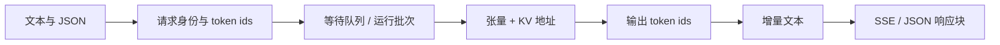
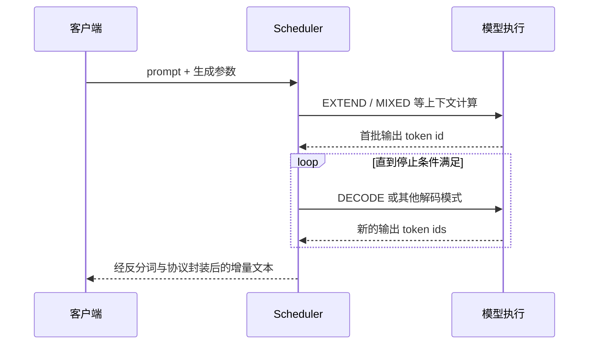
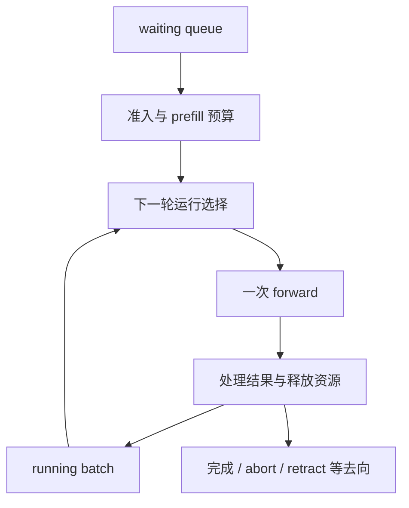
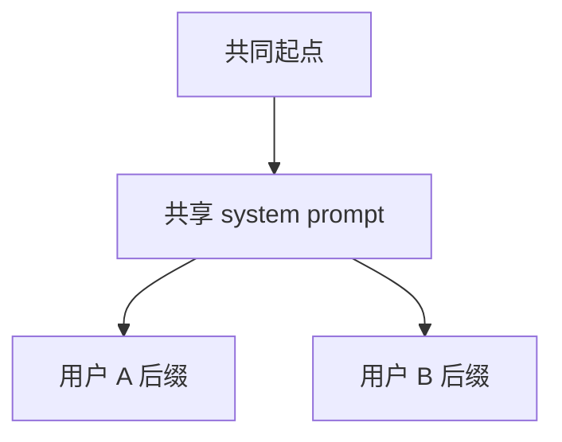

# SGLang 零基础先修

> 面向第一次接触 LLM serving 的读者。源码基线为 `70df09b`；类比用于建立直觉，源码对象负责划定边界。

## 你为什么要读

在聊天网页里输入一句话，看起来只是“模型回答问题”。服务端真正处理的却是一个持续变化的系统：请求从网络进入，被切成 token，排队进入批次，占用模型权重与 KV Cache，在一次次 forward 中生成 token ids，再被还原为可流式发送的文本。

读完本篇，你应当能够：

1. 区分 prompt、token、prefill、decode 与流式 chunk；
2. 用 TTFT、ITL/TPOT、吞吐解释不同的“快”；
3. 说清 KV Cache 为什么既提速又限制并发；
4. 理解 continuous batching 优化的是请求交错，而不是简单“凑一大批”；
5. 沿一次请求指出 HTTP、`TokenizerManager`、`Scheduler`、模型执行与 `DetokenizerManager` 的职责。

先不需要 PyTorch 或 CUDA 背景。你只需接受两件事：模型主要在加速器上计算；文字进入模型前必须先变成整数 token ids。

---

## 一条请求，其实有五次形态变化

把默认 HTTP 文本生成服务想成一家餐厅，可以帮助记住交接关系：

| 请求形态 | SGLang 中的责任 | 餐厅类比 |
|---|---|---|
| JSON / 文本 | HTTP/OpenAI API 校验外部协议 | 顾客提交订单 |
| token ids 与生成参数 | `TokenizerManager` 建立请求身份并送入 runtime | 前台录单、贴订单号 |
| 等待请求与运行批次 | `Scheduler` 决定何时执行、怎样组批 | 后厨排单与安排灶台 |
| 张量、KV 地址与输出 token ids | worker/runner 驱动模型和设备执行 | 厨师按订单做菜 |
| 增量文本与协议 chunk | detokenizer 解码，API 层封装响应 | 传菜并由前台交付 |



类比到这里就应停止：真实系统不会保证“一道菜对应一个 token”，也不会保证每个逻辑角色永远各占一个固定进程。后文会专门划清这两个边界。

---

## 1. Token：模型处理的不是“字”

Tokenizer 会把文本编码成整数序列。一个 token 可能是一个汉字、词的一部分、空格与标点的组合，也可能是特殊控制符；不能把 token 数直接等同于字数或词数。

例如，用户看到的是：

```text
请解释 KV Cache
```

模型看到的概念形态更接近：

```text
[token_id_0, token_id_1, ..., token_id_n]
```

这件事为什么重要？因为服务端的上下文长度、KV 容量、调度预算和计费通常围绕 token，而不是围绕字符。不同 tokenizer 对同一段文字也可能得到不同长度。

---

## 2. Prefill 与 Decode：读题和续写

一次自回归文本生成通常可以先拆成两个阶段。

### Prefill：把尚未计算的上下文读进去

模型处理 prompt 中尚未命中缓存的 token，为它们产生中间结果并写入 KV Cache。若前缀已有可复用 KV，prefill 计算量可以少于完整 prompt 长度；若启用 chunked prefill，长 prompt 还可能被分多轮处理。

### Decode：基于已有上下文继续生成

经典 decode 的一次 forward 为每条普通序列处理一个待解码位置，然后采样出后续 token。可是“整个系统每轮只产生一个 token”并不是普遍定律：speculative decoding、multi-step、dLLM 等路径会改变一次迭代包含的候选、校验或输出数量。

```python
## 来源：python/sglang/srt/model_executor/forward_batch_info.py L78-L102
class ForwardMode(IntEnum):
    # Extend a sequence. The KV cache of the beginning part of the sequence is already computed (e.g., system prompt).
    # It is also called "prefill" in common terminology.
    EXTEND = auto()
    # Decode one token.
    DECODE = auto()
    # Contains both EXTEND and DECODE when doing chunked prefill.
    MIXED = auto()
    # No sequence to forward. For data parallel attention, some workers will be IDLE if no sequence are allocated.
    IDLE = auto()

    # Used in speculative decoding: verify a batch in the target model.
    TARGET_VERIFY = auto()
    # Used in speculative decoding: extend a batch in the draft model.
    DRAFT_EXTEND_V2 = auto()

    # Used in disaggregated decode worker
    # Represent a batch of requests having their KV cache ready to start decoding
    PREBUILT = auto()

    # Split Prefill for PD multiplexing
    SPLIT_PREFILL = auto()

    # Used in dLLM
    DLLM_EXTEND = auto()
```

这张证据卡只证明：当前源码的 forward 语义不止 `EXTEND` 与 `DECODE` 两种。新手可以先用 prefill/decode 建主线，读源码时则必须检查实际 `ForwardMode`。



停止条件可能来自 EOS、长度上限、stop string、abort 或结构化生成约束，不能只记“生成到句号”。

---

## 3. 三种“快”：TTFT、ITL/TPOT 与吞吐

| 指标 | 它测量什么 | 用户感受 | 常见影响因素 |
|---|---|---|---|
| TTFT | 从请求开始到首个输出 token 可用的时间 | 多久开始出现回答 | 排队、未缓存 prompt、prefill、首轮采样与回程 |
| ITL / TPOT | 相邻输出 token 的间隔或其统计近似 | 打字机是否流畅 | decode 批次、并发、kernel、同步与网络回程 |
| Throughput | 单位时间处理的请求数或 token 数 | 整个服务能接多少活 | batching、模型/硬件、序列长度分布与资源利用率 |

它们可能互相牵制。例如等待更多请求组批可能提高吞吐，却增加排队时间；让长 prefill 独占计算也可能伤害正在 decode 的请求。任何延迟阈值都必须同时给出模型、硬件、并发、输入/输出长度和统计口径。

```python
## 来源：python/sglang/srt/observability/metrics_collector.py L1614-L1633
        self.histogram_time_to_first_token = Histogram(
            name="sglang:time_to_first_token_seconds",
            documentation="Histogram of time to first token in seconds.",
            labelnames=labels.keys(),
            buckets=bucket_time_to_first_token,
        )

        self.histogram_inter_token_latency = Histogram(
            name="sglang:inter_token_latency_seconds",
            documentation="Histogram of inter-token latency in seconds.",
            labelnames=labels.keys(),
            buckets=bucket_inter_token_latency,
        )

        self.histogram_e2e_request_latency = Histogram(
            name="sglang:e2e_request_latency_seconds",
            documentation="Histogram of End-to-end request latency in seconds",
            labelnames=labels.keys(),
            buckets=bucket_e2e_request_latency,
        )
```

这张证据卡只证明：SGLang 分别观测 TTFT、inter-token latency 与端到端延迟。它不提供跨模型通用的“合格阈值”。

---

## 4. KV Cache：省掉重算，但占用稀缺地址

Transformer 在生成后续 token 时需要访问已有上下文的 Key/Value。KV Cache 保存已经计算出的 K/V，使后续步骤不必从头重算整段历史。

可以把它类比成后厨的工作台：

| 工作台直觉 | 源码世界 |
|---|---|
| 已备好的材料 | 已计算的 K/V 张量 |
| 格位编号 | token/KV pool 中的物理位置 |
| 订单记录材料放在哪 | request-to-token 映射与 cache indices |
| 工作台满了 | 没有足够可分配 KV slot |

但“一个请求一块连续显存”通常不是正确模型。调度层操作逻辑 token 与映射，allocator 分配物理位置，attention backend 再消费相应地址和布局。

```python
## 来源：python/sglang/srt/mem_cache/allocator/token.py L51-L64
    def available_size(self):
        # To avoid minor "len(free_pages) * 1" overhead
        return len(self.free_pages) + len(self.release_pages)

    def alloc(self, need_size: int):
        if self.need_sort and need_size > len(self.free_pages):
            self.merge_and_sort_free()

        if need_size > len(self.free_pages):
            return None

        select_index = self.free_pages[:need_size]
        self.free_pages = self.free_pages[need_size:]
        return select_index
```

这张证据卡只证明：该 token allocator 在可用位置不足时返回 `None`。后续究竟 evict cache、retract 请求、等待还是失败，要看调用者与当前运行模式，不能由这一个返回值直接推出。

因此 KV Cache 同时带来两种系统效果：

- **时间收益**：复用历史 K/V，减少重复计算；
- **容量压力**：上下文越长、并发越高，通常需要持有的 KV 越多。

继续阅读：[[SGLang-KV-Cache]]。

---

## 5. Continuous Batching：每轮重新决定谁上车

静态 batching 像固定班车：一组乘客一起出发，往往要等最慢的人结束。Continuous batching 更像每站重新调度的公交系统：已有请求继续推进，完成的请求离开，等待请求在资源允许时进入。

关键不是“永远把 prefill 和 decode 混在同一个 forward”，而是 **scheduler 可以在迭代边界持续重组工作**。某轮可能是 extend，某轮可能是 decode，也可能因 chunked prefill、DP cooperation 或特性分支形成 mixed/idle 等模式。



读调度源码时要分三层：

1. **排序**：waiting queue 里谁更靠前；
2. **准入**：当前 KV、token budget 与特性条件允许谁进入；
3. **提交**：选出的 batch 以什么 `ForwardMode` 执行并如何更新状态。

继续阅读：[[SGLang-Scheduler]]、[[SGLang-SchedulePolicy]]。

---

## 6. 默认 HTTP 拓扑：三个核心角色，不是三进程定律

默认 HTTP 服务中，可以先记住 `TokenizerManager → Scheduler → DetokenizerManager` 三个核心角色：

```python
## 来源：python/sglang/srt/entrypoints/http_server.py L2482-L2492
    The SRT server consists of an HTTP server and an SRT engine.

    - HTTP server: A FastAPI server that routes requests to the engine.
    - The engine consists of three components:
        1. TokenizerManager: Tokenizes the requests and sends them to the scheduler.
        2. Scheduler (subprocess): Receives requests from the Tokenizer Manager, schedules batches, forwards them, and sends the output tokens to the Detokenizer Manager.
        3. DetokenizerManager (subprocess): Detokenizes the output tokens and sends the result back to the Tokenizer Manager.

    Note:
    1. The HTTP server, Engine, and TokenizerManager all run in the main process.
    2. Inter-process communication is done through IPC (each process uses a different port) via the ZMQ library.
```

这张证据卡只证明默认 HTTP 启动文档化的组件与 IPC 关系。TP/DP、多 tokenizer、Ray、gRPC、encoder-only、PD disaggregation 等配置会扩展或改变实际拓扑，所以排障时应分别问：

- 逻辑职责属于谁？
- 当前配置中对象在哪个进程或 rank？
- 消息走哪条 IPC、网络或 collective 通道？

继续阅读：[[SGLang-HTTP请求全链路]]、[[SGLang-架构分层]]。

---

## 7. Streaming：响应块不等于单个 token

流式 API 允许客户端在请求尚未全部结束时持续收到增量结果。典型 HTTP 路径会以 SSE 形式发送 `data: ...\n\n`，但必须分清三层粒度：

1. 模型或采样阶段产生的 token ids；
2. detokenizer/API 聚合出的增量文本；
3. 网络层实际发送与客户端读取的 chunk。

三者不是一一对应。一次回程可能包含多个新 token，UTF-8 或 tokenizer 边界也可能使文本暂时不可见，传输层还可能合并或拆分字节。正确描述是“增量返回”，不是“每生成一个 token 必定发送一条 SSE”。

---

## 8. RadixAttention：复用的是匹配前缀的 KV

客服 system prompt、RAG 模板或多轮会话经常共享 token 前缀。SGLang 可以用 radix tree 组织可复用前缀，把匹配结果关联到已有 KV 位置，使新请求只计算未命中的后缀。



类比可以是“共享已经备好的公共底料”，但它有明确失效边界：token 序列必须满足匹配规则；节点是否仍在设备、主机或存储层，是否被锁定或可逐出，也会影响实际命中与可用性。不能只凭字符串“看起来一样”断言必然命中，更不能脱离硬件与 workload 承诺固定倍数收益。

```python
## 来源：python/sglang/srt/mem_cache/radix_cache.py L217-L240
class TreeNode:

    counter = 0

    def __init__(self, id: Optional[int] = None, priority: int = 0):
        self.children = defaultdict(TreeNode)
        self.parent: TreeNode = None
        self.key: RadixKey = None
        self.value: Optional[torch.Tensor] = None
        self.lock_ref = 0
        self.last_access_time = time.monotonic()
        self.creation_time = time.monotonic()

        self.hit_count = 0
        # indicating the node is locked to protect from eviction
        # incremented when the node is referenced by a storage operation
        self.host_ref_counter = 0
        # store the host indices of KV cache
        self.host_value: Optional[torch.Tensor] = None
        self.write_through_pending_id: Optional[int] = None
        # store hash values of each pages
        self.hash_value: Optional[List[str]] = None
        # priority for priority-aware eviction
        self.priority = priority
```

这张证据卡只证明：radix 节点同时携带树关系、设备侧 value、锁引用、host value 与淘汰优先级等状态；前缀缓存不是一张只存字符串的字典。

继续阅读：[[SGLang-RadixAttention]]。

---

## 静态验证：确认直觉没有越过源码边界

在知识库根目录执行：

```powershell
# 1. ForwardMode 不只 EXTEND / DECODE
rg -n "EXTEND =|DECODE =|MIXED =|TARGET_VERIFY =|PREBUILT =" `
  sglang/python/sglang/srt/model_executor/forward_batch_info.py

# 2. 三类延迟指标分别存在
rg -n "time_to_first_token_seconds|inter_token_latency_seconds|e2e_request_latency_seconds" `
  sglang/python/sglang/srt/observability/metrics_collector.py

# 3. KV allocator 的不足语义是返回 None
rg -n "need_size > len\(self.free_pages\)|return None" `
  sglang/python/sglang/srt/mem_cache/allocator/token.py

# 4. 默认 HTTP 拓扑的职责与 IPC 说明
rg -n "TokenizerManager:|Scheduler \(subprocess\)|DetokenizerManager \(subprocess\)|ZMQ library" `
  sglang/python/sglang/srt/entrypoints/http_server.py
```

预期：四组命令都能命中；第一组至少显示五种模式，第二组显示三个不同 histogram，第三组只验证 allocator 返回值，第四组只验证默认 HTTP 文档化拓扑。它们都不需要 GPU 或模型权重。

若已启动本地服务，可以额外用 `stream=true` 请求并记录每个 SSE `data:` 块中的 token 数、文本增量与到达时间；预期是观察到“增量返回”，而不是预设“一块严格等于一 token”。未启动服务时跳过这项动态验证，不影响上述静态结论。

---

## 新手自检

如果你能用自己的话回答下面六问，就可以进入源码主线：

1. token 为什么不等于汉字或单词？
2. 前缀命中后，prefill 为什么可能只处理 prompt 的后缀？
3. TTFT 变好为什么不保证吞吐也变好？
4. KV Cache 为什么同时是加速手段和容量瓶颈？
5. continuous batching 为什么不等于“每轮必定混跑 prefill 与 decode”？
6. 为什么 `TokenizerManager`、scheduler、detokenizer 是三个职责，却不能推出所有部署固定只有三个进程？

下一步读 [[SGLang-项目总览]] 建立 monorepo 边界，再沿 [[SGLang-HTTP请求全链路]] 跟踪一次请求。之后用 [[SGLang-学习路径]] 选择调度、模型执行、内存或生产特性路线；术语卡住时查 [[SGLang-术语表]]。
