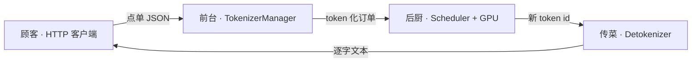
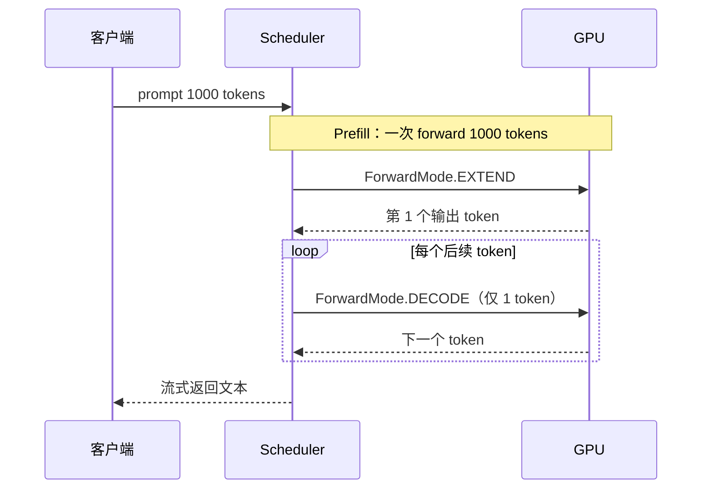
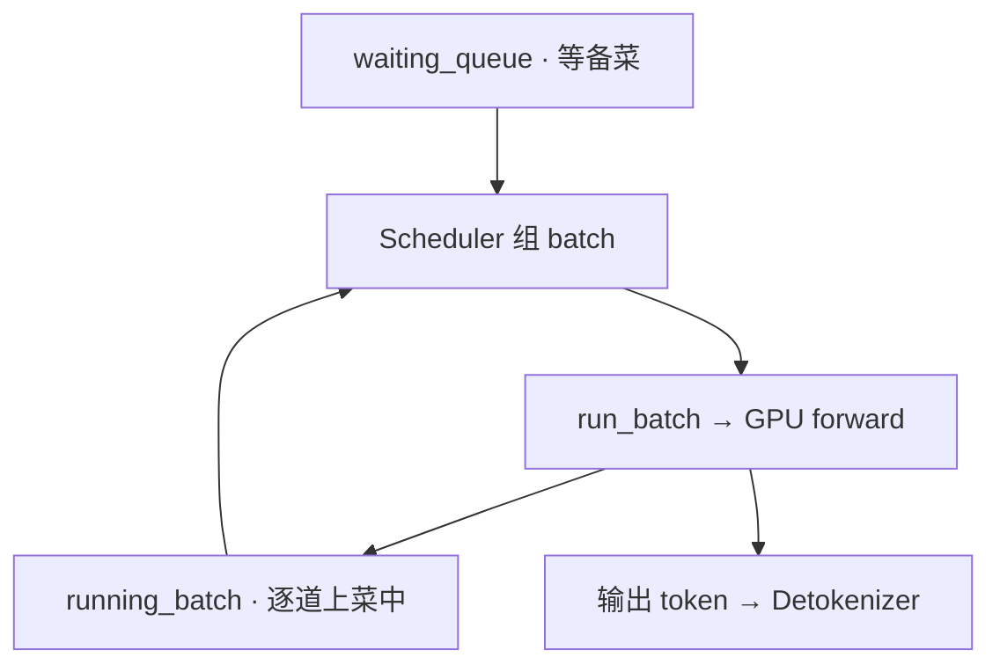
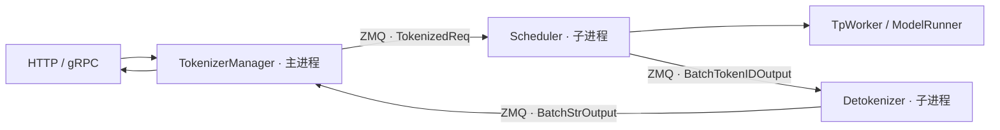
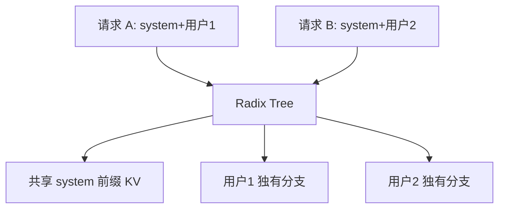

# SGLang 零基础先修

> 面向**从未接触过 LLM serving** 的读者 
> 读完本篇，再进入 [[SGLang-项目总览]] 与 [[SGLang-学习路径]] 
> 内嵌代码对应 sglang Git commit `70df09b`

---

## 这篇文档解决什么问题

你可能用过 ChatGPT 网页版，或本地跑过 `ollama run`，但未必想过：**服务器如何把一段 prompt 变成逐字流出的回答**。SGLang 正是做这件事的系统——它把大模型权重加载到 GPU，接收 HTTP/gRPC 请求，高效调度成千上万个并发对话，并把 token 流式推回客户端。

本篇用**餐厅类比**建立直觉，再用极简 mermaid 和少量源码锚点，帮你读懂后续文档里反复出现的术语。全文采用场景说明、源码锚点与要点说明组织。不必先学 PyTorch 或 CUDA；只需知道「模型在 GPU 上算、请求走网络进来、回答一个字一个字出来」。

---

## 1. 大模型推理服务是什么

### 读法
把 SGLang 想象成一家**智能餐厅**：

| 餐厅 | SGLang |
|------|--------|
| 顾客点单 | 客户端发 HTTP POST（如 `/v1/chat/completions`） |
| 前台接单、记备注 | TokenizerManager 把文字变成 token id |
| 后厨做菜 | GPU 上的 ModelRunner 做矩阵运算 |
| 逐道上菜 | 流式响应：每生成一个 token 就推一条 SSE |
| 厨房设备 | GPU 显存里的模型权重 + KV Cache |

与「离线跑脚本、一次性打印整段答案」不同，**serving** 强调：多用户同时在线、低延迟首字、高吞吐、资源不浪费。SGLang 的定位就是这类**生产级推理服务框架**。



### 源码锚点
```python
## 来源：python/sglang/srt/entrypoints/http_server.py L785-L801
@app.api_route(
    "/generate",
    methods=["POST", "PUT"],
    response_class=SGLangORJSONResponse,
)
async def generate_request(obj: GenerateReqInput, request: Request):
    """Handle a generate request."""
    if envs.SGLANG_ENABLE_REQUEST_HEADER_OVERRIDES.get():
        apply_header_overrides(obj, request.headers)
    if obj.stream:

        async def stream_results() -> AsyncIterator[bytes]:
            try:
                async for out in _global_state.tokenizer_manager.generate_request(
                    obj, request
                ):
                    yield b"data: " + dumps_json(out) + b"\n\n"
```

### 要点
- `stream=True` 时第一个 token 算完即推送；生产对话几乎都用流式。
- OpenAI 兼容层 `/v1/chat/completions` 内部同样汇入 `tokenizer_manager.generate_request`。

---

## 2. Prefill 与 Decode：先备菜 vs 逐道上菜

### 读法
大模型生成回答分**两个阶段**，餐厅类比非常贴切：

**Prefill（备菜阶段）** 
顾客下单后，厨师要把**整份 prompt**（系统提示 + 历史对话 + 用户新问题）全部「读进脑子」。对应 GPU 一次性处理 prompt 里所有 token，并为每个 token 写入 KV Cache。prompt 越长，备菜越久。

**Decode（上菜阶段）** 
备菜完成后，厨师**每次只炒一个新 token**（一个词或字的一部分），端给顾客，再根据刚炒出的味道决定下一道。循环直到出现结束符或达到长度上限。Decode 步数 = 生成答案的长度。



SGLang 用 `ForwardMode` 区分这两种 forward：`EXTEND` ≈ prefill，`DECODE` ≈ 逐 token 生成。

### 源码锚点
```python
## 来源：python/sglang/srt/model_executor/forward_batch_info.py L77-L87
class ForwardMode(IntEnum):
    # Extend a sequence. The KV cache of the beginning part of the sequence is already computed (e.g., system prompt).
    # It is also called "prefill" in common terminology.
    EXTEND = auto()
    # Decode one token.
    DECODE = auto()
    # Contains both EXTEND and DECODE when doing chunked prefill.
    MIXED = auto()
    # No sequence to forward. For data parallel attention, some workers will be IDLE if no sequence are allocated.
    IDLE = auto()
```

### 要点
- 读源码时 `is_extend()` = prefill，`is_decode()` = 逐 token。
- 专题：[[SGLang-通用模型-数据流]]、[[SGLang-Scheduler]]

---

## 3. TTFT 与 TPOT：顾客等多久

### 读法
线上服务用两个核心延迟指标衡量「快不快」：

| 指标 | 全称 | 餐厅类比 | 典型优化手段 |
|------|------|----------|--------------|
| **TTFT** | Time To First Token | 从点单到**第一道菜**上桌 | 前缀缓存、减少 prefill 排队、PD 分离 |
| **TPOT** | Time Per Output Token | **每两道菜之间**的间隔 | Continuous batching、CUDA Graph、量化 |

**TTFT** 决定用户感知的「卡不卡」——ChatGPT 打字机效果出现前那几秒，几乎全是 TTFT（prefill + 调度排队 + 网络）。

**TPOT** 决定回答**喷涌速度**——首字出现后，每个后续 token 的平均间隔。

### 源码锚点
```python
## 来源：python/sglang/srt/observability/metrics_collector.py L1635-L1640
    def observe_one_finished_request(
        self,
        labels: Dict[str, str],
        prompt_tokens: int,
        generation_tokens: int,
        cached_tokens: int,
```

### 要点
- 请求 finish 时一次性上报 TTFT、ITL、e2e 等 histogram；流式过程中也会逐 token 记录 ITL。
- SLA 常写「P99 TTFT < 500ms」「P99 TPOT < 50ms」——两者可能冲突。排障见 [[SGLang-生产排障]] §2、§3。

---

## 4. KV Cache：服务员的记事本

### 读法
Transformer 生成每个新 token 时，需要「回头看」之前所有 token 的 Key/Value 向量。如果每步都从头重算，复杂度爆炸。

**KV Cache** 就是 GPU 显存里的一块**记事本**：prefill 阶段把 prompt 各 token 的 K/V 存进去；decode 每步只算新 token 的 K/V，并追加到记事本，Attention 层读整本笔记做加权求和。

| 类比 | 技术 |
|------|------|
| 记事本页码 | KV pool 里的 index |
| 新顾客要新笔记 | 新请求分配独立 cache slot |
| 笔记写满 | 显存 OOM，需 evict 或 retract 请求 |

SGLang 的 `TokenToKVPoolAllocator` 负责「发页码、回收页码」——调度层向它申请 slot，Attention 层按 index 读写物理张量。

### 源码锚点
```python
## 来源：python/sglang/srt/mem_cache/allocator/token.py L52-L61
        # To avoid minor "len(free_pages) * 1" overhead
        return len(self.free_pages) + len(self.release_pages)

    def alloc(self, need_size: int):
        if self.need_sort and need_size > len(self.free_pages):
            self.merge_and_sort_free()

        if need_size > len(self.free_pages):
            return None

```

### 要点
- `alloc` 返回 `None` 表示显存不够——Scheduler 会触发 retract（把部分 decode 请求退回队列）或 evict 前缀缓存。
- KV Cache 大小与 `max_model_len`、并发请求数、模型层数直接相关；是生产容量规划的核心变量。
- 专题深读 [[SGLang-KV-Cache]]

---

## 5. Continuous Batching：拼桌提高翻台率

### 读法
传统静态 batching：等凑满 8 桌才开席，有人吃完整桌才撤——GPU 经常空转。

**Continuous Batching（连续批处理）**：后厨在一个「大桌」上动态拼单——

- 新顾客（prefill 请求）随时加入；
- 某桌吃完一道（decode 完成一步）不撤桌，继续等下一道；
- 某顾客结账离开（生成结束）立刻腾位给排队的人。

SGLang 的 Scheduler 每轮 `event_loop` 调用 `get_next_batch_to_run()`，把 waiting 队列里的 prefill 与 running 里的 decode **混成一批**送 GPU，最大化利用率。



### 源码锚点
```python
## 来源：python/sglang/srt/managers/scheduler.py L1533-L1539
            # Get the next batch to run
            batch = self.get_next_batch_to_run()
            self.cur_batch = batch

            # Launch the current batch
            if batch:
                result = self.run_batch(batch)
```

### 要点
- `running_batch` 存已完成 prefill、正在 decode 的请求；`waiting_queue` 存等新 prefill 的请求。二者动态合并。
- Prefill 通常优先于 decode（先让新顾客备上菜），但具体策略由 `SchedulePolicy` / `PrefillAdder` 决定。
- 专题深读 [[SGLang-Scheduler]]、[[SGLang-SchedulePolicy]]

---

## 6. ZMQ 三进程：前台、调度、后厨分工

### 读法
SGLang Runtime 把职责拆成**三个协作进程**，用 **ZMQ**（高性能消息队列）传结构化消息：

| 进程 | 角色 | 餐厅 | 主要工作 |
|------|------|------|----------|
| **TokenizerManager** | 主进程 | 前台 + 收银 | HTTP 接入、tokenize、组装流式响应 |
| **Scheduler** | 子进程 | 调度 + 后厨入口 | 组 batch、驱动 GPU forward |
| **DetokenizerManager** | 子进程 | 传菜员 | token id → 人类可读 UTF-8 字符串 |

为什么拆进程？Python GIL 下，GPU 调度与 HTTP 异步 IO 分进程才能**真正并行**；Detokenizer 单独跑可避免 UTF-8 边界处理阻塞 Scheduler。



启动时 `Engine._launch_subprocesses` 一次性拉起这套拓扑。

### 源码锚点
```python
## 来源：python/sglang/srt/entrypoints/http_server.py L2494-L2506
    # Launch subprocesses
    (
        tokenizer_manager,
        template_manager,
        port_args,
        scheduler_init_result,
        subprocess_watchdog,
    ) = Engine._launch_subprocesses(
        server_args=server_args,
        init_tokenizer_manager_func=init_tokenizer_manager_func,
        run_scheduler_process_func=run_scheduler_process_func,
        run_detokenizer_process_func=run_detokenizer_process_func,
    )
```

### 要点
- 消息类型定义在 `io_struct.py`：`TokenizedGenerateReqInput` 去程，`BatchTokenIDOutput` / `BatchStrOutput` 回程。
- 理解「Detokenizer 是 Scheduler 回程第一站」后，全链路的各个边界就不会混淆。见 [[SGLang-HTTP请求全链路]]。
- 专题深读 [[SGLang-HTTP-Server]]、[[SGLang-TokenizerManager]]

---

## 7. RadixAttention 与前缀缓存：共享今日特价菜单

### 读法
很多应用（客服 bot、代码助手、RAG）的 prompt **前缀高度重复**——同一份 2000 token 的 system prompt，每个用户只改后面 100 token。

若每个请求都从头 prefill 整段 prompt，GPU 做大量重复劳动。**前缀缓存（Prefix Cache）** 把已算过的 prefix KV **存起来**，新请求只要前缀匹配，就跳过相应 prefill，直接从未命中处继续——TTFT 可降一个数量级。

SGLang 的实现叫 **RadixAttention**：用**基数树（radix tree）** 按 token 序列组织缓存节点，共享相同前缀的不同请求指向树中同一节点——像多家分店**共用同一份「今日特价菜单」**，不必每家重新印。



### 源码锚点
```python
## 来源：python/sglang/srt/mem_cache/radix_cache.py L217-L226
class TreeNode:

    counter = 0

    def __init__(self, id: Optional[int] = None, priority: int = 0):
        self.children = defaultdict(TreeNode)
        self.parent: TreeNode = None
        self.key: RadixKey = None
        self.value: Optional[torch.Tensor] = None
        self.lock_ref = 0
```

### 要点
- `match_prefix` 在 prefill 前沿树匹配，返回已缓存的 pool indices；未命中部分才送 GPU extend。
- `lock_ref` 保护活跃请求路径上的节点不被 evict——相当于「这桌还在吃，菜单页不能撕」。
- 专题深读 [[SGLang-RadixAttention]]、[[SGLang-用户场景]] 故事 A

---

## 8. 读本文档库的建议顺序

### 读法
本文档库 `sglang_reading/` **自包含**——内嵌源码片段，不必打开 upstream `sglang/` 仓库。建议按「先直觉、后链路、再专题」推进：

```
零基础先修（本篇）
 ↓
阅读方法 · 阅读策略与专题地图
 ↓
项目总览 · monorepo 与启动链
 ↓
全链路请求追踪 · 串起 HTTP 各职责边界
 ↓
SGLang 学习路径 · 入口、调度与执行主线
 ↓
按需：07 用户故事 / 03 关键概念 / 对应专题专题目录
```

| 阶段 | 文档 | 用时 |
|------|------|------|
| 首轮主线 | 本篇 → [[SGLang-阅读方法]] → [[SGLang-项目总览]] → [[SGLang-HTTP请求全链路|全链路请求追踪]] → [[SGLang-学习路径]] 的入口、调度与模型执行 | 约 4 小时 |
| 5 | [[SGLang-术语表|术语表]] / [[SGLang-源码地图]]。

---

## 下一步

→ 无 LLM serving 经验：**必读** [[SGLang-项目总览]] 
→ 想立刻看请求怎么跑：[[SGLang-HTTP请求全链路]] 
→ 语义导读：[[SGLang-学习路径]] 的“零基础先修”已指向本篇
