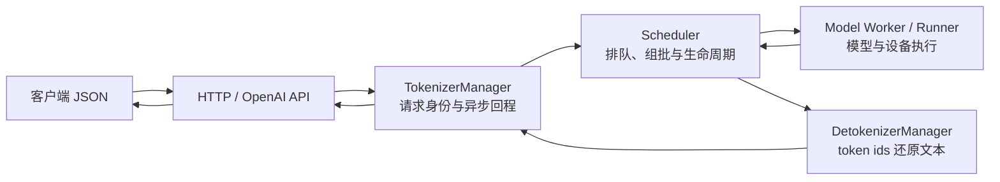

# SGLang 项目总览

> 对应源码基线 `70df09b`。这不是目录清单，而是一张“先辨系统边界、再追对象生命线”的园区地图。

## 你为什么要读

SGLang 是一个 monorepo：语言模型 serving runtime、结构化生成前端、CUDA/C++ 算子、Rust 网关和扩散/视频生成运行时住在同一座“园区”里，却不共享同一条请求执行链。

读完本篇，你应当能回答四个问题：

1. 日常所说的“启动 SGLang”主要启动哪套 runtime？
2. 一条文本生成请求依次由谁拥有、调度、执行和还原成文本？
3. `sgl-kernel`、`sgl-model-gateway` 与 `multimodal_gen` 分别处在什么边界之外？
4. 看到 PD、Speculative、LoRA、DP 或 gRPC 时，为什么不能把默认 HTTP 拓扑原样套过去？

如果你还不熟悉 prefill、decode、TTFT 和 KV Cache，先读 [[SGLang-零基础先修]]；有 serving 经验的读者可以直接从下面的双层模型开始。

---

## 先记住双层模型

理解 SGLang，先把“仓库产品边界”和“SRT 请求生命线”分开。

### 第一层：monorepo 里有多套产品表面

| 区域 | 主要入口或目录 | 它解决的问题 | 不应误解为 |
|---|---|---|---|
| SRT | `python/sglang/srt/` | 语言模型、视觉语言模型的在线推理服务 | 整个仓库的唯一能力 |
| Frontend Language | `python/sglang/lang/` | 组织结构化生成程序与前端语义 | GPU 调度器本身 |
| Multimodal Generation | `python/sglang/multimodal_gen/` | 扩散、图像与视频生成的独立运行时 | SRT 文本生成链上的一个普通模型类 |
| SGL Kernel | `sgl-kernel/` | 被上层运行时调用的高性能 CUDA/C++ 算子 | 可独立接收 HTTP 请求的服务 |
| Model Gateway | `sgl-model-gateway/` | 多实例之前的路由、负载均衡与集群入口 | 单实例内部的 scheduler |

一个实用判断是：**`sglang serve` 是统一命令表面，但不意味着所有模型进入同一套后端。** CLI 会先识别 LLM 与 diffusion，再分派到 SRT 或多模态生成运行时。

```python
## 来源：python/sglang/cli/serve.py L107-L128
        if is_diffusion_model:
            # Logic for Diffusion Models
            from sglang.multimodal_gen.runtime.entrypoints.cli.serve import (
                add_multimodal_gen_serve_args,
                execute_serve_cmd,
            )

            parser = argparse.ArgumentParser(
                description="SGLang Diffusion Model Serving"
            )
            add_multimodal_gen_serve_args(parser)
            parsed_args, remaining_argv = parser.parse_known_args(dispatch_argv)

            execute_serve_cmd(parsed_args, remaining_argv)
        else:
            # Logic for Standard Language Models
            from sglang.launch_server import run_server
            from sglang.srt.server_args import prepare_server_args

            server_args = prepare_server_args(dispatch_argv)

            run_server(server_args)
```

这张证据卡只证明：`serve` 在 diffusion 与标准语言模型之间存在显式分派。它没有证明两套 runtime 的内部结构相同；恰恰相反，后续阅读应把它们分开。

### 第二层：SRT 内部围绕一次请求交接所有权

对默认 HTTP 文本生成路径，可以先用这一条生命线建立心理模型：



这里最重要的不是背进程数，而是认清五本账：

- **协议账**：HTTP/OpenAI 层把外部 JSON 变成内部请求对象。
- **身份账**：`TokenizerManager` 维护请求、流式结果与取消等异步关系。
- **生命周期账**：`Scheduler` 决定请求何时等待、进入批次、执行和结束。
- **执行账**：worker/runner 持有模型执行所需的设备侧状态并完成一步 forward。
- **回程账**：detokenizer 把 token ids 增量还原为文本，再沿原请求身份返回。

默认 HTTP 启动中，HTTP server、Engine 与 `TokenizerManager` 在主进程，scheduler 和 detokenizer 是子进程，进程间主要通过 ZMQ IPC 交接消息。但这只是**默认构型的起点**：tensor parallel、data parallel、多 tokenizer、Ray、gRPC、encoder-only 和 disaggregation 都可能增加角色、改变所有权或换掉入口。不要把“三个角色”误背成“任何部署永远只有三个 OS 进程”。

进一步追这条生命线，读 [[SGLang-HTTP请求全链路]]；要区分对象所有权与进程边界，读 [[SGLang-架构分层]]。

---

## 从命令到运行时：分派发生两次

第一次分派发生在 CLI：`sglang` 可执行文件进入 `sglang.cli.main:main`，再由 `serve` 子命令进入上面的模型类型判断。

```toml
## 来源：python/pyproject.toml L178-L180
[project.scripts]
sglang = "sglang.cli.main:main"
killall_sglang = "sglang.cli.killall:main"
```

这张证据卡只证明：安装 Python 包后，`sglang` 命令的 Python 入口是 `sglang.cli.main:main`。

第二次分派发生在标准语言模型路径：`ServerArgs` 决定进入 encoder-only、legacy gRPC、Ray HTTP 或默认 HTTP。

```python
## 来源：python/sglang/launch_server.py L15-L51
def run_server(server_args):
    """Run the server based on server_args.grpc_mode and server_args.encoder_only."""
    if server_args.encoder_only:
        # For encoder disaggregation
        if server_args.grpc_mode:
            from sglang.srt.disaggregation.encode_grpc_server import (
                serve_grpc_encoder,
            )

            asyncio.run(serve_grpc_encoder(server_args))
        else:
            from sglang.srt.disaggregation.encode_server import launch_server

            launch_server(server_args)
    elif server_args.grpc_mode:
        # TODO: Once the native Rust gRPC server starts alongside HTTP in the
        # default path below (controlled by SGLANG_ENABLE_GRPC / SGLANG_GRPC_PORT),
        # remove this legacy SMG path and the grpc_mode flag.
        from sglang.srt.entrypoints.grpc_server import serve_grpc

        asyncio.run(serve_grpc(server_args))
    elif server_args.use_ray:
        # Ray mode: HTTP mode with Ray backend.
        try:
            from sglang.srt.ray.http_server import launch_server
        except ImportError:
            raise ImportError(
                "Ray is required for --use-ray mode. "
                "Install it with: pip install 'sglang[ray]'"
            )

        launch_server(server_args)
    else:
        # Default mode: HTTP mode.
        from sglang.srt.entrypoints.http_server import launch_server

        launch_server(server_args)
```

这张证据卡只证明：标准语言模型也不是单一启动分支。因而“HTTP → tokenizer → scheduler → detokenizer”应被理解为默认主线，而不是覆盖所有 flags 的普遍定律。

---

## 五个目录，五种阅读问题

### `python/sglang/srt/`：一次请求怎样活着走完全程

这里是日常部署语言模型服务时的核心。不要按目录字母顺序读；沿对象生命线进入：

1. `entrypoints/`：外部协议怎样进入 runtime；
2. `managers/`：请求身份、排队、组批、回程由谁负责；
3. `model_executor/`：批次怎样变成设备侧输入并执行；
4. `mem_cache/`：KV 的逻辑前缀与物理页怎样关联；
5. `layers/`、`speculative/`、`lora/`、`disaggregation/`：哪些特性改写默认路径。

对应主线：[[SGLang-请求调度]]、[[SGLang-模型执行]]、[[SGLang-KV-Cache]]。

### `sgl-kernel/`：某一步为什么能更快

这里回答算子实现、数据布局、kernel 选择和硬件约束问题。它通常位于请求主线的叶子位置：上层先完成调度和张量准备，才调用具体 kernel。阅读时必须同时问清 dtype、shape、GPU 架构和 fallback；脱离这些条件谈“更快”没有意义。

对应专题：[[SGLang-sgl-kernel]]。

### `sgl-model-gateway/`：请求为什么被送到这个实例

Gateway 处在一个或多个 SGLang 实例之前，关心路由、负载与集群级策略；scheduler 位于实例内部，关心请求与批次生命周期。两者都“做决策”，但决策对象和资源视野不同。

对应专题：[[SGLang-model-gateway]]。

### `python/sglang/lang/`：生成程序怎样表达

这里关注结构化生成的前端抽象。它可以调用后端 runtime，却不等于 scheduler、model runner 或 CUDA kernel。阅读时先分清“用户如何描述生成任务”和“服务端如何执行该任务”。

对应专题：[[SGLang-前端语言]]。

### `python/sglang/multimodal_gen/`：扩散与视频生成怎样独立运行

它有自己的 CLI 分派和 runtime 入口。虽然与 SRT 同仓、共享部分工程基础设施，但不能把文本生成的 token/KV 生命周期直接套到扩散 step 或视频生成流程上。

对应专题：[[SGLang-多模态生成]]。

---

## 核心能力不是一张同时开启的功能表

| 能力 | 它改写的核心问题 | 源码入口 | 阅读专题 |
|---|---|---|---|
| RadixAttention / 前缀复用 | 新请求能复用多少已有前缀 KV | `srt/mem_cache/radix_cache.py` | [[SGLang-RadixAttention]] · [[SGLang-KV-Cache]] |
| Continuous Batching | 等待队列中的请求何时进入下一批 | `srt/managers/scheduler.py` | [[SGLang-Scheduler]] · [[SGLang-SchedulePolicy]] |
| PD Disaggregation | prefill 与 decode 的计算、KV 和传输职责如何拆分 | `srt/disaggregation/` | [[SGLang-PD分离]] |
| Speculative Decoding | draft 与 verify 如何改变一次解码迭代 | `srt/speculative/` | [[SGLang-Speculative]] |
| Multi-LoRA | 同一基础模型下 adapter 身份与权重如何进入批次 | `srt/lora/lora_manager.py` | [[SGLang-LoRA]] |
| OpenAI-compatible API | 外部协议怎样映射到内部生成请求 | `srt/entrypoints/openai/` | [[SGLang-OpenAI-API]] |

表中的能力是**条件分支或横切机制**，不是每个请求都会依次经过的六个阶段。例如未启用 speculative decoding 的请求不会经过 draft/verify；未部署 gateway 时，客户端可以直接访问单个 SRT 服务；PD 也不等于“打开 RDMA 后自动成立”。

---

## 三个最容易混淆的边界

### 1. API 兼容不等于执行实现相同

OpenAI-compatible endpoint 约束的是请求与响应表面。进入 runtime 后，模型类型、调度策略、attention backend、量化和并行配置仍会改变执行路径。

### 2. 逻辑角色不等于固定进程数

`TokenizerManager`、scheduler、detokenizer 是理解默认数据流的三个关键角色；TP/DP 和其他模式会扩展实际进程拓扑。源码阅读应分别记录“谁负责”与“在哪个进程”。

### 3. 能力存在不等于当前请求启用

看到仓库里有 PD、LoRA、Speculative 或多模态代码，只能证明项目支持相关路径，不能证明一次普通请求实际经过它。判断运行路径必须回到 `ServerArgs`、请求字段、初始化分支和运行日志。

---

## 静态验证：亲手确认这张地图

在仓库根目录执行：

```powershell
# 1. 确认源码基线
git -C sglang rev-parse --short HEAD

# 2. 确认统一 CLI 的两个主要模型分支
rg -n "is_diffusion_model|execute_serve_cmd|run_server" sglang/python/sglang/cli/serve.py

# 3. 确认标准语言模型仍会按运行模式继续分派
rg -n "encoder_only|grpc_mode|use_ray|entrypoints.http_server" sglang/python/sglang/launch_server.py

# 4. 确认五个产品/实现区域确实存在
@(
  'sglang/python/sglang/srt',
  'sglang/python/sglang/lang',
  'sglang/python/sglang/multimodal_gen',
  'sglang/sgl-kernel',
  'sglang/sgl-model-gateway'
) | ForEach-Object { "$(Test-Path $_)`t$_" }
```

预期结果：

- 第 1 条输出以 `70df09b` 开头；若不同，说明本篇的行号与行为判断需要按新版本复核。
- 第 2 条同时命中 diffusion 的 `execute_serve_cmd` 与标准模型的 `run_server`。
- 第 3 条命中四类条件，说明默认 HTTP 只是标准模型的一条启动分支。
- 第 4 条五行均为 `True`；它验证目录边界，不验证每项能力已在当前部署启用。

如果没有 `rg`，可用 `Select-String` 做静态替代；这组验证不需要 GPU、模型权重或安装 Python 依赖。

---

## 复盘：用一句话定位每一层

- **CLI 决定进入哪套产品运行时。**
- **入口层接住外部协议，manager 交接请求所有权。**
- **scheduler 管生命周期，runner/worker 管一步设备执行。**
- **KV、Speculative、LoRA、PD 是改写主线的机制，不是固定流水线阶段。**
- **kernel 在执行路径下方，gateway 在服务实例前方，multimodal generation 在另一套运行时里。**

下一步建议沿 [[SGLang-HTTP请求全链路]] 跑通一个贯穿请求，再用 [[SGLang-学习路径]] 分流到入口、调度、模型执行或生产部署；术语卡住时查 [[SGLang-术语表]]，需要全局定位时查 [[SGLang-源码地图]]。
