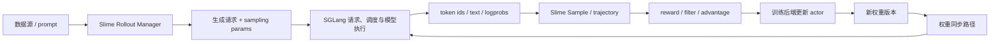
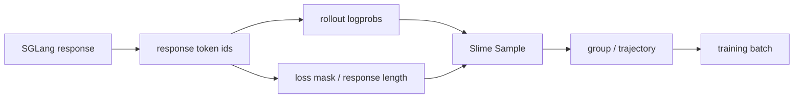

# SGLang 与 Slime 阅读对照

> SGLang 解释“一次推理请求怎样执行”；Slime 解释“生成出的样本怎样进入训练，并让新权重再次回到 rollout”。两库的接缝不是一条函数调用，而是请求、样本、logprob、权重版本和资源所有权五份契约。

## 你为什么要读

读完 SGLang 再进入 Slime，最容易发生两种错位：把 Slime 当作 SGLang 的训练模块，或把 SGLang 当作 Slime 里一个没有内部状态的 HTTP 黑盒。更准确的关系是：Slime 编排 RL 后训练闭环，并把一个或多个 SGLang 服务作为 rollout/推理资源；SGLang 仍独立拥有请求调度、KV、模型执行与响应回程。

本页帮助你在跨库时始终回答三个问题：

1. 当前对象是“在线推理请求”还是“可训练样本”？
2. 当前权重属于哪个版本，训练侧与 rollout 侧是否一致？
3. 出错后该进入 SGLang 的请求链，还是 Slime 的闭环编排链？

---

## 一张总图：推理主线嵌入训练闭环



箭头的关键不是“谁 import 谁”，而是谁拥有状态：

- SGLang 拥有一次推理请求的 `rid`、batch 生命周期、KV 地址和模型执行状态。
- Slime 拥有 sample/group、rollout 批次、reward/advantage、训练 step 和闭环权重版本。
- 两者在请求协议、返回 token/logprob 与权重更新接口处交接。

---

## 五条跨框架契约

### 1. 请求契约：Sample 怎样变成生成请求

Slime 的 rollout 逻辑从 `Sample` 取出 prompt/token ids，组合 `sampling_params`、是否返回 logprob 等字段，再交给 SGLang engine。默认实现、streaming、agent/custom generate 与外部 engine 配置会改变具体调用路径，因此不要把所有 rollout 都写成唯一的 HTTP `/generate` 调用。

| SGLang 侧要问 | Slime 侧要问 |
|---|---|
| 进入的是 native `/generate`、OpenAI API 还是其他 engine 表面？ | 使用默认 `generate`、streaming、agent 轨迹还是自定义插件？ |
| `SamplingParams` 最终如何规范化？ | dataset/global/sample 级参数怎样合并与复制？ |
| batch、stream 与 logprob 字段如何返回？ | group fan-out、seed 与失败样本怎样收口？ |

对照入口：[[SGLang-OpenAI-API]]、[[SGLang-Sampling]] ↔ [[Slime-SGLang-Rollout]]、[[Slime-插件与示例]]。

### 2. 样本契约：响应何时成为训练数据

SGLang 返回的是推理结果；Slime 还要把结果写回 `Sample`，维护 prompt/response 长度、loss mask、状态、reward 以及可能存在的多轮轨迹。一次请求成功不等于样本可训练：token 边界、截断、过滤和长度不变量仍可能失败。



对照入口：[[SGLang-HTTP请求全链路]] ↔ [[Slime-RL训练全链路]]、[[Slime-训练数据]]。

### 3. Logprob 契约：同名数值不等于同一用途

SGLang 的 logprob 是推理侧按请求参数产生的 token 级结果；Slime 的 `rollout_log_probs` 会进入训练数据，并可能与训练后端重新计算的 logprob、reference logprob 或 importance-sampling 修正比较。

跨库时必须核对：

- 是否只覆盖 response token，还是还含 prompt/input logprob；
- 长度是否与 `response_length`、`loss_mask` 对齐；
- 多轮 agent 追加 observation 时，哪些位置是真实 rollout logprob，哪些位置按约定补零或屏蔽；
- tokenizer、chat template 和截断是否在 rollout 与 training 两侧一致。

因此“接口返回了 logprob”只证明字段存在，不能证明训练语义已经对齐。

对照入口：[[SGLang-Sampling-数据流]] ↔ [[Slime-Policy-Loss]]、[[Slime-训练数据-数据流]]。

### 4. 权重版本契约：训练完成不等于 rollout 已更新

训练侧产生新参数后，Slime 需要选择实际同步路线。当前代码同时存在 tensor、distributed、disk、delta/disk 等路径，外部或冻结 engine 也可能采用不同更新策略；CheckpointEngine 只是相关实现/集成之一，不是所有热更新的同义词。

| 路线问题 | 需要确认的事实 |
|---|---|
| 谁发起更新 | actor group、rollout manager 还是外部控制面 |
| 传什么 | tensor、distributed bucket、完整 checkpoint、delta 文件 |
| 谁应更新 | actor rollout engine、reference/reward/frozen engine 是否跳过 |
| 何时可见 | 更新完成、内存恢复、版本切换与下一轮 generate 的边界 |
| 失败怎么处理 | 半数 rank 成功、超时、新 engine 重启后如何恢复 |

对照入口：[[SGLang-CheckpointEngine]]、[[SGLang-ModelLoader]] ↔ [[Slime-分布式权重同步]]、[[Slime-磁盘权重同步]]、[[Slime-Megatron到HF转换]]。

### 5. 资源所有权契约：谁能暂停、卸载和重启 engine

SGLang 单独运行时，服务进程自己管理模型、KV 和 worker 生命周期；进入 Slime 后，Ray/rollout orchestration 可能管理 colocated 资源、offload/resume、engine 重启和外部服务连接。不能把“Slime 不介入 Scheduler 内部”误读成“Slime 不影响 SGLang 生命周期”。

| 层次 | 主要所有权 |
|---|---|
| 请求内排队、batch、KV、attention | SGLang runtime |
| engine 集合、地址、colocation、暂停/恢复、故障重建 | Slime rollout 编排 |
| actor 参数更新与训练并行组 | Slime 训练后端 |
| 外部 gateway/PD worker 选择 | 对应部署的 gateway 与服务控制面 |

对照入口：[[SGLang-启动链路]]、[[SGLang-分布式]] ↔ [[Slime-SGLang-Engine]]、[[Slime-引擎拓扑]]、[[Slime-Ray编排]]。

---

## 故障路由：该去哪个知识库

| 症状 | 第一站 | 原因 |
|---|---|---|
| 请求已进入服务但一直排队、KV 紧张、decode 无输出 | SGLang Scheduler/KV/回程专题 | 故障仍在单次推理生命周期内 |
| rollout group 数量不对、样本被过滤、reward 或 advantage 异常 | Slime rollout/reward/training data | 对象已是 sample/group，不是 SGLang request |
| `rollout_log_probs` 长度与 response/loss mask 不一致 | 先 Slime 数据契约，再回查 SGLang 返回字段 | 接缝两侧都可能改变 token 范围 |
| 更新后生成仍像旧模型 | Slime 权重同步主线，随后查 SGLang 更新入口 | 需要证明版本从训练侧传播到每个目标 engine |
| colocated 模式更新前后 OOM | Slime 资源编排 + SGLang 内存恢复 | 同时涉及 engine 生命周期与 runtime 内存 |
| 外部 PD engine 半边不可用 | Gateway/PD 专题 + Slime external engine 管理 | 路由对健康与上层 engine 注册共同决定可用性 |

---

## 推荐阅读路线

### 已经掌握 SGLang

1. [[Slime-项目总览]]：先建立 rollout、training、weight sync 三角关系。
2. [[Slime-RL训练全链路]]：沿一轮 `generate → train → update weights` 跟对象走。
3. [[Slime-SGLang-Rollout]]：确认 Sample 怎样变成生成请求并收回 token/logprob。
4. [[Slime-训练数据]] 与 [[Slime-Policy-Loss]]：理解返回结果怎样获得训练语义。
5. [[Slime-权重同步]]：证明新版本怎样回到 rollout engine。

### 正在排查跨库问题

按对象选路：

- `rid`、batch、KV index → [[SGLang-HTTP请求全链路]]；
- `Sample`、group、trajectory → [[Slime-Rollout生成]]；
- `rollout_log_probs`、loss mask → [[Slime-训练数据-数据流]]；
- weight bucket/checkpoint/version → [[Slime-权重同步]]；
- engine address/offload/restart → [[Slime-SGLang-Engine]]。

全局专题关系见 [[knowledge_maps/三框架知识地图|跨库专题对照]]，联合主线见 [[knowledge_maps/AI-Infra联合学习路径|AI Infra 联合学习路径]]。

---

## 静态验证：确认五条接缝仍存在

```powershell
# 请求与 sample：默认 rollout 的生成/group 入口
rg -n "async def generate\(|async def generate_and_rm_group|sampling_params" `
  slime/slime/rollout/sglang_rollout.py

# logprob：Sample 自身维护长度与追加语义
rg -n "rollout_log_probs|response_length|loss_mask" `
  slime/slime/utils/types.py

# 权重：多种同步路线并存，不能等同于单一 CheckpointEngine
rg -n "update_weights_from_tensor|update_weights_from_distributed|update_weights_from_disk" `
  slime/slime/backends/sglang_utils/sglang_engine.py

# 资源所有权：rollout 层管理 engine 更新与重建
rg -n "update_weights|restart.*engine|resume_memory_occupation|offload" `
  slime/slime/ray/rollout.py
```

预期：第一组命中单样本生成与 group fan-out；第二组命中 logprob/response/loss-mask 不变量；第三组至少命中三种更新入口；第四组命中 rollout 编排对 engine 生命周期的管理。静态命中只证明接口存在，版本一致性仍需在一次真实闭环中记录 training step、权重版本和各 engine 更新结果。

最后记住一句话：**SGLang 把请求变成生成结果，Slime 把生成结果变成学习信号，再负责让新权重回到下一轮请求。**
