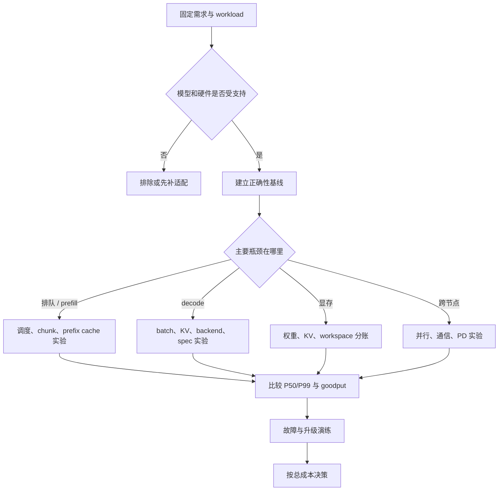

# SGLang 框架对比与设计决策

## 你为什么要读

“SGLang、vLLM、TensorRT-LLM 谁更快”不是一个完整问题。没有模型、GPU、输入输出长度、并发分布、精度和版本，任何单一倍数都更像宣传口号，而不是工程结论。

本页不替你宣布赢家，而是把 SGLang 源码中可确认的设计能力转成比较维度、实验假设和上线检查。其他框架变化很快，具体支持范围必须以各自当前版本的官方文档与实测为准。

## 先把选择题改写正确

一个可回答的问题应包含：

```text
在固定模型、权重、dtype/quant、GPU、请求长度分布和 SLA 下，
候选 runtime 在正确性、延迟分布、goodput、显存、稳定性与运维成本上如何取舍？
```

比较框架前先记录：

| 类别 | 必须固定或说明 |
|------|----------------|
| 模型 | architecture、参数规模、权重版本、tokenizer |
| 数值 | dtype、quant、sampling、随机种子或确定性条件 |
| 硬件 | GPU 型号与数量、驱动、CUDA、互联和网络 |
| workload | prompt/output token 分布、并发、到达过程、prefix 重复度 |
| 服务 | TP/PP/DP、cache、spec、PD、backend、batch 与显存参数 |
| 目标 | TTFT/TPOT/P99、throughput、goodput、错误率、恢复时间 |

## 从 SGLang 源码能确认什么

在本知识库基线中，可以直接从源码验证这些设计方向：

| 能力 | SGLang 的实现重心 | 深入入口 |
|------|-------------------|----------|
| Continuous batching | Scheduler 每轮组织 waiting/running 请求，处理 prefill、decode 与 retract | [[SGLang-Scheduler]] |
| Prefix reuse | RadixCache 把前缀匹配、节点生命周期与 KV 资源协同 | [[SGLang-RadixAttention]] |
| 多 attention backend | 执行层根据 forward mode、硬件与配置选后端 | [[SGLang-Attention]] |
| Speculative decoding | draft、verify、accept/reject 进入调度与执行主线 | [[SGLang-Speculative]] |
| PD disaggregation | Prefill/Decode 角色、KV transfer 与 gateway 路由 | [[SGLang-PD分离]] |
| 多模型扩展 | Registry、专用模型、LoRA、量化和多模态 processor | [[SGLang-模型执行]] · [[SGLang-扩展组件]] |
| 可观测与更新 | Scheduler/Tokenizer 指标、trace、权重更新与版本 | [[SGLang-可观测性]] · [[SGLang-CheckpointEngine]] |

这些是“存在什么机制”，不是“在你的 workload 下一定更快”。机制是否产生收益，必须通过对照实验回答。

同名能力也不代表架构等价。例如两个 runtime 都写“prefix cache”，其 key namespace、page 对齐、eviction、跨 adapter 隔离与 host tier 可能完全不同；都写“speculative decoding”，候选协议、验收、KV commit 和支持的 sampling 也可能不同。比较时应先把营销名拆成对象与协议，再比较实现和结果。

## 与其他 runtime 比较哪些维度

| 维度 | 要问的问题 | 需要什么证据 |
|------|------------|--------------|
| 模型支持 | 当前版本能否原生加载模型、量化和特殊 attention | 官方兼容表、实际启动、正确性测试 |
| 调度 | 长短请求混合时如何 admission、chunk、preempt/retract | trace、队列指标、尾延迟 |
| KV 管理 | page/slot 如何分配，prefix 如何匹配和驱逐 | cache hit、KV usage、故障注入 |
| Kernel | 实际选择哪个 backend，哪些 shape 有专用路径 | 日志、profiler、kernel 名称 |
| 分布式 | TP/PP/DP/EP、跨节点和 collective 失败如何表现 | 拓扑记录、通信 trace、恢复测试 |
| 协议 | OpenAI、原生 API、gRPC、流式和结构化输出是否满足调用方 | contract test、端到端请求 |
| 运维 | 热更新、扩缩容、健康检查、指标和日志是否可用 | 演练记录、恢复时间、观测覆盖 |
| 工程成本 | 编译、部署、升级、调试和自定义模型成本 | CI 时间、镜像、变更量、故障处理时间 |

### 证据等级

| 说法 | 最低证据 |
|---|---|
| “支持某模型/功能” | 当前版本官方说明 + 实际启动与正确性请求 |
| “配置已生效” | 最终配置 + resolved 对象/backend + 日志或 profiler |
| “更快” | 固定变量的端到端分布、正确性一致、包含预热与失败率 |
| “更省显存” | 权重/KV/workspace/runtime 分账和峰值，而非单一 `nvidia-smi` 瞬时值 |
| “更稳定” | 压测、取消、OOM、worker 失败、升级/回滚演练 |

低一级证据不能支撑高一级结论：源码存在某分支，最多证明“机制存在”，不能证明当前部署走到它，更不能证明它在目标 workload 上获益。

不要把“某框架有这个功能”直接等价为“它在当前版本、当前模型和当前硬件上可用”。功能开关、实际选路和可观测结果要同时成立。

## 四个常见实验假设

### 高重复前缀是否值得使用 RadixCache

**假设：** 重复 system prompt 或长共享前缀可以减少后续 prefill 工作。

**操作：** 固定请求集合，对比默认 cache 与 force miss/禁用 cache；记录 matched tokens、TTFT 分布、KV usage 和吞吐。

**判断：** 只在命中确实发生且整体指标改善时保留。动态时间戳、adapter 隔离和低重复度都可能让收益消失。

### Speculative decoding 是否降低 decode 成本

**假设：** draft 产生的候选经常被 target 接受，额外 draft/verify 成本小于节省的 target decode 轮次。

**操作：** 固定请求、采样与 batch，对比关闭/开启 spec；记录 accept length/rate、draft/verify 时间、显存和端到端 TPOT。

**判断：** 不设跨 workload 的固定 accept rate 阈值。真正条件是端到端收益为正，并且显存与尾延迟仍满足目标。

### PD 分离是否抵消 KV 传输成本

**假设：** Prefill 与 Decode 的资源画像冲突，拆池后减少的排队和干扰大于 KV transfer、路由和额外状态管理成本。

**操作：** 同一硬件预算下比较混部与 PD；记录分段排队、prefill、transfer、decode 时间和失败率。

**判断：** 短 prompt、低负载或高网络开销下，PD 可能没有收益。结论必须来自分段时间，而不是只看总吞吐。

### 更换 attention backend 是否有收益

**假设：** 当前模型 shape、dtype、forward mode 和硬件更适合另一 backend。

**操作：** 先确认两条路径都被实际选中，再做正确性与稳定态性能对照。

**判断：** 若某路径 silently fallback，实验无效。记录 kernel、workspace、HBM 与端到端指标，不能只看微基准。

## 选择路线



框架选择不是 benchmark 结束就完成。能跑得快但无法定位失败、无法平滑升级或必须维护大量私有补丁，仍可能不是更低成本的方案。

## 生产检查

| 领域 | 最少要证明什么 |
|------|----------------|
| 正确性 | 参考输出、stop/stream/tool/grammar 等关键协议通过 |
| 容量 | 权重、KV、workspace 和 runtime 预留分账清楚 |
| 延迟 | 预热后报告 TTFT/TPOT 分布和超时，不只报平均值 |
| 稳定性 | 高负载下有背压，OOM、worker 失败与取消不会无限扩散 |
| 一致性 | 权重更新、cache flush 与请求版本可以关联 |
| 可观测 | 请求、队列、KV、GPU、错误和版本有可用信号 |
| 运维 | 扩缩容、滚动升级、回滚和故障恢复做过演练 |

## 运行验证

**操作：** 从上面四个假设中选择与你 workload 最相关的一项，先写实验记录，再执行 [[SGLang服务实验]] 或对应专题验证。

**预期：** 结论包含版本、硬件、模型、workload、固定项、单一变量、正确性结果与指标分布；不出现脱离环境的“健康线”或通用性能百分比。

## 复盘

SGLang 的源码能告诉你它提供哪些控制杆，实验才能告诉你该不该拉。对比其他 runtime 时，坚持把“功能存在、路径生效、结果改善、运维可承受”分成四个独立问题，架构决策才不会被一张最好看的 benchmark 图带走。
