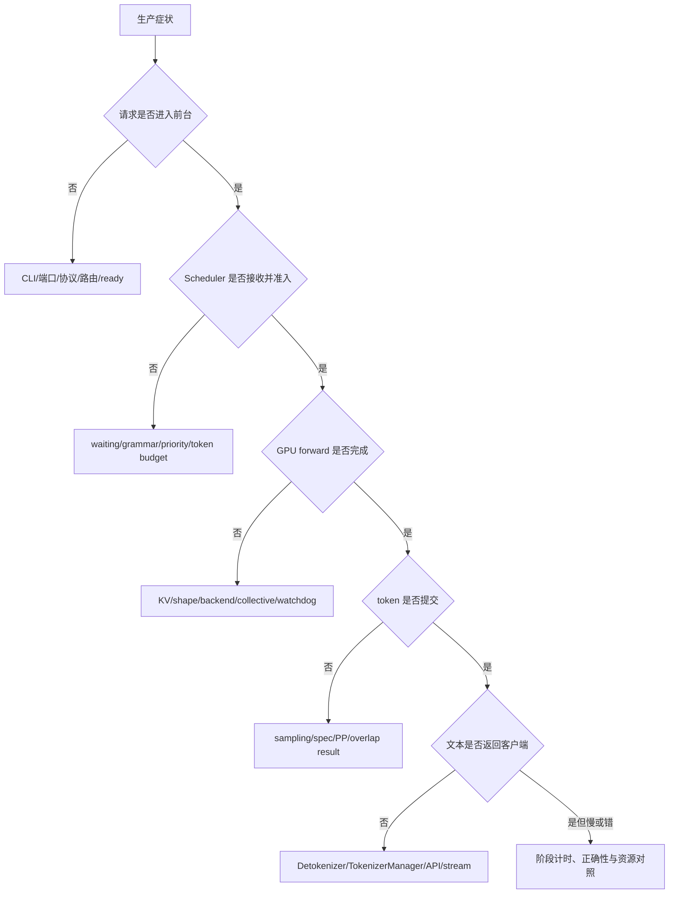

# SGLang 生产排障

## 你为什么要读

本页是生产分诊台，不替代各专题排障指南。它的目标是把“慢、挂、错、OOM”先落到请求、资源、地址、执行或回程账，再进入正确源码入口。

## 先保存现场

任何调参前先记录：

```text
commit / image / dependency lock
model / weight version / tokenizer / dtype / quant
GPU / driver / CUDA / topology / network
最终 ServerArgs（不是只保存启动命令）
请求长度、输出长度、并发、到达过程、prefix 重复度
开始时间、异常时间窗、request id / trace id
每个进程和 rank 的角色、PID、健康与日志
```

若现场不可复现，至少保留指标快照、错误请求和最近一次配置/权重变更。

## 指标先认名字，再谈阈值

当前 baseline 的核心 Scheduler 指标使用这些名字：

```python
# 来源：python/sglang/srt/observability/metrics_collector.py L267-L320
        self.num_running_reqs = Gauge(
            name="sglang:num_running_reqs",
            documentation="The number of running requests.",
            labelnames=labels.keys(),
            multiprocess_mode="mostrecent",
        )
        self.num_queue_reqs = Gauge(
            name="sglang:num_queue_reqs",
            documentation="The number of requests in the waiting queue.",
            labelnames=labels.keys(),
            multiprocess_mode="mostrecent",
        )
        self.num_grammar_queue_reqs = Gauge(
            name="sglang:num_grammar_queue_reqs",
            documentation="The number of requests in the grammar waiting queue.",
            labelnames=labels.keys(),
            multiprocess_mode="mostrecent",
        )
        self.gen_throughput = Gauge(
            name="sglang:gen_throughput",
            documentation="The generation throughput (token/s).",
            labelnames=labels.keys(),
            multiprocess_mode="mostrecent",
        )
        self.cache_hit_rate = Gauge(
            name="sglang:cache_hit_rate",
            documentation="The prefix cache hit rate.",
            labelnames=labels.keys(),
            multiprocess_mode="mostrecent",
        )
        self.decode_sum_seq_lens = Gauge(
            name="sglang:decode_sum_seq_lens",
            documentation="The sum of all sequence lengths in decode.",
            labelnames=labels.keys(),
            multiprocess_mode="mostrecent",
        )

        # =================================================================
        # Memory pool usage ratios
        # =================================================================
        self.token_usage = Gauge(
            name="sglang:token_usage",
            documentation="The token usage.",
            labelnames=labels.keys(),
            multiprocess_mode="mostrecent",
        )
        self.full_token_usage = Gauge(
            name="sglang:full_token_usage",
            documentation="The token usage for full attention layers.",
            labelnames=labels.keys(),
            multiprocess_mode="mostrecent",
        )
        self.swa_token_usage = Gauge(
            name="sglang:swa_token_usage",
```

不要再使用不存在的 `sglang:kv_pool_usage`。`token_usage` 也不是跨模型统一的“健康阈值”；SWA、Mamba、统一内存和特殊 pool 需要看各自分账。多进程指标还要理解 label 与 `multiprocess_mode`，不能把聚合结果误当成每 rank 状态。

## 第一跳决策树



## 1. 端口可达，但服务未 ready

**症状**：TCP/HTTP 已通，生成 503、卡住或 warmup 未完成。

**可能原因**

- 模型仍加载；
- checkpoint-engine 等待初始权重；
- warmup 失败后状态未置 `Up`；
- 访问的是 `/model_info` 或浅健康检查，不是生成链路；
- 多节点非零 rank 只提供 dummy health server。

**源码证据**

```python
# 来源：python/sglang/srt/entrypoints/http_server.py L2145-L2162
def _wait_and_warmup(
    server_args: ServerArgs,
    launch_callback: Optional[Callable[[], None]] = None,
    execute_warmup_func: Callable = _execute_server_warmup,
):
    if server_args.checkpoint_engine_wait_weights_before_ready:
        _wait_weights_ready()

    # Send a warmup request
    if not server_args.skip_server_warmup:
        if not execute_warmup_func(server_args):
            return
    else:
        _global_state.tokenizer_manager.server_status = ServerStatus.Up

    # The server is ready for requests
    logger.info("The server is fired up and ready to roll!")
```

**操作**：区分 socket、ASGI lifespan、`server_status=Up`、`/health_generate` 四层；保存 warmup 第一处失败。

**预期**：只有生成健康探针通过，才证明最小 Scheduler→ModelRunner→Detokenizer 回程可用。

## 2. waiting queue 增长 / TTFT 尖刺

**先看**：`sglang:num_queue_reqs`、`num_running_reqs`、`num_grammar_queue_reqs`、TTFT histogram、prefix hit、prefill token 规模。

**可能原因**

- 到达率超过服务率；
- prefill token budget 或 running slot 已满；
- grammar 仍在编译/跨 rank 同步；
- priority、prefill delayer、min-free-slots 或 LoRA 准入限制；
- 长 prompt prefix 未命中；
- PD bootstrap/prealloc/transfer 尚未完成。

Scheduler 普通循环把 recv、input、schedule、run、result 明确分开：

```python
# 来源：python/sglang/srt/managers/scheduler.py L1521-L1540
    def event_loop_normal(self):
        """A normal scheduler loop."""
        while True:
            if self.gracefully_exit:
                break

            # Receive requests
            recv_reqs = self.request_receiver.recv_requests()
            self.process_input_requests(recv_reqs)
            if self._engine_paused:
                continue

            # Get the next batch to run
            batch = self.get_next_batch_to_run()
            self.cur_batch = batch

            # Launch the current batch
            if batch:
                result = self.run_batch(batch)
                self.process_batch_result(batch, result)
```

**操作**：把 TTFT 拆成前台/tokenize、waiting、prefill、回程；选择一个最可疑阶段做单变量实验。

**预期**：若 queue time 主导，不应先调 attention kernel；若 prefill 主导，再检查 prefix、chunk、backend 与硬件。

## 3. token usage 高、retract 或 OOM

**先看**：`sglang:token_usage`、full/SWA/Mamba usage、available/used tokens、retracted gauge/counter、running/queue、CUDA allocator 与模型 workspace。

**不要只看**：GPU 总显存。权重、KV、graph/workspace、通信 buffer、LoRA、多模态 feature 都可能占用不同生命周期。

```python
# 来源：python/sglang/srt/managers/scheduler.py L3040-L3069
        # Check if decode out of memory
        if (kv_full_retract_flag := not batch.check_decode_mem()) or (
            TEST_RETRACT and self.forward_ct % TEST_RETRACT_INTERVAL == 0
        ):
            old_available_tokens = self.token_to_kv_pool_allocator.available_size()
            old_ratio = self.new_token_ratio_tracker.current
            mamba_allocator = getattr(
                self.tree_cache.req_to_token_pool, "mamba_allocator", None
            )
            old_mamba_available = (
                mamba_allocator.available_size()
                if mamba_allocator is not None
                else None
            )
            retracted_reqs, new_token_ratio, reqs_to_abort = batch.retract_decode(
                self.server_args
            )
            new_available_tokens = self.token_to_kv_pool_allocator.available_size()
            new_token_gained = new_available_tokens - old_available_tokens
            mamba_num_gained = (
                mamba_allocator.available_size() - old_mamba_available
                if mamba_allocator is not None
                else None
            )

            self.metrics_reporter.num_retracted_reqs = len(retracted_reqs)
            if self.metrics_reporter.enable_metrics and len(retracted_reqs) > 0:
                self.metrics_reporter.metrics_collector.increment_retracted_reqs(
                    num_retracted_reqs=len(retracted_reqs),
                    num_retracted_input_tokens=sum(
```

**操作**：记录 retract 前后 available tokens、请求长度和新 token ratio；降低单一容量变量做对照，而不是同时改 `mem_fraction_static/max_running/max_total_tokens`。

**预期**：能证明是 KV 准入压力、其他显存峰值还是内存泄漏。page size 只有在具体 allocator/layout 证据支持时才归因为碎片。

## 4. TPOT 高 / decode goodput 低

**先看**：inter-token latency、`sglang:gen_throughput`、running batch、decode sum seq lens、GPU kernel/collective 时间、retract、spec accept length/rate。

**可能原因**

- 并发不足，decode batch 太小；
- 长 context 拉高 attention/KV 访问成本；
- TP/DP/EP collective 或跨节点网络主导；
- PP bubble；
- overlap 被 grammar、调试或特定模式禁用；
- speculative 的 draft/verify 成本大于节省；
- backend/graph silently fallback。

**操作**：先对比相同请求集下的 batch size/seq lens 与 GPU trace，再选择关闭 spec、切 eager 或改变并行度中的一个变量。

**预期**：结论指向具体阶段和实际 kernel/collective，不用“GPU 利用率低/高”单独定因。

## 5. prefix 命中下降

**检查**：token ids、`extra_key`、adapter、权重/cache version、动态 prompt 字段、page 对齐、force miss、host/device hit。

**操作**：用完全相同的规范化输入重复请求，记录 matched tokens 与 extend length；再只改变一项 namespace 因素。

**预期**：相同 token 但不同 `extra_key` 不共享；权重更新 flush 后命中骤降可能是预期；低命中不能直接归因 RadixTree 算法。

## 6. token 已产生，但无文本或流式异常

**第一跳**：Scheduler output→Detokenizer→TokenizerManager/API adapter。

**检查**

- `BatchTokenIDOut` 是否发出；
- Detokenizer 的 decode window、read offset 与 skip-special-token 配置；
- TokenizerManager 是否收到并唤醒正确 rid；
- incremental/non-incremental streaming 语义；
- API adapter 的 finish reason、`[DONE]` 和客户端断连。

**预期**：若 token id 已正确，先查回程，不重跑 sampling 或 attention。

## 7. backend / CUDA Graph 未生效或结果异常

**检查四层**：用户配置→ServerArgs 自动改写→resolved backend/runner→profiler kernel。

**操作**

1. 保存最终 ServerArgs；
2. 查 auto-disable/fallback 日志；
3. 证明 graph capture 与 replay 命中；
4. 用同一请求比较 eager 与 graph 数值；
5. 对多模态、spec、DP padding 等检查非 shape metadata。

**预期**：性能实验只有在两条路径都真实生效、正确性一致时有效。

## 8. PD transfer 卡住

当前指标直接暴露四类队列与 transfer histogram：

```python
# 来源：python/sglang/srt/observability/metrics_collector.py L473-L510
        self.num_prefill_bootstrap_queue_reqs = Gauge(
            name="sglang:num_prefill_bootstrap_queue_reqs",
            documentation="The number of requests in the prefill bootstrap queue.",
            labelnames=labels.keys(),
            multiprocess_mode="mostrecent",
        )
        self.num_prefill_inflight_queue_reqs = Gauge(
            name="sglang:num_prefill_inflight_queue_reqs",
            documentation="The number of requests in the prefill inflight queue.",
            labelnames=labels.keys(),
            multiprocess_mode="mostrecent",
        )
        self.num_decode_prealloc_queue_reqs = Gauge(
            name="sglang:num_decode_prealloc_queue_reqs",
            documentation="The number of requests in the decode prealloc queue.",
            labelnames=labels.keys(),
            multiprocess_mode="mostrecent",
        )
        self.num_decode_transfer_queue_reqs = Gauge(
            name="sglang:num_decode_transfer_queue_reqs",
            documentation="The number of requests in the decode transfer queue.",
            labelnames=labels.keys(),
            multiprocess_mode="mostrecent",
        )
        self.kv_transfer_speed_gb_s = Histogram(
            name="sglang:kv_transfer_speed_gb_s",
            documentation="Histogram of KV cache transfer speed in GB/s.",
            labelnames=labels.keys(),
            buckets=(0.1, 0.5, 1, 5, 10, 25, 50, 100, 200, 400),
        )
        self.kv_transfer_latency_ms = Histogram(
            name="sglang:kv_transfer_latency_ms",
            documentation="Histogram of KV cache transfer latency in ms.",
            labelnames=labels.keys(),
            buckets=(1, 2, 5, 10, 25, 50, 100, 250, 500, 1000, 2500, 5000),
        )
        self.pending_prealloc_token_usage = Gauge(
            name="sglang:pending_prealloc_token_usage",
```

**定位**

- bootstrap 高：URL/room/metadata handshake；
- prefill inflight 高：prefill 已执行，KV send/完成确认未收口；
- decode prealloc 高：目标 KV 空间/metadata 未就绪；
- decode transfer 高：传输或 poll；
- queue 不高但客户端 502：再查 gateway 的双请求与响应门控。

**预期**：能指出卡在哪个完成协议，而不是笼统说“网络慢”。

## 9. Spec、Grammar、LoRA、多模态

| 特性 | 先看 | 常见误判 |
|---|---|---|
| Spec | accept length/rate、draft/verify 时间、显存、算法类型 | 只用 accept rate 判定收益；假定所有算法同一流水线 |
| Grammar | grammar queue、编译 future、跨 rank sync、timeout | 把 TTFT 全归 GPU；认为 backend=none 会忽略约束 |
| LoRA | adapter identity、CPU cache、GPU slot、准入与动态更新结果 | 把 slot 0 恒等于 base；认为 load/unload 有完整事务回滚 |
| 多模态 | placeholder span、feature/embedding、IPC、hash、ViT graph | 把 Processor 当最终 embedding；把 CUDA IPC 当零复制 |

进入对应专题：[[SGLang-Speculative-排障指南]]、[[SGLang-Sampling-排障指南]]、[[SGLang-LoRA-排障指南]]、[[SGLang-多模态-排障指南]]。

## 10. 权重更新失败或结果不一致

**不要使用 `sglang:num_paused_reqs` 作为当前 baseline 的可靠生产证据**：指标对象存在，但已终审可观测性专题确认没有实际递增生产者。

**检查**

- 外部 checkpoint-engine/HTTP/ZMQ 调用是否成功；
- 每个 scheduler/worker 的结果，而不是只看首个响应；
- update method 与 target/draft 分支；
- `flush_cache` 是否按更新类型执行；
- weight version 是元数据标签，不是权重 checksum；
- partial failure 后没有自动事务回滚。

**预期**：把一次更新记录成阶段表，并在失败时决定继续、重试、回滚部署还是重启，不假定框架替你恢复到旧权重。

## 排障记录模板

```text
症状与影响：
时间窗：
版本/模型/硬件/workload：
最近变更：
请求账：
资源账：
地址账：
执行账：
回程账：
最后一个可信边界：
假设：
源码入口：
操作：
预期：
实际：
结论/下一步：
```

## 复盘

生产排障的目标不是尽快找到一个“看起来有效”的参数，而是找到第一个不满足契约的交接。指标提供方向，源码说明条件，单变量实验决定因果；三者缺一都不能支撑生产结论。
