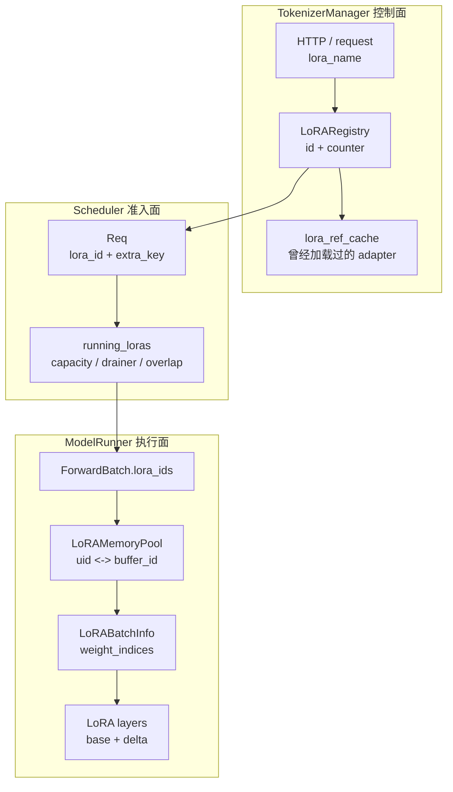

# LoRA · 数据流

## 读者任务

这篇把 [[SGLang-LoRA-源码走读]] 的主线拆成五条数据流：

- 请求身份流：`lora_name/path → lora_id → Req.lora_id → ForwardBatch.lora_ids`
- cache 隔离流：`lora_id → Req.extra_key → RadixCache namespace`
- GPU slot 流：`lora_id → buffer_id → weight_indices → LoRABatchInfo`
- 动态更新流：`/load_lora_adapter`、`/unload_lora_adapter` 与 registry counter
- 失败恢复流：registry、历史引用、worker CPU 字典和 GPU slot 在无事务回滚时如何重新对账

读完后，你应该能判断一个状态属于 TokenizerManager 控制面、Scheduler 准入面，还是 ModelRunner 执行面。

## 怎么读这篇

这是一篇按需查阅的数据流，不必一次读完：

| 当前问题 | 先读 |
|----------|------|
| 请求没有使用预期 adapter，或 prefix cache 疑似串用 | 总图、请求身份流 |
| 动态 load/unload 卡住 | 动态加载、动态卸载、注册上限 |
| GPU slot、shape 或 backend 报错 | ModelRunner 更新、执行面校验、overlap loading |
| adapter 长期留在 waiting queue | drainer 与 Scheduler 准入 |

无论从哪段进入，都先记录 `lora_name/path`、内部 `lora_id`、`buffer_id` 和请求是否仍持有 counter。四个值能把控制面、调度面和执行面重新对齐。

## 总图：五条流不要混在一起



这张图的关键是进程边界：registry 不知道 GPU slot，memory pool 不知道用户传入的名字，backend 不知道 HTTP API。

## 流 1：请求身份如何绑定和释放

`LoRARegistry.acquire` 对单个名称会返回 `lora_id` 并递增 counter；对 batch 名称会先全部查到 ID，再并发递增 counter。这样可以避免 batch 里一部分 adapter 成功计数、一部分失败。

```python
# 来源：python/sglang/srt/lora/lora_registry.py L145-L163
        if isinstance(lora_name, str):
            async with self._registry_lock.writer_lock:
                lora_id = _lookup(lora_name)

            await self._counters[lora_id].increment(notify_all=False)
            return lora_id
        elif isinstance(lora_name, list):
            async with self._registry_lock.writer_lock:
                lora_ids = [_lookup(name) for name in lora_name]

            # Increment the counters only after all IDs are looked up.
            await asyncio.gather(
                *[
                    self._counters[id].increment(notify_all=False)
                    for id in lora_ids
                    if id is not None
                ]
            )
            return lora_ids
```

请求结束或异常时，TokenizerManager 释放 counter。这个释放发生在请求状态清理阶段，不在 model runner 里。

```python
# 来源：python/sglang/srt/managers/tokenizer_manager.py L1430-L1436
            # to ensure aborted request state is cleaned up.
            if state.obj.rid in self.rid_to_state:
                del self.rid_to_state[state.obj.rid]

            # Mark ongoing LoRA request as finished.
            if self.server_args.enable_lora and state.obj.lora_path:
                await self.lora_registry.release(state.obj.lora_id)
```

对应的 registry release 只做 counter decrement，不卸载权重。

```python
# 来源：python/sglang/srt/lora/lora_registry.py L167-L184
    async def release(self, lora_id: Union[str, List[str]]):
        """
        Decrements the usage counter for a LoRA adapter, indicating that it is no longer in use.
        """

        async with self._registry_lock.reader_lock:
            if isinstance(lora_id, str):
                await self._counters[lora_id].decrement()
            elif isinstance(lora_id, list):
                await asyncio.gather(
                    *[
                        self._counters[id].decrement()
                        for id in lora_id
                        if id is not None
                    ]
                )
            else:
                raise TypeError("lora_id must be either a string or a list of strings.")
```

不变量：只要一个请求还在跑，对应 adapter 的 counter 就不应该归零。动态卸载依赖这个不变量保护 in-flight 请求。

## 流 2：动态加载先后端成功，再注册控制面

HTTP endpoint 本身很薄，只把请求交给 TokenizerManager。真正的 load/unload 顺序在 control mixin 里。

```python
# 来源：python/sglang/srt/entrypoints/http_server.py L1431-L1439
@app.api_route("/load_lora_adapter", methods=["POST"])
@auth_level(AuthLevel.ADMIN_OPTIONAL)
async def load_lora_adapter(
    obj: Annotated[LoadLoRAAdapterReqInput, Body()], request: Request
):
    """Load a new LoRA adapter without re-launching the server."""
    result = await _global_state.tokenizer_manager.load_lora_adapter(obj, request)
    status_code = HTTPStatus.OK if result.success else HTTPStatus.BAD_REQUEST
    return ORJSONResponse(msgspec_to_builtins(result), status_code=status_code)
```

动态加载要求 `enable_lora`，并且当前源码要求 `dp_size == 1`。加载顺序是先生成 `LoRARef`，再让后端进程加载，成功后才 register 到 `LoRARegistry` 和 `lora_ref_cache`。

```python
# 来源：python/sglang/srt/managers/tokenizer_control_mixin.py L541-L580
    async def load_lora_adapter(
        self: TokenizerManager,
        obj: LoadLoRAAdapterReqInput,
        _: Optional[fastapi.Request] = None,
    ) -> LoadLoRAAdapterReqOutput:
        self.auto_create_handle_loop()

        try:
            if not self.server_args.enable_lora:
                raise ValueError(
                    "LoRA is not enabled. Please set `--enable-lora` to enable LoRA."
                )

            # TODO (lifuhuang): Remove this after we verify that dynamic lora loading works
            # with dp_size > 1.
            assert (
                self.server_args.dp_size == 1
            ), "dp_size must be 1 for dynamic lora loading"
            logger.info(
                "Start load Lora adapter. Lora name=%s, path=%s",
                obj.lora_name,
                obj.lora_path,
            )

            async with self.lora_update_lock:
                # Generate new uniquely identifiable LoRARef object.
                new_adapter = LoRARef(
                    lora_name=obj.lora_name,
                    lora_path=obj.lora_path,
                    pinned=obj.pinned,
                )

                # Trigger the actual loading operation at the backend processes.
                obj.lora_id = new_adapter.lora_id
                result = (await self.update_lora_adapter_communicator(obj))[0]

                # Register the LoRA adapter only after loading is successful.
                if result.success:
                    await self.lora_registry.register(new_adapter)
                    self.lora_ref_cache[obj.lora_name] = new_adapter
```

这解释了一个重要排障点：如果 backend 明确返回 load 失败，用户不会在 registry 里看到一个可 acquire 的半加载 adapter。但反方向没有原子性：backend 成功后，`register`、LRU unload 或控制面收口仍可能失败，源码没有撤销已经成功的 backend load。

worker 内部也不是事务。`LoRAManager.load_lora_adapter` 在 `load_lora_weights` 前先写 `configs`；异常分支只构造失败结果，没有删除已写入条目。因而重试前应检查各 worker 的 loaded-adapter 状态，而不是假定失败等于“什么都没改变”。

## 流 3：动态卸载先阻止新请求，再等旧请求结束

卸载不是直接删 GPU 权重。控制面先 `unregister`，阻止新请求 acquire 这个 adapter；然后 `wait_for_unload` 等 counter 到零；最后才通知后端卸载。

```python
# 来源：python/sglang/srt/managers/tokenizer_control_mixin.py L521-L537
    async def _unload_lora_adapter_locked(
        self: TokenizerManager,
        obj: UnloadLoRAAdapterReqInput,
    ) -> UnloadLoRAAdapterReqOutput:
        assert (
            self.lora_update_lock.locked()
        ), "self.lora_update_lock must be locked in order for self._unload_lora_adapter_locked() to be called"

        # Unregister the LoRA adapter from the registry to stop new requests for this adapter
        # from being started.
        lora_id = await self.lora_registry.unregister(obj.lora_name)
        obj.lora_id = lora_id

        # Initiate the actual unloading operation at the backend processes only after all
        # ongoing requests using this LoRA adapter are finished.
        await self.lora_registry.wait_for_unload(lora_id)
        result = (await self.update_lora_adapter_communicator(obj))[0]
```

registry 的等待逻辑只看 counter，不碰 GPU state。

```python
# 来源：python/sglang/srt/lora/lora_registry.py L186-L203
    async def wait_for_unload(self, lora_id: str):
        """
        Waits until the usage counter for a LoRA adapter reaches zero, indicating that it is no longer in use.
        This is useful for ensuring that a LoRA adapter can be safely unloaded.

        This method itself is not synchronized, which is safe because it should only be called during LoRA unloading,
        which itself is guaranteed to be sequential.
        """
        assert (
            lora_id not in self._registry
        ), "wait_for_unload should only be called after the LoRA adapter has been unregistered. "
        assert (
            lora_id in self._counters
        ), "The LoRA ID should still have a counter if it has been registered before."

        # Wait until no requests are using this LoRA adapter.
        await self._counters[lora_id].wait_for_zero()
        del self._counters[lora_id]
```

这条流的正常安全性来自两阶段顺序：先让新请求进不来，再等旧请求走完。但它仍不是事务：counter 在 backend 响应前已删除；若 backend unload 失败，registry 不会自动恢复。与此同时，`lora_ref_cache` 仍保留历史引用，后续同名请求会尝试隐式 reload。

backend 的 “unload” 也不等于立即擦除 GPU buffer。`LoRAManager.unload_lora_adapter` 删除 `configs/loras/lora_refs`，却不删除 `LoRAMemoryPool.uid_to_buffer_id`；旧 slot 作为不再被请求引用的冷条目，等未来 pool eviction 覆盖。

```python
# 来源：python/sglang/srt/lora/lora_manager.py L248-L271
    def unload_lora_adapter(self, lora_ref: LoRARef) -> LoRAUpdateOutput:
        """
        Unload LoRA adapters by their names. This will remove the adapters from the memory pool and
        delete the corresponding LoRA modules.
        """

        adapter = self.configs.get(lora_ref.lora_id)
        lora_ref = self.lora_refs.get(lora_ref.lora_id)
        assert (
            adapter is not None and lora_ref is not None
        ), f"LoRA adapter with ID {lora_ref.lora_id} is not loaded. This should have been verified before request is sent to the backend."

        try:
            del self.configs[lora_ref.lora_id]
            del self.loras[lora_ref.lora_id]
            del self.lora_refs[lora_ref.lora_id]
            self.num_pinned_loras -= int(lora_ref.pinned)
        except Exception as e:
            return self.create_lora_update_result(
                success=False,
                error_message=str(e),
            )

        return self.create_lora_update_result(success=True)
```

注意函数 docstring 说 remove from memory pool，但函数体没有触碰 pool 映射；出版级阅读应以可执行语句为准，并把这一处注释/实现漂移记录下来。

## 流 4：`max_loaded_loras` 是控制面注册上限

如果设置了 `max_loaded_loras`，动态 load 成功注册后，TokenizerManager 会按 registry 的 LRU 名称卸载最久未使用、且非 pinned 的 adapter。

```python
# 来源：python/sglang/srt/managers/tokenizer_control_mixin.py L582-L606
                if self.server_args.max_loaded_loras is not None:
                    while (
                        self.lora_registry.num_registered_loras
                        > self.server_args.max_loaded_loras
                    ):
                        lru_lora_name = await self.lora_registry.lru_lora_name(
                            exclude_pinned=True
                        )
                        if lru_lora_name is None:
                            raise ValueError(
                                "Didn't find any LoRA adapters when trying to evict LRU LoRA adapter. "
                                f"LoRA registry is: {self.lora_registry._registry}"
                            )

                        logger.info(
                            f"Unloading least recently used LoRA adapter '{lru_lora_name}' "
                            f"(current number of adapters: {self.lora_registry.num_registered_loras}, "
                            f"max allowed: {self.server_args.max_loaded_loras})"
                        )

                        unload_result = await self._unload_lora_adapter_locked(
                            UnloadLoRAAdapterReqInput(lora_name=lru_lora_name)
                        )
                        if not unload_result.success:
                            raise ValueError(
```

这和 memory pool eviction 不同。`max_loaded_loras` 决定 registry 里最多保留多少可请求 adapter；`max_loras_per_batch` 决定一个 batch 的 GPU slot 能同时容纳多少 uid。

## 流 5：ModelRunner 只接收已经变成 `LoRARef` 的更新请求

TP worker 收到 load/unload 控制消息后，只把 request 转成 `LoRARef` 传给 `ModelRunner`。从 tensors 加载时，TP worker 负责还原 tensor bucket；切片规则由 LoRA 代码处理。

```python
# 来源：python/sglang/srt/managers/tp_worker.py L187-L215
    def load_lora_adapter(self, recv_req: LoadLoRAAdapterReqInput):
        result = self.model_runner.load_lora_adapter(recv_req.to_ref())
        return result

    def unload_lora_adapter(self, recv_req: UnloadLoRAAdapterReqInput):
        result = self.model_runner.unload_lora_adapter(recv_req.to_ref())
        return result

    def load_lora_adapter_from_tensors(
        self, recv_req: LoadLoRAAdapterFromTensorsReqInput
    ):
        # The LoRA code handles TP sharding internally using slice_lora_a_weights
        # and slice_lora_b_weights methods (see lora/layers.py:46-49, mem_pool.py:437-440).
        if recv_req.load_format == "flattened_bucket":
            flattened_data = MultiprocessingSerializer.deserialize(
                recv_req.serialized_tensors
            )
            bucket = FlattenedTensorBucket(
                flattened_tensor=flattened_data["flattened_tensor"],
                metadata=flattened_data["metadata"],
            )
            tensors = dict(bucket.reconstruct_tensors())
        else:
            tensors = MultiprocessingSerializer.deserialize(recv_req.serialized_tensors)
        result = self.model_runner.load_lora_adapter_from_tensors(
            recv_req.to_ref(),
            tensors,
            recv_req.config_dict,
            recv_req.added_tokens_config,
```

ModelRunner 再记录加载前后的 GPU memory，并把实际逻辑委托给 `LoRAManager`。

```python
# 来源：python/sglang/srt/model_executor/model_runner.py L2248-L2263
    def load_lora_adapter(self, lora_ref: LoRARef):
        """Load a new lora adapter from disk or huggingface."""

        logger.info(
            f"LoRA adapter loading starts: {lora_ref}. "
            f"avail mem={get_available_gpu_memory(self.device, self.gpu_id):.2f} GB"
        )

        result = self.lora_manager.load_lora_adapter(lora_ref)

        logger.info(
            f"LoRA adapter loading completes: {lora_ref}. "
            f"avail mem={get_available_gpu_memory(self.device, self.gpu_id):.2f} GB"
        )

        return result
```

这说明动态 API 的数据面最终仍然收敛到同一套 `LoRAManager` 和 `LoRAMemoryPool`，不是另一套执行路径。

## 流 6：执行面加载 adapter 时先验 shape 和功能限制

`LoRAManager.load_lora_adapter` 先读 `LoRAConfig`，再校验 adapter，之后才加载权重并更新 metadata。

```python
# 来源：python/sglang/srt/lora/lora_manager.py L166-L201
    def load_lora_adapter(self, lora_ref: LoRARef) -> LoRAUpdateOutput:
        """
        Load a single LoRA adapter from the specified path.

        Args:
            lora_ref (LoRARef): The LoRARef object containing the LoRA name, path, and ID.
        """
        assert (
            lora_ref.lora_name is not None and lora_ref.lora_path is not None
        ), "LoRARef must have both lora_name and lora_path set for loading."
        assert (
            lora_ref.lora_id not in self.loras
        ), f"LoRA adapter with ID {lora_ref.lora_id} is already loaded. This should have been verified before request is sent to the backend."

        try:
            # load configs
            new_adapter = LoRAConfig(
                lora_ref.lora_path,
                base_vocab_size=self.base_hf_config.vocab_size,
            )
            self.validate_new_adapter(new_adapter, lora_ref)
            self.configs[lora_ref.lora_id] = new_adapter

            # load weights
            self.load_lora_weights(lora_ref)

            # keep metadata for displayed messages
            self.lora_refs[lora_ref.lora_id] = lora_ref
            self.num_pinned_loras += int(lora_ref.pinned)
        except Exception as e:
            return self.create_lora_update_result(
                success=False,
                error_message=str(e),
            )

        return self.create_lora_update_result(success=True)
```

校验里明确拒绝 added tokens 和 DoRA，并检查 memory pool 是否支持 rank 与 target modules。pinned adapter 也不能占满所有 slot。

```python
# 来源：python/sglang/srt/lora/lora_manager.py L203-L242
    def validate_new_adapter(self, lora_config: LoRAConfig, lora_ref: LoRARef):
        """
        Validate if an adapter can be loaded into the current LoRA memory pool and generate error if it is incompatible.
        """
        if lora_config.lora_added_tokens_size > 0:
            raise ValueError(
                f"Failed to load {lora_ref.lora_name} because LoRA serving currently doesn't support adapters that add tokens to the vocabulary"
            )

        if lora_config.use_dora:
            raise ValueError(
                f"Failed to load {lora_ref.lora_name} because LoRA serving currently doesn't support DoRA adapters"
            )

        # Check if this LoRA adapter is already loaded
        for existing_lora_ref in self.lora_refs.values():
            if lora_ref.lora_name == existing_lora_ref.lora_name:
                raise ValueError(
                    f"Failed to load LoRA adapter {lora_ref.lora_name} because it is already loaded"
                )

            if lora_ref.lora_path == existing_lora_ref.lora_path:
                logger.warning(
                    f"{lora_ref.lora_path} is already loaded with name: {existing_lora_ref.lora_name}, "
                    f"but another copy is being loaded with name: {lora_ref.lora_name}"
                )

        # Check if the LoRA adapter shape is compatible with the current LoRA memory pool configuration.
        memory_pool = getattr(self, "memory_pool", None)
        incompatible = memory_pool and not memory_pool.can_support(lora_config)
        if incompatible:
            raise ValueError(
                f"LoRA adapter {lora_ref.lora_name} with rank {lora_config.r} is incompatible with the current "
                "LoRA memory pool configuration. Please ensure that the LoRA adapter's rank is within the configured "
                "`--max-lora-rank` and that the target modules are included in `--lora-target-modules`."
            )

        # Ensure pinned LoRA adapters does not exceed maximal limit or cause starvation.
        if lora_ref.pinned and self.num_pinned_loras >= self.max_loras_per_batch - 1:
            raise ValueError(
```

因此，memory pool 虽然有 extra embedding buffer 相关代码，但当前 `LoRAManager` 在更早阶段已经拒绝 added tokens adapter。读者不要把底层 buffer 能力误读成当前 serving 支持。

## 流 7：overlap loading 把搬权重拆到旁路 CUDA stream

启用 overlap loading 时，scheduler 不会立刻让新 adapter 的请求进入 batch，而是先尝试在旁路 stream 异步加载。状态分成 `LOADING`、`NOT_LOADED`、`LOADED`。

```python
# 来源：python/sglang/srt/lora/lora_overlap_loader.py L31-L53
    def try_overlap_load_lora(
        self, lora_id: Optional[str], running_loras: set[Optional[str]]
    ) -> bool:
        """
        Check a LoRA adapter's asynchronous load status, and try to load it if there's capacity
        in the memory pool. Returns whether or not the adapter has been loaded.
        """
        # Drain completed async loads before status/capacity checks so finished
        # adapters no longer count as in-flight.
        self._drain_completed_overlap_loads()

        lora_pipeline_load_status = self._check_overlap_load_status(lora_id)
        if lora_pipeline_load_status == LoRAOverlapLoadStatus.LOADING:
            return False
        elif lora_pipeline_load_status == LoRAOverlapLoadStatus.NOT_LOADED:
            res = self._try_start_overlap_load(lora_id, running_loras)
            if res:
                logger.debug(f"Loading LoRA adapter {lora_id} asynchronously")

            return False
        else:
            assert lora_pipeline_load_status == LoRAOverlapLoadStatus.LOADED
            return True
```

真正启动异步加载时，仍然先用 `validate_lora_batch` 做容量判断，再调用 `fetch_new_loras`。

```python
# 来源：python/sglang/srt/lora/lora_overlap_loader.py L78-L93
    def _try_start_overlap_load(
        self, lora_id: Optional[str], running_loras: set[Optional[str]]
    ) -> bool:
        loras_to_be_loaded = running_loras | self.lora_to_overlap_load_event.keys()

        new_lora_set = {lora_id} | loras_to_be_loaded
        if not self.lora_manager.validate_lora_batch(new_lora_set):
            return False

        with self.load_stream_context:
            self.lora_manager.fetch_new_loras({lora_id}, loras_to_be_loaded)
            event = self.device_module.Event()
            event.record(self.load_stream)

        self.lora_to_overlap_load_event[lora_id] = event
        return True
```

所以 overlap loading 是延迟隐藏策略，不改变容量不变量。当前实现直接使用 `torch.cuda.current_stream()` 和 CUDA event/stream 类型，不能无条件外推为所有 device backend 都具备同样语义。启动参数还要求 `max_loaded_loras` 存在且不超过 `2 * max_loras_per_batch`，因为 overlap 会 pin CPU adapter 权重。

## 流 8：drainer 是公平性闸门，不是卸载器

当 batch 内 uid 种类占满，某些 uid 长时间等不到机会，drainer 会把一个正在运行的 uid 标记为 draining。这里的 uid 包括 base model 的 `None`。draining 也不是绝对拒绝新请求：若新请求的 `max_new_tokens` 不超过当前最大剩余 token 的 `1.2` 倍，`can_schedule` 仍会放行，以减少尾部拖延。

```python
# 来源：python/sglang/srt/lora/lora_drainer.py L176-L191
    def can_schedule(self, req: Req) -> bool:
        """
        Check if a request can be scheduled based on draining state.

        If the adapter for this request is currently draining, only allow
        scheduling if the request's max_new_tokens is within tolerance of
        the max remaining tokens for the draining adapter.
        """
        stats = self.adapter_to_stats[req.lora_id]
        if not stats.is_draining_for:
            return True

        return (
            req.sampling_params.max_new_tokens
            <= stats.max_remaining_tokens * DRAIN_SCHEDULE_TOLERANCE
        )
```

drainer 不删 registry，也不释放 GPU buffer。它只是影响 scheduler 是否把某个请求加入本轮 batch。

## 运行验证

| 验证点 | 方法 | 预期 |
|--------|------|------|
| 动态 load 成功后才注册 | 在 `TokenizerManager.load_lora_adapter` 打断点 | `result.success` 为真后才执行 `lora_registry.register` |
| unload 不杀 in-flight 请求 | 对同一 adapter 发长生成请求，同时调用 unload | 正常路径卡在 `wait_for_unload`；结束后名称从 registry 消失，但历史 cache 仍允许未来请求触发 reload |
| registry 上限与 batch slot 上限不同 | 设置 `max_loaded_loras > max_loras_per_batch` | registry 可保留更多 adapter，但单 batch 仍受 `max_loras_per_batch` 限制 |
| overlap loading 不改变容量 | 开启 `enable_lora_overlap_loading` | 新 adapter 第一次调度返回 false，加载完成后下一轮才能进入 |
| drainer 只影响准入 | 设置很小 `lora_drain_wait_threshold` | 长请求可能被挡，短请求仍可能按 1.2 tolerance 放行；registry 和 memory pool 不被删除 |
| backend unload 失败 | 注入 worker unload 失败 | registry/counter 已改变而 backend 可能仍保留 adapter；必须人工对账，不能假设回滚 |

## 复盘

- 控制面状态以 name、`LoRARef`、counter 为核心。
- 调度面状态以 `running_loras` 和 drainer/overlap loader 为核心。
- 执行面状态以 `uid_to_buffer_id`、A/B buffer 和 `LoRABatchInfo` 为核心。
- 动态 load 是“后端成功再注册”；动态 unload 是“先 unregister、等 counter、再后端卸载”。
- `max_loaded_loras` 与 `max_loras_per_batch` 是两本账，不能互相替代。
- load/unload 的顺序降低竞态风险，但不提供跨进程事务；失败后要检查四份状态。
