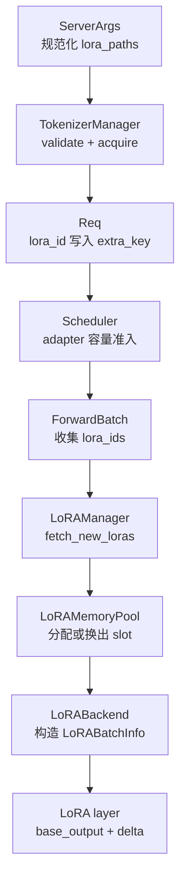

# LoRA · 源码走读

## 读者任务

这篇沿一条真实请求走源码：用户请求带着 `lora_path` 进入 TokenizerManager，先被解析成内部 `lora_id`，再进入 `Req.extra_key`、Scheduler 准入、`ForwardBatch.lora_ids`、`LoRAMemoryPool` GPU 槽位、`LoRABatchInfo`，最后在 LoRA 包装层里执行 `base_output + LoRA delta`。

读完要能做三件事：

- 判断一个 LoRA 请求失败在控制面、调度准入、GPU slot 还是 kernel metadata。
- 解释为什么同 prompt 不同 adapter 不能共享同一个 prefix cache key。
- 改 LoRA backend 或 target module 时，知道必须同时检查 rank、scaling、slot、segment 和 TP 切片。

## 长文读法

这篇按 adapter 身份流转读：启动参数先决定 LoRA 是否可服务并规范化 `LoRARef`，TokenizerManager 把用户传入的 adapter 名称解析成内部 `lora_id`，`Req.extra_key` 用它隔离 prefix cache，Scheduler 用它做 batch 准入，ForwardBatch 和 LoRAManager 再把它转换成 GPU memory pool slot 与 backend 需要的 `weight_indices/rank/scaling/segment` 元数据。

| 读者任务 | 先读 | 要抓住的判断 |
|----------|------|--------------|
| 首次建立 LoRA serving 主线 | 贯穿场景、第 1 到 2 步 | 控制面先把用户名称映射为当前加载生命周期的 `lora_id`，未启用 LoRA 的请求会在这里失败 |
| 排查 prefix cache 污染 | 第 3 步 | `lora_id` 会拼进 `extra_key`，同 prompt 不同 adapter 不能共享同一个 cache namespace |
| 排查请求进不了 batch | 第 4 到 6 步 | Scheduler 先看 running adapters，再让 LoRAManager 校验 `max_loras_per_batch`、pinned adapter 和 overlap loading |
| 排查 GPU slot 或 eviction | 第 7 步 | MemoryPool 优先空槽，满了才按策略换出，并且不能换出当前 batch 或 pinned adapter |
| 排查 kernel metadata 错位 | 第 8 到 9 步 | backend 看到的是 `weight_indices`、rank、scaling、segment；缺失 uid 当前会静默保留 slot 0 |
| 改 LoRA target module 或 backend | 第 9 到 11 步、运行验证 | 包装层负责 `base_output + delta`；还要覆盖 lm_head pruning/logprob 分块与失败回滚 |

读的时候保持四层分开：控制面解析 adapter，调度面限制 adapter 组合，内存面把 adapter 放进 GPU slot，执行面只消费 batch metadata 和 LoRA buffer。

## 贯穿场景

假设服务端启动时预加载一个 adapter：

- `--enable-lora`
- `--lora-paths math=/models/math-lora`
- `--max-loras-per-batch 4`
- `--lora-target-modules q_proj v_proj`

随后用户发来一个 generate 请求，字段里带 `lora_path="math"`。源码主线如下：



只要沿这条链看，LoRA serving 就不是一堆分散文件，而是一条 adapter 身份到 GPU 槽位的转换流水线。

## 第 1 步：启动参数先决定 LoRA 是否可服务

`--lora-paths` 为了向后兼容会自动打开 `enable_lora`，但如果用户显式关掉 LoRA，源码会保留关闭状态并警告。这里是整条链的第一道门：没有启用 LoRA，后面的请求解析会直接拒绝。

```python
# 来源：python/sglang/srt/server_args.py L7184-L7194
        # Enable LoRA if any LoRA paths are provided for backward compatibility.
        if self.lora_paths:
            if self.enable_lora is None:
                self.enable_lora = True
                logger.warning(
                    "--enable-lora is set to True because --lora-paths is provided."
                )
            elif self.enable_lora is False:
                logger.warning(
                    "--enable-lora is set to False, any provided lora_paths will be ignored."
                )
```

同一个启动阶段还校验 speculative decoding 兼容性。当前 LoRA 只允许 `NGRAM` 或不开 speculative decoding。

```python
# 来源：python/sglang/srt/server_args.py L7211-L7215
            # Validate compatibility with speculative decoding
            if self.speculative_algorithm not in ["NGRAM", None]:
                raise ValueError(
                    "Currently LoRA is only compatible with NGRAM speculative decoding."
                )
```

接着 `--lora-paths` 被规范化成 `LoRARef`。`name=path` 形式会用 name 和 path 生成 deterministic `lora_id`，这是多节点启动时保持 adapter 身份一致的关键。

```python
# 来源：python/sglang/srt/server_args.py L7217-L7229
            # Parse lora_paths
            if isinstance(self.lora_paths, list):
                lora_paths = self.lora_paths
                self.lora_paths = []
                for lora_path in lora_paths:
                    if isinstance(lora_path, str):
                        if "=" in lora_path:
                            name, path = lora_path.split("=", 1)
                            lora_ref = LoRARef(
                                lora_id=LoRARef.deterministic_id(name, path),
                                lora_name=name,
                                lora_path=path,
                                pinned=False,
```

如果没有初始 adapter，服务端仍然可以支持后续动态加载，但必须给出 `max_lora_rank` 和 `lora_target_modules`。原因是 memory pool 需要在模型侧提前知道最大形状和目标模块。

```python
# 来源：python/sglang/srt/server_args.py L7283-L7293
            # Ensure sufficient information is provided for LoRA initialization.
            assert self.lora_paths or (
                self.max_lora_rank and self.lora_target_modules
            ), "When no initial --lora-paths is provided, you need to specify both --max-lora-rank and --lora-target-modules for LoRA initialization."

            # Validate max_loaded_loras
            if self.max_loaded_loras is not None:
                assert self.max_loaded_loras >= self.max_loras_per_batch, (
                    "max_loaded_loras should be greater than or equal to max_loras_per_batch. "
                    f"max_loaded_loras={self.max_loaded_loras}, max_loras_per_batch={self.max_loras_per_batch}"
                )
```

这个阶段的系统压力是启动时必须定下 GPU buffer 的最大形状，不能等第一个请求来了才发现 rank 或 target module 无法容纳。

## 第 2 步：TokenizerManager 把用户名字换成 `lora_id`

TokenizerManager 初始化时创建 `LoRARegistry`，并把初始 adapter 放进 `lora_ref_cache`。源码注释明确说 registry 是用户友好名称到内部唯一 ID 的事实源。

```python
# 来源：python/sglang/srt/managers/tokenizer_manager.py L475-L486
        # LoRA
        # Initialize the `LoRARegistry` with initial LoRA adapter paths provided in `server_args`.
        # The registry dynamically updates as adapters are loaded / unloaded during runtime. It
        # serves as the source of truth for available adapters and maps user-friendly LoRA names
        # to internally used unique LoRA IDs.
        self.lora_registry = LoRARegistry(self.server_args.lora_paths)
        # Lock to serialize LoRA update operations.
        # Please note that, unlike `model_update_lock`, this does not block inference, allowing
        # LoRA updates and inference to overlap.
        self.lora_update_lock = asyncio.Lock()
        # A cache for mapping the lora_name for LoRA adapters that have been loaded at any
        # point to their latest LoRARef objects, so that they can be
```

请求侧如果带了 `lora_path`，但服务端没有启用 LoRA，会在这里直接报错。这个错误属于控制面配置问题，不是 scheduler 或 kernel 问题。

```python
# 来源：python/sglang/srt/managers/tokenizer_manager.py L2778-L2794
        if not obj.lora_path:
            return

        if not self.server_args.enable_lora:
            first_adapter = (
                obj.lora_path
                if isinstance(obj.lora_path, str)
                else next((a for a in obj.lora_path if a), None)
            )

            raise ValueError(
                f"LoRA adapter '{first_adapter}' was requested, but LoRA is not enabled. "
                "Please launch the server with --enable-lora flag and preload adapters "
                "using --lora-paths or /load_lora_adapter endpoint."
            )

        await self._resolve_lora_path(obj)
```

`_resolve_lora_path` 还会尝试把曾经加载过、后来被 unregister 的 adapter 重新 load 回来。历史 `lora_ref_cache` 保存的是 name/path/pinned；重新调用动态 load 时会构造新的 `LoRARef`，因此动态 unload/reload 后内部 `lora_id` 会变化。最后一步才是 `LoRARegistry.acquire`，它把请求字段 `lora_path`（实际承载 adapter 名称）换成当前 `lora_id` 并开始引用计数。

```python
# 来源：python/sglang/srt/managers/tokenizer_manager.py L2811-L2833
        # Reload all existing LoRA adapters that have been dynamically unloaded
        unregistered_loras = await self.lora_registry.get_unregistered_loras(
            unique_lora_paths
        )
        for lora_path in unregistered_loras:
            if lora_path is None:
                continue

            if lora_path not in self.lora_ref_cache:
                raise ValueError(
                    f"Got LoRA adapter that has never been loaded: {lora_path}\n"
                    f"All loaded adapters: {self.lora_ref_cache.keys()}."
                )

            logger.info(f"Reloading evicted adapter: {lora_path}")
            new_lora_ref = self.lora_ref_cache[lora_path]
            load_result = await self.load_lora_adapter(
                LoadLoRAAdapterReqInput(
                    lora_name=new_lora_ref.lora_name,
                    lora_path=new_lora_ref.lora_path,
                    pinned=new_lora_ref.pinned,
                )
            )
```

```python
# 来源：python/sglang/srt/managers/tokenizer_manager.py L2842-L2848
        # Look up the LoRA ID from the registry and start tracking ongoing LoRA requests.
        obj.lora_id = await self.lora_registry.acquire(obj.lora_path)
        # Propagate lora_id to any sub-objects already cached by __getitem__.
        for i, sub_obj in obj.__dict__.get("_sub_obj_cache", {}).items():
            sub_obj.lora_id = (
                obj.lora_id[i] if isinstance(obj.lora_id, list) else obj.lora_id
            )
```

注意这里的 adapter 名字仍然是请求侧语言，`lora_id` 才是后续 scheduler、cache 和执行面使用的身份。

## 第 3 步：`Req` 把 `lora_id` 写进 cache namespace

TokenizerManager 构造 tokenized request 时会把 `obj.lora_id` 放进 `Req`。`Req.__init__` 里再把它拼到 `extra_key`。

```python
# 来源：python/sglang/srt/managers/tokenizer_manager.py L1160-L1167
                rid=obj.rid,
                http_worker_ipc=obj.http_worker_ipc,
                bootstrap_host=obj.bootstrap_host,
                bootstrap_port=obj.bootstrap_port,
                bootstrap_room=bootstrap_room,
                lora_id=obj.lora_id,
                input_embeds=input_embeds,
                positional_embed_overrides=obj.positional_embed_overrides,
```

```python
# 来源：python/sglang/srt/managers/schedule_batch.py L782-L789
        # extra key for classifying the request (e.g. cache_salt)
        if lora_id is not None:
            extra_key = (
                extra_key or ""
            ) + lora_id  # lora_id is concatenated to the extra key

        self.extra_key = extra_key
        self.lora_id = lora_id
```

这一步很容易被忽略。它证明 LoRA 不只是 forward 时加一个 delta，而是会改变 prefix cache 的 key 空间。否则同一 token 前缀在不同 adapter 下会复用错误的 KV。

## 第 4 步：Scheduler 先算本轮正在占用哪些 adapter

调度器在从 waiting queue 拉请求前，先统计 running batch 和已经可运行请求里的 `lora_id`。如果启用了 drainer，还会更新每个 adapter 的等待和运行状态。

```python
# 来源：python/sglang/srt/managers/scheduler.py L2827-L2838
        if self.enable_lora:
            running_loras = {
                req.lora_id for req in self.running_batch.reqs if not req.finished()
            }
            # Account for LoRAs that are already loaded in the adder, such as chunked requests
            running_loras.update(req.lora_id for req in adder.can_run_list)

            if self.lora_drainer:
                self.lora_drainer.update_draining_state(
                    self.waiting_queue,
                    self.running_batch.reqs,
                )
```

之后每个 waiting request 都要过 `_can_schedule_lora_req`。这不是单纯检查请求数量，而是检查“当前 running adapters 加上这个 request 的 adapter”是否还能被 memory pool 容量支持。

```python
# 来源：python/sglang/srt/managers/scheduler.py L2998-L3024
    def _can_schedule_lora_req(
        self, req: Req, running_loras: set[Optional[str]]
    ) -> bool:
        """
        Check if a LoRA request can be scheduled.

        This method checks two conditions:
        1. The drainer allows scheduling (based on draining state)
        2. The LoRA adapter can be loaded (either already running or can be added)
        """
        if self.lora_drainer and not self.lora_drainer.can_schedule(req):
            return False

        if req.lora_id in running_loras:
            return True

        if self.enable_lora_overlap_loading:
            # For overlapping loading of LoRA weights with computation, we will load each
            # adapter one at a time, as opposed to loading them in one batch
            return self.lora_overlap_loader.try_overlap_load_lora(
                req.lora_id, running_loras
            )
        else:
            new_lora_set = {req.lora_id} | running_loras
            return self.tp_worker.model_runner.lora_manager.validate_lora_batch(
                new_lora_set
            )
```

系统压力在这里变成 batch packing：如果盲目把更多请求塞进 batch，吞吐看起来更高，但 GPU LoRA slot 会装不下，或者 pinned adapter 把可换出的槽位挤没。

## 第 5 步：ForwardBatch 把请求身份带到执行面

`ForwardBatch` 是模型执行对象，不应理解为与调度状态永久隔离的深拷贝快照。构造时它从 `batch.reqs` 收集 `lora_ids`，再在 LoRA 打开时调用 `fetch_new_loras` 和 `prepare_lora_batch`。

```python
# 来源：python/sglang/srt/model_executor/forward_batch_info.py L711-L718
            # Host-side metadata
            top_logprobs_nums=batch.top_logprobs_nums,
            token_ids_logprobs=batch.token_ids_logprobs,
            mm_inputs=batch.multimodal_inputs,
            encoder_cached=batch.encoder_cached,
            encoder_lens_cpu=batch.encoder_lens_cpu,
            lora_ids=[req.lora_id for req in batch.reqs],
            rids=[req.rid for req in batch.reqs],
```

```python
# 来源：python/sglang/srt/model_executor/forward_batch_info.py L858-L865
        # Init lora information
        if model_runner.server_args.enable_lora:
            # In the non-LoRA overlap loading case, we fetch LoRA adapters into the memory pool
            # as a batch, right before running the batch
            if not model_runner.server_args.enable_lora_overlap_loading:
                model_runner.lora_manager.fetch_new_loras(set(ret.lora_ids))

            model_runner.lora_manager.prepare_lora_batch(ret)
```

如果启用 overlap loading，adapter 可能已经在调度阶段异步搬入 memory pool；如果没启用，则在执行前按本 batch 一次性 fetch。

## 第 6 步：LoRAManager 先做 batch 容量校验

`validate_lora_batch` 先看 batch 内唯一 uid 数量是否超过 `max_loras_per_batch`，再把 pinned adapter 从可换出槽位里扣掉。uid 集合包含 base model 的 `None`；所以“4 个 LoRA + base”需要 5 个并发 slot，而不是把 base 当作免费路径。这里解释了为什么 pinned adapter 太多会让普通请求或 base model 饥饿。

```python
# 来源：python/sglang/srt/lora/lora_manager.py L273-L302
    def validate_lora_batch(self, lora_ids: set[Optional[str]]) -> bool:
        """
        Validate if the LoRA IDs in the batch can be loaded into the current LoRA memory pool.
        """
        if len(lora_ids) > self.max_loras_per_batch:
            return False

        # skip pinned LoRA check if no pinned LoRA adapters are loaded.
        if self.num_pinned_loras == 0:
            return True

        # counting the number of pinned LoRA adapters in the batch.
        pinned_loras_in_batch = 0
        for lora_id in lora_ids:
            if lora_id is not None:
                lora_ref = self.lora_refs.get(lora_id)
                assert (
                    lora_ref is not None
                ), f"LoRA ID {lora_id} not found in lora_refs."
                pinned_loras_in_batch += int(lora_ref.pinned)

        assert pinned_loras_in_batch <= self.num_pinned_loras, (
            f"Number of pinned LoRA adapters in the batch ({pinned_loras_in_batch}) exceeds the total number of pinned adapters "
            f"({self.num_pinned_loras}). This indicates a bug in the LoRA loading logic."
        )

        required_slots = len(lora_ids) - pinned_loras_in_batch
        mem_pool_vacancy = self.memory_pool.max_loras_per_batch - self.num_pinned_loras

        return required_slots <= mem_pool_vacancy
```

通过校验后，`fetch_new_loras` 把当前 batch 要用的 uid 集合交给 memory pool。这里传入的是 `self.loras`、`self.lora_modules` 和 LoRARef 快照，说明 memory pool 只负责把已有 adapter 权重装进 slot，不负责从用户请求解析 adapter。

```python
# 来源：python/sglang/srt/lora/lora_manager.py L304-L318
    def fetch_new_loras(
        self, new_loras: set[Optional[str]], running_loras: set[Optional[str]] = set()
    ):
        # Load active loras into lora memory pool
        cur_uids = new_loras | running_loras

        assert len(cur_uids) <= self.max_loras_per_batch
        self.memory_pool.prepare_lora_batch(
            cur_uids=cur_uids,
            lora_adapters=self.loras,
            lora_modules=self.lora_modules,
            lora_refs=self.lora_refs.copy(),  # copy snapshot of current lora_refs to avoid mutation during the batch preparation.
            lora_embed_tokens_module=self.embed_tokens_module,  # merge into embedding or lora module
            lora_lm_head_module=self.lm_head_module,  # merge into embedding or lora module
        )
```

## 第 7 步：MemoryPool 分配槽位，满了才 eviction

memory pool 先找空槽。满了以后才从非当前 batch、非 pinned 的候选里选 victim。源码还特别优先换出真实 LoRA adapter，而不是 base model 的 `None` 槽位。

```python
# 来源：python/sglang/srt/lora/mem_pool.py L683-L724
        def get_available_buffer_slot():
            # 1. Prioritize empty slots
            for buffer_id in range(self.max_loras_per_batch):
                if self.buffer_id_to_uid[buffer_id] == EMPTY_SLOT:
                    return buffer_id

            # 2. Memory pool is full, need to evict using policy
            candidates = set()

            for buffer_id in range(self.max_loras_per_batch):
                uid = self.buffer_id_to_uid[buffer_id]

                # Skip if this adapter is needed by current batch
                if uid in cur_uids:
                    continue

                # Skip if this adapter is pinned
                if uid is not None:
                    lora_ref = lora_refs.get(uid)
                    if lora_ref and lora_ref.pinned:
                        continue

                candidates.add(uid)

            if not candidates:
                raise ValueError(
                    "No available buffer slots found. Please ensure the number of active (pinned) loras is less than max_loras_per_batch."
                )

            # Prefer evicting LoRA adapters over the base model (None).
            # Only evict None when the batch consists entirely of LoRA requests
            # and no other adapters can be evicted.
            non_none_candidates = candidates - {None}
            if non_none_candidates:
                # Prioritize evicting actual LoRA adapters
                candidates_to_use = non_none_candidates
            else:
                # Only None is available for eviction (batch is all LoRA requests)
                candidates_to_use = candidates

            # Select victim using eviction policy
            victim_uid = self.eviction_policy.select_victim(candidates_to_use)
```

加载权重时，如果某个目标权重不存在，buffer 被清零，避免继承上一个被换出 adapter 的残留值。shape 不匹配则 assert，这类问题通常来自 rank、target module 或 TP 切片错误。

```python
# 来源：python/sglang/srt/lora/mem_pool.py L764-L775
        def load_lora_weight_tensor(
            buffer_view: torch.Tensor, weight: Optional[torch.Tensor]
        ):
            if weight is None:
                # If the particular weight is not present in the adapter, we initialize the buffer to zero
                # to avoid contamination from the residual weight of the evicted adapters.
                buffer_view.zero_()
            else:
                assert (
                    buffer_view.shape == weight.shape
                ), f"LoRA buffer shape {buffer_view.shape} does not match weight shape {weight.shape}."
                copy_weight_into_buffer(buffer_view, weight)
```

这里是 GPU slot 正确性的核心：slot 不是只要分配了就安全，还必须保证缺失权重清零、存在权重 shape 完全匹配。

## 第 8 步：`lora_id` 转成 backend 的 `weight_indices`

`LoRAManager.prepare_lora_batch` 会为每个 request 生成一个 `weight_indices`，也就是这个 request 应该读取哪个 GPU slot。rank 和 scaling 则按 slot 存在数组里。

```python
# 来源：python/sglang/srt/lora/lora_manager.py L320-L352
    def prepare_lora_batch(self, forward_batch: ForwardBatch):
        # set up batch info shared by all lora modules
        bs = forward_batch.batch_size

        use_cuda_graph = (
            hasattr(self, "max_bs_in_cuda_graph")
            and bs <= self.max_bs_in_cuda_graph
            and forward_batch.forward_mode.is_cuda_graph()
        )

        weight_indices = [0] * len(forward_batch.lora_ids)
        lora_ranks = [0] * self.max_loras_per_batch
        scalings = [0] * self.max_loras_per_batch
        for i, uid in enumerate(forward_batch.lora_ids):
            if uid not in self.memory_pool.uid_to_buffer_id:
                continue
            weight_indices[i] = self.memory_pool.get_buffer_id(uid)
            if uid is not None:
                lora = self.loras[uid]
                lora_ranks[weight_indices[i]] = lora.config.r
                scalings[weight_indices[i]] = lora.scaling
        # Do in-place updates when CUDA graph is enabled and the batch forward mode
        # could use CUDA graph.
        self.lora_backend.prepare_lora_batch(
            forward_batch=forward_batch,
            weight_indices=weight_indices,
            lora_ranks=lora_ranks,
            scalings=scalings,
            use_cuda_graph=use_cuda_graph,
        )
        self.lora_backend.batch_info.has_active_lora = any(
            lora_ranks[wi] > 0 for wi in weight_indices
        )
```

这一步把“adapter 身份”变成“kernel 可消费的索引”。后面 layers 和 Triton kernel 不再关心 `lora_name` 或 path。需要特别警惕循环里的 `continue`：uid 不在 pool 时不会报错，`weight_indices[i]` 保持初始化值 0；slot 0 若属于其他 adapter，就可能把身份不一致放大成错误 delta。

## 第 9 步：Triton backend 构造 `LoRABatchInfo`

Triton backend 在非 CUDA Graph 路径里创建 `LoRABatchInfo`：每个 request 是一个 segment，`weight_indices` 指明 segment 用哪个 adapter slot，`lora_ranks` 和 `scalings` 提供 per-slot 元数据。

```python
# 来源：python/sglang/srt/lora/backend/triton_backend.py L229-L281
    def prepare_lora_batch(
        self,
        forward_batch: ForwardBatch,
        weight_indices: list[int],
        lora_ranks: list[int],
        scalings: list[float],
        use_cuda_graph: bool,
    ):
        # Use pinned memory to avoid synchronizations during host-to-device transfer
        weight_indices_tensor = torch.tensor(
            weight_indices, dtype=torch.int32, pin_memory=True, device="cpu"
        )
        lora_ranks_tensor = torch.tensor(
            lora_ranks, dtype=torch.int32, pin_memory=True, device="cpu"
        )
        scalings_tensor = torch.tensor(
            scalings, dtype=torch.float, pin_memory=True, device="cpu"
        )

        bs = forward_batch.batch_size

        if use_cuda_graph:
            assert (
                self.cuda_graph_batch_info is not None
            ), "CUDA Graph batch info is not initialized."
            batch_info = self.cuda_graph_batch_info
            batch_info.bs = forward_batch.batch_size
            batch_info.num_segments = forward_batch.batch_size
        else:
            max_len = (
                # Calculate max_len from the CPU copy to avoid D2H transfer.
                max(forward_batch.extend_seq_lens_cpu)
                if forward_batch.forward_mode.is_extend()
                else 1
            )
            seg_lens = (
                forward_batch.extend_seq_lens
                if forward_batch.forward_mode.is_extend()
                else torch.ones(bs, dtype=torch.int32, device=self.device)
            )
            seg_indptr = torch.zeros((bs + 1,), dtype=torch.int32, device=self.device)
            seg_indptr[1:] = torch.cumsum(seg_lens, dim=0)

            batch_info = LoRABatchInfo(
                bs=forward_batch.batch_size,
                num_segments=forward_batch.batch_size,
                max_len=max_len,
                use_cuda_graph=False,
                seg_lens=seg_lens,
                seg_indptr=seg_indptr,
                weight_indices=torch.empty(
                    (bs,), dtype=torch.int32, device=self.device
                ),
```

decode 路径还会按 adapter 对 token 排序，构建合并后的 sgemm segments。这说明 LoRA backend 不是每个 token 独立发 kernel，而是试图把同 adapter 的行合起来提升效率。

```python
# 来源：python/sglang/srt/lora/backend/triton_backend.py L186-L215
    def compute_sgemm_routing(self, use_cuda_graph: bool):
        """Sort tokens by adapter and build merged segments for sgemm LoRA."""
        bi = self.batch_info
        bs = bi.bs
        mlpb = self.max_loras_per_batch
        wi = bi.weight_indices[:bs]

        perm = torch.argsort(wi, stable=True).to(torch.int32)
        sorted_wi = wi[perm]
        adapter_ids = torch.arange(mlpb, device=wi.device, dtype=torch.int32)
        seg_starts = torch.searchsorted(sorted_wi, adapter_ids)
        seg_ends = torch.searchsorted(sorted_wi, adapter_ids, right=True)
        seg_lens = seg_ends - seg_starts

        if use_cuda_graph:
            sgemm = getattr(self, "cuda_graph_sgemm_batch_info", None)
            if sgemm is None:
                return
            sgemm.permutation[:bs] = perm
            sgemm.seg_lens[:] = seg_lens
            sgemm.seg_indptr[0:1].zero_()
            torch.cumsum(sgemm.seg_lens, dim=0, out=sgemm.seg_indptr[1:])
            sgemm.max_len = bs
            sgemm.lora_ranks[:mlpb] = bi.lora_ranks[:mlpb]
            sgemm.scalings[:mlpb] = bi.scalings[:mlpb]
        else:
            seg_indptr = torch.zeros(mlpb + 1, dtype=torch.int32, device=wi.device)
            seg_indptr[1:] = torch.cumsum(seg_lens, dim=0)
            sgemm = LoRABatchInfo(
                bs=mlpb,
```

`LoRABatchInfo` 本身也暴露了后续 layers 需要的字段：segment、slot、rank、scaling、per-request 映射、MoE LoRA 信息和 `has_active_lora`。

```python
# 来源：python/sglang/srt/lora/utils.py L27-L63
@dataclass
class LoRABatchInfo:
    # The forward mode is using CUDA Graph.
    use_cuda_graph: bool

    # Batch size
    bs: int

    # Number of segments. For triton backend, it is equal to batch size.
    num_segments: int

    # Indice pointers of each segment in shape (num_segments + 1, )
    seg_indptr: torch.Tensor

    # The index of lora adapter used by each segment, in shape (num_segments,)
    weight_indices: torch.Tensor

    # ranks of each lora adapter, in shape (lora_num,)
    lora_ranks: torch.Tensor

    # scaling of each lora adapter, in shape (lora_num,)
    scalings: torch.Tensor

    # Maximum segment length of current batch
    max_len: Optional[int]

    # Lengths of each segments in shape (num_segments,)
    seg_lens: Optional[torch.Tensor]

    # The logical (re)ordering of input rows (tokens), in shape (num_tokens,)
    permutation: Optional[torch.Tensor]

    # Total number of tokens this batch info expects (host-side int).
    # Used by lm_head LoRA to validate input shape without GPU sync.
    expected_tokens: Optional[int] = None

    # CPU-side flag: True when at least one request uses a LoRA adapter.
```

## 第 10 步：包装层把 LoRA delta 加回 base output

ColumnParallelLinear 的 LoRA wrapper 保留 base layer 原始 quant method 计算，再在 `set_lora` 时调用 `apply_lora`。也就是说 LoRA 没有替代 base linear，而是在 base output 上加 delta。

```python
# 来源：python/sglang/srt/lora/layers.py L462-L477
    def forward(self, input_: torch.Tensor):
        # duplicate the logic in ColumnParallelLinear
        bias = self.base_layer.bias if not self.base_layer.skip_bias_add else None
        output_parallel = self.base_layer.quant_method.apply(
            self.base_layer, input_, bias
        )

        if self.set_lora:
            output_parallel = self.apply_lora(output_parallel, input_)

        if self.base_layer.gather_output:
            output = tensor_model_parallel_all_gather(output_parallel)
        else:
            output = output_parallel
        output_bias = self.base_layer.bias if self.base_layer.skip_bias_add else None
        return output, output_bias
```

对于 gate/up 或 QKV 这类 fused projection，wrapper 根据 slice 数选择专门 backend 路径。你在这里看到的是“层类型差异”，不是请求侧 LoRA 语义差异。

```python
# 来源：python/sglang/srt/lora/layers.py L551-L573
    def apply_lora(self, base_output: torch.Tensor, x: torch.Tensor) -> torch.Tensor:
        lora_n_slices = self._get_lora_n_slices()
        if lora_n_slices == 2 and self.use_gate_up_lora:
            lora_output = self.lora_backend.run_gate_up_lora(
                x=x,
                gate_up_lora_a=self.A_buffer,
                gate_up_lora_b=self.B_buffer,
                output_offset=self.output_offset,
                output_offset_cpu=self.output_offset_cpu,
                base_output=base_output,
            )
        else:
            lora_output = self.lora_backend.run_qkv_lora(
                x=x,
                qkv_lora_a=self.A_buffer,
                qkv_lora_b=self.B_buffer,
                output_offset=self.output_offset,
                output_offset_cpu=self.output_offset_cpu,
                max_qkv_out_dim=self.max_out_dim,
                base_output=base_output,
                n_slices=lora_n_slices,
            )
        return lora_output
```

到这里，一条请求完成了从 `lora_path="math"` 到某个 `weight_indices[i]` 的转换。kernel 不再知道用户名字，只知道第 i 个 segment 使用第几个 LoRA buffer slot。

## 第 11 步：两条少见路径暴露当前基线缺陷

### `strict_loading=False` 不保证未知权重只 warning 后跳过

Memory pool 会先收集不匹配 target modules 的权重名：strict 模式抛错，非 strict 模式记录 warning。但后续真实加载循环再次对每个 `layer_weights` 调用 `get_target_module_name`，没有跳过预检标记的名称。因此遇到真正无法匹配的 layer weight 时，非 strict 路径仍可能抛 `ValueError`。学习和排障文档不能把它承诺成稳定的 permissive mode。

```python
# 来源：python/sglang/srt/lora/mem_pool.py L792-L807
        # Pre-validate weight names against target modules across all layers
        # and embedding weights.  This catches mismatches before any GPU
        # buffers are mutated.
        skipped_weight_names: set = set()
        matched_modules: set = set()
        all_weight_names: list = []
        for layer in lora_adapter.layers:
            all_weight_names.extend(layer.weights.keys())
        if lora_adapter.embedding_layers:
            all_weight_names.extend(lora_adapter.embedding_layers.keys())
        for name in all_weight_names:
            try:
                target_module = get_target_module_name(name, self.target_modules)
                matched_modules.add(target_module)
            except ValueError:
                skipped_weight_names.add(name)
```

```python
# 来源：python/sglang/srt/lora/mem_pool.py L847-L848
            for name, weights in layer_weights.items():
                target_module = get_target_module_name(name, self.target_modules)
```

### Triton lm_head + chunked input logprobs 有列表所有权错误

当 extend 请求启用 input logprobs，且 pruned token 总数超过 logprobs chunk size 时，Triton backend 创建局部 `lm_head_pass_batch_infos = []`，却向 `self.lm_head_pass_batch_infos` append。该成员首轮由 backend 初始化为 `None`，所以可触发 `AttributeError: 'NoneType' object has no attribute 'append'`；即便成员残留旧列表，函数最后返回的仍是新的空局部列表。

```python
# 来源：python/sglang/srt/lora/backend/triton_backend.py L324-L350
        lm_head_pass_batch_infos = None

        if pruned_lens is not None:
            pruned_total = sum(pruned_lens)
            lm_head_segments = merge_and_chunk_segments(
                weight_indices, pruned_lens, chunk_size=pruned_total
            )
            lm_head_batch_info = self._build_lm_head_batch_info(
                lm_head_segments, batch_info, pruned_total
            )

            # Precompute per-pass batch_infos for logprobs chunking
            pass_segments = self._get_lm_head_pass_segments(weight_indices, pruned_lens)
            if pass_segments is not None:
                lm_head_pass_batch_infos = []
                for seg_wi, seg_lens_list in pass_segments:
                    pass_total = sum(seg_lens_list)
                    merged_segments = merge_and_chunk_segments(
                        seg_wi, seg_lens_list, chunk_size=pass_total
                    )
                    self.lm_head_pass_batch_infos.append(
                        self._build_lm_head_batch_info(
                            merged_segments, batch_info, pass_total
                        )
                    )

        return lm_head_batch_info, lm_head_pass_batch_infos
```

## 运行验证

基础主线验证不需要改源码。启动服务时打开 LoRA，并预加载一个 adapter：

```powershell
python -m sglang.launch_server --model-path <base-model> --enable-lora --lora-paths math=<adapter-path> --max-loras-per-batch 4 --lora-target-modules q_proj v_proj
```

然后做三组请求：

| 请求 | 预期现象 |
|------|----------|
| 不带 `lora_path` | 使用 base model；`ForwardBatch.lora_ids` 中对应项为 `None` |
| 带 `lora_path="math"` | 请求通过 registry acquire；`Req.extra_key` 追加 `lora_id`；`LoRAManager.prepare_lora_batch` 中该请求映射到非 base slot |
| 带从未加载过的 adapter 名称 | `_resolve_lora_path` 报 “has never been loaded” 或 registry 报 “not loaded” |

排障时可以在这些位置打断点：

| 断点 | 看什么 |
|------|--------|
| `TokenizerManager._resolve_lora_path` | `obj.lora_path` 是否能变成 `obj.lora_id` |
| `Req.__init__` | `extra_key` 是否拼入 `lora_id` |
| `Scheduler._can_schedule_lora_req` | `running_loras` 与 `max_loras_per_batch` 是否冲突 |
| `LoRAMemoryPool.prepare_lora_batch` | `uid_to_buffer_id` 是否已有 slot 或触发 eviction |
| `TritonLoRABackend.prepare_lora_batch` | `weight_indices`、`lora_ranks`、`scalings` 是否一致 |
| `TritonLoRABackend._prepare_lm_head_batch_info` | chunked input logprobs 时是否触发 `NoneType.append` |

## 复盘

LoRA serving 的主线不是文件顺序，而是 adapter 身份逐步变成 GPU slot 的过程；`lora_id` 同时承担请求身份、cache namespace 和执行面 uid。Scheduler 只负责 LoRA 准入，不负责加载权重；`LoRAMemoryPool` 则靠“不换出当前 batch、不换出 pinned adapter、缺失权重清零”守住槽位安全。backend 和 layer 只消费 batch metadata，因此 adapter 名称错误通常应该先查 TokenizerManager 和 registry。当前基线对缺失 pool uid、non-strict unknown weight、Triton lm_head chunked logprobs 的防御不足，验证不能止于普通 decode。

下一篇 [[SGLang-LoRA-数据流]] 会把这条主线拆成身份、cache、slot、动态更新和失败恢复五条流。
