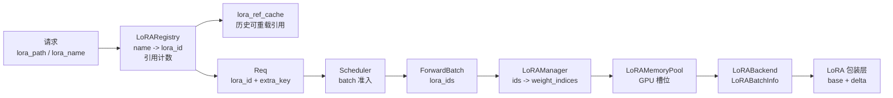

# LoRA

## 读者任务

这一组笔记解决一个很具体的问题：同一个 base model 如何在一套 serving 实例里同时服务多个 LoRA adapter，并且不让请求路由、prefix cache、GPU 权重槽位和 kernel metadata 互相串线。

读完要能做五件事：

- 看到请求里的 `lora_path`，能追到 `LoRARegistry.acquire` 生成的内部 `lora_id`。
- 看到 `max_loras_per_batch` 拦住请求，能判断是 batch 内 adapter 容量、pinned adapter 还是 drainer 在起作用。
- 看到输出疑似串 adapter，能先检查 `Req.extra_key` 是否把 `lora_id` 纳入 RadixCache namespace。
- 准备改 LoRA backend 或 MoE LoRA 时，能分清 `LoRAManager`、`LoRAMemoryPool`、`LoRABackend` 和 LoRA 包装层各自负责什么。
- 处理动态 load/unload 失败时，能判断 registry、`lora_ref_cache`、CPU adapter 字典和 GPU slot 哪些已经改变、哪些没有回滚。

## 先建立模型

LoRA 在 SGLang 里不是“把某个 adapter 临时套到模型上”这么简单。更准确的模型是：每个请求带着一张 adapter 登机牌，控制面先把名称换成本次加载生命周期内有效的内部 ID，调度器确认本轮航班能坐下这些 uid，执行面再把对应权重搬进 GPU 槽位，kernel 只看槽位编号。



这张图是本专题的主线。控制面 registry 回答“哪个名称当前可 acquire、谁正在用”；`lora_ref_cache` 还会保留已经 unregister 的历史引用，以便请求触发隐式 reload。执行面回答“本 batch 要用哪些槽位、每个 token 该读哪组 A/B 权重”。这些状态通过 fan-out 最终一致，而不是一个原子事务。

## 阅读顺序

| 目标 | 先读 |
|------|------|
| 第一次建立整体模型 | [[SGLang-LoRA-核心概念]] |
| 沿一个请求追源码 | [[SGLang-LoRA-源码走读]] |
| 看动态加载、cache namespace、GPU slot 生命周期 | [[SGLang-LoRA-数据流]] |
| 排查加载失败、容量不足、输出串 adapter、MoE shape 问题 | [[SGLang-LoRA-排障指南]] |
| 自检是否真正读懂 | [[SGLang-LoRA-学习检查]] |

## 源码范围

主线源码集中在这些文件：

| 责任 | 源码入口 |
|------|----------|
| CLI 与配置准入 | `python/sglang/srt/server_args.py` |
| 请求侧 LoRA 名称解析 | `python/sglang/srt/managers/tokenizer_manager.py` |
| 动态加载与卸载 API | `python/sglang/srt/managers/tokenizer_control_mixin.py`、`python/sglang/srt/entrypoints/http_server.py` |
| 调度准入 | `python/sglang/srt/managers/scheduler.py` |
| 请求对象与 prefix cache namespace | `python/sglang/srt/managers/schedule_batch.py` |
| 执行对象与 LoRA 身份载体 | `python/sglang/srt/model_executor/forward_batch_info.py` |
| 执行面管理器 | `python/sglang/srt/model_executor/model_runner.py`、`python/sglang/srt/lora/lora_manager.py` |
| GPU 槽位与 eviction | `python/sglang/srt/lora/mem_pool.py`、`python/sglang/srt/lora/eviction_policy.py` |
| kernel metadata 与层内计算 | `python/sglang/srt/lora/backend/triton_backend.py`、`python/sglang/srt/lora/layers.py`、`python/sglang/srt/lora/utils.py` |

## 最小源码证据

`ModelRunner` 只在启用 LoRA 时创建 `LoRAManager`，并把 base model、TP 信息、rank 限制、target modules 和初始 adapter 交给它。也就是说，LoRA 执行面是在模型加载后挂到模型 runner 上的，不是 HTTP API 直接改模型层。

```python
# 来源：python/sglang/srt/model_executor/model_runner.py L2204-L2218
    def init_lora_manager(self):
        self.lora_manager = LoRAManager(
            base_model=self.model,
            base_hf_config=self.model_config.hf_config,
            max_loras_per_batch=self.server_args.max_loras_per_batch,
            load_config=self.load_config,
            dtype=self.dtype,
            server_args=self.server_args,
            lora_backend=self.server_args.lora_backend,
            tp_size=self.tp_size,
            tp_rank=self.tp_rank,
            max_lora_rank=self.server_args.max_lora_rank,
            target_modules=self.server_args.lora_target_modules,
            lora_paths=self.server_args.lora_paths,
        )
```

这段代码给出本专题边界：请求侧 `LoRARegistry` 不负责 GPU 权重，模型侧 `LoRAManager` 不负责用户传入的 adapter 名称解析。还要保留两个失败边界：`LoRAManager` 的加载异常没有清理已经写入的 `configs` 条目；控制面 backend 成功后若 register 或 LRU 收口失败，也没有跨进程回滚。

## 关联专题

- Prefix cache namespace 见 [[SGLang-RadixAttention]]。
- batch 准入与 waiting queue 主线见 [[SGLang-Scheduler]]。
- 模型执行对象、runner view 与 CUDA Graph 选路见 [[SGLang-ModelRunner]]。
- MoE base 层与 expert 并行见 [[SGLang-MoE]]。

## 下一步

先读 [[SGLang-LoRA-核心概念]]。如果你已经在排障，直接跳到 [[SGLang-LoRA-排障指南]] 的症状表。
