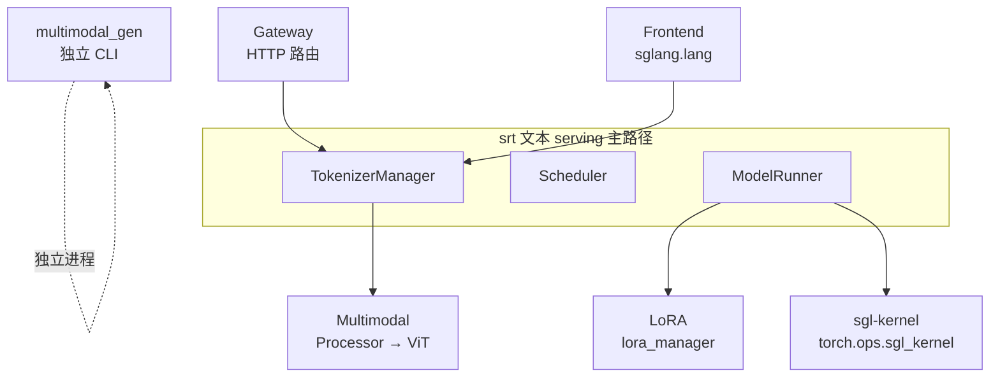

# 扩展组件

> 先用本页判断扩展插入主线的位置；需要修改或确认版本行为时，再回到源码基线 `70df09b` 与测试核对。

---

## 本目录解决什么问题

前面的目录覆盖标准 LLM text serving 主路径。本目录回答：**多模态、LoRA、底层 kernel、Gateway 路由、Frontend DSL、扩散模型** 如何作为可选扩展挂载到同一 Runtime？

| 专题 | 角色 | 关注点 |
|------|------|--------|
| [[SGLang-多模态]] | VLM | Processor 注册、ViT、特殊 token |
| [[SGLang-LoRA]] | 动态 LoRA | LoRAAdapter、MemoryPool、eviction |
| [[SGLang-sgl-kernel]] | CUDA 算子 | attention / MoE / quant custom op |
| [[SGLang-model-gateway]] | 路由网关 | PD 池、负载均衡、Rust gateway |
| [[SGLang-前端语言]] | 编程接口 | `@function`、控制流、Remote |
| [[SGLang-多模态生成]] | 扩散 runtime | 独立 diffusion 子系统 |

---

## 扩展组件与 srt 主路径关系



这张图的读法是：Multimodal 与 LoRA 深度集成在 SRT 内（TokenizerManager mixin、ModelRunner layer）。sgl-kernel 被 SRT 层 import 调用，本身无 Python 推理逻辑。Gateway 是集群前置路由，对 client 暴露统一 endpoint。Frontend 是客户端 SDK，通过 HTTP 调 SRT。multimodal_gen 与 LLM serving 并行，共用 monorepo 但启动路径不同（见 [[SGLang-启动链路]] 的 diffusion 分支）。

**源码锚点：**

```python
## 来源：python/sglang/srt/lora/lora_manager.py L98-L115
        # LoRA backend for running sgemm kernels
        logger.info(f"Using {lora_backend} as backend of LoRA kernels.")
        backend_type = get_backend_from_name(lora_backend)
        self.lora_backend: BaseLoRABackend = backend_type(
            max_loras_per_batch=max_loras_per_batch,
            device=self.device,
            server_args=server_args,
        )

        # Initialize mutable internal state of the LoRAManager.
        self.init_state(
            max_lora_rank=max_lora_rank,
            target_modules=target_modules,
            lora_paths=lora_paths,
        )

    def init_cuda_graph_batch_info(
        self, max_bs_in_cuda_graph: int, num_tokens_per_bs: int
```

读法：

- 动态加载不重启 server；MemoryPool 满时 eviction（见 [[SGLang-LoRA-源码走读]]）。
- API 层 `/load_lora_adapter` 最终调到此 manager。
- MoE 模型有专用 LoRA backend 路径（见 [[SGLang-LoRA-排障指南]]）。

---

## 一句话边界

多模态和 LoRA 改造请求与模型执行，`sgl-kernel` 下沉热点算子，Gateway 位于 worker 之前，Frontend 位于请求发起侧，`multimodal_gen` 则是并列的扩散生成 runtime。先判断扩展位于哪一侧，再进入内部实现。

---

## 推荐阅读顺序

| 顺序 | 文档 | 必读理由 |
|------|------|----------|
| 1 | [[SGLang-多模态-数据流]] | VLM 全链路 |
| 2 | [[SGLang-LoRA-源码走读]] | load / forward 集成 |
| 3 | [[SGLang-sgl-kernel-核心概念]] | 算子分层与 dispatch |
| 4 | [[SGLang-model-gateway-数据流]] | PD 路由 |
| 5 | [[SGLang-前端语言-源码走读]] | IR 与 backend |
| 6 | [[SGLang-多模态生成-核心概念]] | 与 srt 边界 |

---

## 阶段衔接

| 方向 | 模块 | 衔接点 |
|------|------|--------|
| ← 标准 serving 与高级特性 | Sampling、PD、量化、可观测性 | PD 与 Gateway、量化与 kernel 在这里衔接 |
| → 收官 | [[SGLang-总结复盘]] | 回顾主线、设计比较和生产排障 |
| → 排障 | — | [[SGLang-生产排障]] 多模态/LoRA 章节 |

---

## 验证建议（零基础可试）

1. **LoRA：** `/load_lora_adapter` 后带 `lora_path` 请求，对比 base 输出差异。
2. **VLM：** 带 image_url 的 chat 请求，日志应有 multimodal processor 路径。
3. **Gateway：** 本地起 prefill+decode 双节点 + gateway，观察 routing_key（27）。

---

## 模块导航

| 专题 | 入口 |
|------|------|
| Multimodal | [[SGLang-多模态]] |
| LoRA | [[SGLang-LoRA]] |
| sgl-kernel | [[SGLang-sgl-kernel]] |
| model-gateway | [[SGLang-model-gateway]] |
| Frontend lang | [[SGLang-前端语言]] |
| multimodal_gen | [[SGLang-多模态生成]] |

← [[SGLang-高级特性|高级特性]] · → [[SGLang-总结复盘|总结复盘]]
