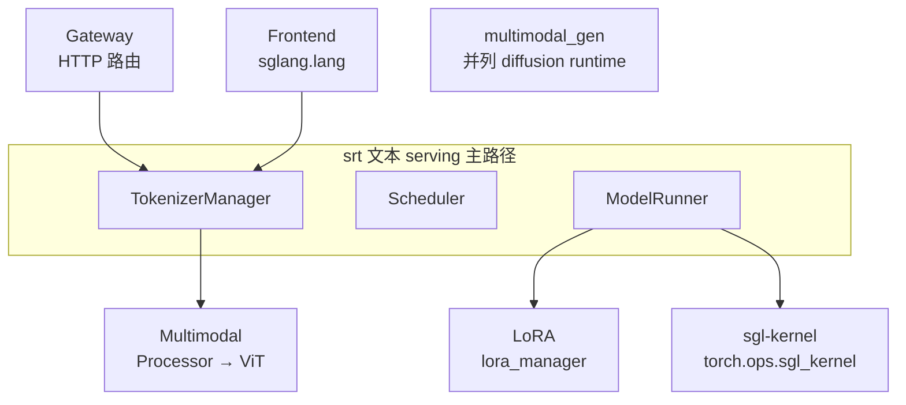

# 扩展组件

> 先用本页判断扩展插入主线的位置；需要修改或确认版本行为时，再回到源码基线 `70df09b` 与测试核对。

---

## 本目录解决什么问题

前面的目录覆盖标准 LLM text serving 主路径。本目录回答：**多模态、LoRA、底层 kernel、Gateway 路由、Frontend DSL、扩散模型** 如何作为可选扩展挂载到同一 Runtime？

| 专题 | 角色 | 关注点 |
|------|------|--------|
| [[SGLang-多模态]] | VLM | Processor 注册、ViT、特殊 token |
| [[SGLang-LoRA]] | 动态 LoRA | adapter CPU 缓存、固定形状 GPU pool、逐 batch metadata |
| [[SGLang-sgl-kernel]] | 算子与 dispatch | attention / MoE / quant kernel 及 Python 调用封装 |
| [[SGLang-model-gateway]] | 路由网关 | PD 池、负载均衡、Rust gateway |
| [[SGLang-前端语言]] | 编程接口 | `@function`、控制流、Remote |
| [[SGLang-多模态生成]] | 扩散 runtime | 独立 diffusion 子系统 |

---

## 扩展组件与 srt 主路径关系



这张图按“扩展插在哪一侧”阅读：Multimodal 改造请求预处理与模型输入；LoRA 替换 ModelRunner 内的目标 module，并在 batch 前准备 adapter metadata；`sgl-kernel` 提供热点 kernel 与 Python dispatch 封装，但不拥有 serving 调度；Gateway 位于 worker 集群之前；Frontend 位于请求发起侧；`multimodal_gen` 与文本 SRT 是同仓库中的并列 runtime，不应画成 SRT 内部的一次函数调用。

下面的源码卡只证明 LoRA manager 的两个构造期动作：选择 kernel backend，并初始化可变 adapter/pool 状态。

```python
# 来源：python/sglang/srt/lora/lora_manager.py L98-L112
        # LoRA backend for running sgemm kernels
        logger.info(f"Using {lora_backend} as backend of LoRA kernels.")
        backend_type = get_backend_from_name(lora_backend)
        self.lora_backend: BaseLoRABackend = backend_type(
            max_loras_per_batch=max_loras_per_batch,
            device=self.device,
            server_args=server_args,
        )

        # Initialize mutable internal state of the LoRAManager.
        self.init_state(
            max_lora_rank=max_lora_rank,
            target_modules=target_modules,
            lora_paths=lora_paths,
        )
```

读法：

- adapter 配置与权重先进入 manager 的 CPU 侧字典；请求运行前，GPU memory pool 再为当前与 running adapter 准备 slot。
- pool 形状由 `max_lora_rank`、target modules、TP 与 embedding/MoE 形式共同约束；新 adapter 不兼容时会在加载阶段拒绝，不能假设任何 adapter 都可热插入。
- pinned adapter 不能占满全部 slot，源码会保留未 pinned adapter 与 base model 的可用空间；具体淘汰策略再进入 [[SGLang-LoRA-源码走读]]。

---

## 一句话边界

多模态和 LoRA 改造请求或模型执行对象，`sgl-kernel` 下沉热点算子与 dispatch，Gateway 位于 worker 之前，Frontend 位于请求发起侧，`multimodal_gen` 则是并列的扩散生成 runtime。先判断状态由客户端、网关、TokenizerManager、ModelRunner、kernel wrapper 还是独立 runtime 持有，再进入内部实现。

---

## 推荐阅读顺序

| 顺序 | 文档 | 必读理由 |
|------|------|----------|
| 1 | [[SGLang-多模态-数据流]] | VLM 全链路 |
| 2 | [[SGLang-LoRA-源码走读]] | load / forward 集成 |
| 3 | [[SGLang-sgl-kernel-核心概念]] | 算子分层与 dispatch |
| 4 | [[SGLang-model-gateway-数据流]] | PD 路由 |
| 5 | [[SGLang-前端语言-源码走读]] | IR 与 backend |
| 6 | [[SGLang-多模态生成-核心概念]] | 与 srt 边界 |

---

## 阶段衔接

| 方向 | 模块 | 衔接点 |
|------|------|--------|
| ← 标准 serving 与高级特性 | Sampling、PD、量化、可观测性 | PD 与 Gateway、量化与 kernel 在这里衔接 |
| → 收官 | [[SGLang-总结复盘]] | 回顾主线、设计比较和生产排障 |
| → 排障 | — | [[SGLang-生产排障]] 多模态/LoRA 章节 |

---

## 验证建议（零基础可试）

1. **LoRA：** 用服务支持的 adapter 名称/路径加载接口加载兼容 adapter，再分别发送 base 与 LoRA 请求；预期加载结果列出 adapter，且两次请求都成功。输出是否变化取决于 adapter，不能作为唯一成功判据。静态替代是检查 `validate_new_adapter → load_lora_weights → lora_refs` 的提交顺序。
2. **VLM：** 用匹配模型发送带 `image_url` 的 chat 请求；预期 processor 产出的多模态输入与占位 token 数一致，并成功进入模型 forward。无 VLM checkpoint 时只做 processor/输入对象静态追踪。
3. **Gateway：** 启动与当前模式匹配的 worker 池和 gateway，连续发送带 request id 的请求；预期从 gateway 日志还原选路与失败重试对象。PD 模式还要分别观察 Prefill/Decode endpoint，不能用一个固定 `routing_key` 数值当正确性标准。

---

## 模块导航

| 专题 | 入口 |
|------|------|
| Multimodal | [[SGLang-多模态]] |
| LoRA | [[SGLang-LoRA]] |
| sgl-kernel | [[SGLang-sgl-kernel]] |
| model-gateway | [[SGLang-model-gateway]] |
| Frontend lang | [[SGLang-前端语言]] |
| multimodal_gen | [[SGLang-多模态生成]] |

← [[SGLang-高级特性|高级特性]] · → [[SGLang-总结复盘|总结复盘]]
