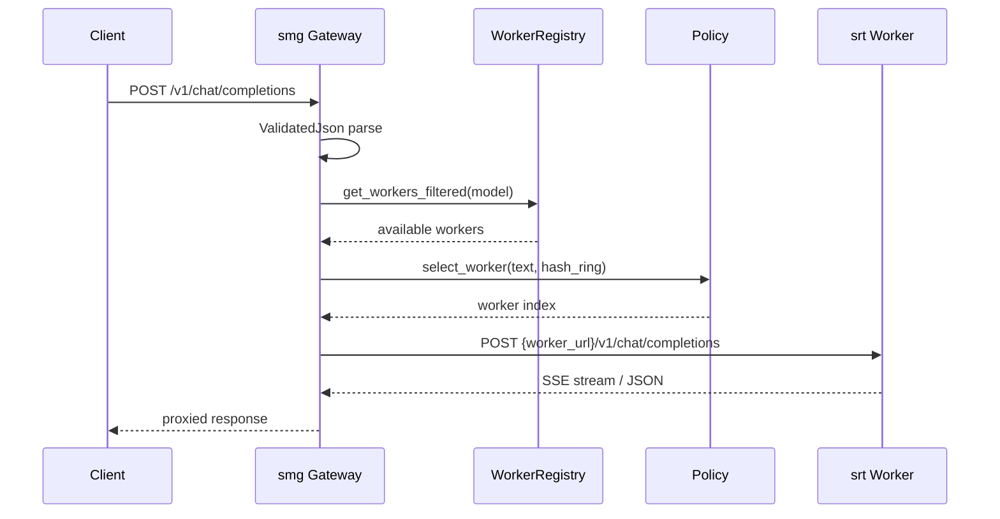
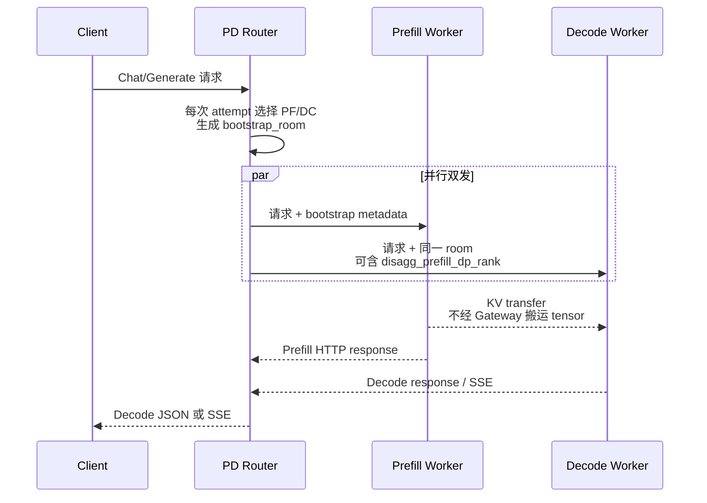

# model-gateway · 数据流

---

## 你为什么要读

Gateway 不生成 token，却能决定请求最终落到哪台 worker、失败后是否重试、PD 两段如何配对。本文沿一个外部请求追踪 handler、router、policy、registry 和 worker client，重点标出每次重试会不会重新选 worker，以及流式响应开始后责任如何变化。

## 1. 架构位置

**读法：** Gateway 是**控制面 + 数据面代理**，不参与 tensor 计算。数据面：把客户端 HTTP 请求转换为具体 router 的 HTTP/gRPC 下游调用，并按模式注入或转换少量字段；控制面：worker 注册、健康检查、policy 配置、mesh 同步。



---

## 2. 输入 / 输出

| 方向 | 类型 | 字段说明 | 源码 |
|------|------|----------|------|
| 输入 | `ChatCompletionRequest` | OpenAI chat 格式：messages, model, stream | `protocols/chat.rs` |
| 输入 | `GenerateRequest` | SGLang 原生：text, sampling_params | `protocols/generate.rs` |
| 输出 | HTTP Response | 流式 `text/event-stream` 或 JSON body | 按具体 router 代理、包装或转换 |
| 控制 | `WorkerConfigRequest` | url, model_id, worker_type | `protocols/worker_spec.rs` |

**读法：** 普通 typed request 会尽量保留业务字段，但 Gateway 不是严格的 byte-for-byte 透明代理：DP-aware 路径注入 `data_parallel_rank`，PD 路径注入 bootstrap 元数据与 `disagg_prefill_dp_rank`，rerank/OpenAI 等路径还可能转换响应，PD 的 `return_logprob` 会合并两侧结果。判断字段是否原样保留，必须落到具体 router 与 endpoint。

**源码锚点：**

```rust
// 定位骨架（非逐行摘录）：来源 sgl-model-gateway/src/server.rs L184-L193
async fn v1_chat_completions(
 State(state): State<Arc<AppState>>,
 headers: http::HeaderMap,
 ValidatedJson(body): ValidatedJson<ChatCompletionRequest>,
) -> Response {
 state
 .router
 .route_chat(Some(&headers), &body, Some(&body.model))
 .await
}
```

**要点：**

- `ValidatedJson` 在 Axum extract 阶段做 schema 校验，失败直接 400。
- `body.model` 用于 worker 过滤与 policy 选取。

---

## 3. 上下游连接

| 上游/下游 | 模块 | 交互方式 | 代码位置 |
|-----------|------|----------|----------|
| 上游 | OpenAI SDK / curl / LangChain | HTTPS | `server.rs` Axum routes |
| 下游 | srt HTTP server | reqwest 反向代理 | `routers/http/router.rs` |
| 下游 | srt gRPC Engine | tonic client | `routers/grpc/router.rs` |
| 下游 | 外部 OpenAI API | HTTPS 代理 | `routers/openai/router.rs` |
| 侧向 | Prometheus | metrics scrape | `observability/metrics/` |
| 侧向 | K8s API / DNS | service discovery | `service_discovery.rs` |

---

## 4. 典型数据流：Regular HTTP Chat Completion

**步骤 1 — 客户端请求到达 Axum**

```rust
// 定位骨架（非逐行摘录）：来源 sgl-model-gateway/src/server.rs L544-L546
 let protected_routes = Router::new()
 .route("/generate", post(generate))
 .route("/v1/chat/completions", post(v1_chat_completions))
```

**步骤 2 — Handler 委托 Router**

→ `state.router.route_chat(headers, &body, Some(&body.model))`

**步骤 3 — 选 worker**

```rust
// 定位骨架（非逐行摘录）：来源 sgl-model-gateway/src/routers/http/router.rs L171-L181
 let idx = policy
 .select_worker(
 &available,
 &SelectWorkerInfo {
 request_text: text,
 tokens: None,
 headers,
 hash_ring,
 },
 )
 .await?;
 Some(available[idx].clone())
```

**步骤 4 — 构造 upstream URL 并 POST**

→ `client.post(format!("{}/v1/chat/completions", worker.url()))`，body 序列化 `ChatCompletionRequest`，headers 注入 trace context。

**步骤 5 — 流式/非流式返回**

- `is_stream=true`：将 worker 的 byte stream 包装为 Axum `Body`，客户端收到 SSE chunk。
- 非流式：读完整 body 返回 JSON。

**步骤 6 — 只在响应交给客户端前重试**

`RetryExecutor` 把一次 `route_typed_request_once` 当作一个 attempt。每个 attempt 都重新执行 worker 过滤和 policy 选择，因此 round-robin 等非粘性策略可能换 worker；cache-aware 或一致性哈希策略则可能因为 routing key 不变而再次选中同一 worker。

触发重试的状态是 `408/429/500/502/503/504`。这里的关键边界不是“请求是否声明 `stream=true`”，而是 **Gateway 是否已经把 upstream response 交给客户端**：

- 建连失败、首个 upstream response 是上述状态码：仍在 retry executor 内，可以退避后重选 worker。
- upstream 已返回 2xx，Gateway 已把 SSE body 交给客户端：retry executor 已经结束；之后即使流中途断开，也不能换 worker 后继续同一条 token 流。
- 客户端主动断开：Gateway 释放 upstream stream，但不把这次取消记成 worker 失败。

```rust
// 来源：sgl-model-gateway/src/core/retry.rs L10-L20
pub fn is_retryable_status(status: StatusCode) -> bool {
    matches!(
        status,
        StatusCode::REQUEST_TIMEOUT
            | StatusCode::TOO_MANY_REQUESTS
            | StatusCode::INTERNAL_SERVER_ERROR
            | StatusCode::BAD_GATEWAY
            | StatusCode::SERVICE_UNAVAILABLE
            | StatusCode::GATEWAY_TIMEOUT
    )
}
```

---

## 5. 典型数据流：PD Disaggregation

**读法：** HTTP PD 不是“Gateway 等 prefill 完成，再把结果串行发给 decode”。Gateway 先选择一对 worker，在同一份 JSON 中注入 `bootstrap_host`、`bootstrap_port`、`bootstrap_room`；若 prefill 是 DP-aware worker，还会给 decode body 注入 `disagg_prefill_dp_rank`。随后两次 HTTP 请求并行发出。Decode worker 可以先接收请求并等待 Prefill worker 通过配置的 transfer backend 写入 KV。



```rust
// 定位骨架（非逐行摘录）：来源 sgl-model-gateway/src/routers/http/pd_router.rs L697-L706
// Send both requests concurrently and wait for both
events::RequestPDSentEvent {
    prefill_url: prefill.url(),
    decode_url: decode.url(),
}
.emit();

let (prefill_result, decode_result) =
    tokio::join!(prefill_request.send(), decode_request.send());
```

**源码锚点：**

```rust
// 定位骨架（非逐行摘录）：来源 sgl-model-gateway/src/server.rs L110-L118
 RoutingMode::PrefillDecode { .. } => {
 let has_prefill = healthy_workers
 .iter()
 .any(|w| matches!(w.worker_type(), WorkerType::Prefill { .. }));
 let has_decode = healthy_workers
 .iter()
 .any(|w| matches!(w.worker_type(), WorkerType::Decode));
 has_prefill && has_decode
 }
```

**要点：**

- 单一 `PrefillDecode` 模式的 readiness 强制双角色就绪，避免「只能 prefill 不能 decode」的半开状态；IGW readiness 只要求任意 healthy worker。
- `routers/http/pd_router.rs` 与 `routers/grpc/pd_router.rs` 分别实现 HTTP/gRPC PD 协议细节。
- Gateway 搬运的是请求 JSON、HTTP response 和少量 logprob 合并数据，不搬运 KV tensor；KV 在 Prefill 与 Decode worker 之间传输。
- `tokio::join!` 等待的是两次 HTTP send future。它不表示 decode 的 GPU 计算与 prefill 互不依赖；decode 仍受 bootstrap/KV 到达约束。
- `join!` 返回后，成功的 Decode response 也不会立刻交给客户端：代码先调用 `process_prefill_response()`，该函数会消费完整 Prefill body；因此 Prefill body 的慢、挂起或解析错误仍可能门控 Decode JSON/SSE 的交付与 TTFT。

### 5.1 PD 重试为什么是“整对重放”

每个 attempt 都重新执行 `select_pd_pair`，并从原始 typed request 重新序列化，再生成新的 room。因此一个可重试错误会重放 **prefill + decode 整对请求**，不是只重试失败的一侧。

```rust
// 定位骨架（非逐行摘录）：来源 sgl-model-gateway/src/routers/http/pd_router.rs L389-L430
let response = RetryExecutor::execute_response_with_retry(
    &self.retry_config,
    {
        move |attempt: u32| {
            let shared_request = Arc::clone(&shared_request);
            let context = context.clone();
            async move {
                let (prefill, decode) = match self
                    .select_pd_pair(
                        context.request_text.as_deref(),
                        context.model_id,
                        context.headers.as_ref(),
                    )
                    .await
                {
                    Ok(pair) => pair,
                    Err(e) => return Self::handle_server_selection_error(e),
                };

                let mut json_request =
                    match serde_json::to_value(shared_request.as_ref()) {
                        Ok(v) => v,
                        Err(e) => return Self::handle_serialization_error(e),
                    };
                json_request = match Self::inject_bootstrap_into_value(
                    json_request,
                    prefill.as_ref(),
                    context.batch_size,
                ) {
                    Ok(v) => v,
                    Err(e) => return Self::handle_serialization_error(e),
                };
```

边界要分三层：

| 失败发生点 | Gateway 可见结果 | 能否自动重试 | breaker 归因 |
|------------|-----------------|--------------|--------------|
| 选择不到 PF 或 DC | 503 | 可以，直到 attempt 耗尽 | 没有已选 worker，不记录某台 worker 失败 |
| Decode 建连失败或 Decode non-2xx | 合成 5xx/可重试状态 | 可以；下一次重选整对 worker、生成新 room | 主要 decode 驱动路径按两侧真实结果分别记录，并插 marker 防止外层重复归因 |
| Decode 已取得成功 response，随后 Prefill body 读取/解析失败 | Prefill error response | 取决于最终 status | 当前分侧闭环不完整：非流式可能连带把 Decode 记 failure；流式可能只记 Prefill、漏记 Decode terminal |
| Pair 已选中，但序列化/bootstrap/request preparation 失败 | 合成错误 response | 取决于最终 status | 外层可能按最终 status 对整对统一归因，粒度较粗 |
| Decode 已返回 2xx，SSE 中途报错 | 客户端已收到部分 token 后流断 | 不可以自动续传 | decode 失败；健康 prefill 不应被连带惩罚 |
| 客户端主动断开 | response body 被 drop | 不重试 | breaker 不增成功也不增失败 |

这也是排障时不能只看最终 502 的原因：最终 response 由哪一侧驱动，与两台 worker 的真实结果不是一回事。

---

## 6. Worker 生命周期数据流

**读法：** Worker 从注册到摘除的理想 state 变化如下；当前基线还存在索引维护边界，不能把这张图误当成已经由代码完全保证的事务不变量。

```
create_worker(WorkerConfigRequest)
 → WorkerBuilder 构造 Worker 对象
 → WorkerRegistry.register(worker)
 → HashRing rebuild
 → HealthChecker 周期 GET /health
 → is_healthy=true → is_available=true（无熔断）
 → 请求可选中该 worker
 → 连续失败 → CircuitBreaker OPEN → is_available=false
 → delete_worker → remove/remove_by_url → HashRing rebuild
```

**源码锚点：**

```rust
// 定位骨架（非逐行摘录）：来源 sgl-model-gateway/src/core/worker_registry.rs L29-L31
/// Number of virtual nodes per physical worker for even distribution.
const VIRTUAL_NODES_PER_WORKER: usize = 150;
```

**要点：**

- registry 使用 `DashMap` + immutable Arc snapshot，读多写少。
- 同 URL 再注册会复用原 `WorkerId` 并覆盖主表，但当前代码仍会向 model/type/connection 索引追加，且不会先清理旧模型、旧类型、旧连接条目；结果可能是重复 snapshot、陈旧索引和重复 virtual nodes。控制面应避免把“更新 worker”当作天然幂等操作。
- `remove()` 会过滤 model snapshot 并重建 ring，但模型最后一台 worker 删除后，内部仍可能保留 empty snapshot 与 empty ring key；`get_models()` 会过滤空项，所以外部模型列表与内部 key 集合不完全等价。
- mesh sync（可选）跨 gateway 实例同步 worker 状态与 rate limit。

---

## 7. IGW 多 Router 选路

**读法：** IGW 启用时，单一 `AppState.router` 可能是 `RouterManager` 实现的 composite router。客户端入口仍是 Axum HTTP；子 router 的 HTTP/gRPC 指 Gateway 到 worker 的 connection mode，不是客户端协议。

**源码锚点：**

```rust
// 定位骨架（非逐行摘录）：来源 sgl-model-gateway/src/routers/router_manager.rs L51-L59
pub mod router_ids {
 use super::RouterId;
 pub const HTTP_REGULAR: RouterId = RouterId::new("http-regular");
 pub const HTTP_PD: RouterId = RouterId::new("http-pd");
 pub const HTTP_OPENAI: RouterId = RouterId::new("http-openai");
 pub const GRPC_REGULAR: RouterId = RouterId::new("grpc-regular");
 pub const GRPC_PD: RouterId = RouterId::new("grpc-pd");
}
```

**要点：**

- 有明确 model 时，manager 查看该模型 worker 并按 external、gRPC/HTTP、PD/Regular 能力评分；某类高分 worker 的存在就可能决定子 router，随后具体 router 还要重新过滤实际候选。
- 无明确 model 时才遍历 router snapshot；`x-prefer-pd` 调整 PD/Regular 分数，并用全局 Regular/PD worker 数过滤无效模式。
- `default_router` 是 `get_router_for_model` 无法匹配时的 fallback；它不等于每个请求都可跨协议、跨模式安全降级。

---

## 8. 观测数据流

**读法：** 三层 metrics：Router 层（请求计数/延迟）、Worker 层（选择/retry）、Upstream 层（status code）。

**源码锚点：**

```rust
// 定位骨架（非逐行摘录）：来源 sgl-model-gateway/src/routers/http/router.rs L208-L215
 Metrics::record_router_request(
 metrics_labels::ROUTER_HTTP,
 metrics_labels::BACKEND_REGULAR,
 metrics_labels::CONNECTION_HTTP,
 model,
 endpoint,
 bool_to_static_str(is_stream),
 );
```

**要点：**

- OpenTelemetry trace：`inject_trace_context_http` 将 traceparent 写入 upstream headers。
- `/engine_metrics` 聚合各 worker Prometheus metrics。

## 运行验证

数据流可以用两组检索复核：第一组看请求入口、router 转发和观测注入；第二组看 router id、worker registry 与健康/熔断边界。

```powershell
rg -n 'async fn generate|route_generate|health_generate|engine_metrics|Metrics::record_router_request|inject_trace_context_http' sglang/sgl-model-gateway/src/server.rs sglang/sgl-model-gateway/src/routers/http/router.rs sglang/sgl-model-gateway/src/routers/http/pd_router.rs sglang/sgl-model-gateway/src/observability/otel_trace.rs
rg -n 'pub mod router_ids|pub struct RouterManager|WorkerRegistry|VIRTUAL_NODES_PER_WORKER|pub fn register|pub fn unregister|CircuitBreaker' sglang/sgl-model-gateway/src/routers/router_manager.rs sglang/sgl-model-gateway/src/core/worker_registry.rs sglang/sgl-model-gateway/src/core/worker.rs
```

读输出时按“入口 -> router -> worker -> metrics”走：`server.rs` 接 `/generate`，HTTP/PD router 负责 `route_generate`，`WorkerRegistry` 维护可选 worker，trace 和 metrics 在转发前后打点。这样可以区分“请求没进 gateway”“router 没选中 worker”和“upstream 已返回但观测没记录”三类问题。
