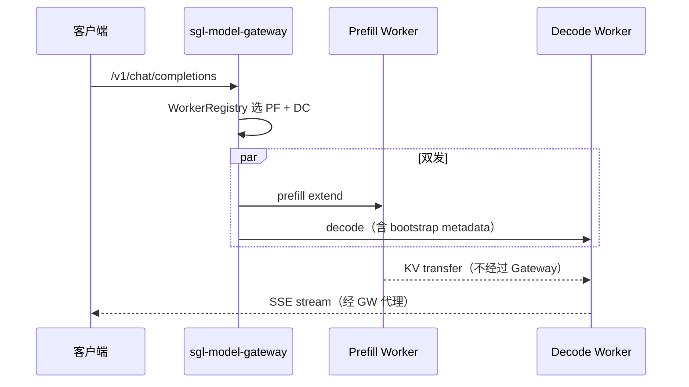

# model-gateway · 核心概念

## 你为什么要读

Gateway 的价值不在“多转发一次 HTTP”，而在把 worker 发现、健康、选路、重试、熔断和 PD 协同从单个 runtime 中抽出来。本篇先建立控制面与请求面的边界，再解释流式请求开始后哪些失败已经不能靠简单重试恢复。

## 用户故事

### 场景角色

**老周**，云厂商 AI Infra 架构师。Prefill 与 Decode 使用独立资源池，客户端只连接 Gateway，由 Gateway 协调 PD 请求并维护两类 worker 的健康状态。

### 时间线

| 时刻 | 事件 |
|------|------|
| T0 | 客户端 POST `/v1/chat/completions` 到 Gateway |
| T1 | `RoutingMode::PrefillDecode` 选中 prefill worker + decode worker |
| T2 | `prepare_pd_worker_requests` 向两侧准备 JSON；decode 侧注入 `disagg_prefill_dp_rank` |
| T3 | `execute_dual_dispatch` 并行取得两侧 HTTP response；随后先消费 Prefill response body，再把 Decode response 交给客户端；transfer backend 在两台 worker 间传 KV |
| T4 | 单一 PD 模式 readiness 要求 `has_prefill && has_decode`；IGW 模式当前只要求至少一个 healthy worker |

### 涉及模块



**读法：** Gateway 不做 GPU forward，只做 worker 发现、策略选路、HTTP/gRPC 代理与熔断。PD 模式下同一次 chat 需同时命中 prefill 与 decode 池：`pd_router` 的 `prepare_pd_worker_requests` 为两侧构造 endpoint URL 与 body，decode 请求在 DP-aware 场景携带 prefill 的 DP rank。两次 HTTP `send()` 由 Gateway 并行推进，KV tensor 则由 worker 间的 transfer backend 传输，Gateway 不搬运 KV。这里的“并行”只到取得两侧 HTTP response 为止：即使 Decode 已经返回 2xx，当前实现仍先完整消费 Prefill response body，之后才把 Decode JSON/SSE 交给客户端，因此 Prefill body 延迟也可能进入客户端 TTFT。

readiness 必须带配置上下文解释：单一 `PrefillDecode` 模式要求两类 worker 都 healthy；`enable_igw=true` 时当前实现只检查是否存在任意 healthy worker，因为同一 Gateway 还可能服务 Regular 或外部 backend。**因此 IGW 的 200 readiness 不能证明某个 PD 模型已经凑齐一对 worker。**

**源码锚点：**

```rust
// 定位骨架（非逐行摘录）：来源 sgl-model-gateway/src/routers/http/pd_router.rs L349-L363
 async fn prepare_pd_worker_requests<'a>(
 route: &'static str,
 json_request: &'a Value,
 prefill: &dyn Worker,
 decode: &dyn Worker,
 ) -> Result<(PreparedWorkerRequest<'a>, PreparedWorkerRequest<'a>), String> {
 let prefill_request =
 Self::prepare_worker_request(route, prefill, Cow::Borrowed(json_request)).await?;
 let decode_json_request =
 Self::inject_prefill_dp_rank_for_decode(Cow::Borrowed(json_request), prefill)?;
 let decode_request =
 Self::prepare_worker_request(route, decode, decode_json_request).await?;
 Ok((prefill_request, decode_request))
 }
```

```rust
// 来源：sgl-model-gateway/src/server.rs L106-L122
let is_ready = if state.context.router_config.enable_igw {
    !healthy_workers.is_empty()
} else {
    match &state.context.router_config.mode {
        RoutingMode::PrefillDecode { .. } => {
            let has_prefill = healthy_workers
                .iter()
                .any(|w| matches!(w.worker_type(), WorkerType::Prefill { .. }));
            let has_decode = healthy_workers
                .iter()
                .any(|w| matches!(w.worker_type(), WorkerType::Decode));
            has_prefill && has_decode
        }
        RoutingMode::Regular { .. } => !healthy_workers.is_empty(),
        RoutingMode::OpenAI { .. } => !healthy_workers.is_empty(),
    }
};
```

**要点：**

- prefill/decode 可配置不同 policy（如 prefill cache-aware、decode round-robin）。
- `enable_igw` 时最多五类 router 并存，Gateway 先按模型能力和请求特征选 router，再由具体 router 选 worker。
- Gateway `/health` 只表示进程存活；`/readiness` 反映的是当前模式定义的最低 worker 条件，但 IGW 下不是逐模型、逐 router readiness。
- Decode transport/non-2xx 等主要 decode 驱动错误路径会分别记录两侧结果，并用 marker 阻止外层重复记账；但 Prefill response 处理失败和 pair 选中后的请求准备失败仍可能被最终 status 粗粒度归因，不能概括成“所有 PD 失败都精确分侧”。
- 客户端无需感知 worker 拓扑，bootstrap metadata 由 Gateway 注入 decode body。

### 如果…会怎样（调试）

| 现象 | 可能原因 | 排查 |
|------|----------|------|
| 单一 PD 模式 readiness 503 | 仅 prefill 或仅 decode healthy | `worker_registry.get_all()` 按 type 过滤 |
| IGW readiness 200 但某 PD 模型仍 503 | 其他类型 worker healthy，但目标模型缺 PF/DC 配对 | 按 model id 查 worker type 和 `select_pd_pair` |
| decode 找不到 KV | bootstrap host/port 未注入 | 查 prefill worker 的 bootstrap 字段 |
| 已出 token 后流式中断 | decode upstream body transport error，或客户端取消 | 查 `BreakerTrackedStream` terminal；不要期待透明续传 |
| 相似请求集中到同一 worker | consistent-hash/cache-aware 的稳定选路，或候选池过小 | 先验证 routing key、available worker 数和 cache 命中，再决定是否换策略 |

---

## 1. Model Gateway 的角色
**读法：** Gateway 解决**多 worker 统一入口**问题：客户端只连一个地址，gateway 负责 worker 发现、健康检查、负载均衡、流式转发、熔断重试。它**不加载模型、不做 GPU forward**——所有推理发生在 srt worker 进程内。

**源码锚点：**

```rust
// 定位骨架（非逐行摘录）：来源 sgl-model-gateway/src/server.rs L184-L193
async fn v1_chat_completions(
 State(state): State<Arc<AppState>>,
 headers: http::HeaderMap,
 ValidatedJson(body): ValidatedJson<ChatCompletionRequest>,
) -> Response {
 state
 .router
 .route_chat(Some(&headers), &body, Some(&body.model))
 .await
}
```

**要点：**

- Handler 仅解析 JSON 并委托 `RouterTrait::route_chat`。
- 与 srt 内置 HTTP server 的区别：srt 是单实例推理引擎；gateway 是前置代理层。

---

## 2. 路由模式（RoutingMode）

**读法：** 三种 routing mode 决定具体 router 行为；connection mode 再决定 HTTP 或 gRPC 实现。IGW 不是第四种 `RoutingMode`，而是让 `RouterManager` 同时持有多种 router。

| 模式 | 说明 | 典型部署 |
|------|------|----------|
| `Regular` | 每个 worker 独立完成 prefill+decode | 标准多副本 |
| `PrefillDecode` | prefill worker 与 decode worker 分离 | PD disaggregation |
| `OpenAI` | 代理到外部 OpenAI 兼容 API | 混合云 |

**源码锚点：**

```rust
// 定位骨架（非逐行摘录）：来源 sgl-model-gateway/src/routers/factory.rs L44-L60
 ConnectionMode::Http => match &ctx.router_config.mode {
 RoutingMode::Regular { .. } => Self::create_regular_router(ctx).await,
 RoutingMode::PrefillDecode {
 prefill_policy,
 decode_policy,
 ..
 } => {
 Self::create_pd_router(
 prefill_policy.as_ref(),
 decode_policy.as_ref(),
 &ctx.router_config.policy,
 ctx,
 )
 .await
 }
 RoutingMode::OpenAI { .. } => Self::create_openai_router(ctx).await,
 },
```

**要点：**

- `ConnectionMode` 与 `RoutingMode` 是两层配置，但并非全笛卡尔积：Regular/PD 都有 HTTP 与 gRPC 实现，OpenAI mode 当前只允许 HTTP。
- PD 模式可为 prefill/decode 配置**不同** policy（如 prefill 用 cache-aware，decode 用 round-robin）。

---

## 3. Worker 抽象

**读法：** 每个后端实例注册为 `Worker` trait 对象，携带 URL、类型（Regular/Prefill/Decode）、健康状态、模型 ID、连接模式（HTTP/gRPC）、熔断器和负载计数。`is_healthy` 与 `is_available` 不是同义词：前者只看健康检查状态；后者还要求 circuit breaker 允许执行。

**源码锚点：**

```rust
// 定位骨架（非逐行摘录）：来源 sgl-model-gateway/src/core/worker.rs L141-L175
#[async_trait]
pub trait Worker: Send + Sync + fmt::Debug {
    fn url(&self) -> &str;
    fn api_key(&self) -> &Option<String>;
    fn worker_type(&self) -> &WorkerType;
    fn connection_mode(&self) -> &ConnectionMode;

    fn bootstrap_host(&self) -> &str {
        &self.metadata().bootstrap_host
    }

    fn bootstrap_port(&self) -> Option<u16> {
        self.metadata().bootstrap_port
    }

    fn is_healthy(&self) -> bool;
    fn set_healthy(&self, healthy: bool);
    async fn check_health_async(&self) -> WorkerResult<()>;
}
```

**要点：**

- `WorkerRegistry` 按 model_id 索引 worker，维护 consistent hash ring（150 virtual nodes/worker，blake3）。
- `is_healthy()` / `is_available()` 区分健康检查通过与熔断器允许转发。
- 健康检查采用连续失败/连续成功阈值；熔断器则根据真实请求结果独立开合。某 worker 可以 health 仍为 true，但 breaker 已 open，因而不会进入请求候选。

---

## 4. IGW（Inference Gateway）多 Router 模式

**读法：** `enable_igw=true` 时，`RouterManager` 尝试注册 HTTP Regular、HTTP PD、HTTP OpenAI、gRPC Regular、gRPC PD 五类 router。客户端仍从 Axum HTTP API 进入；manager 不是按“客户端使用 HTTP 还是 gRPC”选择，而是查看目标模型已注册 worker 的 runtime、connection mode 与 Regular/PD 类型并评分：external 优先 OpenAI，其后依次是 gRPC PD、HTTP PD、gRPC Regular、HTTP Regular。没有明确模型时，`x-prefer-pd` 才参与 PD/Regular 偏好。它解决的是“先选哪类 router”，具体 router 仍要继续选 worker。

**源码锚点：**

```rust
// 定位骨架（非逐行摘录）：来源 sgl-model-gateway/src/routers/router_manager.rs L91-L113
 if config.router_config.enable_igw {
 info!("Initializing RouterManager in multi-router mode (IGW)");

 match RouterFactory::create_regular_router(app_context).await {
 Ok(http_regular) => {
 info!("Created HTTP Regular router");
 manager.register_router(router_ids::HTTP_REGULAR, Arc::from(http_regular));
 }
 Err(e) => {
 warn!("Failed to create HTTP Regular router: {e}");
 }
 }

 match RouterFactory::create_grpc_router(app_context).await {
 Ok(grpc_regular) => {
 info!("Created gRPC Regular router");
 manager.register_router(router_ids::GRPC_REGULAR, Arc::from(grpc_regular));
 }
```

**要点：**

- IGW 模式会尝试创建 PD router（注释：`PD disaggregation auto-enabled for IGW mode`）；创建失败会 warning，并不等于进程必然启动失败，除非最终没有任何 router。
- `routers_snapshot: ArcSwap` 提供无锁读 snapshot，热路径友好。

---

## 5. 健康探针语义

**读法：** Kubernetes 常用 `/health`（liveness）与 `/readiness`。Gateway 的 readiness 检查后端 worker 是否达到当前模式的最低条件，而非验证一次真实生成，也不验证每个 model/router 都可服务。

**源码锚点：**

```rust
// 定位骨架（非逐行摘录）：来源 sgl-model-gateway/src/server.rs L102-L122
async fn readiness(State(state): State<Arc<AppState>>) -> Response {
 let workers = state.context.worker_registry.get_all();
 let healthy_workers: Vec<_> = workers.iter().filter(|w| w.is_healthy()).collect();

 let is_ready = if state.context.router_config.enable_igw {
 !healthy_workers.is_empty()
 } else {
 match &state.context.router_config.mode {
 RoutingMode::PrefillDecode { .. } => {
 let has_prefill = healthy_workers
 .iter()
 .any(|w| matches!(w.worker_type(), WorkerType::Prefill { .. }));
 let has_decode = healthy_workers
 .iter()
 .any(|w| matches!(w.worker_type(), WorkerType::Decode));
 has_prefill && has_decode
 }
 RoutingMode::Regular { .. } => !healthy_workers.is_empty(),
 RoutingMode::OpenAI { .. } => !healthy_workers.is_empty(),
 }
 };
```

**要点：**

- 单一 PD 模式：必须同时有 healthy prefill 与 decode worker，否则返回 503。
- IGW 模式：任意一个 healthy worker 即返回 200；目标模型是否能完成 PD 配对仍要在请求选路时验证。
- liveness 始终返回 200 OK（进程存活即可）。

## 6. 重试边界：response 交付之前与之后

重试的最重要不变量是：**Gateway 只能在尚未向客户端承诺一条具体输出流时换 worker。** Regular 路由每次 attempt 重新选一个 worker；HTTP PD 每次 attempt 重新选一对 worker、重新生成 room，并重放两侧请求。

初始状态为 `408/429/500/502/503/504` 时可以进入下一 attempt。配置名 `max_retries` 容易误读：当前 `RetryExecutor` 把它当作**总 attempt 数**，并用 `max(1)` 保证至少执行一次；例如 `max_retries=3` 是首次尝试加两次重试，而不是首次加三次。若 upstream 已返回 2xx streaming response，RetryExecutor 已结束；后续 body error 只能让 `BreakerTrackedStream` 给相应 worker 记失败，不能把已发送的 token 前缀接到另一台 worker 上。

客户端主动断开又是第三种状态：Gateway 会释放 upstream 请求和 load guard，但 breaker 不应把“调用方不再消费”误判成 worker failure。

流终止还要区分两种实现。通用 HTTP router 不解析 SSE 的 `[DONE]`，只有底层 byte stream 返回 `None` 才进入 `Completed`；HTTP PD router 会识别含 `data: [DONE]` 的 chunk，先 `mark_completed()`、再发送该 chunk、随后停止 poll。因此 `[DONE]` 后潜在的 trailing bytes/error 不会再被观察；若客户端恰在该 chunk 发送时断开，worker 仍会按 success 记账。`mark_completed()` 本身并非不可逆状态：若调用后继续 poll 到错误，通用 wrapper 仍会升级为 `Errored`。

```rust
// 定位骨架（非逐行摘录）：来源 sgl-model-gateway/src/routers/streaming_utils.rs L130-L141
impl<E> Drop for BreakerTrackedStream<E> {
    fn drop(&mut self) {
        match self.terminal {
            Terminal::Completed => self.worker.circuit_breaker().record_success(),
            Terminal::Errored => self.worker.circuit_breaker().record_failure(),
            Terminal::Active => {}
        }
    }
}
```

## 运行验证

不启动 gateway 也可以先用源码检索确认三件事：readiness 的健康语义、IGW 多 router 注册、worker registry 的一致性哈希与健康状态接口。

```powershell
rg -n 'async fn readiness|RoutingMode::PrefillDecode|WorkerType::Prefill|WorkerType::Decode|enable_igw' sglang/sgl-model-gateway/src/server.rs sglang/sgl-model-gateway/src/routers/http/pd_router.rs
rg -n 'pub struct RouterManager|register_router|routers_snapshot|VIRTUAL_NODES_PER_WORKER|fn worker_type\(|fn is_healthy\(' sglang/sgl-model-gateway/src/routers/router_manager.rs sglang/sgl-model-gateway/src/core/worker_registry.rs sglang/sgl-model-gateway/src/core/worker.rs
```

读输出时先看 `server.rs` 的 `/readiness` 分支，明确单一 PD 与 IGW 的不同条件；再看 `RouterManager` 是否根据 `enable_igw` 注册多个 router；最后看 `WorkerRegistry`、`Worker::is_available` 和 `BreakerTrackedStream`，确认候选资格由 model/type/connection、health 与 breaker 共同决定，而不是静态 URL 列表。
