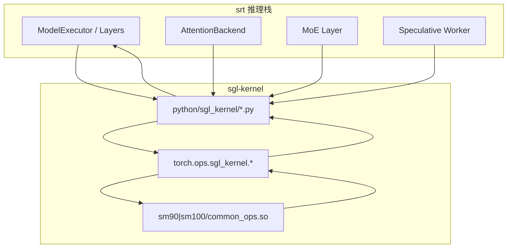

# sgl-kernel · 数据流

---

## 你为什么要读

`sgl-kernel` 的调用常在三处断裂：Python wrapper 的参数不合约、`torch.ops` 没加载到正确动态库、kernel 与当前 GPU/shape 不兼容。本文沿一个算子从 Python 到 C++/CUDA 的真实调用链，标出校验、注册、dispatch 和输出边界。

## 1. 架构位置

**读法：** sgl-kernel 位于 SRT 计算路径下游，不参与 HTTP 或队列调度，但也不是“所有输入只单向下沉”的黑盒。上层先决定实现与 fallback；wrapper 可能转换 dtype、分配输出/workspace、选择 FlashInfer 或内部 op；dispatcher 再按设备 dispatch key 进入扩展实现，结果通过返回 tensor 或 mutable buffer 回到 SRT。



---

## 2. 输入 / 输出（典型算子）

| 方向 | 算子 | 输入 tensor | 输出 | 源码 |
|------|------|-------------|------|------|
| 入+出 | `merge_state_v2` | `v_a,s_a,v_b,s_b` (fp16/bf16) | `v_merged,s_merged` | attention.py |
| 入→出 | `cutlass_mla_decode` | `q_nope,q_pe,kv_cache,page_table` | `out` (B,H,512) | attention.py |
| 入→出 | `int8_scaled_mm` | `mat_a,mat_b,scales_*` | `out_dtype` tensor | gemm.py |
| in-place | `moe_align_block_size` | `topk_ids` + 预分配 buffers | 无（写 buffer） | moe.py |
| in-place | `transfer_kv_per_layer` | src/dst K/V + indices | 无（拷贝） | kvcacheio.py |

**读法：** 许多热点 wrapper 采用“调用方预分配 mutable output”或“wrapper 先分配 output 再传入 op”的模式；也有 GEMM wrapper 直接返回 dispatcher 创建的 tensor，不能把全包统一描述成 in-place。

**源码锚点：**

```python
# 来源：sgl-kernel/python/sgl_kernel/attention.py L87-L100
    out = q_nope.new_empty((B_q, MAX_HEADS, D_latent))

    torch.ops.sgl_kernel.cutlass_mla_decode.default(
        out,
        q_nope,
        q_pe,
        kv_c_and_k_pe_cache,
        seq_lens,
        page_table,
        workspace,
        sm_scale,
        num_kv_splits,
    )
    return out[:, :H].contiguous()
```

**要点：**

- output 用 `q_nope.new_empty` 保证 device/dtype 一致。
- 返回时 slice 掉 padding head 并 `contiguous()`。

---

## 3. 上下游连接

| 上游/下游 | 模块 | 交互方式 | 说明 |
|-----------|------|----------|------|
| 上游 | srt `layers/attention` | `from sgl_kernel import merge_state_v2` | cascade/split-KV merge |
| 上游 | srt `layers/moe` | `topk_sigmoid`, `moe_align_block_size` | MoE forward |
| 上游 | host cache / HiCache / layout conversion | `transfer_kv_*` | 本进程可见 tensor 间按 index 搬运；跨 worker 网络传输不由这些 wrapper 单独完成 |
| 上游 | srt `speculative` | `tree_speculative_sampling_target_only` | 投机 accept |
| 下游 | PyTorch device dispatcher / 扩展实现 | `torch.ops` dispatch | schema 后按设备实现执行 |
| 打包 | pip wheel | `sm90/`, `sm100/` 目录 | fast-math / precise-math 变体；硬件覆盖另看 gencode |

---

## 4. 典型数据流：MoE forward 一步

**读法：** 在选择了相应 fused/CUTLASS runner 的 MoE forward 中，sgl-kernel 可以参与路由 → 对齐 → grouped GEMM → 聚合四个阶段；其他 runner 可能用 Triton、JIT 或另一组实现。

**步骤 1 — 路由（gating → topk）**

```python
# 来源：sgl-kernel/python/sgl_kernel/moe.py L57-L80
def topk_sigmoid(
    topk_weights: torch.Tensor,
    topk_ids: torch.Tensor,
    gating_output: torch.Tensor,
    renormalize: bool = False,
    correction_bias: Optional[torch.Tensor] = None,
) -> None:
    """
    Compute top-k sigmoid for MoE routing.

    Args:
        topk_weights: Output tensor for top-k weights [num_tokens, topk]
        topk_ids: Output tensor for top-k expert indices [num_tokens, topk]
        gating_output: Gating logits [num_tokens, num_experts]
        renormalize: Whether to renormalize the top-k weights
        correction_bias: Per-expert bias correction [num_experts], must be float32 if provided
    """
    torch.ops.sgl_kernel.topk_sigmoid.default(
        topk_weights,
        topk_ids,
        gating_output,
        renormalize,
        correction_bias,
    )
```

→ `gating_output [num_tokens, num_experts]` 经 sigmoid + topk → `topk_ids`、`topk_weights`。

**步骤 2 — 对齐（token → expert block）**

```python
# 来源：sgl-kernel/python/sgl_kernel/moe.py L6-L25
def moe_align_block_size(
    topk_ids,
    num_experts,
    block_size,
    sorted_token_ids,
    experts_ids,
    num_tokens_post_pad,
    cumsum_buffer,
    pad_sorted_token_ids=False,
):
    torch.ops.sgl_kernel.moe_align_block_size.default(
        topk_ids,
        num_experts,
        block_size,
        sorted_token_ids,
        experts_ids,
        num_tokens_post_pad,
        cumsum_buffer,
        pad_sorted_token_ids,
    )
```

→ 产出按 expert 排序、block 对齐的 token index 列表。

**步骤 3 — grouped GEMM（仅在相应 runner 被选中时）**

`fp8_blockwise_scaled_grouped_mm` 接收 pointer tables、scale pointers、stride/layout、problem sizes、expert offsets 和 workspace。它不是“给出 `topk_ids` 就自动完成 MoE”的通用入口；前置 `prepare_moe_input` 与上层 runner 必须先建立完整 grouped-GEMM ABI。

**步骤 4 — 收口输出**

```python
# 来源：sgl-kernel/python/sgl_kernel/moe.py L83-L93
def moe_sum_reduce(
    input_tensor,
    output_tensor,
    routed_scaling_factor=0,
):
    torch.ops.sgl_kernel.moe_sum_reduce.default(
        input_tensor,
        output_tensor,
        routed_scaling_factor,
    )
```

这张卡只证明 `moe_sum_reduce` 把输入、输出和 routed scale 交给扩展 op；top-k weight 是否已融合、何时乘入，必须回具体 runner 看，不能由函数名推断。

---

## 5. 典型数据流：import 时加载链

**读法：** 非 Apple Silicon 路径首次执行 `import sgl_kernel` 时会触发下面的加载链，与具体算子调用无关；macOS arm64 会在入口处直接切到 Metal，不执行 `common_ops` 链。

```
import sgl_kernel
 → _get_compute_capability()
 → glob sm90|sm100/common_ops.*
 → importlib.exec_module(common_ops) # 先执行扩展模块并注册 op
 → _preload_cuda_library()          # 当前基线发生在 common_ops 加载之后
 → from sgl_kernel.attention import ...
 → maybe_wrap_debug_kernel (若 SGLANG_KERNEL_API_LOGLEVEL=1)
```

**源码锚点：**

```python
# 来源：sgl-kernel/python/sgl_kernel/load_utils.py L15-L25
def _get_compute_capability():
    """Get the compute capability of the current GPU."""
    if not torch.cuda.is_available():
        return None

    # Get the current device
    device = torch.cuda.current_device()
    properties = torch.cuda.get_device_properties(device)

    # Return as integer (major * 10 + minor)
    return properties.major * 10 + properties.minor
```

**要点：**

- 加载发生在首次执行 `import sgl_kernel` 的进程内；Python module cache 避免重复初始化，但每次调用仍有 wrapper 与 dispatcher 边界。
- 多 GPU 场景只在首次 import 时按当时的 `current_device()` 选择变体；同一进程之后切换到另一架构设备不会重新选库。
- `_preload_cuda_library()` 排在 `_load_architecture_specific_ops()` 之后，因此不能补救 `common_ops` 首次加载时已经发生的 `libcudart` 解析失败；它最多为随后加载的扩展提供帮助。

---

## 6. KV tensor 搬运流

**读法：** `transfer_kv_*` 处理调用进程已经能访问的 src/dst tensor：按 index、layer 和 layout 在 cache buffer 之间搬运。它们可以成为 disaggregation 或 HiCache 管线中的本地 copy 环节，但函数签名没有网络 endpoint、RDMA handle 或远端 worker 身份，不能把它描述成完整的 prefill→decode 跨 worker 协议。

**源码锚点：**

```python
# 来源：sgl-kernel/python/sgl_kernel/kvcacheio.py L13-L34
def transfer_kv_per_layer(
    src_k: torch.Tensor,
    dst_k: torch.Tensor,
    src_v: torch.Tensor,
    dst_v: torch.Tensor,
    src_indices: torch.Tensor,
    dst_indices: torch.Tensor,
    item_size: int,
    block_quota: int = 2,
    num_warps_per_block: int = 16 if _is_hip else 32,
):
    torch.ops.sgl_kernel.transfer_kv_per_layer.default(
        src_k,
        dst_k,
        src_v,
        dst_v,
        src_indices,
        dst_indices,
        item_size,
        block_quota,
        num_warps_per_block,
    )
```

**要点：**

- `all_layer` 变体一次搬运模型全部层，减少 Python 循环开销。
- MLA 格式 KV 维度不同，使用 `transfer_kv_all_layer_mla`。

## 运行验证

sgl-kernel 的 Python 层主要是算子入口和动态库加载边界。先用检索确认 attention、MoE、KV 搬运和加载链都落到 `torch.ops.sgl_kernel`。

```powershell
rg -n 'cutlass_mla_decode|merge_state_v2|topk_softmax|fp8_blockwise_scaled_grouped_mm|torch\.ops\.sgl_kernel|_get_compute_capability|_preload_cuda_library|transfer_kv_per_layer|transfer_kv_all_layer|transfer_kv_all_layer_mla' sglang/sgl-kernel/python/sgl_kernel/attention.py sglang/sgl-kernel/python/sgl_kernel/moe.py sglang/sgl-kernel/python/sgl_kernel/load_utils.py sglang/sgl-kernel/python/sgl_kernel/kvcacheio.py
```

读输出时先看 `load_utils.py` 的 compute capability、三次扩展搜索和后置 CUDA runtime preload，再按具体 wrapper 判断它究竟是纯转发，还是还承担 dtype 转换、输出/workspace 分配或可选依赖分流。KV 搬运问题除 `kvcacheio.py` 的 per-layer、all-layer、MLA 入口外，还要回上层确认 src/dst layout 与 index 的所有权。
