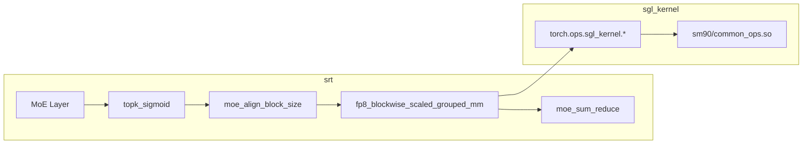

# sgl-kernel · 核心概念

## 你为什么要读

`sgl-kernel` 位于模型语义与 GPU 实现之间：上层知道这是 MoE、量化或 KV 操作，下层只接受 shape、stride、dtype 和设备指针。本篇解释 Python wrapper、动态库加载、op 注册与 CUDA kernel 如何接起来，以及 fallback 与实际选路该怎样验证。

## 用户故事

### 场景角色

**老韩**，量化 MoE 模型的性能工程师。Profiler 显示 expert GEMM 是主要热点，当前 grouped matmul 路径没有达到预期的硬件利用率。他希望验证 `sgl_kernel` fused op 是否能在保持数值正确的前提下减少 kernel 时间。

### 时间线

| 时刻 | 事件 |
|------|------|
| T0 | srt MoE 层 `topk_sigmoid` 路由 token → expert index |
| T1 | `moe_align_block_size` 对齐 token 到 block，准备 grouped GEMM 输入 |
| T2 | `fp8_blockwise_scaled_grouped_mm` 一次 launch 覆盖多 expert × 多 token |
| T3 | `moe_sum_reduce` 聚合 expert 输出；Profiler 对比 fused op 与 fallback 的稳定态时间和访存 |
| T4 | 设 `SGLANG_KERNEL_API_LOGLEVEL=1` 记录 kernel shape，确认无异常 fallback |

### 涉及模块



**读法：** `sgl-kernel` 与 srt 解耦发布：CUDA 编译进独立 wheel，按 SM90/SM100 加载不同 `.so`。MoE 热点路径从路由、对齐到 FP8 grouped GEMM 均有 fused op；srt 的 `from sgl_kernel import fp8_blockwise_scaled_grouped_mm` 仅做 dtype/shape 校验后 dispatch 到 `torch.ops.sgl_kernel`，无需关心 csrc 细节。

**源码锚点：**

```python
## 来源：sgl-kernel/python/sgl_kernel/moe.py L175-L209
def fp8_blockwise_scaled_grouped_mm(
    output,
    a_ptrs,
    b_ptrs,
    out_ptrs,
    a_scales_ptrs,
    b_scales_ptrs,
    a,
    b,
    scales_a,
    scales_b,
    stride_a,
    stride_b,
    stride_c,
    layout_sfa,
    layout_sfb,
    problem_sizes,
    expert_offsets,
    workspace,
):
    torch.ops.sgl_kernel.fp8_blockwise_scaled_grouped_mm.default(
        output,
        a_ptrs,
        b_ptrs,
        out_ptrs,
        a_scales_ptrs,
        b_scales_ptrs,
        a,
        b,
        scales_a,
        scales_b,
        stride_a,
        stride_b,
        stride_c,
        layout_sfa,
```

```python
## 来源：sgl-kernel/python/sgl_kernel/moe.py L105-L137
def moe_fused_gate(
    input_tensor,
    bias,
    num_expert_group,
    topk_group,
    topk,
    num_fused_shared_experts=0,
    routed_scaling_factor=0,
    apply_routed_scaling_factor_on_output=False,
):
    # This fused kernel function is used to select topk expert in a hierarchical 2-layer fashion
    # it split group of expert into num_expert_group, and use top2 expert weight sum in each group
    # as the group weight to select expert groups and then select topk experts within the selected groups
    # the #experts is decided by the input tensor shape and we currently only support power of 2 #experts
    # and #experts should be divisible by num_expert_group. #expert/num_expert_group <= 32 is limited for now.
    # for non-supported case, we suggest to use the biased_grouped_topk func in sglang.srt.layers.moe.topk
    # num_fused_shared_experts: if > 0, the last several experts will be
    #   replaced with shared experts. the shared experts will be divided by the
    #   routed_scaling_factor - this is intended to cancel out later when routed+shared
    #   output is scaled so that shared experts are not scaled.
    # routed_scaling_factor: if > 0, the experts will be scaled by this factor
    # apply_routed_scaling_factor_on_output: if true, output will be
    #   scaled by the routed_scaling_factor
    return torch.ops.sgl_kernel.moe_fused_gate.default(
        input_tensor,
        bias,
        num_expert_group,
        topk_group,
        topk,
        num_fused_shared_experts,
        routed_scaling_factor,
        apply_routed_scaling_factor_on_output,
    )
```

**要点：**

- FP8 blockwise grouped GEMM 目前主要支持 SM90/SM100；其他架构会 fallback 到 srt Triton。
- `moe_fused_gate` 可合并 hierarchical top-k 路由，减少 Python 往返。
- 独立 wheel 使 srt 迭代不必每次重编 CUDA。
- srt MoE 层 import 路径：`from sgl_kernel import moe_align_block_size, moe_sum_reduce`。
- Hopper 走 `sm90/` fast math；Blackwell 及更新架构走 `sm100/` precise math。

### 如果…会怎样（调试）

| 现象 | 可能原因 | 排查 |
|------|----------|------|
| ImportError common_ops | GPU 架构与 wheel 不匹配 | 看 `load_utils` 的 sm90/sm100 分支 |
| GEMM 仍慢 | 静默 fallback 到 torch | 设 `SGLANG_KERNEL_API_LOGLEVEL=1` |
| 数值漂移 | fast math vs precise math | SM90 用 fast math，对比 golden |
| MoE 路由错误 | expert 数非 2 幂或不整除 group | 回退 `biased_grouped_topk` |

---

## 1. sgl-kernel 是什么
**读法：** `sgl-kernel`（PyPI 包名 `sglang-kernel`）是 SGLang 的**高性能算子扩展包**，与 `python/sglang/srt` 解耦发布。设计动机有三点：（1）CUDA 编译耗时长，独立 wheel 可加速 srt 迭代；（2）同一套 op 可按 GPU 架构（Hopper SM90 vs Blackwell SM100）分发不同 `.so`；（3）Python 层保持极薄，只做 dtype/shape 断言与 `torch.ops` dispatch，便于 srt 侧替换 Triton fallback。

**源码锚点：**

```python
## 来源：sgl-kernel/python/sgl_kernel/attention.py L25-L26
    torch.ops.sgl_kernel.merge_state_v2.default(v_a, s_a, v_b, s_b, v_merged, s_merged)
    return v_merged, s_merged
```

**要点：**

- 所有 CUDA 算子统一注册在 `torch.ops.sgl_kernel` 命名空间。
- Python 函数名与 op 名一一对应（如 `merge_state_v2` → `merge_state_v2.default`）。
- srt 中 `from sgl_kernel import merge_state_v2` 即可调用，无需关心 csrc 细节。

---

## 2. 架构相关加载（SM90 vs SM100）

**读法：** Hopper（compute capability 9.0）与后续架构使用不同编译产物：`sm90/` 启用 fast math 优化，`sm100/` 使用 precise math 保证兼容性。加载失败会依次尝试 fallback 路径并最终抛出带安装提示的 `ImportError`。

**源码锚点：**

```python
## 来源：sgl-kernel/python/sgl_kernel/load_utils.py L59-L68
    # Determine which version to load based on GPU architecture
    if compute_capability == 90:
        ops_subdir = "sm90"
        variant_name = "SM90 (Hopper/H100 with fast math optimization)"
    elif compute_capability is not None:
        ops_subdir = "sm100"
        variant_name = f"SM{compute_capability} (precise math for compatibility)"
    else:
        ops_subdir = "sm100"
        variant_name = "CPU/No GPU detected (using precise math)"
```

**要点：**

| compute_capability | 子目录 | 说明 |
|--------------------|--------|------|
| 90 | `sm90/` | H100/Hopper，fast math |
| 其他 GPU | `sm100/` | 精确数学，向前兼容 |
| None（无 GPU） | `sm100/` | 仅用于 import 测试 |

---

## 3. 算子分类一览

**读法：** `__init__.py` 按功能域 re-export，形成清晰的模块边界。下表是 srt 最常触达的几类。

**源码锚点：**

```python
## 来源：sgl-kernel/python/sgl_kernel/__init__.py L88-L100
    from sgl_kernel.moe import (
        apply_shuffle_mul_sum,
        fp8_blockwise_scaled_grouped_mm,
        fused_qk_norm_rope,
        kimi_k2_moe_fused_gate,
        moe_align_block_size,
        moe_fused_gate,
        moe_sum,
        moe_sum_reduce,
        prepare_moe_input,
        topk_sigmoid,
        topk_softmax,
    )
```

**要点：**

- **MoE 路径**：`topk_sigmoid` / `topk_softmax` 做路由 → `moe_align_block_size` 对齐 token → grouped GEMM → `moe_sum_reduce` 聚合。
- **Attention 路径**：`merge_state_v2` 合并 partial attention state；`cutlass_mla_decode` 做 DeepSeek MLA paged decode。
- **Quant 路径**：`gemm.py` 中 FP8/INT8/AWQ/GPTQ 各类 scaled_mm。
- **Disagg 路径**：`kvcacheio.transfer_kv_*` 跨层/跨 MLA 格式搬运 KV。

---

## 4. 平台分支：CUDA / ROCm / MUSA / Metal

**读法：** 同一 Python 包通过条件 import 适配多后端。ROCm 额外暴露 custom allreduce；MUSA 有独立 `musa.py`；macOS 仅 Metal。

**源码锚点：**

```python
## 来源：sgl-kernel/python/sgl_kernel/__init__.py L128-L141
    if torch.version.hip is not None:
        from sgl_kernel.elementwise import gelu_quick
        from sgl_kernel.top_k import deepseek_v4_topk_transform_512

    if hasattr(torch.version, "musa") and torch.version.musa is not None:
        from sgl_kernel.musa import (
            min_p_sampling_from_probs,
            musa_batched_rotary_embedding_contiguous,
            musa_fused_gemv,
            musa_fused_moe_gemv,
            musa_fused_mul_add,
            musa_rotary_embedding_contiguous,
            top_k_top_p_sampling_from_probs,
        )
```

**要点：**

- **HIP（ROCm）**：`allreduce.py` 提供 IPC 共享内存 allreduce，支持 CUDA Graph buffer 注册。
- **MUSA**：采样与 RoPE 有专用 fused kernel。
- **Metal**：Apple Silicon 走 `sgl_kernel.metal`，不加载 `common_ops`。

---

## 5. DEBUG 包装机制

**读法：** 设置环境变量 `SGLANG_KERNEL_API_LOGLEVEL=1` 时，导出函数会被 `maybe_wrap_debug_kernel` 包装，记录每次 kernel 调用的 tensor shape/dtype，便于性能调优。

**源码锚点：**

```python
## 来源：sgl-kernel/python/sgl_kernel/debug_utils.py L7-L24
def _wrap_debug_kernel(func: F, op_name: str | None = None) -> F:
    try:
        if int(os.environ.get("SGLANG_KERNEL_API_LOGLEVEL", "0")) == 0:
            return func
    except Exception:
        return func

    try:
        from sglang.kernel_api_logging import debug_kernel_api
    except Exception:
        return func

    if getattr(func, "_debug_kernel_wrapped", False):
        return func

    wrapped = debug_kernel_api(func, op_name=op_name)
    setattr(wrapped, "_debug_kernel_wrapped", True)
    return cast(F, wrapped)
```

**要点：**

- 默认 loglevel=0，零开销直通。
- 依赖 `sglang.kernel_api_logging`（srt 侧可选包），缺失时静默跳过。
- `__init__.py` 末尾对 `_DEBUG_EXPORT_NAMES` 列表中全部导出函数批量包装。
