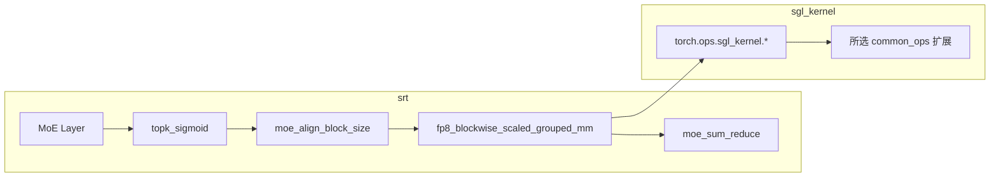

# sgl-kernel · 核心概念

## 你为什么要读

`sgl-kernel` 位于模型语义与 GPU 实现之间：上层知道这是 MoE、量化或 KV 操作，下层只接受 shape、stride、dtype 和设备指针。本篇解释 Python wrapper、动态库加载、op 注册与 CUDA kernel 如何接起来，以及 fallback 与实际选路该怎样验证。

## 用户故事

### 场景角色

**老韩**，量化 MoE 模型的性能工程师。Profiler 显示 expert GEMM 是主要热点，但函数名里出现 `sgl_kernel` 并不等于已经走到预期 kernel。他要先确认 runner 选择、Python wrapper、dispatcher schema、实际动态库与 launch shape，再用同一 workload 做数值和稳定态性能对照。

### 时间线

| 时刻 | 事件 |
|------|------|
| T0 | 从具体 MoE runner 确认是否选择 CUTLASS grouped-MM 路径，而不是只看顶层 MoE 类名 |
| T1 | 跟踪 `prepare_moe_input` 如何生成 problem sizes、permutation 与 expert offsets |
| T2 | 跟踪 grouped-MM wrapper 的预分配 buffer、scale layout 和 workspace |
| T3 | 跟踪 `apply_shuffle_mul_sum` 如何按 permutation 与 top-k weight 收口输出 |
| T4 | 打开 kernel API 日志并结合 profiler；日志只证明 Python 导出函数被调用，fallback 仍要回上层分支确认 |

### 涉及模块



**读法：** `sgl-kernel` 与 SRT 分目录、分 wheel 维护，但运行时仍由 SRT 决定是否进入某个 wrapper。Python 层也不总是“只校验”：有的函数分配输出和 workspace，有的在 FlashInfer 与内部 op 之间分流，有的只是原样转发。要判断 grouped-MM 是否真实生效，必须把 runner 选择和 C++ 注册一起读。

**源码锚点：**

```python
# 来源：sgl-kernel/python/sgl_kernel/moe.py L175-L214
def fp8_blockwise_scaled_grouped_mm(
    output,
    a_ptrs,
    b_ptrs,
    out_ptrs,
    a_scales_ptrs,
    b_scales_ptrs,
    a,
    b,
    scales_a,
    scales_b,
    stride_a,
    stride_b,
    stride_c,
    layout_sfa,
    layout_sfb,
    problem_sizes,
    expert_offsets,
    workspace,
):
    torch.ops.sgl_kernel.fp8_blockwise_scaled_grouped_mm.default(
        output,
        a_ptrs,
        b_ptrs,
        out_ptrs,
        a_scales_ptrs,
        b_scales_ptrs,
        a,
        b,
        scales_a,
        scales_b,
        stride_a,
        stride_b,
        stride_c,
        layout_sfa,
        layout_sfb,
        problem_sizes,
        expert_offsets,
        workspace,
    )
```

```python
# 来源：sgl-kernel/python/sgl_kernel/moe.py L105-L137
def moe_fused_gate(
    input_tensor,
    bias,
    num_expert_group,
    topk_group,
    topk,
    num_fused_shared_experts=0,
    routed_scaling_factor=0,
    apply_routed_scaling_factor_on_output=False,
):
    # This fused kernel function is used to select topk expert in a hierarchical 2-layer fashion
    # it split group of expert into num_expert_group, and use top2 expert weight sum in each group
    # as the group weight to select expert groups and then select topk experts within the selected groups
    # the #experts is decided by the input tensor shape and we currently only support power of 2 #experts
    # and #experts should be divisible by num_expert_group. #expert/num_expert_group <= 32 is limited for now.
    # for non-supported case, we suggest to use the biased_grouped_topk func in sglang.srt.layers.moe.topk
    # num_fused_shared_experts: if > 0, the last several experts will be
    #   replaced with shared experts. the shared experts will be divided by the
    #   routed_scaling_factor - this is intended to cancel out later when routed+shared
    #   output is scaled so that shared experts are not scaled.
    # routed_scaling_factor: if > 0, the experts will be scaled by this factor
    # apply_routed_scaling_factor_on_output: if true, output will be
    #   scaled by the routed_scaling_factor
    return torch.ops.sgl_kernel.moe_fused_gate.default(
        input_tensor,
        bias,
        num_expert_group,
        topk_group,
        topk,
        num_fused_shared_experts,
        routed_scaling_factor,
        apply_routed_scaling_factor_on_output,
    )
```

**要点：**

- 这张卡只证明 Python wrapper 原样转发参数，不能单独证明支持矩阵或自动 fallback；硬件门禁和替代路径属于 SRT runner 与构建配置。
- `moe_fused_gate` 把 hierarchical group selection 与组内 top-k 合并进一个扩展 op；是否适用仍受源码注释列出的 expert/group 约束。
- 独立 wheel 使 srt 迭代不必每次重编 CUDA。
- srt MoE 层 import 路径：`from sgl_kernel import moe_align_block_size, moe_sum_reduce`。
- 当前加载器仅对 compute capability 90 选 `sm90/` fast-math 变体，所有其他 compute capability 都选名为 `sm100/` 的 precise-math 变体；目录名不能替代 wheel 的实际 gencode 清单。

### 如果…会怎样（调试）

| 现象 | 可能原因 | 排查 |
|------|----------|------|
| ImportError common_ops | wheel 缺少所选变体、ABI/依赖不匹配，或扩展执行失败 | 看三次加载尝试、实际文件与异常链 |
| GEMM 仍慢 | runner 未选该实现、shape 不合适、编译架构不匹配或 launch 本身不占优 | 同时记录 runner 类型、导出函数日志与 profiler kernel 名 |
| 数值漂移 | fast-math 变体、scale/layout、dtype 或上层组合差异 | 固定输入并分别比 wrapper、替代实现与高精度参考 |
| MoE 路由错误 | `moe_fused_gate` 的 expert/group 约束不满足 | 在上层显式选择 `biased_grouped_topk` 等受支持路径；wrapper 不会自动回退 |

---

## 1. sgl-kernel 是什么
**读法：** `sgl-kernel`（PyPI 包名 `sglang-kernel`）是 SGLang 的高性能算子扩展包。更稳妥的四层模型是：SRT 选择算法与 fallback；Python API 整理 tensor、输出 buffer、workspace 或可选依赖；PyTorch dispatcher 根据 schema 和 dispatch key 找实现；C++/CUDA/ROCm/MUSA/CPU/Metal 代码执行。独立发布降低了每次 SRT 变更都重编扩展的耦合，但版本、PyTorch ABI、CUDA runtime 与 wheel 架构仍必须兼容。

**源码锚点：**

```python
# 来源：sgl-kernel/python/sgl_kernel/attention.py L25-L26
    torch.ops.sgl_kernel.merge_state_v2.default(v_a, s_a, v_b, s_b, v_merged, s_merged)
    return v_merged, s_merged
```

**要点：**

- 本专题涉及的扩展 op 统一使用 `sgl_kernel` dispatcher 命名空间，但不同扩展文件和设备注册的实际算子集合并不完全相同。
- 许多薄 wrapper 的函数名与 op 名相同，例如 `merge_state_v2` → `merge_state_v2.default`；但 alias、可选依赖分流、纯 PyTorch fast path 和平台专用 API 都是例外，必须逐函数确认。
- SRT 可以通过 `from sgl_kernel import merge_state_v2` 使用公开 wrapper；修改 ABI、判断支持范围或定位 launch 错误时仍必须继续读注册层与 csrc。

---

## 2. 架构相关加载（SM90 vs SM100）

**读法：** 当前目录选择实际是“CC90 fast-math”与“其他情况 precise-math”二分。加载失败后的 fallback 是换路径找同类 `common_ops` 扩展：先架构子目录，再包根目录，最后标准 `import common_ops`；它不是从 CUDA 算法自动退回 Triton 或 PyTorch。

**源码锚点：**

```python
# 来源：sgl-kernel/python/sgl_kernel/load_utils.py L59-L68
    # Determine which version to load based on GPU architecture
    if compute_capability == 90:
        ops_subdir = "sm90"
        variant_name = "SM90 (Hopper/H100 with fast math optimization)"
    elif compute_capability is not None:
        ops_subdir = "sm100"
        variant_name = f"SM{compute_capability} (precise math for compatibility)"
    else:
        ops_subdir = "sm100"
        variant_name = "CPU/No GPU detected (using precise math)"
```

**要点：**

| compute_capability | 子目录 | 说明 |
|--------------------|--------|------|
| 90 | `sm90/` | H100/Hopper，fast math |
| 其他 GPU | `sm100/` | 选择 precise-math 目录；能否执行取决于该 wheel 是否编进当前架构 |
| None（无 GPU） | `sm100/` | 仍会尝试加载扩展，不保证普通 CPU 环境一定可 import |

---

## 3. 算子分类一览

**读法：** `__init__.py` 按功能域 re-export，形成清晰的模块边界。下表是 srt 最常触达的几类。

**源码锚点：**

```python
# 来源：sgl-kernel/python/sgl_kernel/__init__.py L88-L100
    from sgl_kernel.moe import (
        apply_shuffle_mul_sum,
        fp8_blockwise_scaled_grouped_mm,
        fused_qk_norm_rope,
        kimi_k2_moe_fused_gate,
        moe_align_block_size,
        moe_fused_gate,
        moe_sum,
        moe_sum_reduce,
        prepare_moe_input,
        topk_sigmoid,
        topk_softmax,
    )
```

**要点：**

- **MoE 路径**：路由、对齐、GEMM、聚合都有公开 op，但具体 runner 可能只使用其中一部分；不能把这条组合当成所有 MoE backend 的固定流水线。
- **Attention 路径**：`merge_state_v2` 合并 partial attention state；`cutlass_mla_decode` 做 DeepSeek MLA paged decode。
- **Quant 路径**：`gemm.py` 中 FP8/INT8/AWQ/GPTQ 各类 scaled_mm。
- **Disagg 路径**：`kvcacheio.transfer_kv_*` 跨层/跨 MLA 格式搬运 KV。

---

## 4. 平台分支：CUDA / ROCm / MUSA / Metal

**读法：** 平台支持不是一张“所有 op 到处通用”的表。Apple Silicon 在包入口直接切到 Metal；MUSA 有专用 wrapper 和独立注册文件；ROCm 有独立 extension schema。`allreduce.py` 在 HIP 与非 HIP 分支都定义 custom allreduce，但两边函数签名和资源模型不同。

**源码锚点：**

```python
# 来源：sgl-kernel/python/sgl_kernel/__init__.py L128-L141
    if torch.version.hip is not None:
        from sgl_kernel.elementwise import gelu_quick
        from sgl_kernel.top_k import deepseek_v4_topk_transform_512

    if hasattr(torch.version, "musa") and torch.version.musa is not None:
        from sgl_kernel.musa import (
            min_p_sampling_from_probs,
            musa_batched_rotary_embedding_contiguous,
            musa_fused_gemv,
            musa_fused_moe_gemv,
            musa_fused_mul_add,
            musa_rotary_embedding_contiguous,
            top_k_top_p_sampling_from_probs,
        )
```

**要点：**

- **CUDA 与 HIP**：两边都有 custom allreduce wrapper；HIP 额外有 registered/unregistered、deterministic 与 quick-allreduce 接口，CUDA 分支则暴露 `all_reduce` 和另一套 handle ABI。
- **MUSA**：采样与 RoPE 有专用 fused kernel。
- **Metal**：Apple Silicon 走 `sgl_kernel.metal`，不加载 `common_ops`。

---

## 5. DEBUG 包装机制

**读法：** 环境变量只要能解析成非零整数，就会尝试从 SRT 导入 `debug_kernel_api` 并包装白名单里的已导出函数。依赖不存在、值解析失败或符号不在当前平台 globals 时都会静默保持原函数；因此“没有日志”不等于“kernel 没调用”。

**源码锚点：**

```python
# 来源：sgl-kernel/python/sgl_kernel/debug_utils.py L7-L24
def _wrap_debug_kernel(func: F, op_name: str | None = None) -> F:
    try:
        if int(os.environ.get("SGLANG_KERNEL_API_LOGLEVEL", "0")) == 0:
            return func
    except Exception:
        return func

    try:
        from sglang.kernel_api_logging import debug_kernel_api
    except Exception:
        return func

    if getattr(func, "_debug_kernel_wrapped", False):
        return func

    wrapped = debug_kernel_api(func, op_name=op_name)
    setattr(wrapped, "_debug_kernel_wrapped", True)
    return cast(F, wrapped)
```

**要点：**

- 默认 loglevel=0 时 `_wrap_debug_kernel` 返回原函数，不增加一层 debug wrapper。
- 依赖 `sglang.kernel_api_logging`（srt 侧可选包），缺失时静默跳过。
- `__init__.py` 末尾对 `_DEBUG_EXPORT_NAMES` 列表中全部导出函数批量包装。
