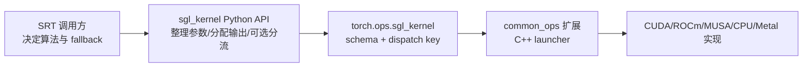
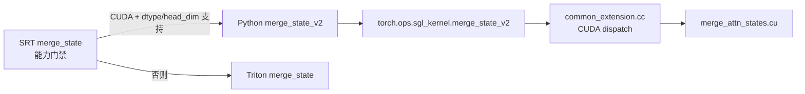

# sgl-kernel

> **源码范围：** `sgl-kernel/python/sgl_kernel/`、`sgl-kernel/csrc/`、构建文件与 SRT 调用点
>
> **Git 基线：** `70df09b`
>
> **前置专题：** [[SGLang-Quantization]] · **下一专题：** [[SGLang-model-gateway]]

## 读者任务

读完这个专题，你应能回答的不是“这里有很多 CUDA kernel”，而是四个可验证的问题：一个 SRT 调用究竟选择了哪个公开函数；Python wrapper 做了哪些 dtype、shape、buffer 或后端分流；扩展注册文件声明了什么 schema 和 dispatch key；最终函数又落到哪个设备实现。

## 心理模型：五道门，而不是一层薄封装



这五层不能互相替代。以 attention state merge 为例，真正的 Triton fallback 在 SRT 的 `merge_state()`，不在 `sgl_kernel.attention.merge_state_v2()`；Python wrapper 只把 LSE 升到 float32、准备输出并调用已注册 op。看到 `torch.ops.sgl_kernel.*` 也只能证明 dispatcher 入口，不能证明当前 shape 一定可运行或一定比替代路径快。

## `sm90/` 与 `sm100/` 的真实含义

当前加载器只对 compute capability 90 选择 `sm90/`，其余 GPU 以及无 GPU 探测时都选择 `sm100/`：

```python
# 来源：sgl-kernel/python/sgl_kernel/load_utils.py L59-L68
    # Determine which version to load based on GPU architecture
    if compute_capability == 90:
        ops_subdir = "sm90"
        variant_name = "SM90 (Hopper/H100 with fast math optimization)"
    elif compute_capability is not None:
        ops_subdir = "sm100"
        variant_name = f"SM{compute_capability} (precise math for compatibility)"
    else:
        ops_subdir = "sm100"
        variant_name = "CPU/No GPU detected (using precise math)"
```

但目录名不等于“这个二进制只包含该架构”。两个 `common_ops` target 使用同一组 `SOURCES` 和同一组 gencode flags，关键差异是 `sm90` target 额外带 `-use_fast_math`，`sm100` target 不带：

```cmake
# 来源：sgl-kernel/CMakeLists.txt L324-L348
Python_add_library(common_ops_sm90_build MODULE USE_SABI ${SKBUILD_SABI_VERSION} WITH_SOABI ${SOURCES})

target_compile_options(common_ops_sm90_build PRIVATE
    $<$<COMPILE_LANGUAGE:CUDA>:${SGL_KERNEL_CUDA_FLAGS} -use_fast_math>
)
target_include_directories(common_ops_sm90_build PRIVATE ${INCLUDES})
# Set output name and separate build directory to avoid conflicts
set_target_properties(common_ops_sm90_build PROPERTIES
    OUTPUT_NAME "common_ops"
    LIBRARY_OUTPUT_DIRECTORY "${CMAKE_CURRENT_BINARY_DIR}/sm90"
)

# =========================== Common SM100+ Build ============================= #
# Build SM100+ library with precise math (same namespace, different directory)
Python_add_library(common_ops_sm100_build MODULE USE_SABI ${SKBUILD_SABI_VERSION} WITH_SOABI ${SOURCES})

target_compile_options(common_ops_sm100_build PRIVATE
    $<$<COMPILE_LANGUAGE:CUDA>:${SGL_KERNEL_CUDA_FLAGS}>
)
target_include_directories(common_ops_sm100_build PRIVATE ${INCLUDES})
# Set output name and separate build directory to avoid conflicts
set_target_properties(common_ops_sm100_build PROPERTIES
    OUTPUT_NAME "common_ops"
    LIBRARY_OUTPUT_DIRECTORY "${CMAKE_CURRENT_BINARY_DIR}/sm100"
)
```

因此更准确的说法是“CC90 选 fast-math 变体，其他情况选 precise-math 变体”；实际可执行架构还取决于 wheel 构建时写入了哪些 gencode，而不是只看目录名。

## 算子版图与所有权

| 域 | Python 入口示例 | 真正决定是否使用它的上层 |
|----|-----------------|--------------------------|
| Attention | `merge_state_v2`、`cutlass_mla_decode` | attention backend / `merge_state()` |
| MoE | `topk_softmax`、`moe_align_block_size`、grouped MM | top-k 与具体 MoE runner |
| Quant/GEMM | INT8、FP8、AWQ、GPTQ wrapper | quant method 与硬件能力门禁 |
| KV I/O | per-layer、all-layer、MLA、layout-conversion variants | HiCache / host pool / disaggregation 路径 |
| Speculative | tree build、greedy verify、stochastic verify | EAGLE、DFLASH 等算法分支 |
| Sampling | top-k/top-p renorm | wrapper 内优先 FlashInfer，缺失或 MUSA 时才走内部 op |
| AllReduce | CUDA 与 ROCm 两套不同 ABI | custom allreduce backend；并非 ROCm 独占 |

## 一条完整证据链



这条链揭示专题最重要的原则：fallback、wrapper、注册和 kernel 是四个不同证据点。调试时必须先确认自己在哪一层，不能拿某层的注释替另一层下结论。

## 阅读顺序

1. [[SGLang-sgl-kernel-核心概念]]：掌握加载变体、dispatcher、ABI 与 fallback 所有权。
2. [[SGLang-sgl-kernel-源码走读]]：沿 `merge_state_v2` 完整走通 SRT→Python→schema→CUDA，再对照 MoE、KV、speculative 和 sampling。
3. [[SGLang-sgl-kernel-数据流]]：按 tensor、输出 buffer、index 与 stream 的生命周期看跨层传递。
4. [[SGLang-sgl-kernel-排障指南]]：按安装/加载、op 注册、能力门禁、ABI、launch 与数值六层定位。
5. [[SGLang-sgl-kernel-学习检查]]：用静态证据和目标环境实验验收，而不是背函数名。
