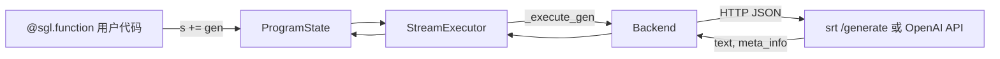
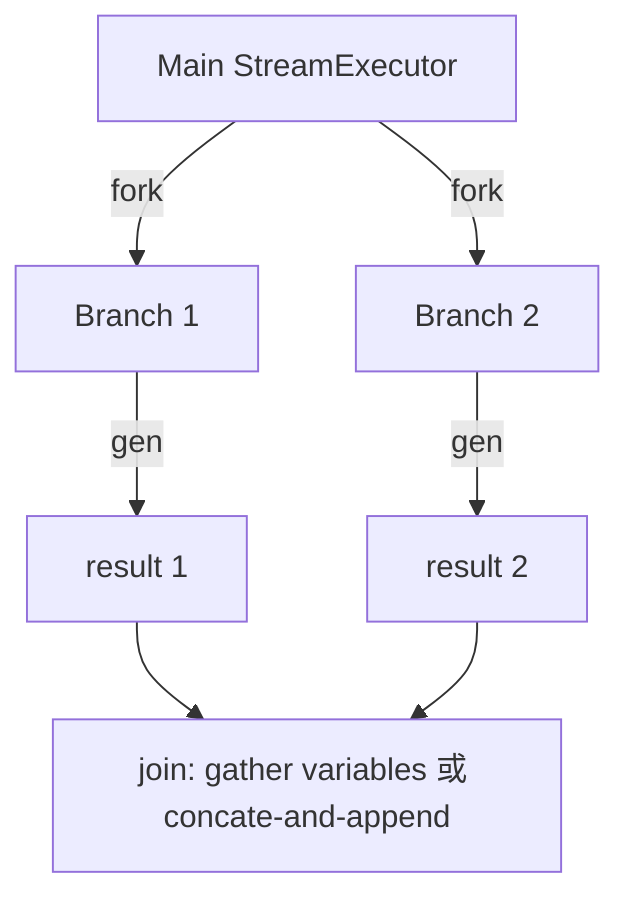

# 前端语言 · 数据流

---

## 你为什么要读

SGL 前端最容易在两个方向被误读：只当成字符串拼接，或反过来想象成装饰时静态编译器。真实路径是运行用户 Python 函数时不断创建 IR 节点，并由 `ProgramState.__iadd__` 立即提交到顺序解释器；tracing 才记录图关系。本文追踪节点、executor 状态和 backend 请求三种对象。

## 1. 架构位置

**读法：** SGL 前端位于 **用户代码与推理后端之间**，不实现 attention 或 scheduling。数据流本质是：Python IR 表达式 → 累积 prompt 状态 → HTTP/REST 请求 → 文本/meta 回写 ProgramState。



---

## 2. 输入 / 输出

| 方向 | 类型 | 说明 | 源码 |
|------|------|------|------|
| 输入 | 用户函数参数 | `SglFunction` 的 `arg_names`（除 `s` 外） | `ir.py` |
| 中间 | `StreamExecutor.text_` | 累积 prompt 字符串 | `interpreter.py` |
| 中间 | `StreamExecutor.messages_` | OpenAI 格式 chat 消息 | `interpreter.py` |
| 输出 | `variables[name]` | `gen("name")` 绑定变量 | `interpreter.py` |
| 输出 | `meta_info[name]` | logprob 等元数据 | RuntimeEndpoint JSON |

**源码锚点：**

```python
# 来源：python/sglang/lang/backend/runtime_endpoint.py L165-L172
        data = {
            "text": s.text_,
            "sampling_params": {
                "skip_special_tokens": global_config.skip_special_tokens_in_output,
                "spaces_between_special_tokens": global_config.spaces_between_special_tokens_in_out,
                **sampling_params.to_srt_kwargs(),
            },
        }
```

**要点：**

- RuntimeEndpoint 的 generate 路径始终发送累计 `text_`；OpenAI chat backend 等其他实现才读取 `messages_`。两份状态都由 role 执行维护，但由哪个 backend 消费必须分开看。
- interpreter 可以积累多张图片/视频帧，但当前 `RuntimeEndpoint._add_images` 断言 `len(images_) == 1`，HTTP frontend 路径一次请求只支持一张编码图片；不要从 executor 的 list 结构推断多图已打通。

---

## 3. 上下游连接

| 上游/下游 | 模块 | 交互方式 |
|-----------|------|----------|
| 上游 | 用户应用 / Notebook | Python 调用 `.run()` |
| 下游 | srt HTTP | `POST {base_url}/generate` |
| 下游 | OpenAI / Anthropic / LiteLLM | 各 backend REST |
| 侧向 | `global_config` | 默认 backend、verbosity、precache 开关 |

---

## 4. 典型数据流：单次 gen()

**步骤 1 — 用户代码**

```python
# 用户代码示例
@sgl.function
def qa(s, question):
 s += "Q: " + question + "\nA:"
 s += gen("answer", max_tokens=64)
```

**步骤 2 — `s +=` 提交 IR**

→ 常量文本 → `_execute_fill` 追加到 `text_` 
→ `gen("answer")` → `_execute_gen`

**步骤 3 — 构造 HTTP 请求**

```python
# 来源：python/sglang/lang/backend/runtime_endpoint.py L186-L191
        res = http_request(
            self.base_url + "/generate",
            json=data,
            api_key=self.api_key,
            verify=self.verify,
        )
```

**步骤 4 — 解析响应**

→ `comp = obj["text"]` 追加到 `text_` 
→ `variables["answer"] = comp` 
→ `variable_event["answer"].set()` 唤醒等待者

**步骤 5 — 用户读取**

→ `state["answer"]` 或 `state.text()`

---

## 5. Batch + Prefix Cache 数据流

**读法：** 多样本共享 instruction prefix 时，可以先 trace，再在 prefix 非空且字符长度大于 64 时发一次零 token cache 请求，随后并行 run。是否真正命中 Radix cache 仍取决于后端 tokenizer、cache key、容量和后续请求前缀一致性。

```
run_program_batch(batch_kwargs)
 → [optional] extract_prefix_by_tracing
 → [prefix chars > 64] cache_prefix(prefix)
 → ThreadPoolExecutor × N × run_program
 → 各样本独立 StreamExecutor，共享 backend Radix cache 命中
```

**源码锚点：**

```python
# 来源：python/sglang/lang/interpreter.py L105-L107
    # Pre-cache the common prefix for a batch. The prefix is extracted by tracing the program.
    if global_config.enable_precache_with_tracing and len(batch_arguments) > 1:
        cache_program(program, backend)
```

**要点：**

- 需 `global_config.enable_precache_with_tracing=True`。
- 返回 prefix 是 flatten 后从开头连续出现的 `SglConstantText`；遇到 argument、gen、select 等首个非 constant 节点即停止拼接。tracing 会执行用户 Python 函数，不能视为无副作用的通用静态分析器。

---

## 6. Fork/Join 数据流

**读法：** fork 先同步主 executor，再复制 Python 侧 variables/text/messages/role/images 到 N 个新 executor；`position_ids_offset` 当前参数未被使用，父 executor 的 `num_api_spec_tokens` 也没有传给子 executor。`gather_variable` 只收集新变量，不拼回文本；`concate_and_append` 才把各分支 fork 后增量拼回，并在 capability 开启时调用后端 KV concatenate endpoint。



**源码锚点：**

```python
# 定位骨架（非逐行摘录）：来源 python/sglang/lang/interpreter.py L375-L377
        if size > 1 and str(self.text_):
            self.submit(SglCommitLazy())

```

**要点：**

- 只有 `size > 1` 且当前 text 非空时，fork 才先提交 `SglCommitLazy`；`fork(1)`/`copy()` 不走这条前置 commit。
- `support_concate_and_append` 且 `enable_parallel_encoding` 时，`concate_and_append` join 会先让每个子分支零 token commit，再以 executor sid 调 `/concate_and_append_request`；否则仅拼接文本增量。当前 RuntimeEndpoint 的 generate/commit payload 没有携带这些 sid 作为 `rid`，因此服务端身份如何与 join 参数对应并无闭合证据，应按基线疑点处理。

---

## 7. 流式数据流

**读法：** `stream=True` 时 `_execute_gen` 迭代 `generate_stream`，每 chunk 设置 `stream_text_event`。

**源码锚点：**

```python
# 来源：python/sglang/lang/interpreter.py L637-L642
            for comp, meta_info in generator:
                self.text_ += comp
                self.variables[name] += comp
                self.meta_info[name] = meta_info
                self.stream_var_event[name].set()
                self.stream_text_event.set()
```

**要点：**

- 主线程 `text_iter()` wait event → yield 增量文本。
- 与 `num_api_spec_tokens` 互斥（assert 禁止）。

---

## 8. Tracing 数据流（无网络）

**读法：** trace 模式下 backend 可为 `BaseBackend` stub，expr 图被记录但不发起 generate。

**源码锚点：**

```python
# 来源：python/sglang/lang/tracer.py L54-L72
def trace_program(program, arguments, backend):
    # Create dummy backend
    if backend is None:
        backend = BaseBackend()

    # Create dummy arguments
    dummy_arguments = {
        name: SglArgument(name, None)
        for name in program.arg_names
        if name not in arguments
    }
    arguments.update(dummy_arguments)
    arguments.update(program.bind_arguments)

    # Trace
    tracer = TracerProgramState(backend, arguments, only_trace_prefix=False)
    with TracingScope(tracer):
        tracer.ret_value = program.func(tracer, **arguments)
    return tracer
```

**要点：**

- 用于静态分析、可视化 IR 图（`print_graph_dfs`）。
- `extract_prefix_by_tracing` 最终遍历已记录节点，只拼接开头连续的 constant；并非所有非 constant 都立即抛 `StopTracing`。fork 或解释器不认识的节点可触发 StopTracing，TypeError/AttributeError 也会被该入口吞掉并返回已收集前缀。

## 运行验证

Frontend Language 的数据流可以用一条检索串起：RuntimeEndpoint 负责网络生成，interpreter 负责表达式执行、fork/join 和 stream 事件，tracer 负责无网络追踪。

```powershell
rg -n 'class RuntimeEndpoint|def generate_stream|def submit|def fork\(|def join\(|trace_program|class StopTracing|class TracingScope|stream_text_event|stream_var_event' sglang/python/sglang/lang/backend/runtime_endpoint.py sglang/python/sglang/lang/interpreter.py sglang/python/sglang/lang/tracer.py
```

读输出时先看 `RuntimeEndpoint.generate_stream`，确认 stream 不是 interpreter 自己造文本；再看 `StreamExecutor.submit/fork` 和 `ProgramState.join`，确认 DSL 表达式怎样落到后台执行器；最后看 `trace_program` 和 `StopTracing`，区分真实请求流与静态追踪流。
