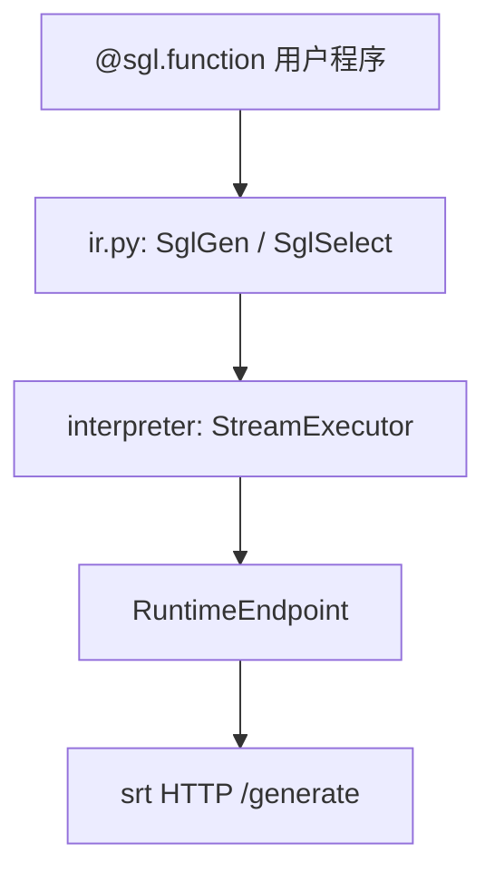

# 前端语言 · 核心概念

## 你为什么要读

SGL 前端不是另一套模型 runtime，而是把 prompt、生成、选择和控制流表达成可解释执行的程序。本篇解释 Python DSL 如何形成 IR、ProgramState 如何承载中间结果、StreamExecutor 如何调度，以及 backend 在哪里接回真实 serving。

## 用户故事

### 场景角色

**小周**，Agent 平台后端开发。业务 prompt 含多轮分支：先 `gen("intent")` 识别意图，再 `select` 在「查订单 / 改地址 / 转人工」三选一，最后按分支 `gen("reply")` 生成回复。希望用 SGL DSL 表达控制流，底层连本地已启动的 srt Runtime（HTTP），而非手写 REST。

### 时间线

| 时刻 | 事件 |
|------|------|
| T0 | `@sgl.function` 定义 `customer_bot(s, query)`；`Runtime("http://127.0.0.1:30000")` 设默认 backend |
| T1 | `s += system(...) + user(query)` 构建 IR 树 |
| T2 | `s += gen("intent", max_tokens=16)` → StreamExecutor 提交 → RuntimeEndpoint HTTP `/generate` |
| T3 | `s += select("action", choices=[...])` 批量算 logprob 选最优分支 |
| T4 | 分支内 `gen("reply")`；tracer 预热共享 system prefix 进 RadixCache |

### 涉及模块



**读法：** SGL 把 prompt 写成 Python 程序：`s +=` 追加 IR 节点，由 `StreamExecutor` 异步解释。`gen()` 触发 sampling forward；`select()` 在 temperature≈0 时对每个 choice 算 prompt logprob，无需多次完整生成。`RuntimeEndpoint` 设 `support_concate_and_append=True`，可走 KV 拼接优化；与 `Engine()` 内嵌 launch 相比，适合「srt 已独立部署、Frontend 只做编排」的本地开发模式。

**源码锚点：**

```python
## 来源：python/sglang/lang/api.py L236-L243
def select(
    name: Optional[str] = None,
    choices: Optional[List[str]] = None,
    temperature: float = 0.0,
    choices_method: ChoicesSamplingMethod = token_length_normalized,
):
    assert choices is not None
    return SglSelect(name, choices, temperature, choices_method)
```

```python
## 来源：python/sglang/lang/backend/runtime_endpoint.py L248-L274
    def select(
        self,
        s: StreamExecutor,
        choices: List[str],
        temperature: float,
        choices_method: ChoicesSamplingMethod,
    ) -> ChoicesDecision:
        assert temperature <= 1e-5

        # Cache common prefix
        data = {"text": s.text_, "sampling_params": {"max_new_tokens": 0}}
        obj = self._generate_http_request(s, data)
        prompt_len = obj["meta_info"]["prompt_tokens"]
        logprob_start_len = max(prompt_len - 2, 0)  # For token healing

        # Compute logprob
        data = {
            "text": [s.text_ + c for c in choices],
            "sampling_params": {
                "max_new_tokens": 0,
                "temperature": 0,
            },
            "return_logprob": True,
            "return_text_in_logprobs": True,
            "logprob_start_len": logprob_start_len,
        }
        obj = self._generate_http_request(s, data)
```

```python
## 来源：python/sglang/lang/api.py L35-L46
def Runtime(*args, **kwargs):
    # Avoid importing unnecessary dependency
    from sglang.lang.backend.runtime_endpoint import Runtime

    return Runtime(*args, **kwargs)

def Engine(*args, **kwargs):
    # Avoid importing unnecessary dependency
    from sglang.srt.entrypoints.engine import Engine

    return Engine(*args, **kwargs)
```

**要点：**

- `select` 一次 HTTP 批量提交所有 choice，比循环 gen 省 latency。
- `fork()` 可并行探索多分支，需 `sync()` 保证顺序。
- batch>1 时 `extract_prefix_by_tracing` 可预热共享 prefix。
- `Runtime()` 连已启动 srt；`Engine()` 进程内 launch，二者对 SGL 程序接口一致。
- `SglSamplingParams.to_srt_kwargs()` 把 DSL 采样参数映射为 `/generate` JSON 字段。

### 如果…会怎样（调试）

| 现象 | 可能原因 | 排查 |
|------|----------|------|
| select 选错 | temperature > 0 或 choice 前缀 token healing | 强制 temperature=0 |
| gen 不流式 | 未走 generate_stream | RuntimeEndpoint `_generate_http_request` |
| prefix cache 未命中 | 首 expr 非常量，trace 提前 break | 把共享 system 放 gen 之前 |
| Connection refused | Runtime URL 与 srt 端口不一致 | `set_default_backend(Runtime(...))` |

---

## 1. SGL 是什么
**读法：** SGL 让 prompt 成为**可组合程序**：字符串拼接、`gen()` 生成、`select()` 多选、`fork()` 并行分支、`user`/`assistant` 角色块等操作构建为 IR 表达式树，由解释器异步提交到 backend。相比手写 HTTP 请求，SGL 自动处理 chat template、lazy commit、prefix cache。

**源码锚点：**

```python
## 来源：python/sglang/lang/ir.py L336-L359
    def __add__(self, other):
        if isinstance(other, str):
            other = SglConstantText(other)
        assert isinstance(other, SglExpr)

        return self.concatenate_ir(self, other)

    def __radd__(self, other):
        if isinstance(other, str):
            other = SglConstantText(other)
        assert isinstance(other, SglExpr), f"{other}"

        return self.concatenate_ir(other, self)

    def concatenate_ir(self, a, b):
        if isinstance(a, SglExprList):
            if isinstance(b, SglExprList):
                return SglExprList(a.expr_list + b.expr_list)
            else:
                return SglExprList(a.expr_list + [b])
        elif isinstance(b, SglExprList):
            return SglExprList([a] + b.expr_list)

        return SglExprList([a, b])
```

**要点：**

- `s += "hello" + gen("x")` 通过 `ProgramState.__iadd__` 构建 `SglExprList`。
- IR 节点带 `node_id` 与 `prev_node` 用于 trace 图遍历。

---

## 2. ProgramState 与 StreamExecutor

**读法：** 用户看到的 `s` 是 `ProgramState` 门面，内部持有 `StreamExecutor`。所有 `s += ...` 最终调用 `stream_executor.submit(expr)`；生成结果写入 `variables`/`text_`。

**源码锚点：**

```python
## 来源：python/sglang/lang/interpreter.py L852-L856
class ProgramState:
    """The state of an SGL program."""

    def __init__(self, stream_executor: StreamExecutor):
        self.stream_executor = stream_executor
```

**要点：**

- `StreamExecutor` 可选后台线程 + `queue.Queue` 异步执行 expr。
- `sync()` 阻塞直到 queue 清空，batch 与 fork 依赖 sync 保证顺序。

---

## 3. Backend 抽象

**读法：** `BaseBackend` 定义 generate/select/cache 等接口。`RuntimeEndpoint` 连本地 srt HTTP；`OpenAIBackend` 等连云端 API。`support_concate_and_append` 决定是否走 KV cache 拼接优化。

**源码锚点：**

```python
## 来源：python/sglang/lang/backend/base_backend.py L9-L12
class BaseBackend:
    def __init__(self) -> None:
        self.support_concate_and_append = False
        self.chat_template = get_chat_template("default")
```

**要点：**

- `RuntimeEndpoint` 设 `support_concate_and_append = True`，启用 parallel encoding 路径。
- `to_srt_kwargs()` / `to_openai_kwargs()` 在各 backend 转换采样参数。

---

## 4. SglSamplingParams 与多后端映射

**读法：** 统一采样参数 dataclass，按 backend 转为不同 JSON 字段名（OpenAI 无 top_k，Anthropic 无 frequency_penalty 等）。

**源码锚点：**

```python
## 来源：python/sglang/lang/ir.py L121-L138
    def to_srt_kwargs(self):
        return {
            "max_new_tokens": self.max_new_tokens,
            "min_new_tokens": self.min_new_tokens,
            "n": self.n,
            "stop": self.stop,
            "stop_token_ids": self.stop_token_ids,
            "stop_regex": self.stop_regex,
            "temperature": self.temperature,
            "top_p": self.top_p,
            "top_k": self.top_k,
            "min_p": self.min_p,
            "frequency_penalty": self.frequency_penalty,
            "presence_penalty": self.presence_penalty,
            "ignore_eos": self.ignore_eos,
            "regex": self.regex,
            "json_schema": self.json_schema,
        }
```

**要点：**

- `regex`/`json_schema` 约束生成走 srt 结构化输出（相关专题 grammar）。
- `dtype` 仅前端约束，会转为 regex（int/float/str/bool）。

---

## 5. Tracing 与 Prefix Cache

**读法：** batch 推理前可用 tracer 静态执行程序（不调用真实 generate），提取各样本共享的 prompt prefix，调用 `backend.cache_prefix` 预热 RadixAttention。

**源码锚点：**

```python
## 来源：python/sglang/lang/tracer.py L29-L51
def extract_prefix_by_tracing(program, backend):
    # Create dummy arguments
    dummy_arguments = {name: SglArgument(name, None) for name in program.arg_names}
    arguments = dummy_arguments
    arguments.update(program.bind_arguments)

    # Trace
    tracer = TracerProgramState(backend, arguments, only_trace_prefix=True)
    try:
        with TracingScope(tracer):
            tracer.ret_value = program.func(tracer, **arguments)
    except (StopTracing, TypeError, AttributeError):
        # Some exceptions may not be caught
        pass

    # Run and cache prefix
    prefix = ""
    for expr in tracer.flatten_nodes():
        if isinstance(expr, SglConstantText):
            prefix += expr.value
        else:
            break
    return prefix
```

**要点：**

- 遇到第一个非常量 expr（如 `gen`）即停止，prefix 为此前全部常量文本。
- `run_program_batch` 在 `enable_precache_with_tracing` 且 batch>1 时自动 `cache_program`。

---

## 6. Runtime vs Engine 入口

**读法：** `api.Runtime()` 延迟 import `RuntimeEndpoint`（HTTP 连已启动 server）；`api.Engine()` 延迟 import srt 内嵌 `Engine`（进程内 launch）。二者对 SGL 程序透明，均实现 Backend 接口。

**源码锚点：**

```python
## 来源：python/sglang/lang/api.py L35-L46
def Runtime(*args, **kwargs):
    # Avoid importing unnecessary dependency
    from sglang.lang.backend.runtime_endpoint import Runtime

    return Runtime(*args, **kwargs)

def Engine(*args, **kwargs):
    # Avoid importing unnecessary dependency
    from sglang.srt.entrypoints.engine import Engine

    return Engine(*args, **kwargs)
```

**要点：**

- 延迟 import 避免未使用 Engine 时加载 torch/CUDA。
- `set_default_backend()` 设置全局默认，省略 `.run(backend=...)`。

## 运行验证

Frontend lang 的维护验证要看三条边界是否仍然成立：API 层只暴露前端函数，IR/Interpreter 负责把程序跑成请求，Backend 接口把前端连接到 RuntimeEndpoint 或 Engine。

```powershell
rg -n 'def Runtime|def Engine|class RuntimeEndpoint|def run_program_batch|class ProgramState|class SglGen|class SglFunction|class BaseBackend|def extract_prefix_by_tracing|set_default_backend|cache_prefix' sglang/python/sglang/lang/api.py sglang/python/sglang/lang/backend/runtime_endpoint.py sglang/python/sglang/lang/ir.py sglang/python/sglang/lang/interpreter.py sglang/python/sglang/lang/backend/base_backend.py sglang/python/sglang/lang/tracer.py
```

读输出时确认 `Runtime/Engine` 仍是延迟入口，`run_program_batch` 仍是批执行主线，`extract_prefix_by_tracing` 仍只收集常量 prefix。若这些入口迁移，本篇关于“前端 DSL 不直接执行模型”的心理模型要跟着重审。
