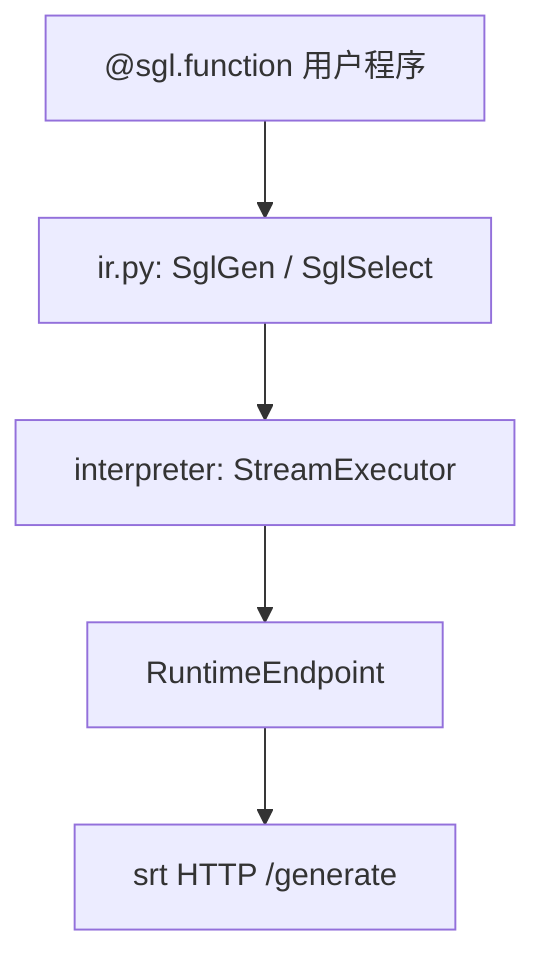

# 前端语言 · 核心概念

## 你为什么要读

SGL 前端不是另一套模型 runtime，而是把 prompt、生成、选择和控制流表达成可解释执行的程序。本篇解释 Python DSL 如何形成 IR、ProgramState 如何承载中间结果、StreamExecutor 如何调度，以及 backend 在哪里接回真实 serving。

## 用户故事

### 场景角色

**小周**，Agent 平台后端开发。业务 prompt 含多轮分支：先 `gen("intent")` 识别意图，再 `select` 在「查订单 / 改地址 / 转人工」三选一，最后按分支 `gen("reply")` 生成回复。希望用 SGL DSL 表达控制流，并用 `RuntimeEndpoint("http://127.0.0.1:30000")` 连接已经启动的 SRT HTTP 服务，而非手写 REST。

### 时间线

| 时刻 | 事件 |
|------|------|
| T0 | `@sgl.function` 包装 `customer_bot(s, query)`；`RuntimeEndpoint(base_url)` 设默认 backend |
| T1 | 函数运行时创建 role/text IR；`s +=` 将节点提交给 executor，而非先编译整棵树 |
| T2 | `s += gen("intent", max_tokens=16)` → StreamExecutor 提交 → RuntimeEndpoint HTTP `/generate` |
| T3 | `s += select("action", choices=[...])` 批量算 logprob 选最优分支 |
| T4 | 分支内 `gen("reply")`；tracer 预热共享 system prefix 进 RadixCache |

### 涉及模块



**读法：** SGL 把 prompt 写成 Python 程序：API 创建 IR 节点，`s +=` 把节点提交给 `StreamExecutor`；线程模式只是把顺序解释移到队列 worker，并不把整段程序预编译。`gen()` 触发 backend generation；`RuntimeEndpoint.select()` 先用一次零 token 请求取得 prompt token 长度，再批量计算 choices logprob，若选择算法需要 unconditional logprob 还会发第三次请求。`RuntimeEndpoint` 连接既有 HTTP 服务；`Runtime` 则自行 spawn HTTP server。`Engine` 是直接驱动 TokenizerManager/Scheduler 的离线 API，当前并未实现 SGL `BaseBackend` 契约。

**源码锚点：**

```python
# 来源：python/sglang/lang/api.py L236-L243
def select(
    name: Optional[str] = None,
    choices: Optional[List[str]] = None,
    temperature: float = 0.0,
    choices_method: ChoicesSamplingMethod = token_length_normalized,
):
    assert choices is not None
    return SglSelect(name, choices, temperature, choices_method)
```

```python
# 来源：python/sglang/lang/backend/runtime_endpoint.py L248-L274
    def select(
        self,
        s: StreamExecutor,
        choices: List[str],
        temperature: float,
        choices_method: ChoicesSamplingMethod,
    ) -> ChoicesDecision:
        assert temperature <= 1e-5

        # Cache common prefix
        data = {"text": s.text_, "sampling_params": {"max_new_tokens": 0}}
        obj = self._generate_http_request(s, data)
        prompt_len = obj["meta_info"]["prompt_tokens"]
        logprob_start_len = max(prompt_len - 2, 0)  # For token healing

        # Compute logprob
        data = {
            "text": [s.text_ + c for c in choices],
            "sampling_params": {
                "max_new_tokens": 0,
                "temperature": 0,
            },
            "return_logprob": True,
            "return_text_in_logprobs": True,
            "logprob_start_len": logprob_start_len,
        }
        obj = self._generate_http_request(s, data)
```

```python
# 定位骨架（非逐行摘录）：来源 python/sglang/lang/api.py L35-L46
def Runtime(*args, **kwargs):
    # Avoid importing unnecessary dependency
    from sglang.lang.backend.runtime_endpoint import Runtime

    return Runtime(*args, **kwargs)

def Engine(*args, **kwargs):
    # Avoid importing unnecessary dependency
    from sglang.srt.entrypoints.engine import Engine

    return Engine(*args, **kwargs)
```

**要点：**

- `RuntimeEndpoint.select` 常规为两次 HTTP：prefix/token-length 探测 + choices 批量 logprob；需要 unconditional logprob 时为三次。它避免逐 choice 完整生成，但不是“一次请求”。
- `fork()` 可并行探索多分支，需 `sync()` 保证顺序。
- batch>1 时 `extract_prefix_by_tracing` 可预热共享 prefix。
- `RuntimeEndpoint(base_url)` 连接已启动服务；`Runtime(**server_args)` spawn 独立 HTTP server 并暴露 `.endpoint`；`Engine(**server_args)` 启动 SRT 子进程但直接通过 IPC 调用，不可当作当前 SGL backend 直接传给 `.run()`。
- `SglSamplingParams.to_srt_kwargs()` 把 DSL 采样参数映射为 `/generate` JSON 字段。

### 如果…会怎样（调试）

| 现象 | 可能原因 | 排查 |
|------|----------|------|
| select 选错 | temperature > 0 或 choice 前缀 token healing | 强制 temperature=0 |
| gen 不流式 | `.run(stream=True)` 未开启，或消费端没有迭代 `text_iter()` | `run_program` 的 stream 分支与 `RuntimeEndpoint.generate_stream` |
| prefix cache 未命中 | 首 expr 非常量，trace 提前 break | 把共享 system 放 gen 之前 |
| Connection refused | `RuntimeEndpoint` base URL 与现有服务不一致，或 `Runtime` spawn 失败 | 区分连接既有服务与自行启动两种入口 |

---

## 1. SGL 是什么
**读法：** SGL 让 prompt 成为可组合程序。普通运行中，字符串、`gen()`、`select()`、role 等对象按 Python 控制流产生并被逐项提交/解释；tracing 才把节点的 `prev_node` 关系保存成可遍历图。不要把“IR 节点存在”误读成“装饰时静态编译整棵程序”。

**源码锚点：**

```python
# 来源：python/sglang/lang/ir.py L336-L359
    def __add__(self, other):
        if isinstance(other, str):
            other = SglConstantText(other)
        assert isinstance(other, SglExpr)

        return self.concatenate_ir(self, other)

    def __radd__(self, other):
        if isinstance(other, str):
            other = SglConstantText(other)
        assert isinstance(other, SglExpr), f"{other}"

        return self.concatenate_ir(other, self)

    def concatenate_ir(self, a, b):
        if isinstance(a, SglExprList):
            if isinstance(b, SglExprList):
                return SglExprList(a.expr_list + b.expr_list)
            else:
                return SglExprList(a.expr_list + [b])
        elif isinstance(b, SglExprList):
            return SglExprList([a] + b.expr_list)

        return SglExprList([a, b])
```

**要点：**

- `"hello" + gen("x")` 先由 `SglExpr.__radd__` 构造 `SglExprList`；随后 `ProgramState.__iadd__` 只负责把这份列表提交给 executor。
- IR 节点带 `node_id` 与 `prev_node` 用于 trace 图遍历。

---

## 2. ProgramState 与 StreamExecutor

**读法：** 用户看到的 `s` 是 `ProgramState` 门面，内部持有 `StreamExecutor`。所有 `s += ...` 最终调用 `stream_executor.submit(expr)`；生成结果写入 `variables`/`text_`。

**源码锚点：**

```python
# 来源：python/sglang/lang/interpreter.py L852-L856
class ProgramState:
    """The state of an SGL program."""

    def __init__(self, stream_executor: StreamExecutor):
        self.stream_executor = stream_executor
```

**要点：**

- `StreamExecutor` 可选后台线程 + `queue.Queue` 异步执行 expr。
- 正常路径下 `sync()` 用 `queue.join()` 等待全部已提交 expr 完成；当前异常清理存在 `task_done()` 计数缺陷，失败路径不能无条件保证唤醒。

---

## 3. Backend 抽象

**读法：** `BaseBackend` 定义 generate/select/cache 等接口。`RuntimeEndpoint` 连接兼容 SRT HTTP 契约的 URL（可为本机、远程或当前 Gateway）；OpenAI backend 等连接外部 API。`support_concate_and_append` 决定 concate-and-append join 是否有资格走后端 KV 拼接优化。

**源码锚点：**

```python
# 来源：python/sglang/lang/backend/base_backend.py L9-L12
class BaseBackend:
    def __init__(self) -> None:
        self.support_concate_and_append = False
        self.chat_template = get_chat_template("default")
```

**要点：**

- `RuntimeEndpoint` 宣告 `support_concate_and_append = True`，使解释器能够进入 KV concatenate 分支；但普通 generate/commit 请求没有把 executor `sid` 作为 `rid` 发送，join 随后却用这些 sid 调 `/concate_and_append_request`。当前身份链不闭合，不能据能力位断言 KV 拼接可用。
- `to_srt_kwargs()` / `to_openai_kwargs()` 在各 backend 转换采样参数。

---

## 4. SglSamplingParams 与多后端映射

**读法：** 统一采样参数 dataclass，按 backend 转为不同 JSON 字段名（OpenAI 无 top_k，Anthropic 无 frequency_penalty 等）。

**源码锚点：**

```python
# 来源：python/sglang/lang/ir.py L121-L138
    def to_srt_kwargs(self):
        return {
            "max_new_tokens": self.max_new_tokens,
            "min_new_tokens": self.min_new_tokens,
            "n": self.n,
            "stop": self.stop,
            "stop_token_ids": self.stop_token_ids,
            "stop_regex": self.stop_regex,
            "temperature": self.temperature,
            "top_p": self.top_p,
            "top_k": self.top_k,
            "min_p": self.min_p,
            "frequency_penalty": self.frequency_penalty,
            "presence_penalty": self.presence_penalty,
            "ignore_eos": self.ignore_eos,
            "regex": self.regex,
            "json_schema": self.json_schema,
        }
```

**要点：**

- `regex`/`json_schema` 约束生成走 srt 结构化输出（相关专题 grammar）。
- dtype 是统一前端意图，但落地随 backend 不同：RuntimeEndpoint 把 int/float/str/bool 转为 regex；OpenAI backend 只对部分 completion dtype 用引号或 logit bias 模拟，chat model 不支持 constrained dtype。

---

## 5. Tracing 与 Prefix Cache

**读法：** batch 推理前可用 tracer 静态执行程序（不调用真实 generate），提取各样本共享的 prompt prefix，调用 `backend.cache_prefix` 预热 RadixAttention。

**源码锚点：**

```python
# 来源：python/sglang/lang/tracer.py L29-L51
def extract_prefix_by_tracing(program, backend):
    # Create dummy arguments
    dummy_arguments = {name: SglArgument(name, None) for name in program.arg_names}
    arguments = dummy_arguments
    arguments.update(program.bind_arguments)

    # Trace
    tracer = TracerProgramState(backend, arguments, only_trace_prefix=True)
    try:
        with TracingScope(tracer):
            tracer.ret_value = program.func(tracer, **arguments)
    except (StopTracing, TypeError, AttributeError):
        # Some exceptions may not be caught
        pass

    # Run and cache prefix
    prefix = ""
    for expr in tracer.flatten_nodes():
        if isinstance(expr, SglConstantText):
            prefix += expr.value
        else:
            break
    return prefix
```

**要点：**

- 遇到第一个非常量 expr（如 `gen`）即停止，prefix 为此前全部常量文本。
- `run_program_batch` 在 `enable_precache_with_tracing` 且 batch>1 时调用 `cache_program`；只有提取出的 prefix 非空且字符长度大于 64，才真正调用 backend `cache_prefix`。tracer 还会吞掉 `StopTracing/TypeError/AttributeError`，因此结果是保守前缀，不是完整程序正确性的证明。

---

## 6. RuntimeEndpoint、Runtime 与 Engine

**读法：** `api.Runtime()` 延迟 import 的是 `runtime_endpoint.py::Runtime` wrapper：它选择端口、spawn `launch_server` 子进程、轮询 `/health_generate`，最后创建 `RuntimeEndpoint(self.url)`；它不是 `RuntimeEndpoint` 的别名。`api.Engine()` 返回 SRT `Engine`，后者直接持有 TokenizerManager 并通过 IPC/ZMQ 驱动 scheduler，没有 SGL backend 所需的 chat-template/select/stream/lazy 方法。两者只是都被公开 API 延迟导入，不能因此视为同一接口。

**源码锚点：**

```python
# 定位骨架（非逐行摘录）：来源 python/sglang/lang/api.py L35-L46
def Runtime(*args, **kwargs):
    # Avoid importing unnecessary dependency
    from sglang.lang.backend.runtime_endpoint import Runtime

    return Runtime(*args, **kwargs)

def Engine(*args, **kwargs):
    # Avoid importing unnecessary dependency
    from sglang.srt.entrypoints.engine import Engine

    return Engine(*args, **kwargs)
```

```python
# 来源：python/sglang/lang/backend/runtime_endpoint.py L356-L364
class Runtime:
    """
    A wrapper for the HTTP server.
    This is used for launching the server in a python program without
    using the command line interface.

    It is mainly used for the frontend language.
    You should use the Engine class if you want to do normal offline processing without the frontend language.
    """
```

```python
# 来源：python/sglang/lang/backend/runtime_endpoint.py L429-L434
                time.sleep(2)
            else:
                self.shutdown()
                raise TimeoutError("Server failed to start within the timeout period.")

        self.endpoint = RuntimeEndpoint(self.url)
```

```python
# 来源：python/sglang/srt/entrypoints/engine.py L183-L195
class Engine(EngineScoreMixin, EngineBase):
    """
    The entry point to the inference engine.

    - The engine consists of three components:
        1. TokenizerManager: Tokenizes the requests and sends them to the scheduler.
        2. Scheduler (subprocess): Receives requests from the Tokenizer Manager, schedules batches, forwards them, and sends the output tokens to the Detokenizer Manager.
        3. DetokenizerManager (subprocess): Detokenizes the output tokens and sends the result back to the Tokenizer Manager.

    Note:
    1. The HTTP server, Engine, and TokenizerManager all run in the main process.
    2. Inter-process communication is done through IPC (each process uses a different port) via the ZMQ library.
    """
```

**要点：**

- 延迟 import 避免只使用客户端 DSL 时加载完整 SRT 依赖。
- `set_default_backend()` 应接收 `BaseBackend` 兼容对象，例如 `RuntimeEndpoint`、`Runtime.endpoint`（`run_program` 会自动解包 wrapper）或 OpenAI backend；不要直接设置为当前 `Engine`。

## 运行验证

Frontend lang 的维护验证要看三条边界是否仍然成立：API 创建节点，Interpreter 逐项执行，`BaseBackend` 把前端接到 RuntimeEndpoint/OpenAI 等实现；Engine 属于另一套直接 SRT Python API。

```powershell
rg -n 'def Runtime|def Engine|class RuntimeEndpoint|def run_program_batch|class ProgramState|class SglGen|class SglFunction|class BaseBackend|def extract_prefix_by_tracing|set_default_backend|cache_prefix' sglang/python/sglang/lang/api.py sglang/python/sglang/lang/backend/runtime_endpoint.py sglang/python/sglang/lang/ir.py sglang/python/sglang/lang/interpreter.py sglang/python/sglang/lang/backend/base_backend.py sglang/python/sglang/lang/tracer.py
rg -n 'class Engine\(|class OpenAI|def generate_stream|def select\(|num_api_spec_tokens|self.sid|src_rids|dst_rid|"rid"' sglang/python/sglang/srt/entrypoints/engine.py sglang/python/sglang/lang/backend/openai.py sglang/python/sglang/lang/interpreter.py sglang/python/sglang/lang/backend/runtime_endpoint.py
```

读输出时确认 `Runtime/Engine` 仍是延迟入口，`run_program_batch` 仍是批执行主线，`extract_prefix_by_tracing` 仍只收集常量 prefix；同时对照 Engine/OpenAI 的接口与 executor sid 到 HTTP rid 的身份链。若这些入口迁移，本篇关于“前端 DSL 不直接执行模型”的心理模型要跟着重审。
