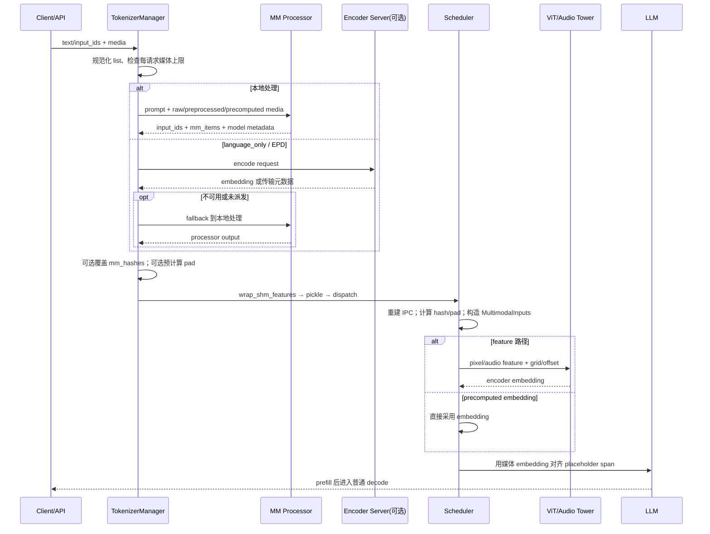
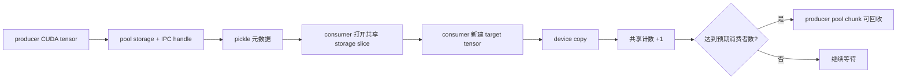

# 多模态 · 数据流

## 你为什么要读

同一张图片在系统里先后可能是 URL、PIL image、`pixel_values`、CUDA IPC proxy、Scheduler tensor、视觉 embedding 和 prefix-cache 身份。排障时如果只说“图片数据”，就会混淆所有者、生命周期和失败位置。本文沿一次请求逐站交接。

## 贯穿对象

假设请求是：

```text
用户：先听这段音频，再看图 A 和视频 B，告诉我它们是否描述同一场景。
媒体顺序：audio → image → video
```

内部可以按 modality 分箱，但 prompt 的占位符顺序必须保留。最终每项媒体都有自己的 `MultimodalDataItem`、hash、pad value 和 offset/span。

## 全链路时序



## 1. 启动期：先决定谁来处理媒体

TokenizerManager 在多模态模型下导入内置 processor，也允许外部包覆盖注册，然后按模型架构和 backend 选择实现。

```python
# 来源：python/sglang/srt/managers/tokenizer_manager.py L327-L350
    def init_tokenizer_and_processor(self):
        server_args = self.server_args

        # Initialize tokenizer and processor
        if self.model_config.is_multimodal:
            import_processors("sglang.srt.multimodal.processors")
            if mm_process_pkg := envs.SGLANG_EXTERNAL_MM_PROCESSOR_PACKAGE.get():
                import_processors(mm_process_pkg, overwrite=True)
            _processor = _get_processor_wrapper(server_args)
            transport_mode = _determine_tensor_transport_mode(self.server_args)

            # We want to parallelize the image pre-processing so we create an executor for it
            # We create mm_processor for any skip_tokenizer_init to make sure we still encode
            # images even with skip_tokenizer_init=False.
            self.mm_processor = get_mm_processor(
                self.model_config.hf_config,
                server_args,
                _processor,
                transport_mode,
                model_config=self.model_config,
            )

            if server_args.skip_tokenizer_init:
                self.tokenizer = self.processor = None
```

注意：`skip_tokenizer_init` 不等于“跳过媒体处理”。代码仍创建 `mm_processor`，只是文本必须由调用者提供 `input_ids`；图片仍需编码。

## 2. 请求入口：先形成文本，再决定是否跑媒体处理

`_tokenize_one_request()` 先处理 `input_embeds`、`input_ids` 或文本 tokenization。音频-only 请求允许文本为空，等待 processor 补出 input ids。随后它判断请求是否含媒体，并把单值 image/video/audio 规范成 list。

三种媒体输入最终收敛到同一 item 契约：

| 路径 | 输入 | 是否需要本地 encoder | 典型用途 |
|---|---|---|---|
| raw media | URL、Base64、PIL、音频等 | 通常需要 | 普通在线请求 |
| processor output | 已预处理 feature 与 metadata | 需要 | 复用预处理或跨组件交接 |
| precomputed embedding | 最终 encoder embedding | 不需要 | encoder 解耦或外部预计算 |

`limit_mm_data_per_request` 在这里按请求检查数量；`mm_process_config` 的启动期校验只验证顶层是 dict、image/video/audio 子项也是 dict，并不证明每个模型都接受其中全部键。

## 3. 本地与远端 encoder 的分叉

`language_only` 并不简单等于“绝不加载 processor”。当前链路仍可能需要本地 fallback：

- `zmq_to_tokenizer`：TokenizerManager 等远端 embedding；拿不到时可回本地处理。
- `zmq_to_scheduler` / `mooncake`：若请求没有被派发到 encoder，仍可本地处理。
- `encoder_urls` 为空并非一定启动失败；可由 EncoderBootstrapServer 接受 encoder 动态注册。

配置层明确禁止 `encoder_only` 与 `language_only` 同时开启，也禁止 encoder-only 与 PD prefill/decode 混用。Mooncake 路径还会提前校验 IB device。

## 4. Processor 阶段：建立位置契约

Processor 的核心输出不是一句“图片转 tensor”，而是：

```text
展开后的 input_ids
+ 每个媒体项的 feature 或 precomputed embedding
+ offsets/span
+ grid、MRoPE、media count 等模型专用数据
```

常见 feature 是 `pixel_values` 或 audio features。视觉塔仍在模型执行侧运行；不能把 processor 阶段描述成已经得到最终 visual embedding。

媒体结果可按 modality 分组存储，而 prompt 扫描按出现顺序展开。每种 modality 使用独立游标，所以“内部三箱”与“全局占位符顺序”可以同时成立。

## 5. hash 的两个计算时机

调用者可以提供 `mm_hashes`。长度匹配且十六进制可解析时，TokenizerManager 把它写入对应 item；错误项会警告并回退内部 hash，不阻断请求。

随后：

- 若 `SGLANG_MM_PRECOMPUTE_HASH` 开启，TokenizerManager 立即调用 `set_pad_value()`；
- 否则 Scheduler 在 `MultimodalInputs.from_processor_output()` 中计算。

因此“传入 hash”不等于“pad 一定在 tokenizer 阶段已经生成”。文档、指标和断点必须区分这两个时机。

## 6. 发送边界：共享内存包装发生在 pickle 前

```python
# 来源：python/sglang/srt/managers/tokenizer_manager.py L1331-L1342
    def _send_one_request(
        self,
        tokenized_obj: Union[TokenizedGenerateReqInput, TokenizedEmbeddingReqInput],
    ):
        tokenized_obj.time_stats.set_api_server_dispatch_time()
        tokenized_obj = wrap_shm_features(tokenized_obj)
        time_stats = tokenized_obj.time_stats
        tokenized_obj.wrap_pickle_fields()
        self._dispatch_to_scheduler(tokenized_obj)
        tokenized_obj.time_stats = time_stats
        tokenized_obj.time_stats.set_api_server_dispatch_finish_time()
```

顺序很重要：大 tensor 先转成共享内存或 IPC 表示，再 pickle 元数据。parallel sampling 会复制请求对象；当前实现特意为某些路径复制 `mm_items`，避免 `wrap_shm_features` 修改共享内部对象。理解这种浅拷贝边界，有助于定位“一次采样包装影响另一次”的诡异问题。

## 7. Scheduler：重建、内容寻址、再交给模型

Scheduler 不只是反序列化：

1. 过滤无效 modality；
2. 重建 CUDA IPC proxy；
3. 可临时将 feature 放进 GPU buffer 加速 hash；
4. 为每个 item 计算 hash/pad；
5. 必要时把 feature 放回 CPU；
6. 复制 MRoPE、特殊 token id、media count 等可选字段到 `MultimodalInputs`。

pad value 是词表外的内容地址，使媒体内容成为 prefix key 的一部分。它不能拿去做普通 tokenizer decode。

## 8. 模型执行：feature 与 embedding 的最后分叉

若 item 携带 `feature`，模型专用 forward 读取 pixel/audio tensor 和 grid 等数据，运行视觉塔或音频 encoder，再把输出放到 placeholder 对应位置。若 item 是 `PRECOMPUTED_EMBEDDING`，则跳过 encoder，直接进入对齐步骤。

之后 decode 大体回到文本 LLM：媒体相关计算主要发生在 prefill；其结果已体现在 hidden state/KV prefix 中。

## 9. CUDA IPC 的真实数据流



它避免 CPU round-trip，但有 consumer-side device copy。pool 满时也不是固定回 CPU：是否保留 CUDA tensor取决于 `keep_mm_feature_on_device`。

## 10. ViT CUDA Graph 的 metadata 生命周期

Graph 只以 `x_3d.shape[0]`，也就是总 `S`，作为 key。首次 capture 时使用的 `cu_seqlens`、window 分段等 metadata 会随 graph 缓存。后续同 `S` 但图片分块布局不同的请求可能复用旧 metadata；当前逻辑没有“发现布局不同后自动 eager fallback”的保证。

所以启用前至少应验证：

- 同总视觉 token 数、不同图片数量；
- 同总长度、不同 grid/窗口分段；
- 单图与多图拼成相同 `S`；
- replay 输出与 eager 输出是否一致。

## 11. 两个跨层风险

### 自动截断

`allow_auto_truncate` 直接裁 `input_ids`，不同时裁已有 offsets/features。若切入媒体 span，链路不再自洽。优先在进入 processor 前限制文本和媒体预算，或拒绝超长请求。

### tokenizer batch encode

批量 tokenizer 明确不适用于 image inputs、预 tokenized ids 或 input embeds。多模态 generation 检测到该组合时会拒绝；不要把纯文本吞吐优化无条件套到 VLM。

## 运行验证

无 GPU 环境也能做静态闭环：

```powershell
rg -n "init_tokenizer_and_processor|_tokenize_one_request|_send_one_request" sglang/python/sglang/srt/managers/tokenizer_manager.py
rg -n "from_processor_output|set_pad_value|MM_PAD_SHIFT_VALUE" sglang/python/sglang/srt/managers/schedule_batch.py
rg -n "_copy_slice_tensor_to_target|copy_\(" sglang/python/sglang/srt/utils/cuda_ipc_transport_utils.py
rg -n "_get_graph_key|cu_seqlens|cu_window_seqlens" sglang/python/sglang/srt/multimodal/vit_cuda_graph_runner.py
```

预期：能分别定位请求入口、Scheduler 二次变换、IPC device copy 和仅按 `S` 取 graph key 的代码。若任一入口迁移，先更新源码判断，再更新本文。
