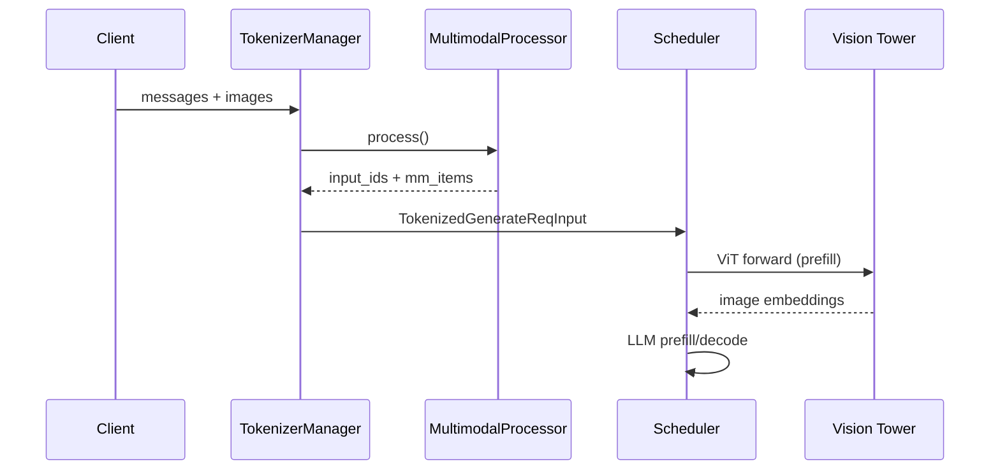

# 多模态 · 数据流

## 你为什么要读

一张图片进入 SGLang 后，不会始终以“图片”存在：它先是请求字段，随后成为 processor 输入、placeholder 元数据、视觉 tensor 和语言模型可消费的特征。本文沿这条变形链标出所有者与校验点，帮助你区分加载失败、token 对齐错误和 GPU 特征搬运问题。

## 1. 请求级数据流



---

## 2. 输入 / 输出

| 阶段 | 类型 | 说明 |
|------|------|------|
| 输入 | OpenAI messages | text + image_url / video |
| 中间 | MultimodalProcessorOutput | input_ids, mm_items, pad 信息 |
| 中间 | MultimodalDataItem | pixel_values, grid_thw, modality |
| 输出 | token stream | 与普通 LLM 相同 |

**读法：** `MultimodalDataItem` 挂在 `Req` 上进入 Scheduler；prefill 时 vision tower 消费 item，产出 embedding 写入 hidden states。

**源码锚点：**

```python
## 来源：python/sglang/srt/managers/schedule_batch.py（类型引用）
# class MultimodalDataItem: 承载单模态 tensor 与 metadata
# class MultimodalProcessorOutput: Processor 返回给 TokenizerManager 的聚合结构
```

**要点：** 具体字段因模态而异；读 [[SGLang-ScheduleBatch数据结构|ScheduleBatch-IO]]可对照完整 dataclass。

---

## 3. 上下游

| 模块 | 关系 |
|------|------|
| TokenizerManager | 调用 get_mm_processor().process |
| schedule_batch.Req | 持有 mm_items |
| models/qwen*_vl.py | vision forward + merge embedding |
| disaggregation/encode_server | 可选独立 encoder 节点 |
| RadixAttention | 多模态 prefix 同样可缓存 |

**读法：** PD + VLM 时 encoder 可分离部署，embedding 经 encode_grpc 送达 prefill。

**源码锚点：**

```python
## 来源：python/sglang/srt/disaggregation/encode_server.py L2477-L2505
async def _push_embedding_to_prefill(enc: MMEncoder, request: dict) -> None:
    # No-op for mooncake (its /send is separate). embedding_port=None is
    # rejected upfront, so ports is always a concrete list here.
    req_id = request["req_id"]
    backend = enc.server_args.encoder_transfer_backend

    if backend == "zmq_to_tokenizer":
        await enc.send(
            req_id=req_id,
            prefill_host=request["prefill_host"],
            embedding_port=request["embedding_port"],
        )
        enc.embedding_to_send.pop(req_id, None)
        return

    if backend == "zmq_to_scheduler":
        ports = request["embedding_port"]
        assert isinstance(ports, list)
        await asyncio.gather(
            *(
                enc.send(
                    req_id=req_id,
                    prefill_host=request["prefill_host"],
                    embedding_port=p,
                )
                for p in ports
            )
        )
        enc.embedding_to_send.pop(req_id, None)
```

**要点：** 与PD 分离 PD 文档交叉引用。

---

## 4. pad_input_ids 与 placeholder 展开

**读法：** 单个 `<image>` placeholder 需展开为 N 个 image pad token（N 由分辨率与 patch 决定）；Processor 负责计算 N 并替换文本。

**源码锚点：**

```python
## 来源：python/sglang/srt/multimodal/processors/base_processor.py L100-L110（build 方法示意）
    def build(self, processor):
        self.convert_to_strs(processor)
        self.parse_regex()
        self.get_combined_regex()
        return self

    def convert_to_str(self, token: Union[str, int], processor) -> str:
        if token is None:
            return token
        if isinstance(token, str):
            return token
```

**要点：** `multimodal_processor.py` 顶部待办注释计划将 pad_input_ids 移入本模块统一维护。

---

## 5. IPC 跨进程路径

**读法：** TokenizerManager 与 GPU Scheduler 分离时，feature tensor 序列化为 CUDA IPC handle，Scheduler 端 reopen。

**源码锚点：**

```python
## 来源：python/sglang/srt/multimodal/processors/base_processor.py L44-L45
SGL_USE_CUDA_IPC = envs.SGLANG_USE_CUDA_IPC_TRANSPORT.get()
_IPC_POOL_HANDLE_CACHE = envs.SGLANG_USE_IPC_POOL_HANDLE_CACHE.get()
```

**要点：** 关闭 IPC 时走传统 pickle + CPU tensor，延迟更高但调试简单。

---

## 6. customized_mm_processor_utils

**读法：** 用户可注入自定义预处理 hook，无需 fork 整个 Processor 类。

**源码锚点：**

```python
## 来源：python/sglang/srt/multimodal/customized_mm_processor_utils.py L9-L35
def register_customized_processor(
    processor_class: Type[ProcessorMixin],
):
    """Class decorator that maps a config class's model_type field to a customized processor class.

    Args:
        processor_class: A processor class that inherits from ProcessorMixin

    Example:
        ```python
        @register_customized_processor(MyCustomProcessor)
        class MyModelConfig(PretrainedConfig):
            model_type = "my_model"

        ```
    """

    def decorator(config_class: PretrainedConfig):
        if not hasattr(config_class, "model_type"):
            raise ValueError(
                f"Class {config_class.__name__} with register_customized_processor should "
                f"have a 'model_type' class attribute."
            )
        _CUSTOMIZED_MM_PROCESSOR[config_class.model_type] = processor_class
        return config_class

    return decorator
```

**要点：** 适合私有 VLM 微调后的非标准输入格式。

## 运行验证

Multimodal 数据流可以从 TokenizerManager、processor、ScheduleBatch 和自定义 processor 注册四个点验证。

```powershell
rg -n 'class MultimodalDataItem|class MultimodalProcessorOutput|pad_input_ids|placeholder|BaseMultimodalProcessor|encode_server|register_customized_processor|_CUSTOMIZED_MM_PROCESSOR|contains_mm_input|mm_processor|process_mm_data' sglang/python/sglang/srt/managers/schedule_batch.py sglang/python/sglang/srt/multimodal/processors/base_processor.py sglang/python/sglang/srt/multimodal/customized_mm_processor_utils.py sglang/python/sglang/srt/disaggregation/encode_server.py sglang/python/sglang/srt/managers/tokenizer_manager.py
```

读输出时先看 `TokenizerManager` 何时调用 `mm_processor`，再看 `BaseMultimodalProcessor.process_mm_data` 如何展开 placeholder。`ScheduleBatch` 的 `MultimodalDataItem` / `MultimodalProcessorOutput` 是跨进程后的结构化对象；私有模型接入则从 `register_customized_processor` 和 `_CUSTOMIZED_MM_PROCESSOR` 查注册关系。
