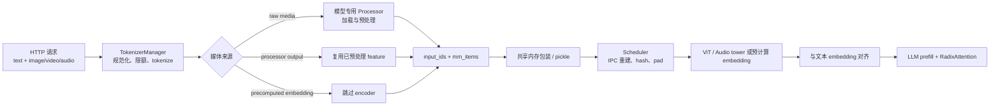

# 多模态

> 这组笔记讲的是 SGLang 的“多模态理解”链路：图片、视频或音频怎样变成与文本 token 对齐的模型输入。它不讨论扩散式图片/视频生成；后者见 [[SGLang-多模态生成]]。

## 你为什么要读

VLM serving 最容易被一句“先跑 ViT，再把 embedding 塞进 LLM”掩盖。真实系统至少同时维护四条契约：

1. prompt 中媒体占位符的出现顺序；
2. processor 产生的 feature、grid、offset 与模型专用元数据；
3. tokenizer、Scheduler、模型执行进程之间的搬运与重建；
4. 媒体内容 hash、词表外 pad value 与 RadixAttention 前缀缓存身份。

只要其中一条错位，报错往往延迟到模型 forward，表面上像 attention shape 问题，根因却可能是早先的截断、媒体排序或 IPC fallback。

## 一张总图



这张图里最重要的分界是：processor 通常产生的是 `pixel_values`、audio feature、grid 等“encoder 输入”，不等于最终视觉 embedding。最终 embedding 通常在模型执行侧由视觉塔产生；只有 `PRECOMPUTED_EMBEDDING` 路径才显式跳过 encoder。

## 建议阅读顺序

1. [[SGLang-多模态-核心概念]]：先建立对象、不变量和缓存身份的心理模型。
2. [[SGLang-多模态-数据流]]：沿一次请求看清所有权和形态变化。
3. [[SGLang-多模态-源码走读]]：把判断落到 Processor、TokenizerManager、Scheduler、CUDA IPC、ViT graph 与 encode server。
4. [[SGLang-多模态-排障指南]]：按症状定位最可能断裂的交接边界。
5. [[SGLang-多模态-学习检查]]：用可执行的静态实验验证自己是否真正理解。

## 读完必须能回答

- `get_mm_processor` 为什么既看架构名，又看 Transformers backend 兼容声明？
- 为什么 `organize_results()` 的 IMAGE→VIDEO→AUDIO 分组不要求 prompt 也按这个顺序？
- `feature`、`precomputed_embeddings`、`offsets`、`hash`、`pad_value` 分别解决什么问题？
- CUDA IPC 为什么能避免 CPU round-trip，却仍不是零复制？
- 为什么 `allow_auto_truncate` 对已有多模态 offset 不是天然安全的？
- 为什么 ViT CUDA Graph 只用总序列长度做 key 会留下“同长度、不同分段布局”的复用风险？
- encode disaggregation 的 `encoder_only`、`language_only`、Mooncake 与 ZMQ 分别改变了哪一段所有权？

## 源码边界

| 层 | 入口 | 读它时关注什么 |
|---|---|---|
| Processor 注册 | `python/sglang/srt/managers/multimodal_processor.py` | 架构到实现的选择与 Transformers backend 闸门 |
| 通用 Processor | `python/sglang/srt/multimodal/processors/base_processor.py` | 媒体加载、占位符扫描、feature 驻留和 IPC pool |
| 模型专用 Processor | `python/sglang/srt/multimodal/processors/qwen_vl.py` | Qwen-VL 的 grid、像素预算、视频和 MRoPE 契约 |
| 请求入口 | `python/sglang/srt/managers/tokenizer_manager.py` | 三种输入路径、限额、hash 覆盖、截断和发送 |
| Scheduler 数据结构 | `python/sglang/srt/managers/schedule_batch.py` | IPC 重建、hash/pad、缓存身份与模型侧输入 |
| IPC | `python/sglang/srt/utils/cuda_ipc_transport_utils.py` | 打开共享 storage、复制到目标 tensor、回收同步 |
| 视觉图优化 | `python/sglang/srt/multimodal/vit_cuda_graph_runner.py` | graph key 与静态 metadata 的适用边界 |
| Encoder 解耦 | `python/sglang/srt/disaggregation/encode_server.py` | encoder batching、缓存、DP dispatcher、ZMQ/Mooncake |
| 参数归一化 | `python/sglang/srt/server_args.py` | 默认值、自动改写、互斥和校验顺序 |

## 第一条源码证据：选择的是“模型专用契约”

```python
# 来源：python/sglang/srt/managers/multimodal_processor.py L44-L67
def get_mm_processor(
    hf_config,
    server_args: ServerArgs,
    processor,
    transport_mode,
    model_config=None,
    **kwargs,
) -> BaseMultimodalProcessor:
    model_impl = str(getattr(server_args, "model_impl", "auto")).lower()
    uses_transformers_backend = model_impl == "transformers"
    if model_impl == "auto" and model_config is not None:
        from sglang.srt.model_loader.utils import get_resolved_model_impl

        uses_transformers_backend = (
            get_resolved_model_impl(model_config) == ModelImpl.TRANSFORMERS
        )

    for model_cls, processor_cls in PROCESSOR_MAPPING.items():
        if model_cls.__name__ not in hf_config.architectures:
            continue
        if not uses_transformers_backend or getattr(
            processor_cls, "supports_transformers_backend", False
        ):
            return processor_cls(
```

这段代码证明：Processor 不是一个可随意互换的图片解码器，而是模型架构和执行 backend 的适配层。架构名匹配只解决“像谁”，兼容声明还要解决“在哪种模型实现上能工作”。

## 阅读边界

- 本专题不承诺任意模型、任意 backend、任意硬件组合都支持多模态。
- 所有性能判断都必须带版本、硬件和 workload；本文只解释当前基线的机制与风险。
- `MultimodalDataItem.validate()` 在当前基线仍未实现，不能把“数据结构存在”误读成“所有不变量已被统一校验”。

## 下一步

先读 [[SGLang-多模态-核心概念]]。如果你已经在处理线上故障，可直接进入 [[SGLang-多模态-排障指南]]，但遇到 hash、pad、offset 或 IPC 语义时仍应回到核心概念补齐模型。
