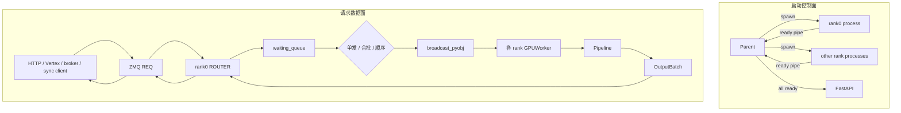

# 多模态生成 · 数据流

## 你为什么要读

扩散服务最容易被画错的地方，是把“进程是怎么拉起的”当成“请求是怎么流动的”。本文只追踪对象：外部请求如何变成 `Req`，如何跨 ZMQ、队列与并行组，怎样在 pipeline 中变形，最后如何成为 `OutputBatch`、frame、文件路径或临时文件引用。

## 1. 总图：控制面与数据面分开



ready pipe 结束后，普通请求不会沿这条 pipe 继续流动。运行期需要分别观察 ZMQ identity、waiting queue、distributed group 与 OutputBatch transport。

## 2. 入口：多个协议，共用 SchedulerClient 边界

FastAPI 注册 health、Vertex、image、video、realtime、mesh、weights 和 rollout 等 router。具体 route 负责把协议字段变成内部请求；`forward_to_scheduler` 与其他入口最终调用 singleton `async_scheduler_client.forward`。

HTTP lifespan 还启动一个 localhost REP broker。broker 收到离线 pickle payload 后，同样转给 async client；所以 HTTP 与 broker 是两个入口、一个 scheduler backend。反过来，关闭 HTTP 启动意味着 lifespan 不存在，broker也不会自动存在。

Async client 为每个请求新建 REQ socket，避免多个并发 coroutine 共享 REQ 的严格 send/recv 状态机：

```python
# 来源：python/sglang/multimodal_gen/runtime/scheduler_client.py L164-L178
        # Create a temporary REQ socket for this request to allow concurrency
        socket = self.context.socket(zmq.REQ)
        socket.setsockopt(zmq.LINGER, 0)
        # 100 minute timeout
        socket.setsockopt(zmq.RCVTIMEO, 6000000)

        endpoint = self.server_args.scheduler_endpoint
        socket.connect(endpoint)

        try:
            await socket.send(pickle.dumps(batch))
            payload = await socket.recv()
            output_batch = pickle.loads(payload)
            _materialize_output_batch_file_refs(output_batch)
            return output_batch
```

同步 client 则复用一个 REQ socket，适合串行调用；若多线程并发共享它，源码没有额外锁来保护状态机。

## 3. ZMQ 入站：payload 先变成逻辑请求

rank0 Scheduler 的 ROUTER 收 multipart envelope，保留 identity 以便稍后把结果发回同一个 REQ client。`_normalize_received_payload` 有一个容易忽略的语义：

- 非 list：一个请求；
- 空 list：无请求；
- 单元素 `list[Req]`：展开成普通单请求；
- 多元素 `list[Req]`：保留为一个 grouped multi-output 逻辑请求；
- 其他 list：逐项展开。

因此“一个 ZMQ payload 里有多个 Req”不必然代表 Scheduler 可以把它们当作独立动态合批候选。显式 grouped request 与 queue 中偶然相遇的兼容请求是两套语义。

## 4. 多 rank：对象广播，不是 Pipe batch

rank0 解析出的 `recv_reqs` 会按并行配置广播。源码顺序是 SP → CFG → TP；每次广播使用对应 group 的 CPU group 和首 rank 作为 source。

```python
# 来源：python/sglang/multimodal_gen/runtime/managers/scheduler.py L924-L937
        # TODO: fix this condition
        if self.server_args.sp_degree != 1:
            recv_reqs = broadcast_pyobj(
                recv_reqs,
                self.worker.sp_group.rank,
                self.worker.sp_cpu_group,
                src=self.worker.sp_group.ranks[0],
            )

        if self.server_args.enable_cfg_parallel:
            recv_reqs = broadcast_pyobj(
                recv_reqs,
                self.worker.cfg_group.rank,
                self.worker.cfg_cpu_group,
```

这里广播的是 Python 对象；真正的 tensor collective 则发生在 pipeline/attention/parallel stage 内。文档不能凭这段推出“所有大 tensor 都不经 CPU”，也不能凭 Pipe 的存在推出“Pipe 只传 metadata”。正确做法是对每一类对象分别找 send/broadcast/collective 调用。

## 5. waiting queue：时间与兼容性共同决定 batch

每个新请求以 `(identity, req, enqueue_time)` 入队。队首决定本轮调度基准：

1. 动态合批关闭时立即弹出一个。
2. 队首不是普通 `Req` 时立即派发。
3. 队首自身不符合动态合批条件时立即单发。
4. 否则向后扫描兼容候选，直到用户 max size 或 admission 判满。
5. 未满且尚在 delay window 内时返回 `None`，event loop 用 poll/sleep 等待剩余时间。
6. 到达上限、遇到限制或超时后，从 queue 中删除选中的非连续索引并保持原相对顺序。

兼容性不是只比较分辨率。完整签名来自 SamplingParams 的 dataclass fields（排除 `batch_sig_exclude`）和 `extra.diffusers_kwargs`，并额外拒绝 warmup、realtime、非字符串 prompt、image conditioning 与不同 path-only 模式。

## 6. merge 与 split：不能只看 forward 成功

Scheduler 深拷贝第一个请求作为 merged base，把 prompt 改为 list，并在 `extra` 保存逐请求 seed 与动态输出路径。执行后必须验证 output 或 output paths 的第一维等于各请求 `num_outputs_per_prompt` 之和，才能切分。

```python
# 来源：python/sglang/multimodal_gen/runtime/managers/scheduler.py L616-L634
    def _try_merge_generation_reqs(self, reqs: List[Req]) -> Req | None:
        """Create a batched generation request from compatible requests.

        Per-request seeds and output paths are stored in `extra` so downstream
        stages can preserve request ordering.
        """
        if len(reqs) <= 1:
            return reqs[0] if reqs else None

        base_req = reqs[0]
        for req in reqs[1:]:
            if not self._can_dynamic_batch(base_req, req):
                return None

        merged_req = deepcopy(base_req)
        merged_req.prompt = [req.prompt for req in reqs]

        merged_req.extra = deepcopy(merged_req.extra)
        merged_req.extra["dynamic_batch_seeds"] = [req.seed for req in reqs]
```

已合并 forward 失败或 split 不安全时，当前实现返回逐请求错误，不执行顺序重算。只有在 merge 前发现不兼容，才走 `_execute_generation_sequential`。这一区分影响成本、幂等性和排障日志。

## 7. Pipeline 内部：`Req` 可以继续承载中间态

普通 monolithic pipeline 最终返回 `Req` 或 `OutputBatch`，GPUWorker 用 `_to_output_batch` 统一。disagg role 可设置 `return_req=True`，让中间 `Req` 保留 embeddings/latents 等状态，在角色边界传输后再转成最终输出。

这意味着 `Req` 不只是“入口 DTO”：在 pipeline 内它也可能是可变状态载体。文档描述 latent 生命周期时，应指出具体字段和 stage，而不是笼统说“executor 始终返回 OutputBatch”。

PipelineExecutor 的 `execute_with_profiling` 只规定横切 context；实际 `execute` 与 stage sequence 属于具体实现。grouped request 也可能走 `execute_group`/`forward_batch`，不应只画单请求 `execute`。

## 8. OutputBatch：四种返回运输

GPUWorker 将计算结果统一为 `OutputBatch` 后，根据请求选择：

| 条件 | worker 动作 | ZMQ 中主要携带 |
|---|---|---|
| `return_raw_frames` | 打包 raw RGB batches，清空普通 output/audio | raw frame batches + metadata |
| `save_output && return_file_paths_only` | rank0 保存文件并清空 output/audio | output file paths |
| `return_frames` | 尽量把 tensor 快速转成 uint8 numpy frames | numpy arrays |
| 其他 | 保留 pipeline output | tensor/list，随后 pickle 或 spill |

如果 scheduler endpoint 被判定为本地，rank0 在回复前还会把大数组 spill 成临时文件引用；client 收到后调用 `materialize_file_refs` 恢复。这个优化发生在 Scheduler 返回边界，不是 broker 入站阶段。

```python
# 来源：python/sglang/multimodal_gen/runtime/managers/scheduler.py L586-L596
            if is_local_endpoint(self.server_args.scheduler_endpoint):
                with self._record_return_stage(
                    output_batch, "Scheduler.return_result.spill_arrays"
                ):
                    output_batch.output = spill_large_arrays_to_file_refs(
                        output_batch.output
                    )

            with self._record_return_stage(
                output_batch, "Scheduler.return_result.pickle"
            ):
```

## 9. Warmup 数据流

server warmup 的顺序是：FastAPI lifespan 初始化 async client → 创建 warmup event → 启动 broker → 后台轮询 `/health` → 构造 synthetic request → 直接 `async_scheduler_client.forward` → 成功后 set event。middleware 在此期间只放行 health/model/server info 等控制面路径。

因此：

- `/health` 200 只证明 HTTP 控制面已起来；
- `warmup_done` 才表示 synthetic scheduler/pipeline 请求完成；
- image/video route 自身的协议转换并没有被这条 direct-forward warmup完整覆盖；
- warmup 异常会向当前 HTTP 进程发 SIGTERM，而不是把 error JSON 留给后续用户请求。

## 10. Disagg 数据流

非 monolithic Scheduler 直接进入 disagg event loop。head `DiffusionServer` 在 encoder、denoiser、decoder work/result endpoint 之间分派；role worker 通过 `return_req=True` 保留中间态。pool launcher 会为每个 role instance 重建 `ServerArgs`，覆盖 GPU 数、并行度、work/result endpoint、scheduler/master port 和 warmup模式。

不要把它简化成“同一 monolithic queue 后面多了三个服务”：入口、event loop、transport 和返回条件都发生了变化。

## 运行验证

```powershell
rg -n '_normalize_received_payload|recv_reqs|broadcast_pyobj|get_next_batch_to_run|_try_merge_generation_reqs|_split_batched_output|spill_large_arrays_to_file_refs' sglang/python/sglang/multimodal_gen/runtime/managers/scheduler.py
rg -n 'temporary REQ socket|materialize_file_refs|run_zeromq_broker' sglang/python/sglang/multimodal_gen/runtime/scheduler_client.py
rg -n '_materialize_output_transport|return_raw_frames|return_file_paths_only|return_frames|return_req' sglang/python/sglang/multimodal_gen/runtime/managers/gpu_worker.py
```

预期：能够从入站 envelope 一直定位到 queue、broadcast、merge/split、worker transport、local spill 与 client materialize。动态运行仍需要匹配模型、GPU、并行后端和输出编码依赖；静态检索不能证明数值正确或端到端吞吐。
