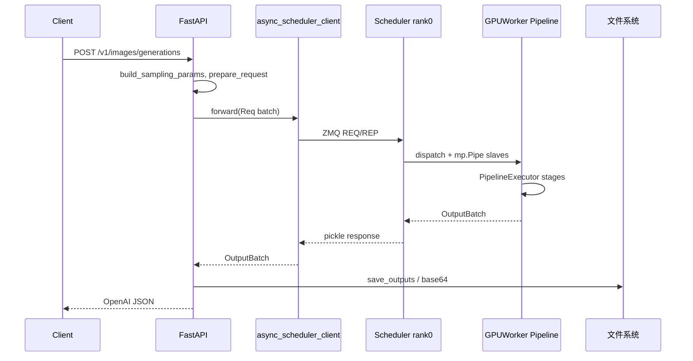
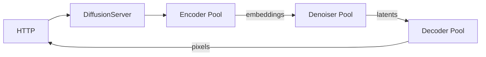

# 多模态生成 · 数据流

---

## 你为什么要读

扩散生成不是文本 decode 循环的换皮版。请求会经过 HTTP、ZMQ、Scheduler、PipelineExecutor，再穿过 text encode、denoise 与 decode stage。本文沿一次生成任务追踪配置、latent 和输出资产，明确它与 `srt` 文本 serving 共用什么、又在哪些地方彻底分叉。

## 1. 架构位置

**读法：** multimodal_gen 与 srt **并列**于 SGLang 仓库，服务扩散推理而非 LLM decode。对外 OpenAI Images/Videos API，对内 ZMQ + 多进程 GPU pipeline。



---

## 2. 输入 / 输出

| 方向 | 类型 | 字段 | 说明 |
|------|------|------|------|
| 输入 | OpenAI Image API JSON | prompt, size, n, response_format | http_server → SamplingParams |
| 内部 | `Req` | prompt_embeds, latents, seeds | schedule_batch |
| 内部 | `OutputBatch` | tensor, paths, metrics | pipeline 输出 |
| 输出 | HTTP JSON | b64_json 或 url | OpenAI 兼容 |

**源码锚点：**

```python
## 来源：python/sglang/multimodal_gen/runtime/entrypoints/http_server.py L27
from sglang.multimodal_gen.runtime.entrypoints.openai.utils import build_sampling_params
```

**要点：**

- `prepare_request` 校验分辨率、帧数、模型能力边界。
- Vertex 路由 `VERTEX_ROUTE` 适配 GCP 部署。

---

## 3. 上下游连接

| 上游/下游 | 模块 | 交互 |
|-----------|------|------|
| 上游 | Web UI / OpenAI SDK | HTTPS |
| 下游 | CUDA DiT/VAE/TextEncoder | in-process torch |
| 侧向 | 本地磁盘 | 输出 PNG/MP4 |
| 侧向 | ZMQ offline client | broker_port pickle |
| 共享 | sglang.srt.utils | json_response, network |

---

## 4. 典型数据流：标准 T2I 请求

**步骤 1 — HTTP 入口**

→ FastAPI route handler（`image_api`）解析 body

**步骤 2 — 构造 Req**

→ `build_sampling_params` + `prepare_request` → `Req` dataclass

**步骤 3 — ZMQ 转发**

```python
## 来源：python/sglang/multimodal_gen/runtime/scheduler_client.py L34-L35
            # 2. Forward the request to the main Scheduler via the shared client
            response_batch = await async_scheduler_client.forward(request_batch)
```

**步骤 4 — Scheduler 派单**

→ Rank0 Scheduler 收请求，必要时 broadcast 到 slave ranks（Pipe）

**步骤 5 — Pipeline stages**

```
TextEncodingStage → DenoisingStage (× steps) → DecodingStage (VAE)
```

**源码锚点：**

```python
## 来源：python/sglang/multimodal_gen/runtime/pipelines_core/executors/pipeline_executor.py L126-L135
    def execute_with_profiling(
        self,
        stages: List["PipelineStage"],
        batch: Req,
        server_args: ServerArgs,
    ) -> OutputBatch:

        with self.profile_execution(batch, dump_rank=0):
            with current_platform.inference_mode():
                batch = self.execute(stages, batch, server_args)
```

**步骤 6 — 输出 materialize**

→ `save_outputs` 写文件 → HTTP 返回 base64 或 path

---

## 5. 多 GPU 数据流

**读法：** Tensor Parallel 时 rank0 通过 Pipe 将 micro-batch 分发给 slaves，collective 在 stage 内完成。

```
launch_server spawn N processes
 → each: run_scheduler_process → Scheduler.event_loop
 → rank0: ZMQ 收 Req → 拆分/广播 → Pipe → slaves
 → all ranks: GPUWorker.pipeline.forward (dist allreduce)
 → rank0: 汇总 OutputBatch → ZMQ reply
```

**源码锚点：**

```python
## 来源：python/sglang/multimodal_gen/runtime/launch_server.py L99-L105
    # Pipes for master to talk to slaves
    task_pipes_to_slaves_w = []
    task_pipes_to_slaves_r = []
    for _ in range(num_gpus - 1):
        r, w = mp.Pipe(duplex=False)
        task_pipes_to_slaves_r.append(r)
        task_pipes_to_slaves_w.append(w)
```

**要点：**

- Pipe 仅传控制/metadata；大 tensor 通过 shared CUDA distributed 通信。
- `num_gpus-1` 条 pipe 对应 slave 数量。

---

## 6. 离线 Broker 数据流

**读法：** DiffGenerator CLI 连 `broker_port`，不经过 HTTP，适合 batch benchmark。

```
Offline Client --pickle Req--> ZMQ REP (broker)
 --> async_scheduler_client.forward
 --> Scheduler
 <-- OutputBatch pickle --
```

**源码锚点：**

```python
## 来源：python/sglang/multimodal_gen/runtime/scheduler_client.py L28-L38
        try:
            # 1. Receive a request from an offline client
            payload = await socket.recv()
            request_batch = pickle.loads(payload)
            logger.info("Broker received an offline job from a client.")

            # 2. Forward the request to the main Scheduler via the shared client
            response_batch = await async_scheduler_client.forward(request_batch)

            # 3. Send the Scheduler's reply back to the offline client
            await socket.send(pickle.dumps(response_batch))
```

**要点：**

- `materialize_file_refs` 解析 Req 中的文件引用为本地路径。
- 错误时也必须 reply，防止 client hang。

---

## 7. Disagg Pool 数据流

**读法：** 请求跨三个 worker pool 流转，每个 pool 内仍可能是多 GPU TP。



**源码锚点：**

```python
## 来源：python/sglang/multimodal_gen/runtime/launch_server.py L13-L15
from sglang.multimodal_gen.runtime.disaggregation.orchestrator import (
    DiffusionServer,
)
```

**要点：**

- `RoleType` 区分 encoder/denoiser/decoder worker。
- pool 大小由 `encoder_gpus`/`denoiser_gpus`/`decoder_gpus` 列表长度决定。

---

## 8. Realtime Video 数据流

**读法：** 长连接 session 缓存中间 latent，逐帧 push；release 释放 cache。

**源码锚点：**

```python
## 来源：python/sglang/multimodal_gen/runtime/managers/gpu_worker.py L133
        self._realtime_sessions = RealtimeSessionCache(max_sessions=1)
```

**要点：**

- `entrypoints/openai/realtime` WebSocket API。
- `build_raw_rgb_frame_batches` 打包原始 RGB 帧。

---

## 9. Warmup 数据流

**读法：** 服务启动后 synthetic client 发与生产相同形状的 Req，触发 CUDA kernel JIT 与 cudnn benchmark。

**源码锚点：**

```python
## 来源：python/sglang/multimodal_gen/runtime/entrypoints/http_server.py L89-L93
        await run_async_client_warmup(
            server_args,
            async_scheduler_client.forward,
            fail_open=server_args.warmup_resolutions is None,
        )
```

**要点：**

- `warmup_done` Event 阻塞部分路由直到 warmup 完成（可选）。
- fail_open 允许 warmup 分辨率未配置时跳过失败。

---

## 10. 启动握手数据流

```
Parent launch_server
 → spawn workers
 → each worker: Scheduler init → pipe send {status: ready}
 → parent recv all ready
 → launch_http_server_only (uvicorn)
 → lifespan: zmq client + broker + warmup
```

**源码锚点：**

```python
## 来源：python/sglang/multimodal_gen/runtime/launch_server.py L196-L208
    if launch_http_server:
        logger.info("Starting FastAPI server.")
        if server_args.webui:
            logger.info("Launch FastAPI server in another process because of webui.")
            http_server_process = mp.Process(
                target=launch_http_server_only,
                args=(server_args,),
                name="sglang-diffusion-webui",
                daemon=True,
            )
            http_server_process.start()
        else:
            launch_http_server_only(server_args)
```

**要点：**

- webui 模式 HTTP 在独立进程，避免 Gradio 阻塞 scheduler。
- 主进程通常阻塞 join worker 或 signal handler。

## 运行验证

这篇的数据流可以用源码检索确认五个边界：HTTP forward、AsyncSchedulerClient、PipelineExecutor、worker realtime session、warmup 与启动握手。

```powershell
rg -n 'launch_http_server_only|class AsyncSchedulerClient|def forward|class PipelineExecutor|def launch_server|DiffusionServer|class GPUWorker|RealtimeSessionCache|run_async_client_warmup|warmup_done' sglang/python/sglang/multimodal_gen/runtime/entrypoints/http_server.py sglang/python/sglang/multimodal_gen/runtime/scheduler_client.py sglang/python/sglang/multimodal_gen/runtime/pipelines_core/executors/pipeline_executor.py sglang/python/sglang/multimodal_gen/runtime/launch_server.py sglang/python/sglang/multimodal_gen/runtime/managers/gpu_worker.py
```

读输出时按请求方向核对：HTTP 只把请求交给 scheduler client，scheduler / worker / executor 才进入 pipeline 执行；warmup 是服务就绪后的 synthetic 请求，不应被误读成普通用户请求。
