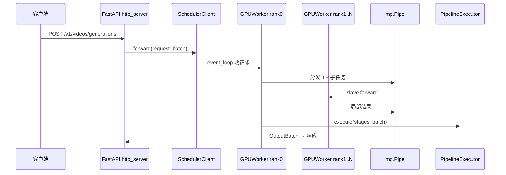

# 多模态生成 · 核心概念

## 你为什么要读

多模态生成与 VLM 理解是两套不同主线：前者运行 text encoder、denoising 与 VAE decode pipeline，后者把媒体特征并入语言模型 prefill。本篇先把扩散 runtime 的进程、stage 和 latent 生命周期摆清楚，再解释它与文本 `srt` 的共享边界。

## 用户故事

### 场景角色

**阿宁**，短视频平台的生成算法工程师。产品需要 Text-to-Video：用户输入文案，服务返回视频资产。DiT pipeline 运行在多 GPU 上；rank 0 接收 ZMQ 请求，并协调其他 worker 完成多步 denoise 与 decode。

### 时间线

| 时刻 | 事件 |
|------|------|
| T0 | 客户端 POST OpenAI 兼容 `/v1/videos/generations` |
| T1 | FastAPI → `async_scheduler_client` ZMQ REQ 到 rank0 Scheduler |
| T2 | rank0 `GPUWorker.execute_forward` 经 Pipe 广播 TP 任务给 rank1..N |
| T3 | `PipelineExecutor` 顺序执行 TextEncoding → Denoising（多步）→ VAE Decoding |
| T4 | 输出 tensor 写文件 / base64；master 汇总 slave 结果返回 HTTP |

### 涉及模块



**读法：** `multimodal_gen` 服务扩散式生成（非 LLM autoregressive decode）。`launch_server` 按 `num_gpus` spawn 多进程：rank0 为 master，持有 ZMQ 与 HTTP 桥接；rank>0 为 slave，仅通过 Pipe 参与 TP。全部 worker pipe 握手 `status: ready` 后 master 才对外监听 HTTP，避免半初始化集群接流量。与 srt LLM 相比，forward 走 DiT/VAE stage 编排而非 token decode loop。

**源码锚点：**

```python
## 来源：python/sglang/multimodal_gen/runtime/launch_server.py L120-L156
    for i in range(num_gpus):
        reader, writer = mp.Pipe(duplex=False)
        scheduler_pipe_writers.append(writer)
        if i == 0:  # Master worker
            process = mp.Process(
                target=run_scheduler_process,
                args=(
                    i,  # local_rank
                    i,  # rank
                    master_port,
                    server_args,
                    writer,
                    None,  # No task pipe to read from master
                    None,  # No result pipe to write to master
                    task_pipes_to_slaves_w,
                    result_pipes_from_slaves_r,
                ),
                name=f"sglang-diffusionWorker-{i}",
                daemon=True,
            )
        else:  # Slave workers
            process = mp.Process(
                target=run_scheduler_process,
                args=(
                    i,  # local_rank
                    i,  # rank
                    master_port,
                    server_args,
                    writer,
                    None,  # No task pipe to read from master
                    None,  # No result pipe to write to master
                    task_pipes_to_slaves_r[i - 1],
                    result_pipes_from_slaves_w[i - 1],
                ),
                name=f"sglang-diffusionWorker-{i}",
                daemon=True,
            )
```

```python
## 来源：python/sglang/multimodal_gen/runtime/managers/scheduler.py L953-L960
    def event_loop(self) -> None:
        """
        The main event loop that listens for ZMQ requests.
        Handles abortion
        """
        # Pool mode: all roles use the pool event loop
        if self._disagg_role != RoleType.MONOLITHIC:
            self._disagg_event_loop()
```

**要点：**

- slave 不直接收 HTTP/ZMQ，降低多进程竞态。
- `ComposedPipelineBase` 由 `build_pipeline(server_args)` 构造各 stage。
- 高级模式可 `launch_pool_disagg_server` 分离 Encoder/Denoiser/Decoder 池。
- rank0 `event_loop` 是请求调度中枢；slave 仅响应 Pipe 上的 TP 子任务。
- OpenAI 兼容 `video_api` 将 HTTP JSON 转为内部 `Req` + `SamplingParams`。

### 如果…会怎样（调试）

| 现象 | 可能原因 | 排查 |
|------|----------|------|
| HTTP 起不来 | 某 rank pipe 非 ready | 看 `Initialization failed` 与 worker 日志 |
| 视频花屏 / 全黑 | denoise 步数或 CFG 配置错 | 查 `ServerArgs.pipeline_config` |
| 单卡 OOM | TP 未启或 layerwise offload 未开 | 增 `num_gpus` 或 component residency |
| ZMQ timeout | master event_loop 阻塞 | 查 `scheduler.py event_loop` 队列深度 |

---

## 1. multimodal_gen 的定位

**读法：** 本子系统服务 **扩散式多模态生成**（Stable Diffusion、Wan、LTX、Flux 等 pipeline），不是 LLM token 自回归。一次请求经历：文本编码 → 多步 denoise（DiT）→ VAE decode → 输出图像/视频文件或 tensor。

**源码锚点：**

```python
## 来源：python/sglang/multimodal_gen/runtime/managers/gpu_worker.py L106-L109
class GPUWorker(GPUWorkerPostTrainingMixin):
    """
    A worker that executes the model on a single GPU.
    """
```

**要点：**

- `ComposedPipelineBase` 由 `build_pipeline(server_args)` 构造，含 transformer/vae/text_encoder 等 stage。
- 支持 realtime video、disagg encoder/denoiser/decoder 等高级模式。

---

## 2. 进程模型：Master + Slaves

**读法：** `launch_server` 按 `num_gpus` spawn 多个 `run_scheduler_process`。Rank 0 为 master：收 ZMQ 请求、通过 Pipe 分发 tensor parallel 任务；Rank > 0 为 slave：等待 pipe 任务并回传结果。

**源码锚点：**

```python
## 来源：python/sglang/multimodal_gen/runtime/launch_server.py L120-L139
    for i in range(num_gpus):
        reader, writer = mp.Pipe(duplex=False)
        scheduler_pipe_writers.append(writer)
        if i == 0:  # Master worker
            process = mp.Process(
                target=run_scheduler_process,
                args=(
                    i,  # local_rank
                    i,  # rank
                    master_port,
                    server_args,
                    writer,
                    None,  # No task pipe to read from master
                    None,  # No result pipe to write to master
                    task_pipes_to_slaves_w,
                    result_pipes_from_slaves_r,
                ),
                name=f"sglang-diffusionWorker-{i}",
                daemon=True,
            )
```

**要点：**

- 与 srt scheduler 类似用独立进程隔离 CUDA context。
- 全部 worker ready 后 master 才启动 HTTP（pipe 握手 `status: ready`）。

---

## 3. PipelineExecutor 与 Stage

**读法：** 每个 diffusion pipeline 拆为多个 `PipelineStage`（如 TextEncoding、Denoising、Decoding）。`PipelineExecutor` 负责顺序/并行执行 stage、管理 component residency（CPU offload 时加载/卸载权重）。

**源码锚点：**

```python
## 来源：python/sglang/multimodal_gen/runtime/pipelines_core/executors/pipeline_executor.py L42-L48
class PipelineExecutor(ABC):
    """
    Abstract base class for all pipeline executors.

    Executors orchestrate the execution of pipeline, with managing the parallel and communications required by stages

    """
```

**要点：**

- 具体子类实现 `execute(stages, batch, server_args)`。
- `before_stage` / `component_residency_manager` 处理 layerwise offload。

---

## 4. HTTP 与 ZMQ 双通道

**读法：** 在线服务：FastAPI 收 HTTP → `async_scheduler_client` ZMQ REQ 到 rank0 Scheduler。离线/本地：`run_zeromq_broker` 另开 REP socket 收 pickle 请求（DiffGenerator CLI）。

**源码锚点：**

```python
## 来源：python/sglang/multimodal_gen/runtime/scheduler_client.py L16-L38
async def run_zeromq_broker(server_args: ServerArgs):
    """
    This function runs as a background task in the FastAPI process.
    It listens for TCP requests from offline clients (e.g., DiffGenerator).
    """
    ctx = zmq.asyncio.Context()
    socket = ctx.socket(zmq.REP)
    broker_endpoint = f"tcp://127.0.0.1:{server_args.broker_port}"
    socket.bind(broker_endpoint)
    logger.info(f"ZMQ Broker is listening for offline jobs on {broker_endpoint}")

    while True:
        try:
            # 1. Receive a request from an offline client
            payload = await socket.recv()
            request_batch = pickle.loads(payload)
            logger.info("Broker received an offline job from a client.")

            # 2. Forward the request to the main Scheduler via the shared client
            response_batch = await async_scheduler_client.forward(request_batch)

            # 3. Send the Scheduler's reply back to the offline client
            await socket.send(pickle.dumps(response_batch))
```

**要点：**

- HTTP 与 broker 共用同一 Scheduler backend。
- pickle 用于离线大 batch 请求（含文件路径引用 materialize）。

---

## 5. ServerArgs 与 PipelineConfig

**读法：** `ServerArgs` dataclass 聚合模型路径、GPU 数、并行策略（TP/SP/CFG ring）、disagg 角色、warmup 配置等，全局 `set_global_server_args` 供 worker 读取。

**源码锚点：**

```python
## 来源：python/sglang/multimodal_gen/runtime/server_args.py L9-L11
import json
import math
import os
```

**要点：**

- `pipeline_config` 决定 task_type（T2V、I2V 等）与 precision。
- `DisaggServerArgsMixin` 扩展 pool disagg 的 encoder/denoiser/decoder GPU 映射。

---

## 6. Disaggregated 扩散服务

**读法：** `launch_pool_disagg_server` 按角色池启动多组 worker：Encoder 编码 prompt → Denoiser 迭代 latent → Decoder VAE 出图。`DiffusionServer` orchestrator 在角色边界 dispatch。

**源码锚点：**

```python
## 来源：python/sglang/multimodal_gen/runtime/launch_server.py L213-L223
def launch_pool_disagg_server(
    server_args: ServerArgs,
    encoder_gpus: list[list[int]],
    denoiser_gpus: list[list[int]],
    decoder_gpus: list[list[int]],
    launch_http_server: bool = True,
):
    """Launch a pool-based disaggregated server with N:M:K independent role instances.

    DiffusionServer orchestrates the full pipeline, dispatching at every
    role transition (Encoder → Denoiser → Decoder).
```

**要点：**

- 类比 srt PD disaggregation，但角色是扩散 pipeline 阶段而非 prefill/decode。
- 各 pool 可独立扩缩容 GPU 数。

---

## 7. OpenAI 兼容 API

**读法：** `entrypoints/openai/image_api.py`、`video_api.py` 将 OpenAI Images/Video 格式转为内部 `Req` + `SamplingParams`，经 scheduler 执行后返回 base64 或 URL。

**源码锚点：**

```python
## 来源：python/sglang/multimodal_gen/runtime/entrypoints/http_server.py L17-L20
from sglang.multimodal_gen.runtime.entrypoints.openai import (
    image_api,
    video_api,
)
```

**要点：**

- `/health`、`/v1/models` 与 srt 风格一致便于 K8s 探针。
- `server_warmup` 可选 synthetic 请求预热 CUDA graph。

## 运行验证

这篇可以用源码检索验证 multimodal_gen 的四个边界：入口启动、Scheduler/worker/pipeline 执行、pool disagg 角色、HTTP OpenAI 兼容层。

```powershell
rg -n 'def launch_server|def launch_pool_disagg_server|class Scheduler|class GPUWorker|class PipelineExecutor|class AsyncSchedulerClient|class ServerArgs|pipeline_config|DiffusionServer|image_api|video_api|server_warmup' sglang/python/sglang/multimodal_gen/runtime/launch_server.py sglang/python/sglang/multimodal_gen/runtime/managers/scheduler.py sglang/python/sglang/multimodal_gen/runtime/managers/gpu_worker.py sglang/python/sglang/multimodal_gen/runtime/pipelines_core/executors/pipeline_executor.py sglang/python/sglang/multimodal_gen/runtime/scheduler_client.py sglang/python/sglang/multimodal_gen/runtime/server_args.py sglang/python/sglang/multimodal_gen/runtime/entrypoints/http_server.py
```

如果输出显示 `DiffusionServer`、`AsyncSchedulerClient` 或 OpenAI router 的位置变化，优先重读 HTTP 与 broker 共用 backend 的部分；如果 `pipeline_config` 或 `launch_pool_disagg_server` 变化，则优先重读角色池和 task type 的解释。
