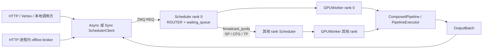

# 多模态生成

> **源码范围：** `python/sglang/multimodal_gen/runtime/`
> **Git 基线：** `70df09b`
> **前置专题：** [[SGLang-前端语言]]

## 你为什么要读

本专题的读者任务，是建立一张能用于源码定位和线上排障的运行时地图，而不只是知道“扩散模型有编码、去噪和解码”。读完后，你应能从任意一个请求或故障反推出当前 owner、通信边界与下一处证据。

## 你将在这里建立什么模型

`multimodal_gen` 是与文本 SRT 并列的生成运行时。它服务图像、视频等 diffusion pipeline：请求不是进入逐 token decode loop，而是携带 prompt、图像条件、seed、分辨率和采样配置，依次穿过 pipeline stage，最终形成 tensor、frame、音视频文件或文件引用。

最值得先纠正的直觉是：多 GPU 普通生成不靠父进程创建的 `mp.Pipe` 广播请求。rank 0 的 Scheduler 从 ZMQ ROUTER 收请求，随后按启用的 SP、CFG、TP 进程组调用 `broadcast_pyobj`；各 rank 都持有 Scheduler 和 GPUWorker，只有 rank 0 持有对外 ROUTER socket。Pipe 仍存在，但属于专门的控制任务/结果通道，不能代替分布式广播主线。



## 一次请求的五层所有权

| 层 | 核心对象 | 真正负责什么 |
|---|---|---|
| 启动层 | `launch_server`、worker process、ready pipe | 拉起每个 rank，等待全部 Scheduler 构造完成，再暴露 HTTP |
| 协议层 | FastAPI router、warmup middleware | 把外部协议转成内部请求；维护控制面 bypass 与 server warmup gate |
| IPC 层 | `AsyncSchedulerClient`、`SchedulerClient` | 每请求 ZMQ REQ/REP；本地大数组返回时可用临时文件引用降低 pickle 压力 |
| 调度层 | `Scheduler.waiting_queue`、动态合批签名与 admission | 收请求、等待兼容请求、合并或顺序执行，并把结果按 identity 回复 |
| 执行层 | `GPUWorker`、`ComposedPipeline`、`PipelineExecutor` | 初始化设备与并行组，执行 stage，处理驻留/offload、profiling 和输出 transport |

正式启动顺序由源码明确限定：

```python
# 来源：python/sglang/multimodal_gen/runtime/launch_server.py L176-L192
    for i, reader in enumerate(scheduler_pipe_readers):
        try:
            data = reader.recv()
        except EOFError:
            logger.error(
                f"Rank {i} scheduler is dead. Please check if there are relevant logs."
            )
            processes[i].join()
            logger.error(f"Exit code: {processes[i].exitcode}")
            raise

        if data["status"] != "ready":
            raise RuntimeError(
                "Initialization failed. Please see the error messages above."
            )
        scheduler_infos.append(data)
        reader.close()
```

而普通请求的跨 rank 复制发生在 Scheduler：

```python
# 来源：python/sglang/multimodal_gen/runtime/managers/scheduler.py L933-L951
        if self.server_args.enable_cfg_parallel:
            recv_reqs = broadcast_pyobj(
                recv_reqs,
                self.worker.cfg_group.rank,
                self.worker.cfg_cpu_group,
                src=self.worker.cfg_group.ranks[0],
            )

        if self.server_args.tp_size > 1:
            recv_reqs = broadcast_pyobj(
                recv_reqs,
                self.worker.tp_group.rank,
                self.worker.tp_cpu_group,
                src=self.worker.tp_group.ranks[0],
            )

        assert recv_reqs is not None

        return recv_reqs
```

## 当前基线必须记住的边界

- `server_warmup` 先轮询 HTTP `/health`，但合成 warmup 随后直接调用 `async_scheduler_client.forward`，不是再走一次生成 HTTP route。
- HTTP lifespan 才会启动 offline broker；`launch_server(..., launch_http_server=False)` 本身不会顺带启动 broker。
- 动态合批只合并满足签名、prompt 类型、图像条件、realtime、warmup 和输出模式等约束的请求；同轮候选无法合并时会顺序执行。
- `dp_size` 虽然存在于配置和返回信息中，但当前校验明确拒绝 `dp_size > 1`，不能把字段存在写成已支持 DP serving。
- component residency 的真实迁移由具体 executor/manager 完成；基类 `before_stage` 只是委托，不能概括成固定的“stage 后必回 CPU”。
- monolithic 与 encoder/denoiser/decoder disagg role 使用不同 event loop；非 monolithic role 会关闭 server warmup。

## 阅读顺序

1. [[SGLang-多模态生成-核心概念]]：先分清进程、rank、通信和对象边界。
2. [[SGLang-多模态生成-数据流]]：沿 `Req → waiting_queue → OutputBatch` 追踪对象变化。
3. [[SGLang-多模态生成-源码走读]]：按启动、调度、执行和返回完整走读。
4. [[SGLang-多模态生成-排障指南]]：用症状定位协议、队列、并行、stage 或输出 transport。
5. [[SGLang-多模态生成-学习检查]]：闭卷证明自己没有把 Pipe、ZMQ、collective 和 disagg 混成一层。

## 验收标准

- [ ] 能解释为何“rank0 用 Pipe 广播普通生成请求”在当前基线是错误模型。
- [ ] 能沿 HTTP/本地客户端 → ZMQ ROUTER → waiting queue → 动态合批 → GPUWorker → OutputBatch 讲清所有权。
- [ ] 能区分 request warmup、server warmup，以及控制面 bypass。
- [ ] 能说明 TP/SP/CFG、尚未支持的 DP 与 disagg role 是不同维度。
- [ ] 能给出静态验证命令及预期，而不是只背组件名。
