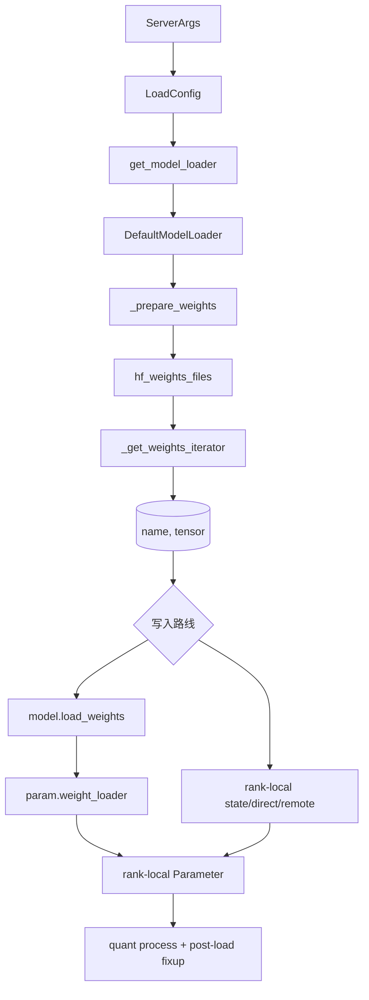

# ModelLoader · 源码走读

本篇先沿一条真实基线走：Llama 类 HF checkpoint 的 safetensors tensor 如何进入当前 TP rank 参数；随后用 ShardedState、BitsAndBytes、GGUF、Remote 与 Layered 路线逐一指出这条基线在哪里失效。

## 主线图



## 读者任务

读完本篇，应能从日志或异常倒推出卡在哪个边界：

- loader 没找到文件：看 `_prepare_weights`。
- 加载很慢或 CPU 内存高：看 iterator、mmap、prefetch、多线程。
- shape mismatch：看模型 `load_weights` 的名字映射和参数 `weight_loader`。
- rank 间行为不同：看 TP rank 在 `LoadConfig` 和 `weight_loader` 中的消费点。
- 量化模型启动后错误：看 `quant_method.process_weights_after_loading` 和 KV scale。

## 长文读法

这篇按冷启动权重路径读：`ModelRunner` 先把 server args 汇总成 `LoadConfig`，`get_model_loader` 选择具体 loader，`DefaultModelLoader` 准备文件并产出 `(name, tensor)` iterator，模型类的 `load_weights` 负责 checkpoint 名字映射，参数自己的 `weight_loader` 才完成当前 TP rank 的切片写入，最后量化模块做加载后处理。

| 读者任务 | 先读 | 要抓住的判断 |
|----------|------|--------------|
| 首次建立权重加载主线 | 主线图、第 1 到 3 节 | loader 分支由 `LoadConfig` 和 `ModelConfig` 决定，普通 HF 权重最终回到 `DefaultModelLoader` |
| 排查找不到权重文件 | 第 4 节 | `_prepare_weights` 决定下载、本地目录、allow pattern、safetensors index 过滤和 PT fallback |
| 排查加载慢或内存高 | 第 2、5 节 | weights region、CPU backup、mmap、prefetch、多线程 iterator 都会影响冷启动峰值 |
| 排查 shape mismatch | 第 6 到 8 节 | 先看模型 `load_weights` 是否把名字映射到正确参数，再看参数 `weight_loader` 的 TP 切片 |
| 排查 rank 间权重不同 | 第 1、7、8、10 节 | 区分 LoadConfig remote rank、运行时 linear rank、rank-local iterator/state 与 presharded 标志 |
| 排查量化模型启动后错误 | 第 9 节 | `model.load_weights` 之后还会遍历模块执行 `quant_method.process_weights_after_loading` |
| 判断特殊 loader 改了哪段 | 第 10 节、运行验证 | remote、RunAI、FlashRL、BitsAndBytes 等通常替换 transport、iterator 或 postprocess 的一段，不等于重写整条主线 |

读的时候保持四层分开：文件/transport 解决“字节从哪里来”，写入路线决定“是否经过模型名字 remap”，rank-local 协议决定“在哪里且只切一次”，完成阶段负责 quant layout 与模型 post-load fixup。

## 1. ModelRunner 先编译 LoadConfig

`ModelRunner` 把 server args 中和加载相关的字段聚合成 `LoadConfig`。这一步把冷启动加载、远端实例加载、ModelOpt、RL quant、draft model 等配置放到同一张事实表里。

```python
# 来源：python/sglang/srt/model_executor/model_runner.py L1421-L1437
        self.load_config = LoadConfig(
            load_format=self.server_args.load_format,
            download_dir=self.server_args.download_dir,
            model_loader_extra_config=self.server_args.model_loader_extra_config,
            tp_rank=self.tp_rank,
            remote_instance_weight_loader_seed_instance_ip=self.server_args.remote_instance_weight_loader_seed_instance_ip,
            remote_instance_weight_loader_seed_instance_service_port=self.server_args.remote_instance_weight_loader_seed_instance_service_port,
            remote_instance_weight_loader_send_weights_group_ports=self.server_args.remote_instance_weight_loader_send_weights_group_ports,
            remote_instance_weight_loader_backend=self.server_args.remote_instance_weight_loader_backend,
            remote_instance_weight_loader_transfer_engine=self.remote_instance_transfer_engine,
            remote_instance_weight_loader_transfer_engine_session_id=self.remote_instance_transfer_engine_session_id,
            modelexpress_url=self.server_args.modelexpress_url,
            modelexpress_transport=self.server_args.modelexpress_transport,
            modelopt_config=modelopt_config,
            rl_quant_profile=self.server_args.rl_quant_profile,
            draft_model_idx=self.draft_model_idx,
        )
```

如果想知道某个 loader 分支为什么被选中，先看 `LoadConfig`，不要直接跳到 `loader.py` 的类定义。

## 2. ModelRunner 在权重内存区域内调用 loader

加载发生在 `GPU_MEMORY_TYPE_WEIGHTS` region 内。这里还临时 patch vLLM parallel state，让复用的 linear/quant 代码读取到 SGLang 的并行状态。

```python
# 来源：python/sglang/srt/model_executor/model_runner.py L1461-L1488
        # Load the model
        # Remove monkey_patch when linear.py quant remove dependencies with vllm
        monkey_patch_vllm_parallel_state()

        enable_cpu_backup = self.server_args.enable_weights_cpu_backup or (
            self.is_draft_worker and self.server_args.enable_draft_weights_cpu_backup
        )
        with self.memory_saver_adapter.region(
            GPU_MEMORY_TYPE_WEIGHTS,
            enable_cpu_backup=enable_cpu_backup,
        ):
            self.loader = get_model_loader(
                load_config=self.load_config,
                model_config=self.model_config,
            )
            self.model = self.loader.load_model(
                model_config=self.model_config,
                device_config=DeviceConfig(self.device, self.gpu_id),
            )
            if hasattr(self.loader, "remote_instance_transfer_engine_weight_info"):
                self.remote_instance_transfer_engine_weight_info = (
                    self.loader.remote_instance_transfer_engine_weight_info
                )
        # Cache needs to be cleared after loading model weights (in the self.loader.load_model function).
        # To avoid conflict with memory_saver_adapter.region, empty_cache operation is now moved here.
        if _is_npu:
            torch.npu.empty_cache()
        monkey_patch_vllm_parallel_state(reverse=True)
```

这里有两个排障信号：加载期间 OOM 要看 weights region 与 CPU backup；加载后执行异常要确认 parallel state patch 是否正确恢复。

## 3. get_model_loader 先处理特殊分支，最后回到 DefaultModelLoader

普通 HF checkpoint 会落到函数尾部的 `DefaultModelLoader`。真正改变主线的是 DUMMY、ModelOpt、SHARDED_STATE、BITSANDBYTES、GGUF、LAYERED、FLASH_RL、REMOTE、REMOTE_INSTANCE、PRIVATE、RUNAI_STREAMER。

```python
# 来源：python/sglang/srt/model_loader/loader.py L3202-L3301
def get_model_loader(
    load_config: LoadConfig, model_config: Optional[ModelConfig] = None
) -> BaseModelLoader:
    """Get a model loader based on the load format."""

    if load_config.load_format == LoadFormat.DUMMY:
        return DummyModelLoader(load_config)

    if model_config and model_config.quantization in ["auto-round-int8"]:
        logger.info("Using IncModelLoader due to AutoRound quantization config.")
        return IncModelLoader(load_config)

    # ModelOptModelLoader's local-copy quantize-and-export workflow doesn't apply
    # to non-local loaders. These loaders own their weight transport path and still
    # initialize the model with ModelOpt quantization config where applicable.
    model_optloader_allowed = model_config and load_config.load_format not in (
        LoadFormat.RUNAI_STREAMER,
        LoadFormat.REMOTE_INSTANCE,
    )

    if model_optloader_allowed and (
        (hasattr(model_config, "modelopt_quant") and model_config.modelopt_quant)
        or model_config.quantization
        in ["modelopt_fp8", "modelopt_fp4", "modelopt_mixed", "modelopt"]
    ):
        logger.info("Using ModelOptModelLoader due to ModelOpt quantization config.")
        return ModelOptModelLoader(load_config)

    # Use ModelOptModelLoader for unified quantization flags
    if (
        model_optloader_allowed
        and hasattr(model_config, "quantization")
        and model_config.quantization
        in ["modelopt_fp8", "modelopt_fp4", "modelopt_mixed"]
    ):
        if model_config._is_already_quantized():
            logger.info(
                f"Using ModelOptModelLoader for pre-quantized model: {model_config.quantization}"
            )
        else:
            logger.info(
                f"Using ModelOptModelLoader for quantization: {model_config.quantization}"
            )
        return ModelOptModelLoader(load_config)

    if isinstance(load_config.load_format, type):
        return load_config.load_format(load_config)

    if load_config.load_format == LoadFormat.SHARDED_STATE:
        return ShardedStateLoader(load_config)

    if load_config.load_format == LoadFormat.BITSANDBYTES:
        return BitsAndBytesModelLoader(load_config)

    if load_config.load_format == LoadFormat.GGUF:
        return GGUFModelLoader(load_config)

    if load_config.load_format == LoadFormat.LAYERED:
        return LayeredModelLoader(load_config)

    # Check for FLASH_RL format early
    # FP8 approach: BF16/FP16 model with native FP8 quantization
    if load_config.load_format == LoadFormat.FLASH_RL:
        logger.info(
            "Using QuantizedRLModelLoader for RL training with native FP8 quantization."
        )
        logger.info(
            "FP8 approach: Model loads with native SGLang FP8 quantization. "
            "Same model path for both training and inference."
        )

        # Set quantization to FP8 for native SGLang support
        if model_config and not model_config.quantization:
            logger.info(
                "QuantizedRL: Setting quantization to fp8 (native SGLang support). "
                "Model will be loaded with FP8 infrastructure"
            )
            model_config.quantization = "fp8"

        return QuantizedRLModelLoader(load_config)

    if load_config.load_format == LoadFormat.REMOTE:
        return RemoteModelLoader(load_config)

    if load_config.load_format == LoadFormat.REMOTE_INSTANCE:
        return RemoteInstanceModelLoader(load_config)

    if load_config.load_format == LoadFormat.PRIVATE:
        import importlib

        try:
            module = importlib.import_module("sglang.private.private_model_loader")
            return module.PrivateModelLoader(load_config)
        except ImportError:
            raise ValueError("Failed to import sglang.private.private_model_loader")

    if load_config.load_format == LoadFormat.RUNAI_STREAMER:
        return RunaiModelStreamerLoader(load_config)

    return DefaultModelLoader(load_config)
```

读这个函数时不要把每个 loader 都展开。先问：这次启动有没有显式 `load_format` 或量化配置把路线改走？

## 4. DefaultModelLoader 先选择文件模式

`_prepare_weights` 的职责是拿到一个目录和一组权重文件。`AUTO` 允许 safetensors 和 `.bin`，safetensors 明确只读 `.safetensors`，PT/NPCACHE 各走自己的模式。

```python
# 来源：python/sglang/srt/model_loader/loader.py L431-L470
    def _prepare_weights(
        self, model_name_or_path: str, revision: Optional[str], fall_back_to_pt: bool
    ) -> Tuple[str, List[str], bool]:
        """Prepare weights for the model.

        If the model is not local, it will be downloaded."""
        model_name_or_path = self._maybe_download_from_modelscope(
            model_name_or_path, revision
        )

        is_local = os.path.isdir(model_name_or_path)
        load_format = self.load_config.load_format
        use_safetensors = False
        index_file = SAFE_WEIGHTS_INDEX_NAME
        # Some quantized models use .pt files for storing the weights.
        if load_format == LoadFormat.AUTO:
            allow_patterns = ["*.safetensors", "*.bin"]
        elif (
            load_format == LoadFormat.SAFETENSORS
            or load_format == LoadFormat.FASTSAFETENSORS
        ):
            use_safetensors = True
            allow_patterns = ["*.safetensors"]
        elif load_format == LoadFormat.MISTRAL:
            use_safetensors = True
            allow_patterns = ["consolidated*.safetensors"]
            index_file = "consolidated.safetensors.index.json"
        elif load_format == LoadFormat.PT:
            allow_patterns = ["*.pt"]
        elif load_format == LoadFormat.NPCACHE:
            allow_patterns = ["*.bin"]
        elif load_format == LoadFormat.DUMMY:
            raise ValueError(
                f"DUMMY load_format should use DummyModelLoader and not call _prepare_weights"
            )
        else:
            raise ValueError(f"Unknown load_format: {load_format}")

        if fall_back_to_pt:
            allow_patterns += ["*.pt"]
```

远端 HF 下载和本地路径在这里合流：

```python
# 来源：python/sglang/srt/model_loader/loader.py L472-L520
        if not is_local:
            hf_folder = download_weights_from_hf(
                model_name_or_path,
                self.load_config.download_dir,
                allow_patterns,
                revision,
                ignore_patterns=self.load_config.ignore_patterns,
            )
        else:
            hf_folder = model_name_or_path

        server_args = get_global_server_args()
        if server_args and server_args.model_checksum is not None:
            from sglang.srt.utils.model_file_verifier import verify

            checksums_source = server_args.model_checksum or model_name_or_path
            verify(model_path=hf_folder, checksums_source=checksums_source)

        hf_weights_files: List[str] = []
        for pattern in allow_patterns:
            hf_weights_files += glob.glob(os.path.join(hf_folder, pattern))
            if len(hf_weights_files) > 0:
                if pattern == "*.safetensors":
                    use_safetensors = True
                break

        if use_safetensors:
            # For models like Mistral-7B-Instruct-v0.3
            # there are both sharded safetensors files and a consolidated
            # safetensors file. Using both breaks.
            # Here, we download the `model.safetensors.index.json` and filter
            # any files not found in the index.
            if not is_local:
                download_safetensors_index_file_from_hf(
                    model_name_or_path,
                    index_file,
                    self.load_config.download_dir,
                    revision,
                )
            hf_weights_files = filter_duplicate_safetensors_files(
                hf_weights_files, hf_folder, index_file
            )
        else:
            hf_weights_files = filter_files_not_needed_for_inference(hf_weights_files)

        if len(hf_weights_files) == 0:
            raise RuntimeError(
                f"Cannot find any model weights with `{model_name_or_path}`"
            )
```

如果报找不到权重，错误不是来自模型类，而是文件模式和 allow pattern 没匹配上。

## 5. 权重文件被包装成 iterator

`_get_weights_iterator` 根据 `_prepare_weights` 的结果选 NPCACHE、safetensors、fastsafetensors、PT、多线程等路径。它返回的是 generator。

```python
# 来源：python/sglang/srt/model_loader/loader.py L541-L620
    def _get_weights_iterator(
        self, source: Source
    ) -> Generator[Tuple[str, torch.Tensor], None, None]:
        """Get an iterator for the model weights based on the load format."""
        extra_config = self.load_config.model_loader_extra_config
        use_multithread = extra_config.get("enable_multithread_load", True)
        hf_folder, hf_weights_files, use_safetensors = self._prepare_weights(
            source.model_or_path, source.revision, source.fall_back_to_pt
        )

        if use_safetensors and source.model_config is not None:
            hf_weights_files = maybe_add_mtp_safetensors(
                hf_weights_files,
                hf_folder,
                "model.safetensors.index.json",
                source.model_config.hf_config,
            )

        if self.load_config.load_format == LoadFormat.NPCACHE:
            # Currently np_cache only support *.bin checkpoints
            assert use_safetensors is False
            weights_iterator = np_cache_weights_iterator(
                source.model_or_path,
                self.load_config.download_dir,
                hf_folder,
                hf_weights_files,
            )
        elif use_safetensors:
            server_args = get_global_server_args()
            weight_loader_disable_mmap = server_args.weight_loader_disable_mmap
            weight_loader_prefetch = server_args.weight_loader_prefetch_checkpoints
            prefetch_num_threads = server_args.weight_loader_prefetch_num_threads
            weight_loader_drop_cache_after_load = (
                server_args.weight_loader_drop_cache_after_load
            )

            if self.load_config.load_format == LoadFormat.FASTSAFETENSORS:
                weights_iterator = fastsafetensors_weights_iterator(
                    hf_weights_files,
                )
            elif use_multithread:
                weights_iterator = buffered_multi_thread_safetensors_weights_iterator(
                    hf_weights_files,
                    max_workers=extra_config.get(
                        "num_threads", self.DEFAULT_NUM_THREADS
                    ),
                    disable_mmap=weight_loader_disable_mmap,
                    prefetch=weight_loader_prefetch,
                    prefetch_num_threads=prefetch_num_threads,
                    drop_cache_after_load=weight_loader_drop_cache_after_load,
                )
            else:
                weights_iterator = safetensors_weights_iterator(
                    hf_weights_files,
                    disable_mmap=weight_loader_disable_mmap,
                    prefetch=weight_loader_prefetch,
                    prefetch_num_threads=prefetch_num_threads,
                    drop_cache_after_load=weight_loader_drop_cache_after_load,
                )

        else:
            if use_multithread:
                weights_iterator = multi_thread_pt_weights_iterator(
                    hf_weights_files,
                    max_workers=extra_config.get(
                        "num_threads", self.DEFAULT_NUM_THREADS
                    ),
                )
            else:
                weights_iterator = pt_weights_iterator(hf_weights_files)

        if self.load_config.draft_model_idx is not None:
            return self._filter_mtp_weights(
                weights_iterator, source.prefix, self.load_config.draft_model_idx
            )

        if self.counter_before_loading_weights == 0.0:
            self.counter_before_loading_weights = time.perf_counter()
        # Apply the prefix.
        return ((source.prefix + name, tensor) for (name, tensor) in weights_iterator)
```

对默认普通 HF 路线，关键点是这里通常还没有 tensor 切片；但 `_prepare_weights` 可按 TP rank stagger 文件顺序以错峰 I/O，不能把“读取顺序不同”误判为“每 rank 选了不同 shard”。BitsAndBytes、remote connector 等特殊 iterator 则可能真的产出 rank-local tensor。

## 6. DefaultModelLoader 初始化模型后才灌权重

默认 loader 先根据 `ModelConfig` 解析模型类并初始化，然后把 `_get_all_weights` 交给 `model.load_weights`。

```python
# 来源：python/sglang/srt/model_loader/loader.py L300-L318
    load_config: LoadConfig,
    quant_config: Optional[QuantizationConfig] = None,
) -> nn.Module:
    """Initialize a model with the given configurations."""
    model_class, _ = get_model_architecture(model_config)
    kwargs = {
        "config": model_config.hf_config,
        "quant_config": quant_config,
    }

    # Only add sparse head kwargs if envs.SGLANG_EMBEDDINGS_SPARSE_HEAD.is_set()
    if envs.SGLANG_EMBEDDINGS_SPARSE_HEAD.is_set():
        kwargs["sparse_head"] = envs.SGLANG_EMBEDDINGS_SPARSE_HEAD.get()
        kwargs["model_path"] = model_config.model_path

    if load_config.draft_model_idx is not None:
        kwargs["draft_model_idx"] = load_config.draft_model_idx

    return model_class(**kwargs)
```

```python
# 来源：python/sglang/srt/model_loader/loader.py L741-L770
    def load_model(
        self,
        *,
        model_config: ModelConfig,
        device_config: DeviceConfig,
    ) -> nn.Module:

        if hasattr(model_config, "modelopt_quant") and model_config.modelopt_quant:
            # Load base model using shared method
            model = self._load_modelopt_base_model(model_config)
            # Note: DefaultModelLoader doesn't do additional quantization processing
            # For full ModelOpt quantization, use ModelOptModelLoader
            return model.eval()

        target_device = torch.device(device_config.device)
        quant_config = _get_quantization_config(model_config, self.load_config)
        with set_default_torch_dtype(model_config.dtype):
            with target_device:
                model = _initialize_model(
                    model_config,
                    self.load_config,
                    quant_config,
                )

            self.load_weights_and_postprocess(
                model, self._get_all_weights(model_config, model), target_device
            )

        self.counter_after_loading_weights = time.perf_counter()
        return model.eval()
```

## 7. 模型类负责名字映射和跳过规则

以 Llama 类模型为例，`load_weights` 会跳过 rope cache、vision tower、tie embedding 的 `lm_head` 等无效或派生 tensor，并处理 scale 名字 remap。

```python
# 来源：python/sglang/srt/models/llama.py L641-L700
        for name, loaded_weight in weights:
            if name.endswith(".activation_scale"):
                name = name.replace(".activation_scale", ".input_scale")
            if name.endswith(".weight_scale_inv"):
                name = name.replace(".weight_scale_inv", ".weight_scale")

            layer_id = get_layer_id(name)
            if (
                layer_id is not None
                and hasattr(self.model, "start_layer")
                and (
                    layer_id < self.model.start_layer
                    or layer_id >= self.model.end_layer
                )
            ):
                continue
            if "rotary_emb.inv_freq" in name or "projector" in name:
                continue
            if "rotary_emb.cos_cached" in name or "rotary_emb.sin_cached" in name:
                # Models trained using ColossalAI may include these tensors in
                # the checkpoint. Skip them.
                continue
            if name.startswith("model.vision_tower") and name not in params_dict:
                continue
            if self.config.tie_word_embeddings and "lm_head.weight" in name:
                continue
            # Handle FP8 kv-scale remapping
            if "scale" in name:
                name = maybe_remap_kv_scale_name(name, params_dict)
                if name is None:
                    continue

            for param_name, weight_name, shard_id in stacked_params_mapping:
                if weight_name not in name:
                    continue
                name = name.replace(weight_name, param_name)
                # Skip loading extra bias for GPTQ models.
                if name.endswith(".bias") and name not in params_dict:
                    continue
                if name not in params_dict:
                    continue
                param = params_dict[name]
                weight_loader = param.weight_loader
                weight_loader(param, loaded_weight, shard_id)
                break
            else:
                # Skip loading extra bias for GPTQ models.
                if name.endswith(".bias") and name not in params_dict:
                    continue
                # Skip loading kv_scale from ckpts towards new design.
                if name.endswith(".kv_scale") and name not in params_dict:
                    continue
                if name in params_dict.keys():
                    param = params_dict[name]
                    weight_loader = getattr(
                        param, "weight_loader", default_weight_loader
                    )
                    weight_loader(param, loaded_weight)
                else:
                    logger.warning(f"Parameter {name} not found in params_dict")
```

这段说明：shape mismatch 或 “Parameter not found” 多半不是 `_prepare_weights` 的问题，而是 name remap、模型分层、PP layer 范围或模型实现的加载规则问题。

## 8. 默认全量 tensor 由 parameter loader 完成本 rank 写入

`RowParallelLinear.weight_loader` 根据本 rank 的参数 shape 计算 `start_idx`，再 narrow checkpoint tensor，最后 shape assert 和 copy。

```python
# 来源：python/sglang/srt/layers/linear.py L1426-L1487
    def weight_loader(self, param: Parameter, loaded_weight: torch.Tensor):
        input_dim = getattr(param, "input_dim", None)
        use_bitsandbytes_4bit = getattr(param, "use_bitsandbytes_4bit", False)

        # Special case for GGUF
        is_gguf_weight = getattr(param, "is_gguf_weight", False)
        is_gguf_weight_type = getattr(param, "is_gguf_weight_type", False)
        if is_gguf_weight_type:
            param.weight_type = loaded_weight.item()

        # Materialize GGUF UninitializedParameter
        if is_gguf_weight and isinstance(param, UninitializedParameter):
            weight_shape = list(loaded_weight.shape)
            if input_dim:
                weight_shape[input_dim] = weight_shape[input_dim] // self.tp_size
            param.materialize(tuple(weight_shape), dtype=loaded_weight.dtype)

        param_data = param.data
        # bitsandbytes loads the weights of the specific portion
        # no need to narrow here
        if (
            input_dim is not None
            and not use_bitsandbytes_4bit
            and not self.use_presharded_weights
        ):
            shard_size = param_data.shape[input_dim]
            start_idx = self.tp_rank * shard_size

            if _is_cpu:
                from sglang.srt.model_loader.weight_utils import (
                    narrow_padded_param_and_loaded_weight,
                )

                param_data, loaded_weight = narrow_padded_param_and_loaded_weight(
                    param_data,
                    loaded_weight,
                    0,  # param_data_start
                    start_idx,
                    input_dim,
                    shard_size,
                )
            else:
                # Padding for special case like qwen2_5_VL's mlp which is not 8-aligned
                end_idx = start_idx + shard_size
                if end_idx > loaded_weight.shape[input_dim]:
                    loaded_weight = pad_or_narrow_weight(
                        loaded_weight, input_dim, start_idx, shard_size
                    )
                else:
                    loaded_weight = loaded_weight.narrow(
                        input_dim, start_idx, shard_size
                    )

        # Special case for loading scales off disk, which often do not
        # have a shape (such as in the case of AutoFP8).
        if len(loaded_weight.shape) == 0:
            loaded_weight = loaded_weight.reshape(1)

        assert (
            param_data.shape == loaded_weight.shape
        ), f"{param_data.shape=} {loaded_weight.shape=}"
        param_data.copy_(loaded_weight)
```

这一步是 Llama + 普通全量 tensor 基线的最终写入。卡片中的条件本身就是边界：BitsAndBytes 4bit 或 `use_presharded_weights` 会跳过这里的 narrow；QKV/Merged/quant parameter v2 还有各自的 packed、replicated KV head 与 scale 协议。`self.tp_rank` 默认来自 `get_parallel()`，不是 `LoadConfig.tp_rank`。

## 9. 加载完成至少有两类动作

默认路线在 `model.load_weights` 后遍历 module 执行 `quant_method.process_weights_after_loading`。CPU offload 场景通过 `device_loading_context` 临时搬运，并在 quant method 替换 parameter/storage 时谨慎恢复。另一类是模型级 `post_load_weights`：Dummy、ShardedState、RemoteInstance、Remote KV 等绕过 `model.load_weights()` 的路线必须显式触发，用来补齐模型派生状态。

```python
# 来源：python/sglang/srt/model_loader/loader.py L772-L821
    @staticmethod
    def load_weights_and_postprocess(model, weights, target_device):
        # Used in tests to verify memory savings when using online quantization.
        if is_cuda_alike():
            peak_memory = torch.cuda.max_memory_allocated()
            logger.debug(
                "Peak GPU memory before loading weights: %s GiB",
                f"{peak_memory / GIB_BYTES:.3f}",
            )
            memory_start = get_available_gpu_memory(
                target_device.type, gpu_id=torch.cuda.current_device()
            )

        quant_config = getattr(model, "quant_config", None)
        is_nvfp4_online = getattr(quant_config, "is_nvfp4_online", False)

        if is_nvfp4_online:
            # Scope exact FP4 quantization math to load-time conversion only;
            # restore the original environment before serving starts.
            with temp_set_env(
                TRTLLM_DISABLE_FP4_QUANT_FAST_MATH="1",
                FLASHINFER_DISABLE_FP4_QUANT_FAST_MATH="1",
            ):
                model.load_weights(weights)
            if target_device.type == "cuda":
                torch.cuda.synchronize()
                torch.cuda.empty_cache()
        else:
            model.load_weights(weights)

        # Used in tests to verify memory savings when using online quantization.
        if is_cuda_alike():
            memory_end = get_available_gpu_memory(
                target_device.type, gpu_id=torch.cuda.current_device()
            )
            logger.debug(
                "Memory increase during load_weights: %s GiB",
                f"{memory_start - memory_end:.3f}",
            )

        for _, module in model.named_modules():
            quant_method = getattr(module, "quant_method", None)
            if quant_method is not None:
                # When quant methods need to process weights after loading
                # (for repacking, quantizing, etc), they expect parameters
                # to be on the global target device. This scope is for the
                # case where cpu offloading is used, where we will move the
                # parameters onto device for processing and back off after.
                with device_loading_context(module, target_device):
                    quant_method.process_weights_after_loading(module)
```

## 10. 特殊 loader 组成路线矩阵

| loader | 改变哪一段 |
|--------|------------|
| `DummyModelLoader` | 不读 checkpoint，随机初始化，用于 profiling |
| `ShardedStateLoader` | 按 `model-rank-{rank}` 读取并直接 copy state dict，绕过模型 remap |
| `BitsAndBytesModelLoader` | 非预量化时可在 iterator 内先 TP 切片再 4bit；预量化 TP>1 被拒绝 |
| `GGUFModelLoader` | 文件解析和参数 materialize 特殊化 |
| `LayeredModelLoader` | 用 meta 初始化，逐层 materialize，降低峰值 |
| `RemoteModelLoader` | FS 走 model loader，KV 按 rank state dict direct copy |
| `RemoteInstanceModelLoader` | 按参数顺序 NCCL broadcast 或按注册地址传输，绕过名字 remap |
| `ModelOptModelLoader` | 加载和量化工作流合并 |
| `QuantizedRLModelLoader` | RL 场景下让权重重载走 native FP8 路线 |
| `RunaiModelStreamerLoader` | 改用流式/分布式 safetensors iterator，仍复用默认 postprocess |

特殊 loader 统一于“交付可执行 `nn.Module`”，不统一于中间调用链。判断新 loader 时要回答五问：权重是否 rank-local；是否经过模型 remap；是否直接写 state/address；quant process 在写前还是写后；谁负责 model post-load fixup。

## 运行验证

| 现象 | 观察入口 | 预期 |
|------|----------|------|
| 文件选择 | 日志中的 load format、权重文件后缀、`Cannot find any model weights` | 能定位到 `_prepare_weights` 的 allow pattern |
| 启动慢 | `Loading safetensors checkpoint shards` 进度、多线程/prefetch 参数 | 能判断是文件 IO、mmap、NFS/page cache 还是模型写入慢 |
| rank OOM | 各 rank 文件顺序、iterator 窗口、tensor 是否 rank-local、GPU memory | 先定位 I/O/CPU 峰值还是 rank-local 写入，不机械归因 parameter loader |
| 量化后异常 | `quant_method.process_weights_after_loading` | 确认后处理是否执行，参数是否临时搬到目标设备 |

## 复盘

这条源码主线应压缩成一句话：ModelLoader 选择一条把来源字节变成可执行 rank-local 模型的协议；默认 HF 路线把名字语义交给 `model.load_weights`、把常规 TP 切片交给 parameter loader，特殊路线可以改写任何一段，但必须避免漏切、重切、漏 post-load 或部分更新。
