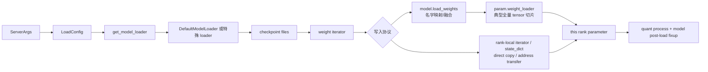

# ModelLoader

这组文档解决一个启动阶段的硬问题：一个 checkpoint shard 里的 tensor，如何在每个 TP rank 上变成模型参数槽里的本 rank 分片。

读完后应能回答：

1. `ServerArgs.load_format` 如何被编译成 `LoadConfig`。
2. `get_model_loader` 为什么有很多分叉，但普通 HF checkpoint 最终落到 `DefaultModelLoader`。
3. `DefaultModelLoader` 为什么用 iterator 逐个 yield `(name, tensor)`，而不是一次性读完整模型。
4. 典型 HF 全量 tensor 为什么在参数协议里切 TP，以及 presharded、BitsAndBytes、ShardedState、remote/direct 路径为何不遵守这条简化。
5. 量化、GGUF、remote instance、layered load、dummy load 分别改变哪一段主线。

## 首次阅读路径

| 读者任务 | 先读 | 再读 |
|----------|------|------|
| 第一次理解冷启动装载 | [[SGLang-ModelLoader-核心概念]] | [[SGLang-ModelLoader-源码走读]] |
| 排查加载 OOM 或慢启动 | [[SGLang-ModelLoader-数据流]] | [[SGLang-ModelLoader-排障指南]] |
| 要改模型 `load_weights` | [[SGLang-ModelLoader-源码走读]] | [[SGLang-通用模型]] |
| 要理解加载后执行 | [[SGLang-ModelRunner]] | [[SGLang-ModelLoader-学习检查]] |

## 心理模型

把 ModelLoader 看成“权重装载生产线”：



这条线里有三本账：

| 账本 | 源码对象 | 负责什么 |
|------|----------|----------|
| 配置账 | `LoadConfig` | 记录格式、下载目录、TP rank、remote backend、ModelOpt、draft model |
| 文件账 | `_prepare_weights` / `_get_weights_iterator` | 找到哪些 shard，选 safetensors/PT/NPCACHE，决定 mmap、多线程、prefetch |
| 写入账 | model/parameter loader、state dict、remote transfer | 名字 remap、融合、rank 选择、direct copy、地址传输与 shape 校验 |
| 完成账 | quant process、`post_load_weights` | 把已填参数变成可执行 layout，并执行模型级加载后修补 |

## 核心源码证据

ModelRunner 在启动时把 server args 编译成 `LoadConfig`，然后在权重内存区域里选择 loader 并装载模型：

```python
# 来源：python/sglang/srt/model_executor/model_runner.py L1421-L1437
        self.load_config = LoadConfig(
            load_format=self.server_args.load_format,
            download_dir=self.server_args.download_dir,
            model_loader_extra_config=self.server_args.model_loader_extra_config,
            tp_rank=self.tp_rank,
            remote_instance_weight_loader_seed_instance_ip=self.server_args.remote_instance_weight_loader_seed_instance_ip,
            remote_instance_weight_loader_seed_instance_service_port=self.server_args.remote_instance_weight_loader_seed_instance_service_port,
            remote_instance_weight_loader_send_weights_group_ports=self.server_args.remote_instance_weight_loader_send_weights_group_ports,
            remote_instance_weight_loader_backend=self.server_args.remote_instance_weight_loader_backend,
            remote_instance_weight_loader_transfer_engine=self.remote_instance_transfer_engine,
            remote_instance_weight_loader_transfer_engine_session_id=self.remote_instance_transfer_engine_session_id,
            modelexpress_url=self.server_args.modelexpress_url,
            modelexpress_transport=self.server_args.modelexpress_transport,
            modelopt_config=modelopt_config,
            rl_quant_profile=self.server_args.rl_quant_profile,
            draft_model_idx=self.draft_model_idx,
        )
```

```python
# 来源：python/sglang/srt/model_executor/model_runner.py L1461-L1488
        # Load the model
        # Remove monkey_patch when linear.py quant remove dependencies with vllm
        monkey_patch_vllm_parallel_state()

        enable_cpu_backup = self.server_args.enable_weights_cpu_backup or (
            self.is_draft_worker and self.server_args.enable_draft_weights_cpu_backup
        )
        with self.memory_saver_adapter.region(
            GPU_MEMORY_TYPE_WEIGHTS,
            enable_cpu_backup=enable_cpu_backup,
        ):
            self.loader = get_model_loader(
                load_config=self.load_config,
                model_config=self.model_config,
            )
            self.model = self.loader.load_model(
                model_config=self.model_config,
                device_config=DeviceConfig(self.device, self.gpu_id),
            )
            if hasattr(self.loader, "remote_instance_transfer_engine_weight_info"):
                self.remote_instance_transfer_engine_weight_info = (
                    self.loader.remote_instance_transfer_engine_weight_info
                )
        # Cache needs to be cleared after loading model weights (in the self.loader.load_model function).
        # To avoid conflict with memory_saver_adapter.region, empty_cache operation is now moved here.
        if _is_npu:
            torch.npu.empty_cache()
        monkey_patch_vllm_parallel_state(reverse=True)
```

这里说明 ModelLoader 不是独立服务。它运行在每个 TP worker 的 `ModelRunner` 里，处于 `GPU_MEMORY_TYPE_WEIGHTS` 区域，并且加载结束后要恢复 vLLM parallel state patch。

## 源码范围

| 路径 | 读它时关注什么 |
|------|----------------|
| `python/sglang/srt/configs/load_config.py` | `LoadFormat`、`LoadConfig` 字段、默认 ignore pattern |
| `python/sglang/srt/model_executor/model_runner.py` | `LoadConfig` 构造、loader 调用、KV scale 后处理 |
| `python/sglang/srt/model_loader/loader.py` | loader factory、默认 loader、特殊 loader、量化后处理 |
| `python/sglang/srt/model_loader/weight_utils.py` | HF 下载、safetensors/PT iterator、prefetch、量化配置 |
| `python/sglang/srt/models/llama.py` | 典型模型类如何按 name 灌权重 |
| `python/sglang/srt/layers/linear.py` | 典型参数切片、presharded/quant/GGUF 例外与最终 copy |

## 与相邻专题的关系

| 相邻专题 | 衔接点 |
|----------|--------|
| [[SGLang-ModelRunner]] | ModelRunner 负责触发加载和加载后执行环境 |
| [[SGLang-通用模型]] | 模型类定义 `load_weights`，决定名字如何映射到参数 |
| [[SGLang-专用模型]] | 特殊模型覆盖加载逻辑或跳过部分 tensor |
| [[SGLang-KV-Cache]] | KV cache 不是 ModelLoader 分配，但 FP8 KV scale 在加载后处理 |
| [[Slime-分布式权重同步]] | 冷启动加载和运行时权重同步共享“参数槽”概念，但入口不同 |

## 读完后的判断标准

- 看到 `Cannot find any model weights`，知道先查 `_prepare_weights` 的 allow patterns 和路径。
- 看到某个 rank OOM，先判断当前路线读的是全量 tensor、rank-local shard 还是预切片量化 tensor，再定位 iterator、parameter loader 或 direct-copy 阶段。
- 看到 shape mismatch，知道先追 `model.load_weights` 的名字 remap，再追 `RowParallelLinear` 或 QKV loader。
- 看到量化加载后输出异常，知道区分量化 module process、模型 `post_load_weights` 与 KV scale 三类完成动作。

基线心智模型适用于 `DefaultModelLoader + 普通 HF checkpoint`，不是所有 loader 的共同内部实现。ModelLoader 真正统一的是输入配置与最终交付 `nn.Module`，中间可以走 generator、rank-local state dict、量化 iterator、NCCL broadcast 或按地址 RDMA。
