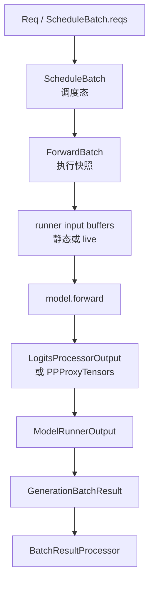

# ModelRunner · 数据流

## 你为什么要读

本页沿一次 forward 的对象流读 ModelRunner：调度态如何变成执行快照，执行快照如何进入 graph/eager buffer，rank 本地输出又如何回到 Scheduler。读完后应能定位 shape、KV 写入、graph replay 和 PP 输出错位发生在哪个边界。

## 对象流图



这条流里有三次语义变化：

1. `ScheduleBatch` 到 `ForwardBatch`：从调度态变成执行快照。
2. `ForwardBatch` 到 runner buffer：从 live tensor 变成 eager buffer 或 graph replay buffer。
3. `ModelRunnerOutput` 到 `GenerationBatchResult`：从 rank 本地输出变成 Scheduler 可处理的结果包。

## ScheduleBatch 到 ForwardBatch

`ForwardBatch` 的核心字段来自 `ScheduleBatch`，但它不是简单引用全部对象。它只保留本次 forward 所需的输入 token、请求行、序列长度、KV 写入位置、采样信息、spec 信息、LoRA id 和 request id。

源码入口：来源：python/sglang/srt/model_executor/forward_batch_info.py L323-L430

源码入口：来源：python/sglang/srt/model_executor/forward_batch_info.py L613-L722

需要特别关注四组字段：

| 字段 | 生命周期含义 |
|------|--------------|
| `input_ids` / `input_embeds` | 本次 forward 真正喂给模型的 token 或 embedding |
| `req_pool_indices` | 请求行索引，连接 [[SGLang-KV-Cache|KV Cache]] 的 req-to-token 映射 |
| `seq_lens` / `seq_lens_cpu` | 位置、padding、DP/graph eligibility 的共同依据 |
| `out_cache_loc` | 本次输出 token 写入 KV pool 的位置 |

如果这些字段和 Scheduler 当前 batch 不一致，轻则 graph 退回 eager，重则位置或 KV 写入错误。`seq_lens_cpu_cache` 的 shape 断言就是防 stale mirror 的硬保护。

## ForwardMode 如何影响数据形状

| mode | 输入形状直觉 | 主要后果 |
|------|--------------|----------|
| `EXTEND` | 每条请求可能推进多个 token | 通常走 prefill 或 eager，采样看最后位置 |
| `DECODE` | 每条请求通常推进一个 token | 优先尝试 decode graph replay |
| `MIXED` | batch 内同时有 extend 和 decode | 需要更谨慎的 metadata 与 backend 初始化 |
| `TARGET_VERIFY` | target 模型验证 draft tokens | 可进入 graph，但采样时机由 verify 分支决定 |
| `SPLIT_PREFILL` | prefill 被拆层或拆段执行 | 留在 ModelRunner 的 split prefill 分支 |

源码入口：来源：python/sglang/srt/model_executor/forward_batch_info.py L78-L170

读 `_forward_raw` 时先看 `forward_batch.forward_mode`，再看 runner。反过来从 runner 名字猜 mode，容易误判。

## Runner buffer 是 graph 能 replay 的基础

eager 和 graph 都可能使用共享 input buffer，只是目的不同：

- eager runner 把 live batch 放入固定最大 buffer，再按当前 shape 切片，方便与 graph runner 共享分配形态。
- decode graph runner 需要把 live batch pad 到 capture bucket，再把 `input_ids`、`positions`、`out_cache_loc` 等字段装入 replay view。
- 共享 buffer 以 `(name, size, dtype, device)` 为 key，避免不同 runner 反复分配，同时保证已经 capture 的 buffer 不被重新指向。

源码入口：来源：python/sglang/srt/model_executor/runner/eager_runner.py L167-L253

源码入口：来源：python/sglang/srt/model_executor/runner/decode_cuda_graph_runner.py L930-L1045

源码入口：来源：python/sglang/srt/model_executor/input_buffers.py L16-L66

```python
# 来源：python/sglang/srt/model_executor/input_buffers.py L16-L41
def share_input_buffer(name: str, new_buffer: torch.Tensor) -> torch.Tensor:
    key: _PoolKey = (name, new_buffer.numel(), new_buffer.dtype, new_buffer.device)
    canonical = _forward_input_buffer_pool.get(key, None)
    if canonical is None:
        _forward_input_buffer_pool[key] = new_buffer
        canonical = new_buffer
    return canonical.as_strided(new_buffer.size(), new_buffer.stride())
```

这解释了为什么 graph 问题常常不是“模型算错”，而是 buffer shape、capture bucket 或 replay view 的问题。

## PP 分支改变输出语义

PP 末 rank 与非末 rank 返回同一个结果类型，但字段含义不同：

- 末 rank：`logits_output` 是 `LogitsProcessorOutput`，随后可以采样 `next_token_ids`。
- 非末 rank：`logits_output` 实际承载 `PPProxyTensors`，Worker 会放进 `pp_hidden_states_proxy_tensors`，交给下一 pipeline stage。

源码入口：来源：python/sglang/srt/managers/tp_worker.py L506-L572

因此在 PP 环境中看到某个 rank 没有 token，不一定是 forward 失败。先确认它是不是 `pp_group.is_last_rank`。

## 结果包承载异步生命周期

`GenerationBatchResult` 不是只放 token。它还承载：

| 字段 | 含义 |
|------|------|
| `can_run_cuda_graph` | 本次 forward 是否成功走 graph |
| `delay_sample_func` | overlap + grammar 下延迟采样闭包 |
| `copy_done` | D2H copy 完成事件 |
| `future_indices` | 下一迭代 relay payload 的请求行 |
| `routed_experts_output` / `indexer_topk_output` | MoE 或 indexer 的异步输出 |
| `fpm_start_event` / `fpm_end_event` | GPU 侧 timing 事件 |

源码入口：来源：python/sglang/srt/managers/utils.py L38-L86

Scheduler 在 overlap 下会把这些字段继续推进：设置 copy event、relay next token、必要时执行 delayed sampling，再进入 result processor。

源码入口：来源：python/sglang/srt/managers/scheduler.py L3175-L3372

源码入口：来源：python/sglang/srt/managers/scheduler.py L3389-L3455

## Embedding 路径不采样

embedding 或 reward model 分支复用 `ForwardBatch.init_new` 和 `ModelRunner.forward`，但不会进入 generation 的采样和 token relay。

源码入口：来源：python/sglang/srt/managers/tp_worker.py L219-L222

```python
# 来源：python/sglang/srt/managers/tp_worker.py L219-L222
def forward_batch_embedding(self, batch: ScheduleBatch):
    forward_batch = ForwardBatch.init_new(batch, self.model_runner)
    output = self.model_runner.forward(forward_batch).logits_output
    return output  # Returns EmbeddingPoolerOutput
```

如果 embedding 请求里追 `next_token_ids`，方向就错了；应该看 `EmbeddingBatchResult.embeddings` 和 `pooled_hidden_states`。

## HiCache 与 HiSparse 的交互点

Worker 在构造 `ForwardBatch` 前同步 HiCache consumer index；ModelRunner 在 decode 且启用 HiSparse 时把 coordinator 放入 `forward_batch`，并等待 pending backup。

源码入口：来源：python/sglang/srt/managers/tp_worker.py L440-L443

源码入口：来源：python/sglang/srt/model_executor/model_runner.py L3071-L3078

这个交互说明：分层 KV 或 sparse KV 的状态不是由 attention backend 独立决定，它从 Scheduler batch 透过 Worker 和 ModelRunner 一路传入 forward。

## 运行验证

ModelRunner 的数据流要从 Scheduler result、TP worker、ForwardBatch 和 `_forward_raw` 四层一起看。

```powershell
rg -n 'class ForwardBatch|def init_new|forward_mode|class ForwardInputBuffers|_forward_raw|can_run_cuda_graph|PPProxyTensors|EmbeddingBatchResult|forward_batch_embedding|hicache_consumer_index|hisparse_coordinator|GenerationBatchResult|next_token_ids' sglang/python/sglang/srt/model_executor/model_runner.py sglang/python/sglang/srt/model_executor/forward_batch_info.py sglang/python/sglang/srt/model_executor/input_buffers.py sglang/python/sglang/srt/managers/tp_worker.py sglang/python/sglang/srt/managers/scheduler.py
```

读输出时先看 `ForwardBatch.init_new`，确认 `ScheduleBatch` 怎样变成执行输入；再看 `tp_worker.py` 如何把 `ModelRunner.forward/sample` 包成 `GenerationBatchResult` 或 `EmbeddingBatchResult`。CUDA Graph、PP、HiCache/HiSparse 问题继续看 `_forward_raw`、`PPProxyTensors`、`hicache_consumer_index` 和 `hisparse_coordinator`。
