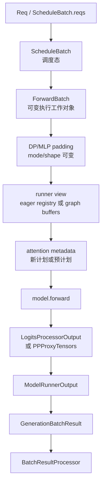

# ModelRunner · 数据流

## 你为什么要读

本页沿一次 forward 的对象流读 ModelRunner：调度态如何变成可变执行对象，它又如何被 padding、复制或投影成 runner view，metadata 由谁计划，rank 本地输出如何跨流回到 Scheduler。读完后应能定位 shape、KV 地址、Graph replay、PP 输出与 tensor lifetime 错位发生在哪个边界。

## 对象流图



这条流里有三次语义变化：

1. `ScheduleBatch` 到 `ForwardBatch`：职责从调度收窄到执行，但许多字段仍是借用引用。
2. live `ForwardBatch` 到 runner view：可能先 padding，再复制进 eager registry，或投影成 padded Graph replay view。
3. runner view 到 metadata：可能当场 plan，也可能承接 plan-stream/multi-step 已拥有的计划。
4. `ModelRunnerOutput` 到 `GenerationBatchResult`：从 rank 本地输出变成带 D2H、relay、采样和存活期责任的结果包。

## ScheduleBatch 到 ForwardBatch

`ForwardBatch` 的核心字段来自 `ScheduleBatch`。它不保留全部请求对象，却会直接借用本轮所需的 token、请求行、长度、generic KV 写入位置、采样/spec 信息、LoRA id 等字段；因此它既不是原 batch，也不是与原 batch 完全隔离的副本。

源码入口：来源：python/sglang/srt/model_executor/forward_batch_info.py L323-L430

源码入口：来源：python/sglang/srt/model_executor/forward_batch_info.py L613-L722

需要特别关注四组字段：

| 字段 | 生命周期含义 |
|------|--------------|
| `input_ids` / `input_embeds` | 本次 forward 真正喂给模型的 token 或 embedding |
| `req_pool_indices` | 请求行索引，连接 [[SGLang-KV-Cache|KV Cache]] 的 req-to-token 映射 |
| `seq_lens` / `seq_lens_cpu` | 位置、padding、DP/graph eligibility 的共同依据 |
| `out_cache_loc` | 本轮新 token 的 generic KV write location；Unified/SWA 下还需翻译 |

如果这些字段和当前执行 shape 不一致，轻则 Graph eligibility 改变，重则 metadata 或 KV 地址错误。`seq_lens_cpu_cache` 的 shape 断言只防一种 stale mirror；metadata 预计划还要用计划时 bs/token 数判断是否失效。

## ForwardMode 如何影响数据形状

| mode | 输入形状直觉 | 主要后果 |
|------|--------------|----------|
| `EXTEND` | 每条请求可能推进多个 token | 通常走 prefill 或 eager，采样看最后位置 |
| `DECODE` | 每条请求通常推进一个 token | 优先尝试 decode graph replay |
| `MIXED` | batch 内同时有 extend 和 decode | 需要更谨慎的 metadata 与 backend 初始化 |
| `TARGET_VERIFY` | target 模型验证 draft tokens | 可进入 graph，但采样时机由 verify 分支决定 |
| `SPLIT_PREFILL` | prefill 被拆层或拆段执行 | 留在 ModelRunner 的 split prefill 分支 |
| `DRAFT_EXTEND_V2` | draft worker 的扩展 | eager extend 谓词需显式纳入 |
| `PREBUILT` | PD decode worker 已准备好 KV | 过渡状态，不进入普通 eager dispatch |
| `DLLM_EXTEND` | dLLM block 扩展 | decode Graph runner 可用该 capture mode |

源码入口：来源：python/sglang/srt/model_executor/forward_batch_info.py L78-L170

读 `_forward_raw` 时先看 `forward_batch.forward_mode`，再看 runner。反过来从 runner 名字猜 mode，容易误判。

## Runner view：eager 也不一定直接吃 live batch

eager 和 graph 都可能使用共享 input buffer，只是目的不同：

- eager runner 默认把 live batch 复制进固定最大 registry，再抽取同 shape view；环境开关 `SGLANG_EAGER_INPUT_NO_COPY` 才改成浅层 dataclass replacement。
- decode graph runner 需要把 live batch pad 到 capture bucket，再把 `input_ids`、`positions`、`out_cache_loc` 等字段装入 replay view。
- 共享 buffer 以 `(name, size, dtype, device)` 为 key，避免不同 runner 反复分配，同时保证已经 capture 的 buffer 不被重新指向。

源码入口：来源：python/sglang/srt/model_executor/runner/eager_runner.py L167-L253

源码入口：来源：python/sglang/srt/model_executor/runner/decode_cuda_graph_runner.py L930-L1045

源码入口：来源：python/sglang/srt/model_executor/input_buffers.py L16-L66

```python
# 定位骨架（非逐行摘录）：来源 python/sglang/srt/model_executor/input_buffers.py L16-L41
def share_input_buffer(name: str, new_buffer: torch.Tensor) -> torch.Tensor:
    key: _PoolKey = (name, new_buffer.numel(), new_buffer.dtype, new_buffer.device)
    canonical = _forward_input_buffer_pool.get(key, None)
    if canonical is None:
        _forward_input_buffer_pool[key] = new_buffer
        canonical = new_buffer
    return canonical.as_strided(new_buffer.size(), new_buffer.stride())
```

process-wide pool 按 `(name, numel, dtype, device)` 合并物理分配；同名同规格 view 共享 `data_ptr`，不同 size 不互相顶替。Graph 问题因此常常不是“模型算错”，而是 capture bucket、view 的 actual/capture mode、填充时机或稳定地址问题。

## Metadata 流：计划也有所有权

eager decode/extend 在 `needs_forward_metadata_init()` 为真时才调用模型专用 `prepare_forward_batch` 和 attention backend plan。Graph replay 的普通路径先填固定 buffer、构造 `build_replay_fb_view()`，再在 replay 前调用 `init_forward_metadata_out_graph`；若 plan-stream 已标记 metadata ready，`load_batch()` 只补本轮必要的 input/position 等字段，不能重复覆盖专用计划。

DP padding 使 shape 改变时，也只有标记为 `replan_equivalent` 的预计划允许普通 forward 重建。这里的排障问题不是简单的“metadata 有没有初始化”，而是“谁初始化、针对哪个 view、是否仍然有效”。

## PP 分支改变输出语义

PP 末 rank 与非末 rank 返回同一个结果类型，但字段含义不同：

- 末 rank：`logits_output` 是 `LogitsProcessorOutput`，随后可以采样 `next_token_ids`。
- 非末 rank：`logits_output` 实际承载 `PPProxyTensors`，Worker 会放进 `pp_hidden_states_proxy_tensors`，交给下一 pipeline stage。

源码入口：来源：python/sglang/srt/managers/tp_worker.py L506-L572

因此在 PP 环境中看到某个 rank 没有 token，不一定是 forward 失败。先确认它是不是 `pp_group.is_last_rank`。

## 结果包承载异步生命周期

`GenerationBatchResult` 不是只放 token。它还承载：

| 字段 | 含义 |
|------|------|
| `can_run_cuda_graph` | 本次 forward 是否成功走 graph |
| `delay_sample_func` | overlap + grammar 下延迟采样闭包 |
| `copy_done` | D2H copy 完成事件 |
| `future_indices` | 下一迭代 relay payload 的请求行 |
| `extra_keep_alive_refs` | 让 spec/跨流张量跨过两轮窗口仍保持存活 |
| `routed_experts_output` / `indexer_topk_output` | MoE 或 indexer 的异步输出 |
| `fpm_start_event` / `fpm_end_event` | GPU 侧 timing 事件 |

源码入口：来源：python/sglang/srt/managers/utils.py L38-L86

Scheduler 在 overlap 下会把这些字段继续推进：设置 copy event、relay next token、必要时执行 delayed sampling，再进入 result processor。D2H 使用 pinned host memory，并对源 tensor `record_stream`，所以结果包还承担“不能过早被 caching allocator 复用”的内存安全责任。

源码入口：来源：python/sglang/srt/managers/scheduler.py L3175-L3372

源码入口：来源：python/sglang/srt/managers/scheduler.py L3389-L3455

## Embedding 路径不采样

embedding 或 reward model 分支复用 `ForwardBatch.init_new` 和 `ModelRunner.forward`，但不会进入 generation 的采样和 token relay。

源码入口：来源：python/sglang/srt/managers/tp_worker.py L219-L222

```python
# 来源：python/sglang/srt/managers/tp_worker.py L219-L222
def forward_batch_embedding(self, batch: ScheduleBatch):
    forward_batch = ForwardBatch.init_new(batch, self.model_runner)
    output = self.model_runner.forward(forward_batch).logits_output
    return output  # Returns EmbeddingPoolerOutput
```

如果 embedding 请求里追 `next_token_ids`，方向就错了；应该看 `EmbeddingBatchResult.embeddings` 和 `pooled_hidden_states`。

## HiCache 与 HiSparse 的交互点

Worker 在构造 `ForwardBatch` 前同步 HiCache consumer index；ModelRunner 在 decode 且启用 HiSparse 时把 coordinator 放入 `forward_batch`，并等待 pending backup。

源码入口：来源：python/sglang/srt/managers/tp_worker.py L440-L443

源码入口：来源：python/sglang/srt/model_executor/model_runner.py L3071-L3078

这个交互说明：分层 KV 或 sparse KV 的状态不是由 attention backend 独立决定，它从 Scheduler batch 透过 Worker 和 ModelRunner 一路传入 forward。

## 运行验证

ModelRunner 的数据流要从 Scheduler result、TP worker、ForwardBatch 和 `_forward_raw` 四层一起看。

```powershell
rg -n 'class ForwardBatch|def init_new|forward_mode|class ForwardInputBuffers|_forward_raw|can_run_cuda_graph|PPProxyTensors|EmbeddingBatchResult|forward_batch_embedding|hicache_consumer_index|hisparse_coordinator|GenerationBatchResult|next_token_ids' sglang/python/sglang/srt/model_executor/model_runner.py sglang/python/sglang/srt/model_executor/forward_batch_info.py sglang/python/sglang/srt/model_executor/input_buffers.py sglang/python/sglang/srt/managers/tp_worker.py sglang/python/sglang/srt/managers/scheduler.py
```

读输出时先看 `ForwardBatch.init_new`，确认 `ScheduleBatch` 怎样变成执行输入；再看 `tp_worker.py` 如何把 `ModelRunner.forward/sample` 包成 `GenerationBatchResult` 或 `EmbeddingBatchResult`。CUDA Graph、PP、HiCache/HiSparse 问题继续看 `_forward_raw`、`PPProxyTensors`、`hicache_consumer_index` 和 `hisparse_coordinator`。
