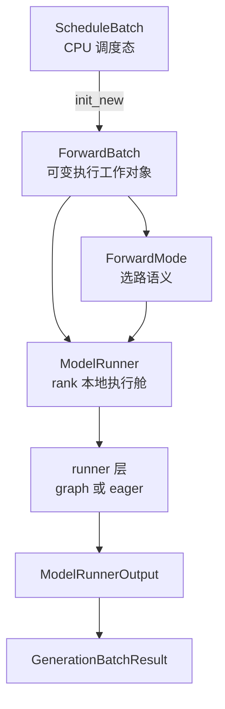

# ModelRunner · 核心概念

本页先回答 ModelRunner 在 serving 链路里到底管什么。读完后，你应该能区分 mutable `ScheduleBatch`、可变 `ForwardBatch`、runner view、metadata planner、Graph/eager 路径和两层结果包，并能判断某个字段当前由谁拥有。

## 先建立模型

把一次 forward 想成“换轨”：Scheduler 只决定哪些请求同车发车；ModelRunner 负责把这列车开上具体轨道。轨道有三类：decode graph、prefill graph、eager。换轨依据不是请求文本，而是 `ForwardBatch.forward_mode`、batch shape、graph 是否已 capture、PP rank 位置和若干高级特性开关。



这张图有一个关键边界：`ScheduleBatch` 仍带调度语义和请求对象；`ForwardBatch` 收窄为执行字段，但许多 tensor/reference 是借用而非深拷贝，随后还可能被 DP padding、inner view、runner registry 和 Graph replay view 改写。称它“工作对象”比“稳定快照”准确。

## 六层对象

| 层 | 对象 | 读者要记住的职责 |
|----|------|------------------|
| 进程门面 | `TpModelWorker` | Scheduler 调用的入口；隐藏 TP/PP、draft worker、权重更新、embedding 分支 |
| 执行工作对象 | `ForwardBatch` | 组织请求索引、长度、generic KV 写入位置、采样与预计划状态，并允许受控变形 |
| 选路开关 | `ForwardMode` | 标明本次是 extend、decode、mixed、verify、idle、split prefill |
| runner/view 层 | eager、decode/prefill Graph runner | 把 live batch 放进固定 buffer 或构造 padded replay view，并协调 metadata plan |
| rank 执行舱 | `ModelRunner` | 持有模型、KV pool、attention backend、runner、sampler 和 profiling/capturer 状态 |
| 结果包 | `ModelRunnerOutput` / `GenerationBatchResult` | 把 logits、PP hidden states、采样结果、graph 状态和异步事件交回 Scheduler |

## Worker 是门面，不是薄包装

Scheduler 不直接调用 `ModelRunner.forward`，因为执行层不仅要 forward，还要处理 TP/PP 分组、draft worker、tokenizer/processor、权重热更新、memory pool 复用和 overlap 的读写屏障。

源码入口：来源：python/sglang/srt/managers/tp_worker.py L63-L101

```python
# 定位骨架（非逐行摘录）：来源 python/sglang/srt/managers/tp_worker.py L63-L78
class BaseTpWorker(ABC):
    @abstractmethod
    def forward_batch_generation(self, forward_batch: ForwardBatch):
        pass

    @property
    @abstractmethod
    def model_runner(self) -> ModelRunner:
        pass

    @property
    def war_fastpath_runner(self):
        return self.model_runner
```

这个抽象让 Scheduler 面向“generation/embedding/weight update”语义，而不是面向某个 rank 上的模型对象。PP、speculative decoding 或多 runner 变体可以藏在 Worker 后面。

## Batch 的核心分界：收窄职责，不承诺不可变

`forward_batch_info.py` 的文件头直接写明了两层 batch 的分工：Scheduler 管 `ScheduleBatch`，ModelRunner 管 `ForwardBatch`。

源码入口：来源：python/sglang/srt/model_executor/forward_batch_info.py L14-L26

```python
# 来源：python/sglang/srt/model_executor/forward_batch_info.py L17-L24
The following is the flow of data structures for a batch:

ScheduleBatch -> ForwardBatch

- ScheduleBatch is managed by `scheduler.py::Scheduler`.
  It contains high-level scheduling data. Most of the data is on the CPU.
- ForwardBatch is managed by `model_runner.py::ModelRunner`.
  It contains low-level tensor data. Most of the data consists of GPU tensors.
```

读源码时要抓住这条不变量：Scheduler 可以合并、过滤、retract、chunk；`ForwardBatch.init_new` 消费 one-shot override、处理 grammar、检查 `seq_lens_cpu_cache`，并把本轮所需字段组织起来。但组织不等于深拷贝。ModelRunner 的 live 路径会做 DP/MLP padding，eager runner 默认再复制进固定 registry，Graph runner则构造 capture-mode 与 actual-mode 并存的 replay view。

attention metadata 还有独立所有权：multi-step draft 或 plan-stream 可能提前 plan，并用 `forward_metadata_ready` 记录计划 shape。普通 runner 必须先调用 `needs_forward_metadata_init()`，不能无条件重建并覆盖专用计划。

## ForwardMode 是换轨钥匙

`ForwardMode` 不只是枚举名，它决定 `_forward_raw` 的第一层分支。

源码入口：来源：python/sglang/srt/model_executor/forward_batch_info.py L78-L170

```python
# 定位骨架（非逐行摘录）：来源 python/sglang/srt/model_executor/forward_batch_info.py L78-L102
class ForwardMode(IntEnum):
    EXTEND = auto()
    DECODE = auto()
    MIXED = auto()
    IDLE = auto()
    TARGET_VERIFY = auto()
    DRAFT_EXTEND_V2 = auto()
    PREBUILT = auto()
    SPLIT_PREFILL = auto()
    DLLM_EXTEND = auto()
```

```python
# 定位骨架（非逐行摘录）：来源 python/sglang/srt/model_executor/forward_batch_info.py L155-L167
    def is_cuda_graph(self):
        return (
            self == ForwardMode.DECODE
            or self == ForwardMode.TARGET_VERIFY
            or self == ForwardMode.IDLE
            or self == ForwardMode.DLLM_EXTEND
        )

    def is_split_prefill(self):
        return self == ForwardMode.SPLIT_PREFILL
```

直觉上可以这样记：

- `EXTEND` 和 `MIXED` 面向 prefill 或 chunked prefill，token 数通常不固定。
- `DECODE` 每个请求主要推进一个 token，shape 更稳定，所以优先尝试 graph replay。
- `TARGET_VERIFY`、`DRAFT_EXTEND_V2` 属于投机解码，把“验证”和“草稿扩展”塞进同一套执行框架。
- `SPLIT_PREFILL` 是特殊分支，留在 ModelRunner 内部处理，不直接交给 eager runner。
- `PREBUILT` 是 PD decode worker 的过渡状态，不属于 eager runner 接受的普通 forward mode。
- `DLLM_EXTEND` 属于 Graph mode；decode Graph runner 的名字不能被理解为“只处理普通 DECODE”。

## ModelRunner 持有运行时现场

`ModelRunner.__init__` 一开始保存的是 rank、并行组、模型配置、page size、KV pool 句柄、spec 配置和若干硬件/模型特性。它不是只包一层 `model.forward`，而是“这个 rank 上 forward 需要的一切上下文”。

源码入口：来源：python/sglang/srt/model_executor/model_runner.py L343-L460

```python
# 定位骨架（非逐行摘录）：来源 python/sglang/srt/model_executor/model_runner.py L368-L406
self.mem_fraction_static = mem_fraction_static
self.memory_pool_config = memory_pool_config
self.device = server_args.device
self.gpu_id = gpu_id
self.tp_rank = tp_rank
self.tp_size = tp_size
self.dp_rank = dp_rank
self.dp_size = server_args.dp_size if server_args.enable_dp_attention else 1
self.pp_rank = pp_rank
self.pp_size = pp_size
self.model_config = model_config
self.server_args = server_args
self.is_draft_worker = is_draft_worker
self.spec_algorithm = SpeculativeAlgorithm.from_string(
    server_args.speculative_algorithm
)
self.page_size = server_args.page_size
self.req_to_token_pool = req_to_token_pool
self.token_to_kv_pool_allocator = token_to_kv_pool_allocator
```

因此排查 ModelRunner 问题时不能只看 forward。启动期的 `load_model`、`alloc_memory_pool`、`init_attention_backends`、`init_cuda_graphs` 会决定后续 forward 能不能走 graph、能不能访问正确的 KV pool、能不能在 PP/DP/EP 下同步。

## 结果分两层返回

`ModelRunner.forward` 只返回 rank 本地输出和 graph 状态；`TpModelWorker.forward_batch_generation` 再把它扩展成 Scheduler 能处理的 `GenerationBatchResult`。

源码入口：来源：python/sglang/srt/model_executor/model_runner.py L335-L340

```python
# 来源：python/sglang/srt/model_executor/model_runner.py L335-L340
class ModelRunnerOutput:
    logits_output: Union[LogitsProcessorOutput, PPProxyTensors]
    can_run_graph: bool
    expert_distribution_metrics: Optional[ExpertDistributionMetrics] = None
    routed_experts_output: Optional[TopkCaptureOutput] = None
    indexer_topk_output: Optional[TopkCaptureOutput] = None
```

源码入口：来源：python/sglang/srt/managers/utils.py L38-L86

```python
# 来源：python/sglang/srt/managers/utils.py L38-L45
@dataclasses.dataclass
class GenerationBatchResult:
    logits_output: Optional[LogitsProcessorOutput] = None
    pp_hidden_states_proxy_tensors: Optional[PPProxyTensors] = None
    next_token_ids: Optional[Union[torch.Tensor, List[torch.Tensor]]] = None
    num_correct_drafts: int = 0  # no bonus included
    num_correct_drafts_per_req_cpu: Optional[List[int]] = None
    can_run_cuda_graph: bool = False
```

如果是 PP 非末 rank，`logits_output` 的语义会变成 `PPProxyTensors`；如果是 overlap + grammar，采样可能延迟到 Scheduler 后续调用 `delay_sample_func`。所以读 result 时不要只找 `next_token_ids`，还要看当前 rank 和是否延迟采样。

## 关键不变量

- `ForwardBatch` 的借用字段、runner view 与预计划 shape 必须彼此一致；过期 CPU mirror、padding 后 stale metadata 都可能越过不同保护点。
- decode graph 的前提是 mode 支持 graph、runner 存在、当前 batch 能被 runner 接受。
- PP 非末 rank 不产出最终 logits；它产出 hidden states 代理，交给下一 stage。
- structured output 的 vocab mask 必须及时释放；延迟采样闭包不能长期持有大 GPU tensor。
- 在线更新权重后，是否主动重建 decode graph 取决于请求中的 `recapture_cuda_graph`；运行时 hidden-state capture mode 改变也可能触发 recapture。
