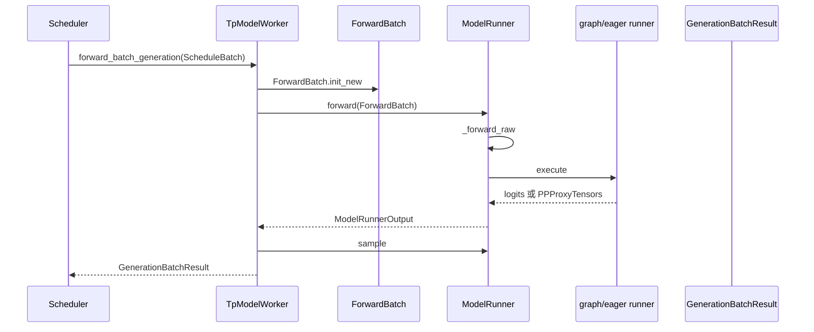

# ModelRunner · 源码走读

## 读者任务

这篇沿一条真实主线走：Scheduler 已经选出一个 generation batch，接下来谁把它变成一次 GPU forward，谁决定 graph 或 eager，谁采样 token，谁把结果交回 Scheduler。

读完后应能定位这些问题：

- decode 为什么没有走 CUDA Graph。
- prefill 为什么落到 eager。
- PP 非末 rank 为什么没有 logits。
- structured output 下为什么会延迟采样。
- 在线更新权重后 graph 是否需要重建。

## 长文读法

这篇按“调度态如何变成一次 GPU forward”读：Scheduler 只交出 `ScheduleBatch`，Worker 把它快照成 `ForwardBatch`，ModelRunner 判断 graph/eager 路径，runner 真正调用模型，Worker 再决定是否立即采样，Scheduler 最后消费结果并衔接下一轮。

| 读者任务 | 先读 | 要抓住的判断 |
|----------|------|--------------|
| 第一次建立执行主线 | 读者任务、主线地图、1 到 3 | `ScheduleBatch` 是调度态，`ForwardBatch` 是一次 forward 的执行快照 |
| 排查 graph/eager | 4 到 7 | CUDA Graph 能不能跑由 forward mode、runner 可用性和 batch 条件共同决定 |
| 排查 PP 非末 rank | 2、8 | 非末 rank 返回的是 PP proxy tensors，不负责 logits 和采样 |
| 排查 structured output 延迟采样 | 8 到 9 | overlap + grammar 场景会把采样封装成 `delay_sample_func`，由 Scheduler 之后触发 |
| 排查 prefill eager | 6 到 7 | split prefill、prefill graph 不可用或 CP strategy 等条件会落回 eager runner |
| 排查权重更新后的 graph 状态 | 4、6、运行验证 | graph runner 是执行现场的一部分，更新权重后要确认 graph 可用性和 fallback 行为 |

读的时候先定位边界：Scheduler 管调度和结果生命周期，Worker 管执行态转换和采样时机，ModelRunner/runner 才管模型 forward。

## 主线地图



下面按因果顺序走，不按文件顺序走。

## 1. Scheduler 只交出调度态

系统压力：Scheduler 在一个迭代里同时处理 overlap、future map、spec、PP proxy、embedding/reward 分支。如果让 ModelRunner 直接理解这些状态，执行层会被调度细节污染。

设计选择：`Scheduler.run_batch` 只把 `ScheduleBatch` 交给 Worker。Worker 是边界，负责把调度态换成执行态。

源码入口：来源：python/sglang/srt/managers/scheduler.py L3175-L3372

```python
# 来源：python/sglang/srt/managers/scheduler.py L3234-L3239
# FIXME: pp is not compatible with overlap
batch_result = self.model_worker.forward_batch_generation(
    batch, **fwd_kwargs
)
if batch.spec_algorithm.is_none():
    self.future_map.publish(future_indices, batch.seq_lens + 1)
```

这里有两个抓手：

- `forward_batch_generation` 是 Scheduler 看到的执行入口。
- overlap 模式下，Scheduler 还会把下一迭代的输入通过 `future_map` 接起来，所以结果包不仅是 logits，还会带跨流、跨迭代的生命周期约束。

## 2. Worker 先换成 ForwardBatch

系统压力：`ScheduleBatch` 里有请求对象、调度字段、CPU mirror、grammar、HiCache consumer 等混合状态；模型 forward 需要的是稳定 tensor 视图。

设计选择：`TpModelWorker.forward_batch_generation` 在进入 ModelRunner 前先设置 HiCache consumer，再调用 `ForwardBatch.init_new`。

源码入口：来源：python/sglang/srt/managers/tp_worker.py L482-L572

```python
# 来源：python/sglang/srt/managers/tp_worker.py L490-L511
if batch is not None:
    # update the consumer index of hicache to the running batch
    self.set_hicache_consumer(batch.hicache_consumer_index)

    forward_batch = ForwardBatch.init_new(batch, self.model_runner)
else:
    # FIXME(lsyin): unify the interface of forward_batch
    assert forward_batch is not None

forward_batch.apply_deprecated_skip_attn_backend_init(skip_attn_backend_init)

if self.is_dllm():
    return self._forward_batch_generation_dllm(forward_batch)

if self.pp_group.is_last_rank:
    out = self.model_runner.forward(
        forward_batch,
        pp_proxy_tensors=pp_proxy_tensors,
    )
```

执行逻辑：

- 正常路径从 `ScheduleBatch` 转出 `ForwardBatch`。
- 特殊路径可以直接传入已经构造好的 `ForwardBatch`，源码里仍保留统一接口的待办注释。
- dLLM 有独立分支。
- PP 末 rank 与非末 rank 从这里分叉，末 rank 才会进入采样。

## 3. ForwardBatch 是一次 forward 的快照

系统压力：同一个 `ScheduleBatch` 会被 Scheduler 继续修改，例如过滤完成请求、合并 running batch、处理 overlap。forward 需要的是本次调用能稳定读取的字段集合。

设计选择：`ForwardBatch.init_new` 消费一次性 override，处理 extend-only 字段，填充 grammar，校验 CPU cache，最后把核心字段组织成 dataclass。

源码入口：来源：python/sglang/srt/model_executor/forward_batch_info.py L613-L722

```python
# 来源：python/sglang/srt/model_executor/forward_batch_info.py L640-L670
if batch.forward_mode.is_decode_or_idle():
    extend_seq_lens = extend_prefix_lens = extend_logprob_start_lens = None
else:
    extend_seq_lens = batch.extend_lens
    extend_prefix_lens = batch.prefix_lens
    extend_logprob_start_lens = batch.extend_logprob_start_lens

if batch.sampling_info is not None:
    if batch.has_grammar:
        batch.sampling_info.grammars = [req.grammar for req in batch.reqs]
    else:
        batch.sampling_info.grammars = None

if seq_lens_cpu_cache is not None:
    assert seq_lens_cpu_cache.shape == batch.seq_lens.shape, (
        f"seq_lens_cpu_cache shape {seq_lens_cpu_cache.shape} != "
        f"seq_lens {batch.seq_lens.shape}; stale override on batch?"
    )
    seq_lens_cpu = seq_lens_cpu_cache
else:
    seq_lens_cpu = batch.seq_lens_cpu
```

```python
# 来源：python/sglang/srt/model_executor/forward_batch_info.py L675-L683
ret = cls(
    forward_mode=batch.forward_mode,
    batch_size=len(batch.seq_lens),
    input_ids=batch.input_ids,
    req_pool_indices=batch.req_pool_indices,
    seq_lens=batch.seq_lens,
    out_cache_loc=batch.out_cache_loc,
    seq_lens_sum=batch.seq_lens_sum,
```

这里的关键不是“字段很多”，而是这些字段定义了执行层能相信什么：

- `input_ids` 是这次要算的 token。
- `req_pool_indices` 指向请求行。
- `seq_lens` 和 `seq_lens_cpu` 决定位置、padding、graph eligibility。
- `out_cache_loc` 指向本次写 KV 的 slot。
- `sampling_info.grammars` 决定 structured output 是否需要延迟采样和 vocab mask。

## 4. 启动期先搭好执行现场

系统压力：graph capture、attention backend、KV pool、canary、input buffer 共享都有顺序依赖。顺序错了，可能不是立刻报错，而是后续 replay 读到错误 buffer 或 hook 被 capture 进 graph。

设计选择：Worker 生命周期把内存池、attention backend、graph 初始化拆开；ModelRunner 内部也显式规定顺序。

源码入口：来源：python/sglang/srt/managers/tp_worker.py L316-L355

源码入口：来源：python/sglang/srt/model_executor/model_runner.py L820-L945

```python
# 来源：python/sglang/srt/model_executor/model_runner.py L900-L940
def init_cuda_graphs(self, capture_decode_cuda_graph: bool = True):
    self.eager_runner = EagerRunner(self)

    self.init_prefill_cuda_graph()

    self.decode_cuda_graph_runner = None
    self.graph_mem_usage = 0

    if capture_decode_cuda_graph:
        if self.device in ("cuda", "musa", "cpu", "npu"):
            self.init_decode_cuda_graph()
    else:
        self.decode_cuda_graph_runner = self.eager_runner

    if self.server_args.forward_hooks:
        register_forward_hooks(self.model, self.server_args.forward_hooks)
```

两个不变量很重要：

- eager runner 总是先建，它既是 fallback，也提供共享静态 buffer 的基准。
- forward hooks 在 graph capture 之后注册，避免 Python hook 的 tensor op 被 capture 进去。

权重加载也属于执行现场的一部分。`load_model` 会处理 dtype、loader、CPU backup、FP8 KV scale、sliding window、RoPE cache、TP barrier。排查“某些 rank 起不来”时不要只看 forward。

源码入口：来源：python/sglang/srt/model_executor/model_runner.py L1388-L1437

源码入口：来源：python/sglang/srt/model_executor/model_runner.py L1461-L1617

## 5. ModelRunner.forward 先包一层观测与保护

系统压力：一个 forward 不只是模型计算，还要记录 profiling span、canary、expert distribution、routed experts、debug dumper、elastic EP 恢复。

设计选择：`forward` 负责这些横切逻辑，真正选 graph/eager 的逻辑放到 `_forward_raw`。

源码入口：来源：python/sglang/srt/model_executor/model_runner.py L2954-L3046

```python
# 来源：python/sglang/srt/model_executor/model_runner.py L2965-L3002
self.forward_pass_id += 1

step_span_ctx = profile_range(_build_step_span_name(forward_batch))

with (
    canary_ctx,
    step_span_ctx,
    get_global_expert_distribution_recorder().with_forward_pass(
        self.forward_pass_id,
        forward_batch,
    ) as recorder_outputs,
):
    output = self._forward_raw(
        forward_batch,
        pp_proxy_tensors,
        reinit_attn_backend,
        split_forward_count,
    )
```

这解释了一个常见误判：profiling 或 MoE metric 出问题时，入口在 `ModelRunner.forward`；graph/eager 路径出问题时，入口在 `_forward_raw`。

## 6. _forward_raw 是真正的换轨处

系统压力：decode 要尽量 replay graph 降低 launch 开销；prefill token 数不稳定，需要 graph runner 支持或退回 eager；split prefill 又不能直接交给 eager。

设计选择：先判断 decode/verify/idle 是否能走 graph，能走就立即返回；否则准备 live batch，再依次尝试 split prefill、prefill graph、eager。

源码入口：来源：python/sglang/srt/model_executor/model_runner.py L3048-L3141

```python
# 来源：python/sglang/srt/model_executor/model_runner.py L3060-L3085
mode_check = (
    forward_batch.forward_mode.is_cpu_graph
    if self.device == "cpu"
    else forward_batch.forward_mode.is_cuda_graph
)
can_run_graph = bool(
    mode_check()
    and self.decode_cuda_graph_runner
    and self.decode_cuda_graph_runner.can_run_graph(forward_batch)
)

if can_run_graph:
    ret = self.decode_cuda_graph_runner.execute(
        forward_batch,
        pp_proxy_tensors=pp_proxy_tensors,
    )
    return ModelRunnerOutput(logits_output=ret, can_run_graph=can_run_graph)
```

```python
# 来源：python/sglang/srt/model_executor/model_runner.py L3093-L3133
self._prepare_eager_forward_batch(forward_batch)

if forward_batch.forward_mode.is_split_prefill():
    ret = self.forward_split_prefill(
        forward_batch,
        reinit_attn_backend=reinit_attn_backend,
        forward_count=split_forward_count,
    )
elif (
    forward_batch.forward_mode.is_extend(include_draft_extend_v2=True)
    and not isinstance(self.prefill_cuda_graph_runner, EagerRunner)
    and self.prefill_cuda_graph_runner is not None
    and self.prefill_cuda_graph_runner.can_run_graph(forward_batch)
    and get_cp_strategy() is None
):
    kwargs = self._extend_forward_kwargs(forward_batch, pp_proxy_tensors)
    ret = self.prefill_cuda_graph_runner.execute(
        forward_batch, **kwargs
    )
    can_run_graph = True
else:
    ret = self.eager_runner.execute(
        forward_batch, pp_proxy_tensors=pp_proxy_tensors
    )
```

排障时按这四个门槛看：

1. `forward_mode` 是否允许 graph。
2. 对应 graph runner 是否存在。
3. 当前 batch 是否能被 runner 接受。
4. prefill 是否被 CP、capture size、模型结构或 EAGLE target 条件挡住。

## 7. Runner 才真正调用模型

系统压力：同样是 eager，decode、idle、extend 的准备动作不同；graph replay 还需要把 live batch 装入静态 buffer。

设计选择：eager runner 负责按 mode 分派；decode graph runner 负责 pad 到 capture bucket、填共享 buffer、初始化 out-of-graph metadata，然后 replay。

源码入口：来源：python/sglang/srt/model_executor/runner/eager_runner.py L167-L253

```python
# 来源：python/sglang/srt/model_executor/runner/eager_runner.py L197-L207
def execute(
    self, forward_batch: ForwardBatch, pp_proxy_tensors=None, **kwargs
) -> Any:
    mode = forward_batch.forward_mode
    if mode.is_decode():
        return self._execute_decode(forward_batch, pp_proxy_tensors)
    if mode.is_idle():
        return self._execute_idle(forward_batch, pp_proxy_tensors)
    if mode.is_extend(include_draft_extend_v2=True):
        return self._execute_extend(forward_batch, pp_proxy_tensors)
    raise ValueError(f"Invalid forward mode for eager runner: {mode}")
```

```python
# 来源：python/sglang/srt/model_executor/runner/eager_runner.py L247-L253
with ctx, pdmux_ctx:
    return model_runner.model.forward(
        forward_batch.input_ids,
        forward_batch.positions,
        forward_batch,
        **kwargs,
    )
```

源码入口：来源：python/sglang/srt/model_executor/runner/decode_cuda_graph_runner.py L930-L1045

```python
# 来源：python/sglang/srt/model_executor/runner/decode_cuda_graph_runner.py L1012-L1037
def execute(
    self,
    forward_batch: ForwardBatch,
    pp_proxy_tensors: Optional[PPProxyTensors] = None,
) -> Union[LogitsProcessorOutput, PPProxyTensors]:
    with timer_ctx, self.backend.replay_session():
        self.load_batch(forward_batch, pp_proxy_tensors)
        if forward_batch.forward_mode.is_decode() or (
            forward_batch.forward_mode.is_target_verify()
            and self.model_runner.spec_algorithm.is_dflash()
        ):
            read_done = self.device_module.Event()
            read_done.record()
            self.model_runner.war_fastpath_read_done_event = read_done
        output = self.backend.replay(self._replay_graph_key, forward_batch)
```

这里能看出 overlap 的一个底层抓手：graph replay 前会记录 read-done event，Scheduler 的 WAR barrier 可以知道共享 buffer 的读阶段何时完成。

## 8. Worker 决定采样时机

系统压力：模型 forward 只产 logits，是否立刻采样要看 PP rank、verify 分支、prefill-only 请求、structured output 与 overlap。

设计选择：末 PP rank 才构造含 logits 的 `GenerationBatchResult`；verify 可跳过采样；overlap + grammar 会把采样延迟成闭包；prefill-only 用 dummy token。

源码入口：来源：python/sglang/srt/managers/tp_worker.py L506-L572

```python
# 来源：python/sglang/srt/managers/tp_worker.py L512-L543
batch_result = GenerationBatchResult(
    logits_output=logits_output,
    can_run_cuda_graph=can_run_cuda_graph,
    expert_distribution_metrics=out.expert_distribution_metrics,
    routed_experts_output=out.routed_experts_output,
    indexer_topk_output=out.indexer_topk_output,
)

if is_verify:
    return batch_result

if (
    self.enable_overlap
    and not self.enable_spec
    and forward_batch.sampling_info.grammars is not None
):

    def sample_batch_func():
        batch_result.next_token_ids = self.model_runner.sample(
            logits_output, forward_batch
        )
        return batch_result

    batch_result.delay_sample_func = sample_batch_func
    return batch_result

if not forward_batch.is_prefill_only:
    batch_result.next_token_ids = self.model_runner.sample(
        logits_output, forward_batch
    )
```

采样本身仍在 ModelRunner 内，因为它要使用 logits、sampling_info、logprob 请求和位置索引。

源码入口：来源：python/sglang/srt/model_executor/model_runner.py L3143-L3191

```python
# 来源：python/sglang/srt/model_executor/model_runner.py L3160-L3191
def sample(
    self,
    logits_output: LogitsProcessorOutput,
    forward_batch: ForwardBatch,
) -> torch.Tensor:
    self._preprocess_logits(logits_output, forward_batch.sampling_info)

    next_token_ids = self.sampler(
        logits_output,
        forward_batch.sampling_info,
        forward_batch.return_logprob,
        forward_batch.top_logprobs_nums,
        forward_batch.token_ids_logprobs,
        (
            forward_batch.positions
            if forward_batch.forward_mode.is_decode()
            else forward_batch.seq_lens - 1
        ),
    )
    self.maybe_update_ngram_token_table(next_token_ids, forward_batch)
    return next_token_ids
```

一个细节很重要：prefill 只用每条序列最后一个位置采样，decode 用当前位置。读采样 bug 时要先确认 `forward_mode`。

## 9. Scheduler 消费结果

系统压力：overlap 下 GPU forward、D2H copy、下一次 scheduling 可以并行；structured output 延迟采样还会让 `GenerationBatchResult` 暂时没有 token。

设计选择：Scheduler 在 `run_batch` 中为结果包记录 copy event、relay payload、future indices；必要时后续调用 `launch_batch_sample_if_needed`，最后根据 `forward_mode` 分派到不同 result processor。

源码入口：来源：python/sglang/srt/managers/scheduler.py L3389-L3455

```python
# 来源：python/sglang/srt/managers/scheduler.py L3404-L3432
def launch_batch_sample_if_needed(
    self, batch_result: GenerationBatchResult
) -> Union[GenerationBatchResult]:
    if batch_result is None or batch_result.delay_sample_func is None:
        return

    with self.forward_stream_ctx:
        self.forward_stream.wait_stream(self.schedule_stream)
        _batch_result = batch_result.delay_sample_func()
        assert _batch_result is batch_result
        self._relay_forward_payload(batch_result.future_indices, batch_result)
        batch_result.copy_to_cpu(
            return_logprob=self.cur_batch.return_logprob,
            return_hidden_states=self.cur_batch.return_hidden_states,
        )

    batch_result.delay_sample_func = None
    if batch_result.logits_output is not None:
        batch_result.logits_output.next_token_logits = None
```

这里解释了为什么 result 不是一个普通同步返回值：它同时承载采样结果、D2H copy、跨流生命周期、下一迭代 token relay 和显存释放责任。

## 运行验证

最小验证不需要改源码：

- 启动时对比打开和关闭 graph，观察日志中是否出现 `Capture target decode CUDA graph begin` 与 `end`，并对比 decode throughput。
- 对 structured output 请求打开 overlap，检查 delayed sampling 是否最终被 `launch_batch_sample_if_needed` 消费；预期是 result 进入处理器前已有 `next_token_ids`。
- 在 PP 环境下分别断点 `tp_worker.py` 的末 rank 和非末 rank 分支；预期非末 rank 返回 `pp_hidden_states_proxy_tensors`，末 rank 才进入 `sample`。
- 如果在线更新权重，检查请求是否带 `recapture_cuda_graph`；预期只在该标志打开且设备支持 graph 时重建 decode graph。

## 复盘迁移

- 调度态和执行态分开，是读懂本模块的第一不变量。
- `ForwardMode` 是最短排障路径；先看 mode，再看 runner。
- graph 不是“decode 必然走”，而是 mode、runner、shape、backend、capture 配置共同满足后的结果。
- `GenerationBatchResult` 是跨流结果包，不只是 logits 容器。
- Worker 边界让 Scheduler 免于理解 TP/PP/draft/embedding/weight update 的执行细节。
