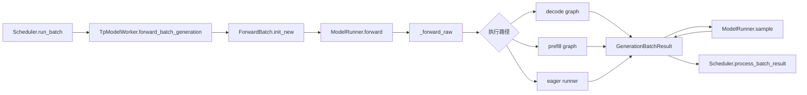

# ModelRunner

> **SGLang 模型执行** | Git：`70df09b83363e0127b43c83a6007d3938f815b2d`
> **源码范围：** `python/sglang/srt/managers/tp_worker.py`、`python/sglang/srt/model_executor/model_runner.py`、`python/sglang/srt/model_executor/forward_batch_info.py`、`python/sglang/srt/model_executor/runner/`

## 读者为什么要读

读完 Scheduler 后，读者已经知道一个请求什么时候进入 `running_batch`，但还不知道这个 batch 如何真的变成一次 GPU forward。这个专题回答三个问题：

1. Scheduler 选出的 `ScheduleBatch` 为什么不能直接喂给模型。
2. `TpModelWorker`、`ForwardBatch`、`ModelRunner`、runner 层各自守住哪条边界。
3. decode 为什么有时走 CUDA Graph、有时退回 eager；PP、overlap、structured output 又如何改变结果返回方式。

如果你在排查 decode 吞吐低、`can_run_cuda_graph=False`、PP rank 没有 logits、structured output 显存涨、在线更新权重后 graph 行为变化，这一组文档是入口。

## 源码主线

ModelRunner 不是“模型类本身”，而是单个 rank 上的执行齿轮箱：Scheduler 交来调度态，Worker 把它换成执行态，ModelRunner 选择执行路径，runner 调用模型，Worker 再把 logits 或 hidden states 包装回 Scheduler。

这条线只讲一次 generation batch 如何 forward。Attention backend 内部 kernel 见 [[SGLang-KV-Cache]] 与后续 Attention 专题；模型权重如何被加载见 [[SGLang-ModelLoader]]；采样策略细节见 [[SGLang-Sampling]]。

## 源码入口

本专题需要先定位这些 upstream 入口：

- Worker 门面与 rank 本地资源：来源：python/sglang/srt/managers/tp_worker.py L63-L101
- generation batch 主入口：来源：python/sglang/srt/managers/tp_worker.py L482-L572
- `ScheduleBatch -> ForwardBatch` 契约：来源：python/sglang/srt/model_executor/forward_batch_info.py L14-L26
- `ForwardMode` 选路语义：来源：python/sglang/srt/model_executor/forward_batch_info.py L78-L170
- `ForwardBatch` 核心字段：来源：python/sglang/srt/model_executor/forward_batch_info.py L323-L430
- `ModelRunner` 初始化与运行时状态：来源：python/sglang/srt/model_executor/model_runner.py L343-L460
- 内存池、attention backend、graph 初始化顺序：来源：python/sglang/srt/model_executor/model_runner.py L820-L945
- forward 选路与采样：来源：python/sglang/srt/model_executor/model_runner.py L2954-L3191
- 返回给 Scheduler 的结果包：来源：python/sglang/srt/managers/utils.py L38-L86

## 阅读顺序

| 文件 | 解决的问题 |
| ------ | ------------ |
| [[SGLang-ModelRunner-核心概念]] | 先建立“执行齿轮箱”模型，区分 Worker、Batch、Mode、Runner、Result |
| [[SGLang-ModelRunner-源码走读]] | 沿一次 generation batch 走完整主线 |
| [[SGLang-ModelRunner-数据流]] | 看对象生命周期、PP 分支、overlap 返回、buffer 复用 |
| [[SGLang-ModelRunner-排障指南]] | 用症状定位 graph、prefill、PP、delay sample、权重更新问题 |
| [[SGLang-ModelRunner-学习检查]] | 做可执行验收，确认不是只看过源码摘录 |

首次阅读先看核心概念，再读源码走读和数据流。正在排障时先看排障指南，再回到源码走读的对应步骤。

## 运行抓手

- 对照 `--disable-cuda-graph` 前后的 decode 吞吐与启动日志，观察 `Capture target decode CUDA graph begin/end` 是否出现。
- 对 structured output 请求观察 overlap 下是否出现 delayed sampling 路径，并确认结果包最终仍进入 `process_batch_result`。
- 在 PP 模式下分别看非末 rank 与末 rank 的返回字段：非末 rank 只传 `pp_hidden_states_proxy_tensors`，末 rank 才会采样出 `next_token_ids`。

## 相邻专题

← [[SGLang-Detokenizer|Detokenizer]]
↑ [[SGLang-Scheduler|Scheduler]]
→ [[SGLang-ModelLoader|ModelLoader]]
→ [[SGLang-KV-Cache|KV Cache]]
